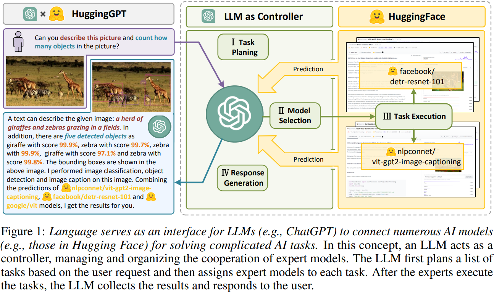
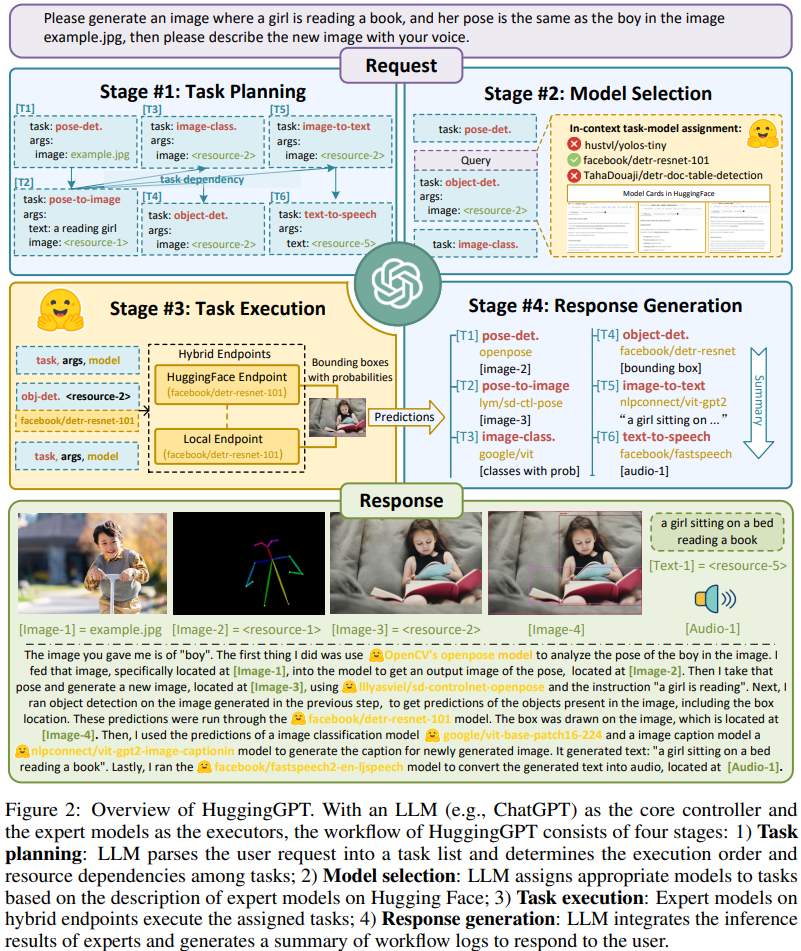
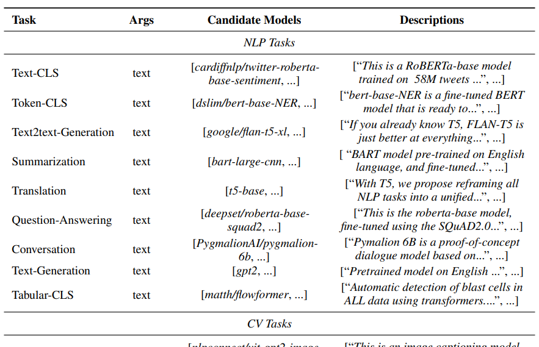
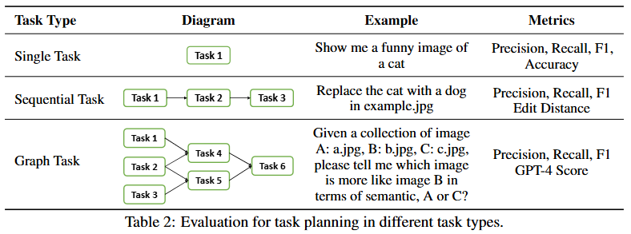

# HuggingGPT

> HuggingGPT: Solving AI Tasks with ChatGPT and its Friends in Hugging Face

考虑到大型语言模型（LLMs）在语言理解、生成、交互和推理方面表现出了非凡的能力，我们认为LLMs可以作为控制器来管理现有的AI模型以解决复杂的AI任务，语言则作为赋能这一过程的通用接口。

HuggingGPT是一个由LLM驱动的代理，它利用LLMs（例如，ChatGPT）连接机器学习社区（例如，Hugging Face）中的各种AI模型来解决AI任务。

具体来说，我们在接收到用户请求时使用ChatGPT进行任务规划，根据Hugging Face中可用的功能描述选择模型，用选定的AI模型执行每个子任务，并根据执行结果总结响应。



HuggingGPT的整个过程（如图1所示）可以分为四个阶段：

1. 任务规划：使用ChatGPT分析用户请求以理解其意图，并将其拆分为可能的可解决任务
2. 模型选择：为了解决计划中的任务，ChatGPT根据模型描述选择托管在Hugging Face上的专家模型
3. 任务执行：调用并执行每个选定的模型，并将结果返回给ChatGPT
4. 响应生成：最后，利用ChatGPT整合所有模型的预测，为用户生成响应

## 方法



### Task Planning

通常，在现实场景中，用户请求通常包含一些复杂的意图，因此需要协调多个子任务来实现目标。LLM 需要分析用户请求，然后将其分解为一组结构化任务。此外，我们要求LLM确定这些分解任务的依赖性和执行顺序，以建立它们之间的联系。为了提高大型语言模型中任务规划的效果，

任务解析模板 prompt 如下：

```
#1 Task Planning Stage - The AI assistant performs task parsing on user input, generating a list of tasks with the following format: [{"task": task, "id", task_id, "dep": dependency_task_ids, "args": {"text": text, "image": URL, "audio": URL, "video": URL}}]. The "dep" field denotes the id of the previous task which generates a new resource upon which the current task relies. The tag "<resource>-task_id" represents the generated text, image, audio, or video from the dependency task with the corresponding task_id. The task must be selected from the following options: {{ Available Task List }}. Please note that there exists a logical connections and order between the tasks. In case the user input cannot be parsed, an empty JSON response should be provided. Here are several cases for your reference: {{ Demonstrations }}. To assist with task planning, the chat history is available as {{ Chat Logs }}, where you can trace the user-mentioned resources and incorporate them into the task planning stage
```

HuggingGPT采用了一种提示设计，该设计包括基于规范的指令和基于演示的解析。

基于规范的指令：为了更好地表示用户请求的预期任务并在后续阶段中使用它们，我们希望大型语言模型通过遵循特定规范（例如，JSON格式）来解析任务。因此，我们为任务设计了一个标准化模板，并指导大型语言模型通过槽位填充来进行任务解析。例如上面的 prompt 中，包含四个槽位，用以表示任务名称、唯一标识符、依赖项和参数。

```
[{
    "task": task, 
    "id", task_id, 
    "dep": dependency_task_ids, 
    "args": {
        "text": text, 
        "image": URL, 
        "audio": URL, 
        "video": URL
    }
}]
```

- task 表示解析任务的类型。它涵盖语言、视觉、视频、音频等不同任务。截至目前，HuggingGPT已支持24项AI任务，涵盖语言、视觉、语音等方面。支持的全部 task 见原论文
- id 任务规划的唯一标识符，用于引用依赖任务及其生成的资源
- dep定义了执行所需的先决条件任务。只有在所有先决条件依赖任务完成后，任务才会启动
- args包含任务执行所需的参数列表。根据任务类型，它包含三个子字段，分别填充文本、图像和音频资源。它们可以从用户的请求或依赖任务的生成资源中解析



基于演示的解析：为了更好地理解任务规划的意图和标准，HuggingGPT在提示中融入了多个 demonstrations ，类似 few-shot

```
Can you tell me how many objects in e1.jpg?
[{"task": "object-detection", "id": 0, "dep": [-1], "args": {"im age": "e1.jpg" }}]

In e2.jpg, what’s the animal and what’s it doing?
[{"task": "image-to-text", "id": 0, "dep":[-1], "args": {"im age": "e2.jpg" }}, {"task":"imagecls", "id": 1, "dep": [-1], "args": {"image": "e2.jpg" }}, {"task":"object-detection", "id": 2, "dep": [-1], "args": {"image": "e2.jpg" }}, {"task": "visual-quesrion-answering", "id": 3, "dep": [-1], "args": {"text": "what’s the animal doing?", "image": "e2.jpg" }}]

First generate a HED image of e3.jpg, then based on the HED image and a text “a girl reading a book”, create a new image as a response.
[{"task": "pose-detection", "id": 0, "dep": [-1], "args": {"im age": "e3.jpg" }}, {"task": "posetext-to-image", "id": 1, "dep": [0], "args": {"text": "a girl reading a book", "image": "<re- source>-0" }}]
```

此外，为了支持更复杂的场景（例如，多轮对话），我们通过附加以下指令在提示中包含聊天记录Chat Logs：

```
To assist with task planning, the chat history is available as {{ Chat Logs }}, where you can trace the user-mentioned resources and incorporate them into the task planning.”
```

### Model Selection

任务规划之后，HuggingGPT需要从解析的任务列表中为每个任务选择最合适的模型。我们首先收集来自机器学习社区（例如，Hugging Face）的专家模型描述，然后采用动态的上下文中的任务-模型分配机制来为任务选择模型。

具体来说，我们将任务-模型分配问题构建为一个单选题，可用模型作为给定上下文中的选项呈现。由于最大上下文长度的限制，首先根据任务类型筛选模型以选出与当前任务匹配的模型。在这些选出的模型中，我们根据在 Hugging Face 上的下载次数进行排名，然后选择前 K 个模型作为候选：

```
Candidate Models:
{"model_id": model id #1, "metadata": meta-info #1, "description": description of model #1}
{"model_id": model id #2, "metadata": meta-info #2, "description": description of model #2}
...
{"model_id": model id #K, "metadata": meta-info #K, "description": description of model #K}
```

prompt

```
#2 Model Selection Stage - Given the user request and the call command, the AI assistant helps the user to select a suitable model from a list of models to process the user request. The AI assistant merely outputs the model id of the most appropriate model. The output must be in a strict JSON format: {"id": "id", "reason": "your detail reason for the choice"}. We have a list of models for you to choose from {{ Candidate Models }}. Please select one model from the list
```

### Task Execution

在这一阶段，HuggingGPT 将自动将这些任务参数输入到模型中，执行这些模型以获得推理结果，然后将它们发送回大型语言模型。

启动任务之前，需要动态指定该任务的依赖资源。HuggingGPT将先决任务生成的资源标识为 `<resource>-task_id`，其中task_id是先决任务的ID，如果某些任务依赖于先前执行任务的输出

- 在任务规划阶段，HuggingGPT会将`<resource>-task_id`设置为参数中相应的资源子字段
- 在任务执行阶段，HuggingGPT会动态地将此符号替换为先决任务生成的资源。

对于没有任何资源依赖的剩余任务，我们将直接并行执行这些任务，以进一步提高推理效率。我们提供了一个混合推理端点来部署这些模型，以加速和提高计算稳定性。



理想的情况是我们仅在云服务（例如，Hugging Face）上使用推理端点。然而，在某些情况下，我们必须部署本地推理端点，例如当某些模型的推理端点不存在、推理耗时或网络访问受限时。

本地推理端点运行速度快，但覆盖的模型较少；而云服务（例如，Hugging Face）中的推理端点则相反。因此，本地端点的优先级高于云推理端点。只有当匹配的模型未在本地部署时，HuggingGPT才会在像Hugging Face这样的云端点上运行该模型。

### Response Generation

HuggingGPT在此阶段将前三个阶段（任务规划、模型选择和任务执行）的所有信息整合成一个简洁的摘要，包括计划任务的列表、为任务选择的模型以及模型的推理结果。

- 其中最重要的是推理结果这些推理结果以结构化格式呈现，例如对象检测模型中的带检测概率的边界框、问答模型中的答案分布等
- HuggingGPT允许大型语言模型接收这些结构化推理结果作为输入，并以友好的人类语言形式生成响应
- 大型语言模型不仅仅是聚合结果，而是生成积极响应用户请求的响应，提供具有置信度的可靠决策

prompt

```
#4 Response Generation Stage - With the input and the inference results, the AI assistant needs to describe the process and results. The previous stages can be formed as - User Input: {{ User Input }}, Task Planning: {{ Tasks }}, Model Selection: {{ Model Assignment }}, Task Execution: {{ Predictions }}. You must first answer the user’s request in a straightforward manner. Then describe the task process and show your analysis and model inference results to the user in the first person. If inference results contain a file path, must tell the user the complete file path. If there is nothing in the results, please tell me you can’t make it.
```

## 实验

为了更好地进行任务规划评估，我们将任务分为三个不同的类别，并为它们制定不同的度量指标：

- 单任务指的是只涉及一个任务的请求。我们认为，只有当任务名称（即“task”）和预测标签完全一致时，规划才是正确的。在这个背景下，我们使用F1分数和准确率作为评估指标。
- 顺序任务表示用户的请求可以分解为多个子任务的序列。在这种情况下，我们采用F1分数和标准化编辑距离作为评估指标。
- 图任务表示用户请求可以分解为有向无环图。考虑到图任务中可能存在多种规划拓扑的可能性，仅依赖F1分数不足以反映LLM在规划中的能力。为解决这一问题，使用GPT-4作为评论家来评估规划的正确性。准确率是通过评估GPT-4的判断获得的，称为GPT-4分数

关于GPT-4 评分，在提示中包含了用户请求以及大型语言模型计划的任务列表，然后让GPT-4判断任务列表是否准确，并提供理由。为了指导GPT-4做出正确判断，我们设计了一些任务指南：

1. 任务在支持的任务列表中
2. 计划的任务列表能够达到用户请求的解决方案
3. 任务之间的逻辑关系和顺序合理
4. 我们还补充了几个任务规划的正面和负面示例，以供GPT-4参考，完整 prompt 如下

```
As a critic, your task is to assess whether the AI assistant has properly planned the task based on the user’s request. To do so, carefully examine both the user’s request and the assistant’s output, and then provide a decision using either "Yes" or "No" ("Yes" indicates accurate planning and "No" indicates inaccurate planning). Additionally, provide a rationale for your choice using the following structure: {"choice": "yes"/"no", "reason": "Your reason for your choice"}. Please adhere to the following guidelines: 1. The task must be selected from the following options: {{ Available Task List }}. 2. Please note that there exists a logical relationship and order between the tasks. 3. Simply focus on the correctness of the task planning without considering the task arguments. Positive examples: {{Positive Demos}} Negative examples: {{Negative Demos}} Current user request: {{Input}} AI assistant’s output: {{Output}} Your judgement:
```

为了进行评估，我们邀请一些标注者提交一些请求。我们将这些数据收集为评估数据集。总共，我们收集了多样化的3,497个用户请求。由于标记这个数据集以获取每个请求的任务规划非常繁重，我们利用了GPT-4的能力来进行注释。最终，这些自动标记的请求可以分为三种类型：单任务（1,450个请求）、序列任务（1,917个请求）和图任务（130个请求）

结果表示，GPT-3.5展现出了更为显著的规划能力，在所有类型的用户请求方面均超越了开源大型语言模型Alpaca-7b和Vicuna-7b。具体来说，在更复杂的任务（例如，序列任务和图表任务）中，GPT-3.5对其他大型语言模型有着绝对的优势。这些结果还表明，任务规划的评估能够反映大型语言模型作为控制器的能力。

此外，我们邀请一些专家标注员对一些复杂请求（包括24个顺序任务和22个图任务）的任务规划进行标注，作为一个高质量的人工标注数据集。我们发现，尽管GPT-4优于其他大型语言模型，但与人工标注相比仍有显著差距。这些观察进一步强调了提升大型语言模型规划能力的重要性。

增加演示之间的多样性和数量可以适度提高LLMs进行规划的性能。但当数量超过4个演示时，这种提升将是有限的。

我们邀请了三位人类专家对HuggingGPT的不同阶段进行评估。首先，我们从Hugging Face的任务列表中挑选了3-5个任务，然后基于所选任务手动创建用户请求。我们将丢弃无法从所选任务生成新请求的样本。总共，我们通过使用不同的种子进行随机抽样，得到130个多样化的用户请求。

基于生成的样本，我们评估不同阶段（例如，任务规划、模型选择和响应生成）的大型语言模型（LLM）的性能。在这里，我们设计了三个评估指标：

- 通过率：用于确定计划的任务图或选定的模型是否能够成功执行
- 合理性：评估生成的任务序列或选定的工具是否以合理的方式与用户请求相符
- 成功率：验证最终结果是否满足用户的请求

然后计算平均值以得出最终得分

## 局限

HuggingGPT中的规划严重依赖于大型语言模型的能力。因此，我们不能保证生成的计划总是可行且最优的。因此，探索优化大型语言模型（LLM）的方法以增强其规划能力至关重要

效率是我们框架中的一个普遍挑战。要构建一个具有任务自动化的协作系统（例如HuggingGPT），它严重依赖于一个强大的控制器（例如ChatGPT）。然而，HuggingGPT在整个工作流程中需要与大型语言模型进行多次交互，从而增加了生成响应的时间成本

**最大token长度**总是有限制的。尽管一些工作已将最大长度扩展到32K，但如果我们想连接众多模型，对我们来说仍然不够。因此，如何简洁有效地总结模型描述也值得探索

**不稳定性**主要是由于大型语言模型通常不可控。尽管大型语言模型擅长生成，但在预测过程中仍可能无法遵循指令或给出错误答案，导致程序工作流程中的异常。在设计系统时应考虑如何在推理期间减少这些不确定性。

## 讨论

BabyAGI、AgentGPT和AutoGPT都可以被视为自主代理，它们提供了一些任务自动化的解决方案。对于这些代理，它们都采用逐步思考的方式，通过使用大型语言模型（LLMs）迭代生成下一个任务。此外，AutoGPT对每个任务生成过程采用一个附加反思模块，用于检查当前预测的任务是否合适。

HuggingGPT采用全局规划策略在一次查询中获取整个任务队列。很难判断哪一个更好，因为每一个都有其缺陷，而且它们都严重依赖于LLMs的能力，尽管现有的LLMs并非专门为任务规划设计。

- 结合反思的迭代规划需要大量LLM查询，如果某一步骤产生错误预测，整个工作流程可能会进入无尽的循环
- 对于全局规划，尽管它总能在一次查询中为每个用户请求提供一个解决方案，但它仍不能保证每一步的正确性或整个计划的最优性

任务规划的难度也与任务范围线性相关。随着任务范围的扩大，控制器预测精确计划的挑战也更大。因此，优化用于任务规划的控制器（即大型语言模型）在构建自主代理方面至关重要。

AutoGPT主要使用一些常用工具（例如，网络搜索、代码执行器），而HuggingGPT则利用机器学习社区的专家模型（例如，Hugging Face）。因此，AutoGPT的任务范围更广，但不适合解决更专业的问题；而HuggingGPT则更为专业化，专注于解决更复杂的AI任务。因此，大型语言模型所使用的工具范围将是任务深度与任务范围之间的权衡

用户可以根据他们的需求（例如日常请求或专业领域）选择最合适的代理，或者通过定义知识、规划策略和工具包来定制他们自己的代理。

## Case Study

见原论文
