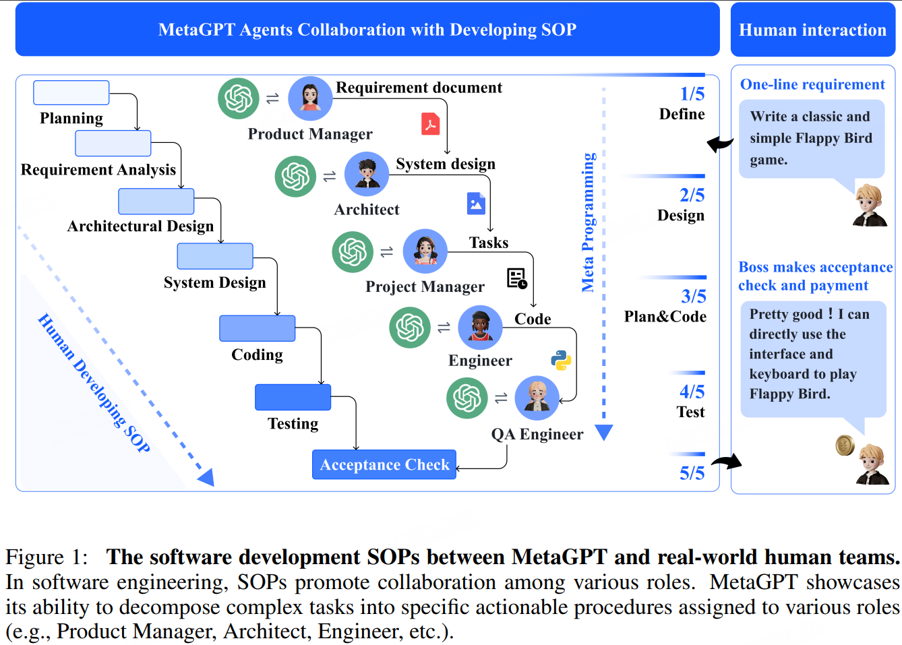
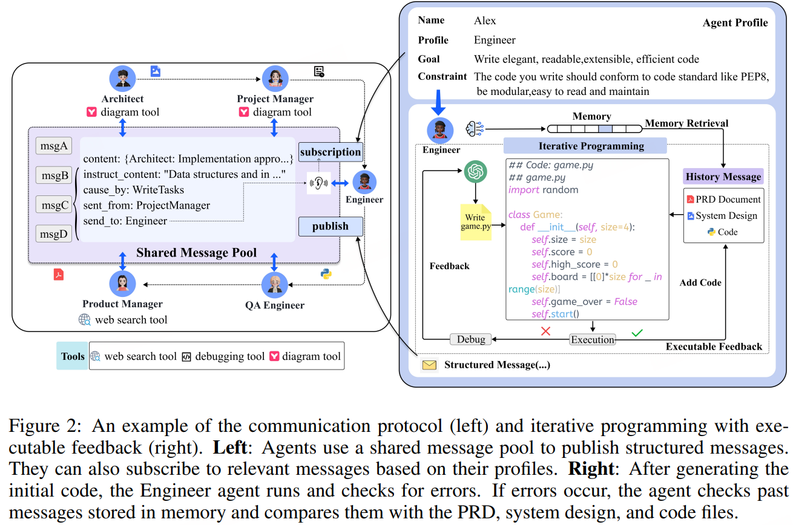
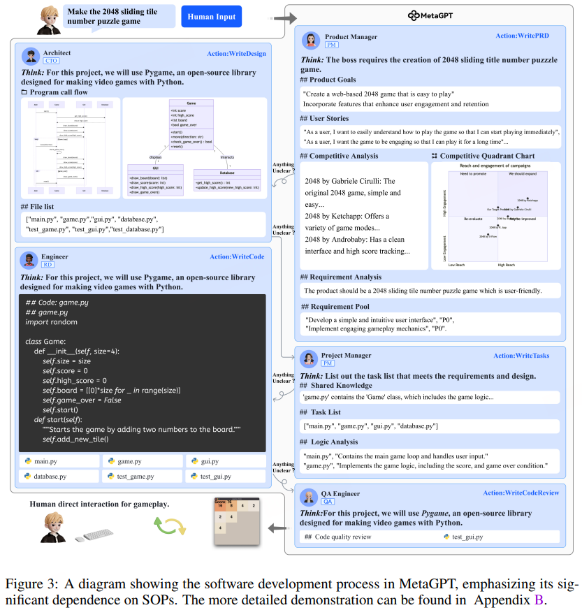

# MetaGPT

简单地将LLMs串联起来而导致的级联幻觉，使得更复杂任务的解决方案变得复杂，出现了逻辑不一致的问题。MetaGPT

- 将标准化操作程序（SOPs）编码成提示序列，以实现更加流畅的工作流程，从而允许具有类似人类领域专业知识的智能体验证中间结果并减少错误。

- 采用流水线模式为各种智能体分配不同的角色，高效地将复杂任务分解为涉及多个智能体协同工作的子任务。

- MetaGPT要求 Agent 生成结构化输出，包括文档、设计工件、流程图和界面规范。中间结构化输出有助于保持沟通的一致性，提高了目标代码生成的成功率。



> Standardized Operating Procedures (SOPs) 规定了每个团队成员的职责，并为中间输出建立了标准。明确定义的SOPs提高了与既定角色和质量标准一致的任务执行的一致性和准确性，在支持任务分解和有效协调方面起着关键作用。
> 
> 例如，在软件公司中，产品经理分析竞争情况和用户需求，使用标准化结构创建产品需求文档（PRD），以指导开发过程。

## 方法

### Specialization of Roles

明确的角色专业化可以将复杂的工作分解为更小、更具体的任务。我们在软件公司定义了五种角色：产品经理、架构师、项目经理、工程师和质量保证工程师，如图所示。我们指定了智能体的个人资料，其中包括他们的姓名、简介、目标和每个角色的限制。我们还为每个角色初始化特定的上下文和技能。

> 例如，产品经理可以使用网络搜索工具，而工程师可以执行代码



每个 Agent 监控MetaGPT中的消息池，以发现重要的观察结果（例如，来自其他 Agent 的消息）。这些消息可以直接触发行动或帮助完成任务。

所有Agent都遵循 React风格行为。指的是一种将推理（Reasoning）与行动（Acting）协同结合的Agent行为模式，其核心是通过“思考→行动→观察”的循环迭代（TAO循环），解决复杂任务并提升决策可控性。通过结构化Prompt定义Agent的思考、行动参数及观察反馈格式，例如：

```
Question: {问题输入}
Thought: 分析目标并规划步骤
Action: 调用工具（如search、file_write）
Action Input: 工具参数（如搜索关键词）
Observation: 工具返回结果
...（循环直至解决）
Final Answer: 最终答案
```

这种设计强制Agent按逻辑链输出，避免随机性

### Workflow across Agents

通过定义Agent的角色和操作技能，我们可以建立基本的工作流。遵循软件开发的SOP，使所有Agent能够按顺序工作。



1. 产品经理在获得用户需求后，将进行彻底的分析，制定一个详细的PRD，其中包含用户故事和需求池。

2. 结构化的PRD随后交给架构师，后者将这些需求转化为系统设计组件，如文件列表、数据结构和接口定义。

3. 一旦在系统设计中捕捉到这些信息，就会将其分配给项目经理进行任务分配。

4. 工程师接着按照指定的类别和功能执行

5. 质量保证工程师制定测试用例以强制执行严格的代码质量

### Structured Communication Interfaces

我们建议使用结构化通信来制定Agent的沟通方式。我们为每个角色建立了一个模式与格式，并要求个人根据其特定角色和上下文提供必要的输出。

> 例如，架构Agent生成两个输出：系统界面设计和序列流程图。这些包含系统模块设计和交互序列

MetaGPT中的Agent通过文档和图表（结构化输出）而非对话进行通信。这些文档包含所有必要信息，防止不相关或缺失的内容。

### Publish-Subscribe Mechanism

每次一对一地交流这些信息会使通信拓扑变得复杂，导致效率低下。

我们引入了一个共享的消息池，允许所有Agent直接交换消息。这些Agent不仅能在池中发布其结构化消息，还能透明地访问其他实体的消息。任何Agent都可以直接从共享池中检索所需信息，无需询问其他Agent并等待他们的回复。这提高了沟通效率。

将所有信息与每个Agent共享可能导致信息过载。我们提供了一个简单而有效的解决方案——订阅机制（图2左）。他们可以根据角色配置文件选择要关注的信息。在实际实施中，Agent在收到所有先决依赖项后才会激活其动作。

> 架构师主要关注产品经理提供的PRD，而来自QA工程师等角色的文档可能就不那么重要了。

### Iterative Programming With Executable Feedback

日常编程任务中，调试和优化的过程起着重要作用。现有方法通常缺乏自我纠正机制，导致代码生成不成功。以往的工作引入了不可执行的代码审查和自我反思

我们在初步代码生成后引入了一个可执行的反馈机制，以迭代改进代码。更具体地说，如图2所示，工程师被要求根据原始产品需求和设计编写代码。

这使得工程师能够利用其自身的历史执行和调试记忆不断改进代码。为了获取额外信息，工程师会编写并执行相应的单元测试用例，随后接收测试结果。如果结果令人满意，就会启动额外的开发任务。否则，工程师会在继续编程前调试代码。这种迭代测试过程将持续进行，直到测试通过或达到最多3次重试。

## 实验

虽然像AutoGPT、Langchain和AgentVerse这样的模型展现出强大的通用问题解决能力，但它们缺乏开发复杂系统的一个基本要素：系统地解构需求。MetaGPT通过专门的分工和标准操作程序（SOPs）工作流程简化了将抽象需求转化为详细的类和功能设计的流程。

与ChatDev（相比，MetaGPT的结构化消息传递和反馈机制不仅减少了通信信息的丢失，还提高了代码的执行效率。

详细的提示能够带来更好的软件项目，因为需求与功能更清晰；而简单的输入仍然可以使用MetaGPT生成足够好的软件

## 限制

MetaGPT版本的一个局限性是每个软件项目都是独立执行的。然而，软件开发团队应该从开发每个项目的经验中学习，从而变得更加兼容和成功。

我们探索了一种自我指涉机制，该机制根据Agent在软件开发过程中观察到的信息递归地修改约束提示。在每个项目之前，软件公司的每个Agent都会回顾先前的反馈，并对其约束提示进行必要的调整。这使他们能够持续地从过去的项目经验中学习，并通过提升公司中的每一个个体来增强整体的多Agent系统。我们首先为每个Agent建立一个交接反馈动作。这个动作负责关键性地总结在先前项目开发期间收到的信息，并将这些信息整合到更新的约束提示中。摘要信息被存储在长期记忆中，以便未来的约束提示更新可以继承。在启动一个新项目时，每个Agent以反应动作为起点。每个Agent评估收到的反馈，并总结他们可以在约束提示中如何改进。

目前的一个限制是，这些基于摘要的优化只修改角色专业化中的约束，而不是通信协议中的结构化通信接口

在现实世界的团队合作中，交互过程通常不是硬编码的。例如，在软件公司，协作标准操作程序可能会动态变化。

> 一篇关于“基于自然语言的心智社会”（NLSOM）（诸葛等人，2023年）的论文中讨论了这种自组织的实现，该论文引入了“心智经济”（EOM）的概念，即一种针对大型语言模型（LLMs）和其他代理的心智社会的强化学习（RL）框架。EOM不是使用标准的RL技术通过修改神经网络参数来优化系统的总奖励，而是利用自由市场中供需原则为那些对经济成功（奖励）做出贡献的代理分配信用（金钱）。

> 最近基于代理的平台DeepWisdom 与EOM的信用分配概念兼容。AgentStore中的每个代理提供一系列服务及其相应成本。提供了一个便捷的API，以便平台中的人类用户或代理可以轻松地从其他代理购买服务以完成其服务。个人开发者可以参与构建新代理，并促进社区内的协作开发。具体来说，AgentStore允许用户根据需求订阅代理，并根据使用情况进行支付。而且，用户可以购买额外的能力来扩展其现有代理的即插即用功能。这允许用户逐步升级他们的代理。

在MetaGPT框架内，AgentStore可以支持各种代理的协作。用户可以将多个代理聚集在一起执行更复杂任务或项目，所有代理共享并遵守MetaGPT中定义的开发和通信协议。

我们的系统无法完全满足特定场景的需求，如用户界面和前端，因为我们尚未整合此类代理和多模态工具。满足现实世界应用多样化和复杂的要求仍具有挑战性。

对用户来说，一个关键挑战是中断每个代理的运行过程，或设置每个代理的起始运行点（检查点）
