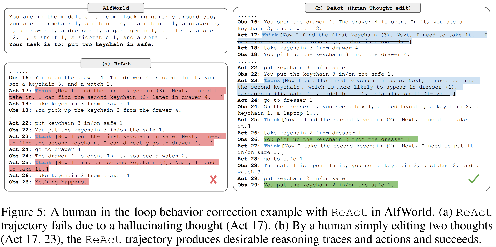

# React

> React: Synergizing reasoning and acting in language models

人类智能的一个独特特点是能够无缝地将以任务为导向的行动与言语推理结合起来，这已被理论化为在人类认知中起着重要作用，以实现自我调节或策略化以及维持工作记忆

> 以在厨房烹饪一道菜为例。在任何两个特定行动之间，我们可能会用语言进行推理，以便跟踪进度（“既然所有食材都已切好，我应该把水壶加热”），处理异常情况或根据情况调整计划（“我没有盐，所以我用酱油和胡椒代替”），以及意识到何时需要外部信息（“我该如何准备面团？让我在互联网上搜索一下”）。我们可能还会采取行动（打开食谱阅读做法，打开冰箱，检查食材）来支持推理并回答问题（“我现在能做什么菜？”）

“行动”与“推理”之间的紧密协同作用使人类能够快速学习新任务，并在以前未见过的情境下或面对信息不确定性时，进行稳健的决策制定或推理。

ReAct，一种通用范式，它将推理、行动与语言模型结合起来，用于解决多样的语言推理和决策任务。ReAct促使大型语言模型以交错方式生成与任务相关的语言推理轨迹和行动，这使得模型能够进行动态推理，创建、维护及调整高层次的行动计划（推理以行动），同时还能与外部环境（例如维基百科）互动，将额外信息纳入推理中（行动以推理）。

ReAct的表现优于普通的行动生成模型，并且在链式思维推理（CoT）方面具有竞争力。总体而言，最佳方法是ReAct和CoT的结合，它允许在推理过程中同时使用内部知识和外部获取的信息。

## 相关工作

得到恰当提示的大型语言模型（LLMs）已展现出执行多个推理步骤的能力，然而，这种“思维链”推理是一个静态的黑盒子，模型使用其自身的内部表征来生成想法，并且不根植于外部世界，这限制了它进行反应性推理或更新知识的能力

另一方面，最近的研究探讨了使用预训练的语言模型在交互式环境中进行规划和行动，重点是通过语言先验预测行动。这些方法通常将多模态观测转换为文本，使用语言模型生成特定领域的行动或计划，然后使用控制器选择或执行它们。然而，它们没有利用语言模型来抽象推理关于高级目标或维持工作记忆以支持行动

最接近的前期工作是黄等人（2022b年）的 Inner Monologue，简称IM，其中行为是由一个同名的“内心独白”激发的。然而，IM中的“内心独白”仅限于观察环境状态以及 agent 需要完成什么任务才能满足目标。相比之下，ReAct中用于决策的推理轨迹灵活且稀疏，允许为不同任务推导出多种推理类型

还没有研究如何将推理和行动以协同的方式结合起来进行一般任务解决，以及这种结合是否相比单独推理或行动能带来系统性的好处

## 想法

在时间步骤t，代理从环境接收到一个观察 $o_t \in \mathcal{O}$，然后根据某个策略 $\pi(a_t|c_t)$ 采取一个动作 $a_t \in \mathcal{A}$，其中 c 为上下文 $c_t=\{o_1, a_1......o_{t-1},a_{t-1},o_t\}$ ，当c到a的映射高度隐含且需要大量计算时，学习策略$\pi$是具有挑战性的。

ReAct的想法很简单：我们将代理的动作空间扩展为 $\hat{\mathcal{A}}=\mathcal{A}\cup\mathcal{L}$，即扩展到了语言空间。语言空间中的一个动作 $\hat{a}_t\in\mathcal{L}$ 称为想法或推理轨迹，不会影响外部环境，因此不会产生观察反馈。想法 $\hat{a}_t$ 旨在通过对当前上下文 $c_t$ 进行推理来组成有用信息，并更新上下文 $c_{t+1}=(c_t, \hat{a}_t)$ 以支持未来的推理或行动

然而，由于语言空间 $\mathcal{L}$ 是无限的，在这个增强的动作空间中学习是困难的，需要强大的语言先验。在本文中，我们主要关注这样一个设置：一个冻结的大型语言模型PaLM-540B 通过少量的上下文示例提示来生成特定领域的动作和自由形式的语言思考，以解决任务。每个上下文示例都是一个人完成任务实例的动作、思考和环境影响观察的行为轨迹

对于那些推理至关重要的任务，我们交替生成思考和动作，以便任务解决轨迹由多个思考-行动-观察步骤组成。相比之下，对于那些可能涉及大量动作的决策任务，思考只需稀疏地出现在轨迹的最相关位置，所以我们让语言模型自行决定思考和动作的异步发生。

## 实验

我们考虑了两个对知识检索和推理具有挑战性的数据集：(1) Hot-PotQA（杨等人，2018年），一个多跳问答基准测试，要求对两个或更多的维基百科段落进行推理；(2) FEVER（索恩等人，2018年），一个事实验证基准测试，每个主张都根据是否存在可验证该主张的维基百科段落而被标注为“支持”、“反驳”或“信息不足”。

模型只接收问题/主张作为输入，没有访问支持段落，必须依赖其内部知识或通过与外部环境的交互来检索知识以支持推理。我们设计了一个简单的维基百科网络API，它包含三种类型的操作以支持交互式信息检索

1. 搜索[实体]，如果相应的实体维基页面存在，则返回该页面的前5个句子；否则，建议从维基百科搜索引擎中获取前5个相似的实体

2. 查找[字符串]，它会返回包含该字符串的页面中的下一个句子，模拟浏览器上的Ctrl+F功能

3. 完成[答案]，它会用答案结束当前任务

> 这个动作空间大多只能基于确切的篇章名称检索到文章的一小部分，这比最先进的词汇或神经检索器要弱得多。其目的是模拟人类如何与维基百科互动，并强制模型通过语言的显式推理进行检索

针对HotpotQA和Fever，我们从训练集中随机选取6个和3个例子，手动编写ReAct格式的轨迹，作为提示中的小样本示例。与图1(d)类似，每个轨迹包含多个思考-行动-观察步骤（即密集思考），其中自由形式的思考用于各种目的。

具体来说，我们使用一系列思考:

- 分解问题（“我需要搜索x，找到y，然后找到z”）

- 从维基百科观察中提取信息（“x始于1844年”，“该段落没有告诉x”）

- 执行常识（“x不是y，所以z必须是……”）

- 算术推理（“1844 < 1989”）

- 指导重写搜索（“也许我可以搜索/查找x代替”）

- 综合最终答案（“……所以答案是x”）

ReAct 展示的问题解决过程更为实际和扎实，而 CoT 在构建推理结构方面更为精确，但容易受到幻觉事实或思维的影响。因此，我们建议结合使用 ReAct 和 CoT-SC（自我一致性），并让模型根据以下启发式规则决定何时切换到另一种方法：

1. ReAct→CoT-SC：当 ReAct 在给定步骤内未能返回答案时，退回到 CoT-SC。我们分别为 HotpotQA 和 FEVER 设置了 7 步和 5 步，因为我们发现更多步骤并不会提升 ReAct 的表现

2. CoT-SC → ReAct：当 n 个 CoT-SC 样本中的多数答案出现少于 n/2 次（即内部知识可能无法自信地支持任务）时，退回到 ReAct

由于手动注释推理轨迹和行动在规模上的挑战，我们采用一种类似于 Zelikman 等人（2022 年）的 bootstraping 方法，使用由 ReAct 生成（也适用于其他基线）的带有正确答案的 3000 条轨迹来微调较小的语言模型（PaLM-8/62B），以解码基于输入问题/声明的条件轨迹（所有思想、行动、观察）

我们还探索了与ReAct的人机交互，以允许人类检查和编辑ReAct的推理轨迹。例如，通过简单地在第17幕中移除一个幻觉句子，并在第23幕中添加一些提示，可以使ReAct的行为发生显著变化，以与这些人类思维编辑保持一致，并在任务中取得成功。

从人类的角度来看，解决此类任务变得显著容易，从输入数十个动作出发，仅需编辑几个想法，这促进了人机协作的新形式。

## 结论

1. one-shot Act提示的表现已经与 imitation learning 和 imitation + reinforcement learning (IL + RL)方法相当

2. ReAct 一致性地优于 Act，Act在没有进行任何思考的情况下，无法正确地将目标分解为较小的子目标，或者失去对当前环境状态的追踪

3. ReAct在整体成功率上显著优于IM风格的提示，后者在识别子目标何时完成或下一个子目标应该是什么时，由于缺乏高层次的目标分解，经常犯错误

4. ReAct与CoT互有胜负

5. 幻觉是CoT的一个严重问题，导致其成功模式下的假阳性率远高于ReAct（14%对6%），并且是其主要的失败模式（56%）。相比之下，ReAct的问题解决轨迹更加扎实、事实驱动且可信，得益于对外部知识库的访问

6. 虽然交错推理、行动和观察步骤提高了ReAct的扎实性和可信度，但这种结构约束也降低了其在制定推理步骤时的灵活性，导致其推理错误率高于CoT。我们注意到ReAct有一个常见的错误模式，即模型会重复生成之前的想法和行动。我们将其归类为“推理错误”，因为模型未能推理出应采取的适当下一步行动，并跳出了循环。

7. 对于ReAct，通过搜索成功检索到丰富的信息至关重要。

8. ReAct+CoT-SC在提示大型语言模型方面表现最佳

9. ReAct在微调方面表现最佳

10. 尽管我们的方法简单，但具有较大动作空间的复杂任务需要更多的示范才能学好，这不幸地很容易超出上下文学习的输入长度限制

11. GPT-3在HotpotQA和ALFWorld上的表现始终优于PaLM-540B，这可能是因为它经过了遵循人类指令的微调。这表明ReAct提示在不同任务的不同大型语言模型中都是有效的。

12. 然而，现有方法仍远远达不到专家人类的水平，专家人类在探索产品和重新构建查询方面做得明显更多，这对于基于提示的方法来说仍然具有挑战性。

prompt和实验结果例子见原论文
