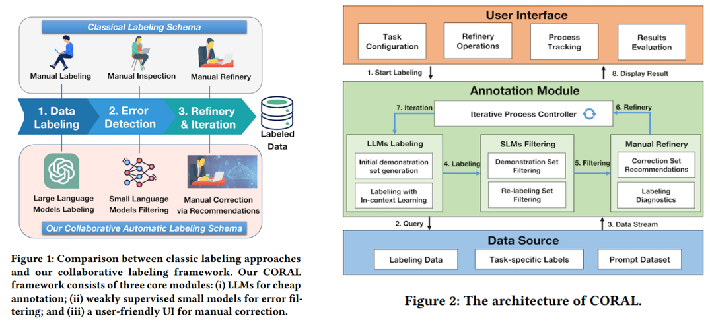
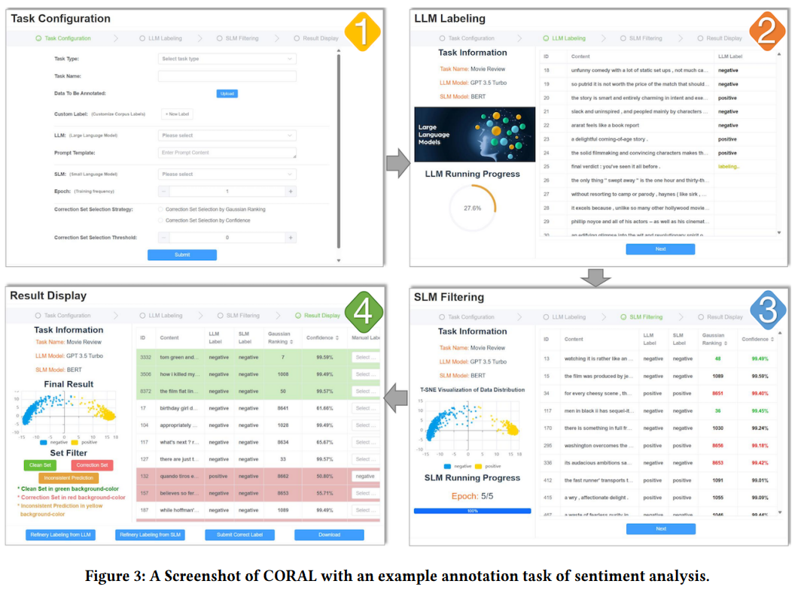

# CORAL

> CORAL: Collaborative Automatic Labeling System based on Large Language Models

数据标注是一个既费力又耗时的过程，严重阻碍了数据驱动型应用的可扩展性和效率。为解决这一问题，研究人员探索了多种解决方案，例如弱监督学习可以减少对精确监督的需求

- 主动学习仅对最重要样本的一个子集进行标注，以实现卓越性能
- 半监督学习允许从少量有标记样本和大量无标记数据中训练模型
- 噪声标签学习（NLL）则允许训练语料库包含许多错误标签

然而，尽管取得了这些进展，弱监督学习仍需要大量的标注成本，以确保达到良好的性能。不过，大语言模型（LLMs）展现出卓越的零样本 / 少样本能力，有望减轻标注成本。它们具备上下文学习（ICL）能力，在给定一些与任务相关的有标记样本的情况下，在特定领域任务中表现出色。

然而，最近一些研究发现，在面对具有挑战性的任务时，大语言模型往往落后于经过微调的小语言模型（SLMs）。时至今日，在大语言模型时代，如何以最少的人力投入将模型泛化到下游任务，仍是一个有待解决的问题。

CORAL 是一个由 LLMs 驱动的协作式自动标注系统，它能够以最少的人力投入实现高质量标注。包括

1. 一个大语言模型标注模块，能够自动标注大量语料库，生成粗粒度标签
2. 一个弱监督学习模块，使用噪声标签学习技术训练小模型，从粗粒度标注中提炼出准确标签
3. 一个标签优化机制，根据对模型结果的统计分析，推荐可能错误的标签。

还支持大语言模型和小语言模型利用人工校正后的标签进行迭代优化，从而确保标注质量和模型性能不断提升。同时，系统还配备了可视化界面，便于对标注过程进行监控以及对结果进行分析。 



## System overview

如上图，CORAL 包含三个关键部分：

- **用户友好界面**：该界面使标注过程对用户透明，并为用户提供友好的交互界面，用于优化操作，包括进行配置、执行优化操作、跟踪过程以及重新评估结果。
- **标注模块**：这是 CORAL 的核心模块，以最低的人力成本执行标注任务。它包含大语言模型驱动的标注、小语言模型驱动的过滤、优化组件以及迭代过程控制组件。
- **数据管理模块**：负责处理和组织系统内的数据，包括数据存储预处理和整合。它首先将用户输入的未标注数据、定义的标签以及任务配置写入数据库。然后，该模块负责管理不同模块之间的数据交互，并更新新的标注结果。

核心标注模块由四个组件组成：

### 大语言模型驱动的标注组件

利用大语言模型强大的零样本 / 少样本学习能力来取代人工标注员。对于任何标注任务，我们都可以为大语言模型设计特定任务的提示，以便在给定的未标注语料库上生成大量的弱标注。值得注意的是，可以修改这些提示以适应不同的任务，例如各种文本分类和表格数据分析

> 情感分析任务的提示模板：
>
> ```
> [Task Description] You are a helpful assistant for the task of sentiment analysis. You reply with brief, to-the-point answers with no elaboration as truthfully as possible. Your task is to a binary classification to classify content as positive or negative according to their overall sentiment polarity. The category is divided into two types: ’positive’ and ’negative’.
> 
> [In-Context Demonstration] You can refer to the following labeled samples for prediction: ["content": "enigma is well-made, but it’s just too dry and too placid.", "label": "negative"]...
> 
> [Output Control] Given a content: <QUERY>. How do you feel about the sentiment polarity of the given content? Is this positive or negative? please answer in a single line with ’positive’ or ’negative’.
> ```

为了进一步提高标注质量，还纳入了上下文学习算法，使大语言模型能够模仿 [上下文示例] 中有标注样本的模式。这里的示例集不一定需要人工标注，甚至不一定要完全精确。

### 小语言模型过滤组件

大语言模型不可避免地会引入错误标签，而且大语言模型自身很难识别自己的错误。为此通过噪声标签学习（NLL）训练一个稳健的小语言模型，以便在训练过程中检测噪声样本。之后，其输出（包括特征表示和预测置信度）可用于设计检测错误标签的指标。例如，那些标注错误的样本通常置信度较低。此外，小语言模型本身能够产生比大语言模型输出更准确的预测，实现无人干预的标签优化。

> 对于非语言任务，也可以用另一个特定任务模型来替代小语言模型，例如，在表格数据分析中使用多层感知器。

### 人工优化组件

仅依靠机器模型无法标注某些具有挑战性的样本。在实际应用中，人类知识对于把控标注质量不可或缺。在这个组件中，通过用户界面突出显示那些可能有误的样本，比如预测置信度极低的数据。然后，用户可以借助显示的信息，如大语言模型 / 小语言模型的预测结果、置信度等，手动修正这些被推荐的样本。该组件能在很大程度上减轻人工修正成本的负担，将人类专业知识转移到解决最棘手的标注问题上。

### 迭代过程控制组件

受主动学习算法的启发，CORAL 还支持迭代标注，以最大程度提高标注质量。这个控制组件实现两个主要功能。

- 为提高大语言模型的熟练度，该组件根据模型输出收集极有可能正确的干净样本，并识别出最具代表性的样本，用作上下文示例。借助精确的示例样本，大语言模型能够以更高的准确率对训练语料库重新标注。
- 它汇总机器标注和人工标注，以重新训练一个更稳健的小模型

用户可以通过我们的控制组件，选择多次重新运行  LLM 和 SLM 组件

## Implementation details

### SLM 提炼策略

虽然任何现成的噪声标签学习（NLL）算法都可以使用，但我们在实现过程中选择了最流行的基于选择的技术。其基本思路是，干净的样本通常损失值较小，因为深度网络在训练早期往往更容易拟合简单模式 。

因此，我们可以根据损失值分离出干净的样本用于稳健训练。在对噪声标签进行几个热身轮次的标准训练后，我们对损失函数拟合一个双成分高斯混合模型（GMM），以识别属于均值较小的高斯成分的干净样本，该均值较小表明其为干净样本的概率较高。

为了最大限度地提高稳健性，我们进一步开发了一个半监督学习（SSL）过程，将干净样本视为有标记样本，其余数据视为无标记样本。在实现过程中，我们遵循开创性的 FixMatch 算法进行半监督学习训练。我们在每个训练轮次开始时执行这两个步骤，直至收敛。

### 大语言模型的上下文示例

大语言模型的标注质量取决于两个关键因素，即良好的提示和上下文学习（ICL）。尽管我们为特定任务提供了一些模板，但提示设计在很大程度上依赖于人类知识。因此，本节重点关注在我们的 CORAL 系统中提高上下文学习能力。

通过实验我们发现，即使是带有噪声的上下文示例样本，仍然能显著提升性能。因此，我们制定了两种策略来获取上下文示例样本。

- 在初始标注轮次，我们执行自标注，即由大语言模型随机标注一些样本，并将它们整合到提示中。
- 在后续轮次，当小语言模型训练良好后，我们执行提炼选择 Distilled Selection，优先收集小语言模型检测到的所有干净样本以及那些经过人工修正的样本。
- 然后，我们对小语言模型的特征运行一个简单的 𝑘-中心点聚类算法，以收集 𝑘 个聚类中最具代表性的中心点作为上下文学习的示例。

随着标注过程的推进，上下文学习示例数据变得越来越准确，充分释放大语言模型进行精细标注的强大能力

### 性能评估

在用于情感分类的 MR 数据集上的实验中，通过大语言模型迭代器和小语言模型的优化，CORAL 显著提升了无监督性能。我们采用 Llama3 - 8B 作为大语言模型，并使用 RoBERTa - Base 作为下游小语言模型。CORAL 取得了具有竞争力的结果，与之前人工标注相比，以最低成本大幅减少了低置信度样本

## Demonstration scenarios



标注流程：

1. **任务配置**：配置界面会引导用户完成初始设置。
   1. 首先要选择标注任务的类型，目前的选项包括情感分析、主题分类和表格预测。该系统采用灵活的策略架构设计，便于扩展以适应更多任务类型
   2. 选择任务后，用户通过 “上传” 按钮上传目标未标注数据。此外，CORAL 为特定任务提供提示模板配置，但也允许用户根据自身特定需求定制提示。
   3. 为 CORAL 标注任务定义自定义标签名称。
   4. 配置大语言模型（LLM）和小语言模型（SLM），以及小语言模型的训练轮数等基本任务信息

2. **大语言模型标注**：接下来，大语言模型开始根据预定义的提示进行数据标注。用户可以通过左下角的进度条跟踪大语言模型标注的进度。右侧显示大语言模型标注结果的表格会持续更新。
3. **小语言模型过滤**：小语言模型过滤实际上是 CORAL 对前序工作结果进行审核的过程。系统会在右侧表格中为每个样本展示置信度和高斯损失排名，以供分析。小语言模型会基于交叉熵损失不断迭代，优化预测结果左下角显示当前训练轮次和进度条，左侧的散点图根据小语言模型的特征描绘了数据分布情况，右侧的表格展示了经小语言模型过滤后的过程数据。过滤工作完成后，我们会补充几个新列，分别显示小语言模型预测的标签、置信度值以及高斯混合模型（GMM）概率的排名。我们还会将那些可能为准确或错误的数据分别用绿色和红色突出显示。
4. **结果展示与人工修正**：在这一步，CORAL会展示标注和过滤的最终结果。右侧表格呈现标注结果，并新增了一个人工修正列。左侧的三个按钮可让用户突出显示那些极有可能为准确（高置信度）、错误（低置信度）以及不一致（小语言模型与大语言模型预测结果不同）的样本。准确样本会以绿色背景标记，而错误和不一致的数据则为红色。我们还允许用户根据小语言模型的置信度或高斯混合模型概率对数据进行排序。
5. **可选步骤（迭代标注）**：最后，CORAL支持循环迭代标注，用户分别点击“从大语言模型进行优化标注”或“从小语言模型进行优化标注”，就能从大语言模型标注或小语言模型过滤进入下一次迭代。在每个页面上，系统可以分别利用上一次的人工修正集来为大语言模型和小语言模型提供信息。最后，用户可以通过点击“下载”按钮，下载包含标注数据的Excel文件。 