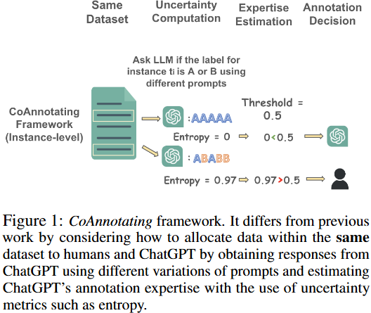
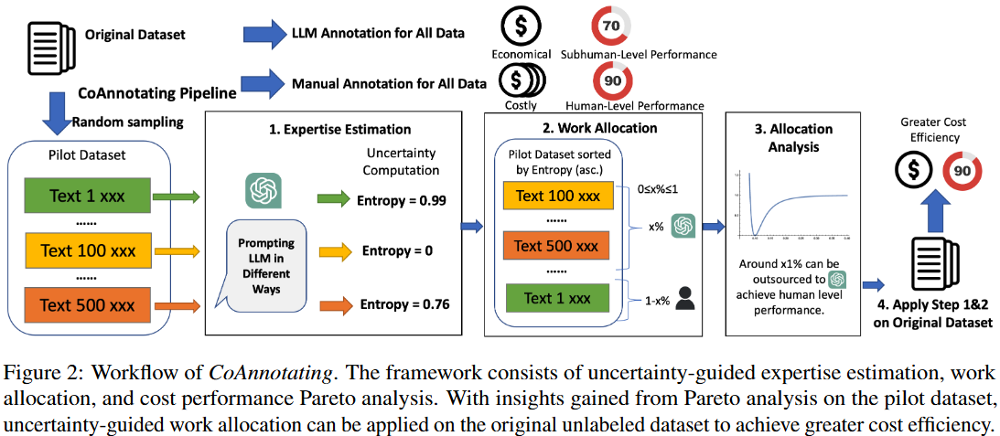
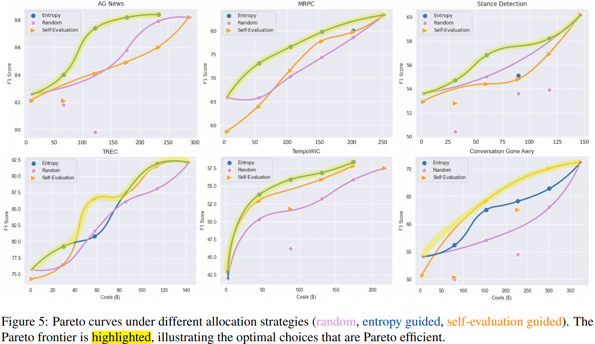

# CoAnnotating

> [CoAnnotating: Uncertainty-Guided Work Allocation between Human and Large Language Models for Data Annotation](https://arxiv.org/pdf/2310.15638)

LLM 在问答、推理、自然语言推理、情感分析和命名实体识别等各种任务中展示了强大的零样本性能，但微调后的语言模型在大多数这些任务上的结果仍然优于LLM。

收集用于模型训练和微调的标记数据仍然很有价值。与其直接部署LLM进行下游应用，不如研究如何利用LLMs的零样本能力来标记文本数据，构建高质量的数据集并提高微调后模型的性能。

通常，研究人员招募人类注释者（如专家或众包工作者）来进行数据注释。手动注释的一些挑战包括招募和培训注释者的高成本、注释不一致性和人类主观性。

最近的研究表示，像ChatGPT这样的 LLM 有可能取代大规模人工注释，LLM 的注释质量甚至可以在某些任务上超越人类注释者，并且成本远低于众包工人。其他研究表示，LLM 在更具挑战性和实用性的任务上的零样本表现不如人类。

不过，这些先前的工作将人类和大型语言模型视为竞争对手，而不是考虑人类和大型语言模型如何高效协作。本工作，共同注释框架，旨在平衡人类和大型语言模型在各自的注释质量和成本方面的互补特点。

我们的工作从资源分配的角度来解决人类与大型语言模型共同注释的问题。我们将模型置信度视为模型预期表现的可靠信号。当我们考虑为大型语言模型分配一个给定的数据点进行注释时，我们可以使用模型不确定性的倒数来估计我们对该分配的信心。

在我们的工作中，超越了任务级别（评估LLMs在每个数据集整体上的表现），在实例级别（估计LLMs标注给定数据点的能力）量化了 LLM 的注释专业知识，可以做出更明智的分配决策。

我们的结果还表明，

- LLMs生成的置信度分数通常校准得很好，但并不总是可靠
- 对于一些直接的任务，如主题理解，可以外包一些注释工作以达到人类水平的性能
- 对于更微妙的任务，注释质量和注释成本之间的权衡是不可避免的

## 方法

对于给定的未标记训练数据集 $$D_t = \{t_1, t_2, ...t_m\}$$，框架通过计算每个实例的 LLM 注释的不确定性水平，自动决定每个数据实例应该由人还是大型语言模型进行注释，目的是在实现更高注释质量的同时降低给定数据集的注释成本。

先前的研究表明，LLM 的性能可能对输入中的扰动非常敏感。因此，我们对每个实例 $$t_i$$ 引入了一组多样化的提示类型 $$P_i = \{p_{i1}, p_{i2}, ..., p_{ik}\}$$ 来变化 prompt，下面是判断 paraphrases 的例子

| Prompt                                                       | Type                            |
| ------------------------------------------------------------ | ------------------------------- |
| Please label if the following two sentences are paraphrases of each other. Please give your answer as “paraphrase” or “not paraphrase”.  {Text} | Instruction                     |
| {Text}  Please label if the two sentences above are paraphrases of each other. Please give your answer as “paraphrase” or “not paraphrase” | Sequence Swapping               |
| Given the following two sentences, please classify the relationship of the following two sentences as “paraphrase” or “not paraphrase”. {Text} | Paraphrase                      |
| Is it true that the following two sentences are/are not paraphrases of each other? Give your answer as “true” or “false” {Text} | True/False                      |
| What relationship do the following two sentences have? Is it “paraphrase” or “not paraphrase”? {Text} | Question Answering              |
| Please choose one option that best de- scribes the relationship between the fol- lowing two sentences. {Text} (A) Paraphrase (B) Not paraphrase | Multiple Choice Question        |
| I think the following two sentences are/are not paraphrases of each other. Do you agree? {Text} | Question with Confirmation Bias |

模型置信度可以作为模型性能的可靠信号，因此我们计算LLM的不确定性 $$u_i$$ 来指导工作分配过程。通过对每个实例用不同的提示 $$P_i$$ 提示LLM k次，我们得到k个标注  $$A_i = \{a_{i1}, a_{i2}, ...,a_{ik}\}$$

计算不确定性的一种方法是要求模型直接输出其置信度分数：“and please give a confidence score on a scale of 0 to 1 for your prediction”，$$t_i$$ 的不确定性通过以下公式计算
$$
u_i = 1 - \frac{1}{k} \sum_{j=1}^{k} P_{\theta}(a_{ij} | p_{ij})
$$
$$P_{\theta}(a_{ij} | p_{ij})$$  是在给定 prompt $$p_{ij}$$的情况下，ChatGPT 标注类别标签 $$a_{ij}$$ 的概率，通过直接提取大型语言模型（LLMs）提供的置信度分数来获取其值。

另一种计算不确定性的方式是熵，可用于量化与类别标签相关的不确定性。熵值越大，响应的不确定性越高。公式为：
$$
u_i = -\sum_{j=1}^{k} P_{\theta}(a_{ij}|p_{ij}) \ln P_{\theta}(a_{ij}|p_{ij})
$$
其中 $$P_{\theta}(a_{ij} | p_{ij})$$ 是作为所有预测中某个特定预测出现的频率计算的。

在上述不确定性水平估计的基础上，我们可以使用不确定性水平 $$u_i$$ 来指导工作分配。

- 随机分配。随机分配被选为比较的基线策略。这种策略是从 $$D_t$$ 中随机抽取n个实例（0 ≤ n ≤ m），由大型语言模型进行注释，而剩余的 m−n 条数据则由人类进行注释
- 自我评估引导分配。按自我报告的置信度分数降序排列实例。选择 $$D_t$$ 中不确定性水平最低的top n个实例（0 ≤ n ≤ m）作为大型语言模型注释的最佳候选者。剩余的数据点 m−n 则分配给人类注释员
- 熵引导分配。按照各自的熵值以递增顺序对实例进行排序，并选择数据集 $$D_t$$ 中不确定性水平最低的 n个（0≤n≤m）实例由大型语言模型（LLMs）进行注释。同样，剩余的 m−n 个数据点，如果响应不一致，将被分配用于人工注释

通过采用不同的分配策略和设置分配给LLM的数据比例不同，我们得到具有不同注释质量和成本的各种分配模式。然后我们可以绘制每种质量-成本组合的性能，并通过插值离散数据点来近似 Pareto frontier 。

实践者可以绘制注释质量与试点数据的成本对比图，以更好地理解这种权衡。他们可以使用 Pareto efficient points 来决定，在期望的预算水平下，应该将多少比例的数据外包给大型语言模型（LLM）。

## 实验与结果

使用六个分类数据集来处理不同类型的任务。如果训练数据量过大，我们将对大约1000个样本进行分层随机抽样。

我们获取了ChatGPT（gpt-3.5-turbo）的回复，如果回复是一个模糊的答案，如“I cannot determine the class of the text”，我们将其编码为一个新类别标签，这可能导致更高的不确定性指标。不确定性计算决定最终是否将注释分配给ChatGPT，如果是，我们将通过ChatGPT生成的多数投票来决定最终标签

我们假设每个实例由5位独立标注员标注，每小时工资为15美元。我们使用实验时输入提示的标记长度与调用API（gpt-3.5-turbo）的价格（每千token0.002美元）的乘积来计算ChatGPT的标注成本。

使用大型语言模型自我报告的置信度并不一定可靠，使用大模型标注数据训练小模型，熵引导分配优于置信度引导分配

通过绘制测试性能与标注成本（下图），实践者可以通过研究帕累托前沿来可视化在不同预算下通过人机协作（如ChatGPT）可实现的标注质量权衡。

对于含有讽刺和需要更多推理的不完整句子的实例，ChatGPT具有较高不确定性。此外，它在数字推理方面也存在问题，并可能因与错误类别（如“商业”）相关的某些关键词（“公司”）而误导主题分类。