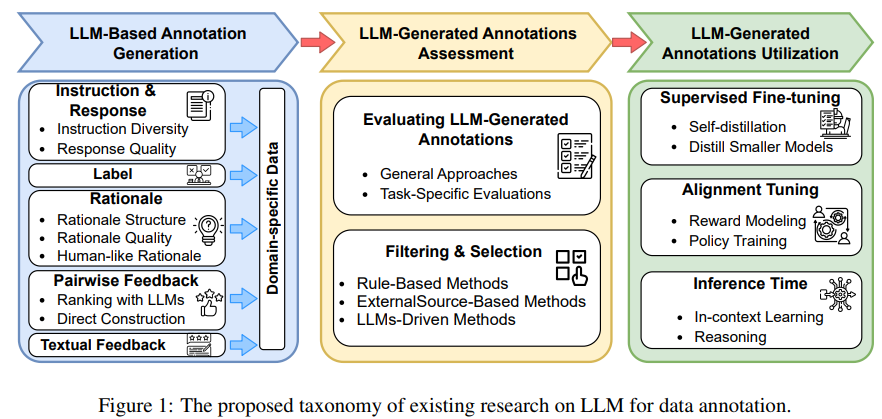
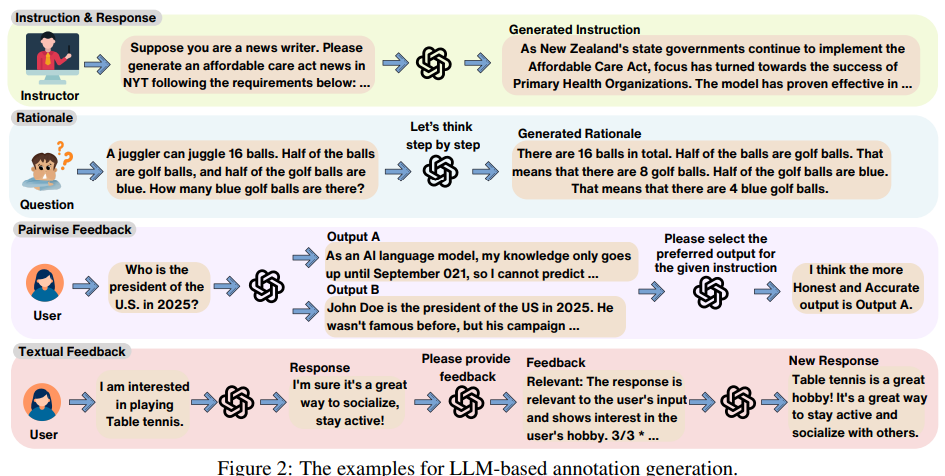
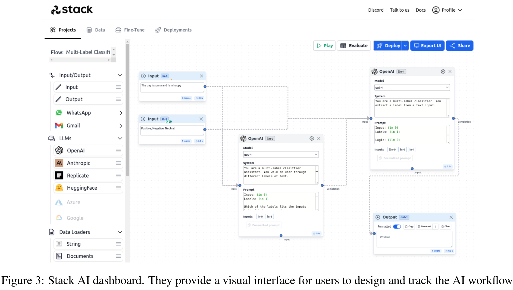
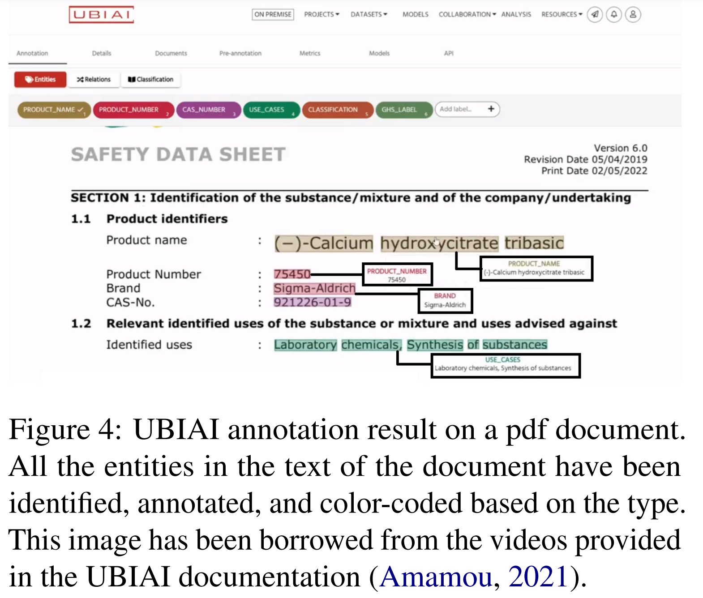

# LLM for Data Annotation and Synthesis

数据标注与合成的过程通常包括

- 用类别或任务标签对原始数据进行分类，以实现基本的分类
- 添加中间标签以增加上下文深度
- 分配置信度分数来评估标注的可靠性
- 应用对齐或偏好标签，使输出符合特定标准或用户需求
- 标注实体关系，以了解数据集中的实体之间如何相互作用
- 标记语义角色，以定义实体在句子中所扮演的潜在角色
- 标记时间序列，以捕捉事件或动作的顺序
- 以指令、回复、推理、成对和文本反馈的格式合成数据，用于语言模型的调优

像 GPT-4这样的先进大语言模型为数据标注提供了新道路，大语言模型在标注合成中的应用可以概括为：

- **基于大语言模型的标注生成**：我们深入研究为各种数据类型合成标注的过程，包括指令与回复、推理依据、成对反馈、文本反馈以及其他特定领域的数据。此外，我们还讨论了标注过程中的标准（例如，多样性和质量）
- **评估大语言模型生成的标注**：我们探索了评估标注质量的各种方法，以及从众多选项中选择高质量标注的策略
- **大语言模型生成标注的利用**：我们研究了在不同阶段的方法，包括监督微调、对齐调整和推理阶段，以基于大语言模型生成的标注来训练机器学习模型

在标注和合成中，有两个核心模型：

- 一个标注器模型，记为 $$\mathcal{A}$$，它将输入数据映射为标注，通常由先进大语言模型担任，如GPT-4
- 一个任务学习器，记为 $$\mathcal{L}$$ ，利用这些标注数据或从中学习以完成特定任务。可以是另一个大型模型或者是像BERT这样不太复杂的模型

大语言模型生成的标注包含分类标签，并通过一系列全面的辅助信号来增强原始数据点。这些标注，包括置信度分数、上下文细节和其他元数据，超越了传统的分类标签

## LLM-Based Annotation Generation

### Instruction Diversity

> 指令和回复是构成大语言模型微调及上下文学习（ICL）数据集的两个基本要素。以往的 NLP 中，主要依靠人工标注来构建，现在 LLM 和自动生成式方法受到了更多关注

各种方法在原始数据集中增加指令多样性 Instruction Diversity，并扩充指令数量：

- 通过混合两个不同样本创建新样本来增强数据多样性
- 使用一些人工编写的种子指令，并通过“生成 - 过滤”流程对其进行迭代扩充
- 在原始数据集中训练一个指令生成模型，以增加指令的多样性
- 采用多步提示方法，先生成任务描述，然后将其作为实例种子，引导大语言模型生成指令
- “解释 - 生成”流程，借助大语言模型进行迭代数据合成，为了获得丰富且多样的示例
- 对给定样本进行多次释义，帮助大语言模型从不同角度理解它们
- 基于聚类的数据选择方法，以确保用于扩充的初始种子数据具有多样性
- AttrPrompt，作为在基于大语言模型的数据标注中平衡多样性与成本的有效方法
- 通过直接从对齐的大语言模型中提取，来大规模合成高质量指令数据，并提出Magpie自合成方法，用于生成大规模对齐数据
- Persona Hub，它是一个从网络数据中自动整理出的包含10亿个多样角色的集合，旨在为各种场景大规模生成多样的合成数据
- FANNO，这是一个完全自主的开源框架，无需预先存在的标注数据即可革新标注过程。
- CorrSynth，使用相关采样策略生成更多样且忠实于输入提示的数据
- 为了安全扩充临床数据并保护患者隐私，通过单次提示和零次提示，利用GPT - 4进行数据扩充
- “通过检索与细化进行合成”（SynthesizRR）方法，利用检索增强在数据集合成过程中引入多样性：由于检索到的段落不同，大语言模型会基于不同内容生成示例
- 引入通用且可扩展的框架IDEA - MCTS（使用蒙特卡洛树搜索的指令数据增强），是一个用于高效合成指令的可扩展框架

### Response Quality

提高生成回复的质量的方法：

- 将回复生成构建为阅读理解任务，并为大语言模型创建详细的提示
- 在回复生成中采用自一致性方法，从置信度得分最高的候选回复中进行选择
- 自我提炼，并通过改写原始回复来扩充指令调优数据集
- 进行社会模拟，以确保大语言模型给出高质量、符合人类价值观的回复
- 在回复生成流程中引入多步提示，包括问题分析、答案引导和安全答案生成
- 通过实施检索增强的上下文学习，并为大语言模型提供相关文档，来提高大语言模型输出的质量
- 为确保大语言模型提供符合人类价值观的回复，进行原则驱动的提示，用精心设计的详细原则来引导大语言模型
- Source2Synth 将自定义数据源作为输入，并生成具有基于现实世界来源的中间推理步骤的合成数据点
- 遵循 “少即是多” 的原则，在数学推理数据生成中用更少的数据点取得了更好的效果

### Label

标签标注自动化的方法

- 将大语言模型用作事件提取的专家标注器
- 利用多个大语言模型生成的主题标注，来支持元数据丰富化
- 大语言模型作为自动数据标注器，提高标签标注任务效率和一致性
- 协同标注（CoAnnotating），大规模对非结构化文本进行人类与大语言模型协同标注的新范式
- 大语言模型在标注与新冠疫苗相关推文相关应用，与人工标注者的表现进行对比
- 为解决大语言模型标注可能存在的局限性，提出了一套全面的标准和最佳实践，以确保其使用的可靠性、可重复性和符合伦理
- 利用大语言模型来改进人工标注者给出的原始标注
- 大语言模型中的通用领域知识（如语言理解能力）足以创建一个精心整理的数据集，这可以降低成本
- 一种新的通用领域泛化方法，可生成与目标领域无关的数据集
- 将大语言模型与一种新的排序方法相结合，以处理代码库中的多级函数调用关系，用于代码标注
- 利用思维链和多数投票等方法来模仿人工标注，并从广泛用于多文档摘要任务的Multi-News数据集中，对不相关文档进行分类
- 为校准模型并提高其泛化能力，将大语言模型作为合成数据生成策略，以降低预期校准误差（ECE）界限，并提高模型在真实测试数据上的准确性

### Rationale

推理反映了个体在解决给定问题时所遵循的详细思维过程和推理路径，被视为最终答案预测的宝贵辅助信息。

在早期研究中，每个数据集中的推理依据都由人类专家进行标注，这极大地限制了其可获取性和可扩展性。有研究最初证实了思维链（CoT）方法在大语言模型中的有效性，以及通过整合自我生成的推理依据来提升大语言模型的推理能力。 

继上述研究之后，人们对将大语言模型的推理过程抽象为各种不同结构和格式，这些结构和格式包括树状结构、图状结构、表格、程序、递归以及概念等。 

为生成高质量、细致的推理依据，人们采用了多种方法：

- 通过提示固定的大语言模型，生成针对特定选项的推理依据，以阐释样本中的每个选项
- 运用对比解码法，结合标准答案，生成更合理的推理依据
- 精心设计提示，从 GPT-4 中得出高质量的推理依据，并构建一个逻辑连贯的思维链指令调优数据集
- 为获得细致的推理依据，引入苏格拉底式思维链，将原始问题分解为一系列子问题-解决方案对，并分别为它们生成思维链
- 提出一种神经重排模型，在知识密集型推理任务中为推理依据生成获取补充相关文档
- 使用基于图的合成推理数据作为训练信号，来增强大语言模型推理能力的潜力与局限性
- InstructRAG 让大语言模型通过自我合成的推理依据明确学习去噪过程

合成推理依据领域另一个引人关注的方向是让推理过程更具人类思维特点：

- 模拟人类在解决问题时的多样化思维，针对给定问题采样多种推理路径
- 大语言模型中的推理排除，反向检查每条推理路径并排除错误选项
- 探索单个大语言模型之间的协作与辩论，以捕捉类似人类讨论的内容作为推理依据

### Pairwise Feedback

高质量的人类反馈已被证明能有效地使 LLMs 的价值观和偏好与人类保持一致，最近的进展旨在实现这种成对反馈机制的自动化。 

利用大语言模型进行排序：

- 对多个回复进行采样，然后让大语言模型根据各种标准对这些候选回复进行排序
- 从初始策略模型中采样两个回复，并使用该模型根据人工编写的原则选择更优的回复
- 自我评估机制，为每个回复生成问题，并通过大语言模型对答案的置信度来衡量其真实性
- 为了提高合成数据的质量，结合了 “N 中最佳” 和 “N 中最差” 的采样策略，并引入了 “N 中更差” 的方法。他们根据预训练的偏好模型确定得分最高和最低的回复，从而构建数据对
- 在机器人领域，利用大语言模型自我排序的回复来迭代更新奖励函数，在无需人工监督的情况下提高学习效率

实现自动成对反馈生成的另一项工作涉及直接生成各种质量的回复。为了做到这一点，在确定影响回复质量的因素时，他们通常必须做出各种假设。

- 例如假设参数更多且示例更多的大语言模型会给出更好的回复，并基于此生成合成数据对
- 遵循经验法则（即经过监督微调的模型会比未微调的基础模型表现更好）遵循这一标准一些种子数据开始，迭代训练模型并合成对比数据对
- 通过促使大语言模型遵循或违反给定原则来制造质量差异
- 为了更主观地衡量回复质量，引入多个大语言模型，并利用基准分数来定义优劣。

### Textual Feedback

大语言模型生成的文本反馈通常会突出当前输出的不足，或提出具体的改进建议，从而为优化或评估生成的回复提供丰富且有价值的信息。 

- 设计提示引导大语言模型在各类任务中生成这种有价值的反馈，这些任务包括问答、机器翻译以及幻觉检测等
- 利用辩论和同行评审作为反馈，来提升大语言模型的推理及评估能力
- 分析大语言模型产生不理想或错误回复的原因，以便从之前的错误中进行反思和学习。

### Other Domain-Specific Data

从大语言模型中提取多轮对话，是构建高质量对话数据集或增强现有数据集的一种极具成本效益的方法

- 在图数据和表格数据方面，促使大语言模型为这些结构化数据添加上下文信息，或从原始文本中提取结构洞察。 
- 大语言模型在机器人和智能体研究中也得到广泛应用，作为专业的数据标注工具来生成计划、模拟任务以及提供监督信号。
- 大语言模型在各类人工智能领域都充当着高效的数据标注工具，包括多模态领域、推荐系统、信息提取、多语言标注等等

## LLM-Generated Annotations Assessment

对大语言模型生成的标注进行有效评估

General Approaches：

- “众包测试”，用于评估大语言模型对数据标注指南的遵循情况，由人工标注者将大语言模型的输出与诸如 SNLI、SQuAD 和 NewsQA 等基准进行对比
- 手动检查大语言模型创建的数据集在原创性、准确性和多样性方面的表现，重点关注其对指令的响应
- 在相关性和主题检测等任务中，对照人工标注标签来衡量开源大语言模型的性能

Task-Specific Evaluations：

- 在知识图谱增强中，词元排序指标用于评估大语言模型在事实补全方面的贡献。
- 反事实生成的评估通常会使用诸如Self-BLEU这样的多样性指标
- 代码生成依赖于诸如Pass@k之类的指标
- 在需要大量数据集的场景中，大语言模型生成的标注质量会与一小部分有标注子集中的标准标签进行比较。

“大语言模型作为评判者” 是自动生成评估中常用的一种方法。

- 利用多个大语言模型相互辩论，以公正地评估合成数据的质量，迭代提升回复质量，同时创建一个评判大语言模型，为强化指令调优选择更优回复
- 为提高合成指令调优数据的质量，迭代自我提升范式（I - SHEEP）中，采用 “大语言模型作为评判者” 对合成回复进行评分，并设定一个阈值，以收集高质量的查询 - 回复对，用于后续的训练迭代。

###  Filtering & Selection

从众多选项中挑选出高质量的标注

基于规则的方法遵循各种启发式假设，比如依据样本长度、关键词出现情况以及特定模式，来过滤掉低质量或不符合要求的合成数据点。

- 对生成对话的轮数设定阈值，以确保每个合成对话包含足够信息
- 采用基于事实的解析，从每个候选推理样本中过滤掉错误的思维链推理依据
- 为了提高生成数据点的多样性，利用语义相似性指标来识别并去除冗余样本

可以依赖外部资源的反馈来清理和优化合成数据集：

- 借助预训练的奖励模型，仅用获得高奖励值的样本扩充原始数据集
- 在提炼较小模型时，通过学生模型的反馈精心挑选合适的数据
- 利用预训练的分类模型来区分目标数据点和不需要的数据点

利用大模型进行数据选择：

- 使用大语言模型产生的信号或特征，如困惑度分数、置信水平和对数几率，作为构建数据选择器的标准
- 直接向大语言模型提出执行该任务的要求（prompt）。例如询问目标大语言模型以评估生成样本的质量。
- 利用ChatGPT来判断合成对话中社会常识知识是否得到恰当表达
- 采用大语言模型对多个候选标注进行排序，并在后续阶段使用排名靠前的标注
- 在成对反馈合成中，让基础大语言模型判断一个回复是否确实优于另一个
- 过滤掉正确但分布偏移程度（DSE）较高的样本也有助于提升自我改进的结果

## LLM-Generated Annotations Utilization

利用大语言模型生成的标注进行学习

### Supervised Fine-Tuning

Self-Evolution 即将大语言模型同时用作数据标注器和可学习模型，并在其自我标注的数据中迭代微调大语言模型：

- 在指令调优数据集中对 GPT3 进行微调，以提升其零样本泛化能力
- 为促进大语言模型的进化，在自我优化的合成回复中迭代微调大语言模型
- 为缩小任务数据集与大语言模型之间的分布差距，采用自蒸馏方法，用模型自身生成的蒸馏数据集来指导微调
- “自我博弈” 机制，即大语言模型通过与自身实例进行博弈来提升自身能力
- 小规模大语言模型的推理能力可以通过自我训练得到增强，在这个过程中模型从自身输出中学习

出于效率考量，以及让模型具备更好的指令跟随能力，许多研究旨在利用强大的大型语言模型生成的数据，来训练灵活且成本较低的小型模型：

- 在分类任务中，扩充原始数据集，并在扩充后的数据上训练小型双向注意力模型
- 为培养模型的推理能力，使用从大型语言模型收集的合成推理依据来微调小型模型
- 从大型语言模型提炼特定任务能力的应用还包括对话生成、信息提取以及代码生成等。 
- 大型语言模型在知识容量方面遵循一种缩放定律。因此，人们也越来越关注从大型语言模型中提炼特定领域的垂直知识，如医学、金融和科学等领域的知识，并将其应用于小型模型。 

### Alignment Tuning

对齐微调方法，如基于人类反馈的强化学习（RLHF），旨在使大语言模型的输出与人类意图保持一致，确保其输出有用、符合道德规范且可靠

大语言模型生成的标注可用于训练或优化奖励模型（奖励建模），以实现更好的对齐效果：

- 利用大语言模型的成对反馈来计算样本难度级别，让大语言模型从易到难进行平稳学习
- 奖励模型引导的自我博弈，通过策略模型生成的合成数据迭代改进奖励模型
- 根据基础偏好模型，最大化给定查询下一对策略响应正确标记的概率
- 在机器人领域，利用大语言模型的反馈从零学习奖励函数
- 借助合成数据对，训练一个可指导的奖励模型，根据任意人类定义的原则生成奖励分数

除了直接对齐方法外，一些研究直接探索将带标注的反馈用于策略训练：

- 直接对大语言模型生成的合成成对反馈应用直接偏好优化（DPO）
- 利用预训练的奖励模型过滤低质量的合成数据，并使用不断扩充的数据集迭代微调大语言模型
- 自举自对齐方法，反复利用合成数据
- “有洞察力专家混合”（Mixture of insightful Experts，MoTE）架构，应用专家混合来增强合成回复的每个组成部分，显著提高对齐效率
- 利用大语言模型自身生成的推理成对反馈，使用带有额外负对数似然项的改进直接偏好优化损失来微调大语言模型

###  Inference

上下文学习（ICL）由三个部分组成：任务描述（或提示）、若干上下文样本（或示例），以及需要推理的测试用例。当前的研究将大语言模型生成的标注和数据应用于上述所有部分，以进行优化或扩充。 

- 通过精心设计的流程，大语言模型能够成为具备人类水平的提示工程师，生成准确的任务描述。
- 对原始任务提示进行扩充和拓展，使其更加详细，便于大语言模型遵循
- 示例扩充用于丰富所提供的示例并增加其多样性，尤其是在标注数据有限的情况下
- 对于测试样本，一种扩充方法是利用大语言模型对其进行一次或多次重新表述。
- 优化原始测试样本，或将其分解为若干子问题

推理 Reasoning 在提高大型语言模型（LLMs）生成内容的质量和准确性方面起着至关重要的作用：

- 利用自我生成的注释来提升大型语言模型推理能力的一种有效方法，是在输出最终答案/回复之前直接提供生成的推理依据
- 为了通过多种推理路径提高大型语言模型的性能，采用多数表决和排除法，以便在多个可能的候选答案中确定最终答案
- 事后编辑和完善是利用文本反馈和分析来提高大型语言模型的推理能力
- 利用大型语言模型生成的注释有时需要额外的领域工具。例如使用程序思维（PoT）中的程序解释器来执行生成的程序并将其转换为具体答案
- 通过提示生成器来构建要发送到大型语言模型的提示，并设计了一个解析器来从大型语言模型的思维中提取信息
- 在思维树（ToT）中，通过设计特定的提示并重新利用基础大型语言模型来构建一个额外的状态评估器。

## Challenges

### Model Collapse

**模型崩溃**是指在其他大语言模型输出上训练的大语言模型性能逐渐下降。模仿模型往往复制风格元素，但无法达到更优模型的事实准确性。这种差异是由有限样本量导致的统计近似误差和受限模型能力导致的函数近似误差造成的。这两种误差在连续的训练周期中往往会放大。

潜在解决方案：确保训练数据多样且高质量，其中很大一部分为人类生成的内容，这一点很重要。有研究通过积累真实数据和机器生成的数据来避免模型崩溃。这种方法保持了数据的多样性，防止不同大语言模型的性能下降。

### Hallucinations

大语言模型中的**幻觉**问题严重损害了其生成标注的完整性和可靠性。脱离事实信息的幻觉输出可能导致错误信息的扩散。解决幻觉问题需要完善训练过程，并通过自动和人工验证为标注实施验证机制。此外，大语言模型固有的不透明性使得探究幻觉产生的原因变得复杂。

潜在解决方案：

- 使用反向验证方法解决大语言模型中的幻觉问题，通过从回复构建查询并在大语言模型的内部知识中检查匹配情况，在段落层面检测幻觉
- 使用思维链（CoT）提示和解释生成，其中思维链提示为预测生成解释，确保输出具有逻辑性和可验证性
- 协同标注框架在人类和大语言模型之间使用不确定性引导的工作分配，应用自我评估和熵度量来评估可靠性并有效分配任务
- 使用人类 - 大语言模型内涵过程，以提高标注质量

### Efficiency of LLMs

大语言模型规模与复杂性不断增加，对计算资源需求巨大，提升效率有益于在资源受限的环境中部署模型。高效的模型能降低推理延迟，这对实时应用来说至关重要；还能降低能耗，符合可持续人工智能实践的要求

- 剪枝是一种减少大语言模型参数数量的有效技术。例如基于梯度信息有选择地去除冗余神经元，同时保留大语言模型的大部分能力。
- 专家混合（MoE）利用一组专家子模型，对于任何给定输入，仅激活其中一部分专家
- 量化技术降低用于表示模型参数的数字精度。量化模型不使用 32 位浮点数，而可能使用 16 位浮点数、8 位整数，甚至更低的精度

## Tools for Annotation

- LangChain，通过创建一种名为 “链” 的模块化结构来推动标注工作。在链式技术中，一个复杂问题会被拆解为较小的子任务。从一个或多个步骤中获得的结果随后会被汇总，并作为链中后续操作的输入提示。
- Stack AI，以可视化方式设计、测试和部署人工智能工作流程。并且利用弱监督机器学习模型来加快数据准备过程。
- UBIAI，便于手动标注的用户界面，还具备多种自动标注功能，如大语言模型辅助的零样本和少样本标注，以及模型辅助标注。它还支持与 Hugging Face 上的各种模型集成，并提供一个环境，可根据用户标注的数据对不同模型进行微调
- Prodigy，提供基于规则、统计模型以及大语言模型辅助的标注方法。该工具为文本、音频和视觉等不同模态提供简单、灵活且强大的标注选项，如命名实体识别、跨度分类以及分类 / 标注。此外，它能轻松与具备零样本或少样本学习能力的大语言模型集成，同时还提供用于优化提示以解决任何噪声结果的服务和可量化方法

