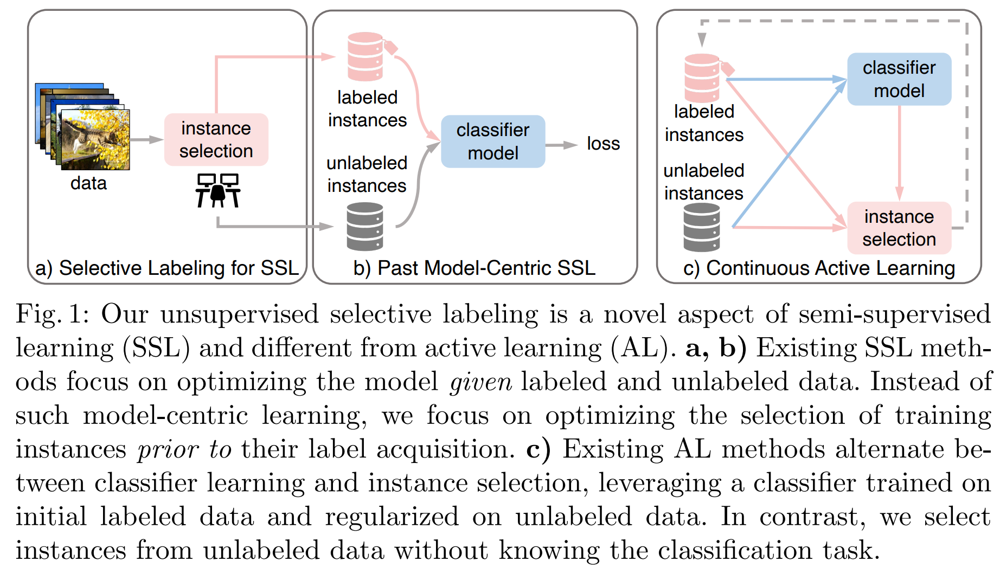
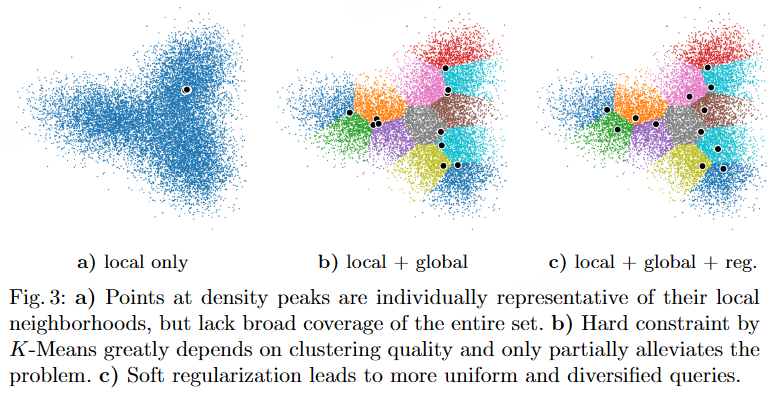

# Selective Labeling

最近的SSL方法以非常少的标记数据接近全监督学习的性能。例如，在ImageNet上，使用1%的标记数据进行SSL的效果就已经非常出色了。每个类别只有13张而非大约1300张标记过的图片，能达到有监督学习95%的效果

给定一个未标记的数据集和一个注释预算，我们研究了如何选择固定数量的实例进行标记，以便在此类部分标记的数据集上进行半监督学习（SSL）最为有效

这个实例选择任务很有挑战性，因为如果没有标记数据，我们不知道学习的目标应该是什么。标注数据越少（即标注水平越低），标注样本的选择对模型性能的影响越大。无论下游任务是什么，待标记的实例必须具有代表性和多样性：前者有助于将标签传播到未标记数据，而后者确保覆盖整个数据集。

> 典型图像可能代表大量相似图像，而异常样本（odd-ball）仅能代表自身，无法推广到其他样本。若标注实例仅覆盖部分数据多样性，分类器可能被局限在局部视角中，导致学习过程不稳定甚至模型崩溃。

SSL中的一个常见假设是，标记的实例要么在整个可用数据集中随机抽样，要么在单个类别中随机抽样，后者被称为分层抽样

- 随机抽样可能无法覆盖所有语义类别，从而导致性能差和不稳定
- 分层抽样则完全不现实：如果我们能够按类别采样数据，那么我们就已经拥有了每个实例的标签了！

为了模型优化而选择正确的数据进行标记并不新鲜。实际上，这是主动学习（AL）的重点：给定一组初始标记的数据，目标是选择另一个要标记的数据子集，以便在部分标记的数据上训练的模型接近于在完全标记的数据上训练的模型。

通过结合AL和SSL，也可以利用未标记数据进行模型训练，从而产生一系列称为半监督主动学习（SSAL）的方法。然而，现有的AL/SSAL方法存在几个缺点：

1. 他们通常一开始就需要随机抽样的标记数据，这在低标记量环境中效率低下，而SSL方法擅长处理这种情况
2. 自监督学习（AL）和半自监督学习（SSAL）方法设计有人类注释者参与，在多轮标记和训练中工作。这在少样本场景下可能显得繁琐，并导致较大的标记开销
3. AL自身具有人在回路设计（human-in-the-loop design）的训练流程，使其难以整合到现有的SSL代码实现中
4. 请求的标签与正在训练的模型紧密耦合，以至于每次使用AL/SSAL训练模型时都需要重新收集标签

与AL的监督数据选择形成鲜明对比，我们解决了在仅有注释预算和未标记数据集的情况下，如何选择固定数量的实例进行标记，以便在此类部分标记的数据集上进行半监督学习（SSL）最为有效

我们通过选择聚类原型来实现这一想法，无论是在预训练的特征空间中，还是在特征优化的过程中，两者都不需要标签。

我们的无监督选择性标记在标记效率上始终优于最先进的基于主动学习的方法，提高了8到25倍。例如，它在 CIFAR-10（ImageNet-1K）上将 FixMatch 的准确率提高了10%（14%），而标记数据的量仅为0.08%（0.2%）

## 方法

假设我们有一个未标记的数据集，包含n个实例和一个注释预算m。我们的任务是选取m（m≤n）个实例进行标注，以便在部分标注的数据集上训练出的安全学习（SSL）模型能够获得最佳的分类性能。该数据集有m个实例被标注，n-m个实例未被标注。

我们的流程有三个步骤：1）无监督特征学习，将数据映射到具有区分性的特征空间。2）选择最具代表性和多样性的实例进行标记，无论是否进行额外的优化。3）将SSL应用于标记过的数据和其余未标记的数据。

第一步是通过无监督的对比学习获得低维且语义上有意义的特征，该学习将 $x_i$​映射到一个经过 $L^2$ 归一化的d维超球面上，记作f(xi​)。我们使用MoCov2（SimCLR或CLD）在ImageNet（CIFAR）上学习表示

如何选择具有**代表性**的节点？直观地说，特征距离越小，从有标签节点到无标签节点传输类别信息的效果就越好。一种直接的方法是选择连接良好的节点，将语义信息传播给附近的节点。这相当于在特征空间中寻找一个**密度峰值**，可以使用K近邻密度（K-NN）估计公式

$$
p_{\mathrm{KNN}}(V_i, k) = \frac{k}{n}\frac{1}{A_d\cdot D^d(V_i, V_{k(i)})}
$$

如何选择具有**多样性**的节点？即在每个簇中挑选一个。虽然高特征密度值的实例各自具有代表性，但需要单独的标准以避免在相同的密度峰附近重复选择相似的实例

为了选择覆盖整个未标记数据集的m个多样化实例，我们重新排序至**K-Means聚类**，该聚类将n个实例划分为m(≤n)个簇，每个簇由其质心c表示，每个实例被分配到最近质心的簇中，即寻求m路节点划分，以最小化簇内平方和

$$
\min_{\mathcal{S}}\sum_{i = 1}^{m}\sum_{V\in S_i}\|V - c_i\|^2=\min_{\mathcal{S}}\sum_{i = 1}^{m}|S_i|\mathrm{Var}(S_i)
$$

到目前为止，我们使用K均值聚类找到m个硬簇，然后每个簇独立选择其代表。这最后一步并不是最佳的，因为高密度的实例可能位于簇的边界上，并且靠近相邻区域中的实例（见图3b）。因此，我们应用一个正则化器来通知每个簇其他簇的选择，并迭代地多样化选定的实例（见图3c）。

具体来说，当我们选定了m个实例的集合，我们希望集合里面的实例的距离越远越好，这样多样性就越大，我们通过一个正则化损失最小化与其他所有实例的总逆距离，这个正则化器使用指数移动平均值进行更新

