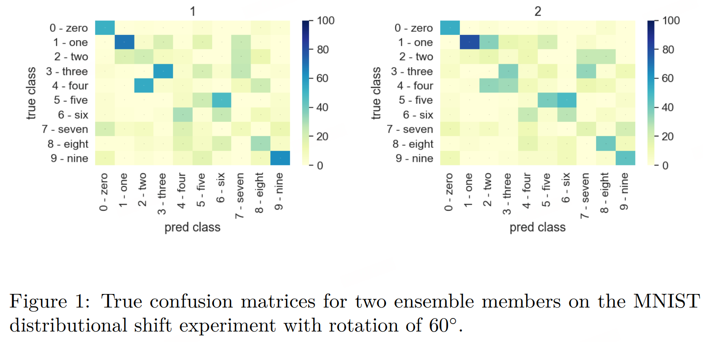

# Soft Dawid Skene

> Improving Deep Ensembles by Estimating Confusion Matrices

深度学习中的集成方法提高了单一网络的准确性和校准度。传统的聚合方法——集成平均法，通过平均各个网络的输出来平等地对待所有个体网络。

然而，这种最简单的方法没有考虑到集合成员的结构差异。考虑一个由三个神经网络组成的集合。模型A擅长识别动物，但经常误分类车辆。模型B正好相反——在车辆识别上非常准确，但在动物识别上较差。模型C在这两方面的表现都是平均水平。EA在预测时给这三个模型相同的权重，但对于动物，我们应该更加信任模型A；而对于车辆，应该优先选择模型B；模型C则处于中等水平。

理想情况下，我们希望有一种聚合方法来推断出每个模型的优缺点，然后据此权衡模型，而不是平等地对待所有模型。在上述示例中，模型C有一个对角线的混淆矩阵，型A的混淆矩阵在动物行上的对角权重更高，但在车辆行上的权重则更为均匀。

混淆矩阵的另外一个例子如下，当模型2预测“3”时，该数据点的真实类别是“3”或“4”的概率几乎相等。相比之下，模型1预测“3”的正确率高。因此，当我们结合这些模型的预测时，在它们都预测“3”的情况下，我们应该比模型2更重视模型1的预测。

但是，在预测时我们无法获得真实类别（实际预测中，数据是全新的、未标注的）。有些来自众包文献的方法可以在没有真实标签的情况下动态估计这些混淆矩阵。然而，它们大多只使用硬标签（即类别标签，如“猫”或“狗”）。因此，当它们被应用于集成时，它们忽略了软标签中编码的所有关于单个模型不确定性的信息，即每个类别的预测概率。

事实证明，软标签中编码的信息对于推断集成预测很重要，不使用混淆矩阵而是使用软标签的EA（Ensemble Aggregator，集成聚合器），比估计混淆矩阵但使用硬标签的众包模型表现得更好。

受到众包启发，我们提出了一种针对深度集成的聚合方法，称为Soft Dawid Skene，它估计集成成员的混淆矩阵并根据推断的性能为其加权。于常见的众包硬标签不同，它聚合软标签。

## 相关工作

多数投票（MV）是一种基线方法，通过选择类别预测的模式来确定。MV平等地权衡每个分类器，并且不估计混淆矩阵（类似于EA）。

一种流行的方法是Dawid Skene（DS）（Dawid和Skene，1979年），它使用期望最大化（EM）算法估计混淆矩阵，因此不同地权衡分类器

该模型贝叶斯版本是贝叶斯分类器组合（BCC）

在众包的背景下，集成平均法EA对应于MV，其中每个众包成员的输出在共识答案中具有相等的权重。MV在众包文献中一直是一个强大的基线（如同集成中的EA），并且由于其简单性而常用于实践。

然而，对于硬标签，根据技能不同而给予众包成员不同权重的众包模型优于MV，利用这一见解，我们探索使用不同权重的聚合是否也对软标签有益。
