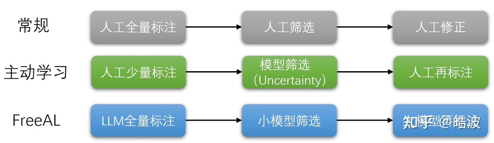
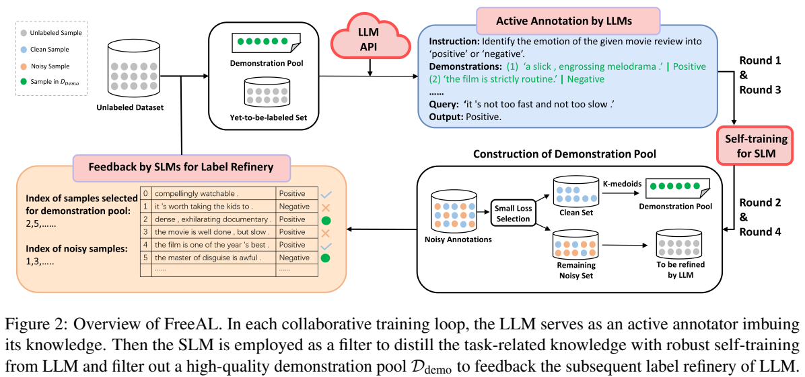
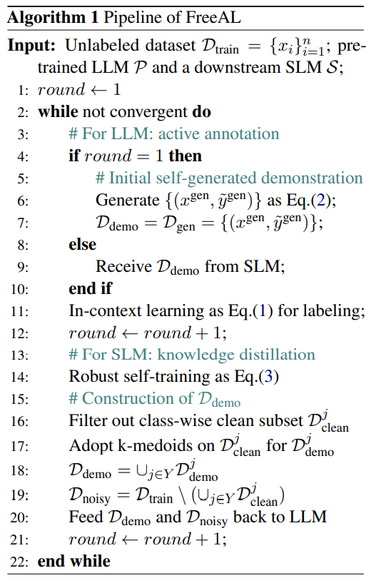

# FreeAL

数据标注耗时耗力，当前的改进方法包括半监督学习、带噪声标签学习等等。

其中，主动学习是一种突出的解决方案，它可以交互式地查询外部专家，以标记模型想要学习的新数据点。这些方法在一定程度上减轻了标注负担，但仍然需要人类在注释付出努力才能开始。

LLMs展现出了强大的零样本学习能力以及上下文学习 ICL 能力，可以从少量与任务相关的有标签样本中学习以提高性能。但不如经过微调的小型语言模型（SLMs）表现出色，可能的原因是，由于上下文长度有限，ICL 无法充分利用有监督的训练样本。参数大也比较难训练

FreeAL 通过从大型语言模型中交互式地提炼和过滤与任务相关的知识，改变了传统的主动学习：

- 虽然大型语言模型难以微调，但它们是有能力的零样本学习者，并且可以为下游任务提供粗粒度的知识。
- 小语言模型是有效的弱学习者，可以从有噪声的监督中提炼出有价值的干净样本。

为了将大型语言模型和小语言模型协同整合为一个整体，我们设计了一个协作训练框架，其中大型语言模型作为一个主动标注器注入其知识，小语言模型作为一个学生过滤出高质量的输入-标签对，以反馈给大型语言模型进行后续的标签精炼。 



## 背景

对于没有人类注释的无监督分类任务，给定一个未标记的训练数据集 $$\mathcal{D}_{\text{train}}=\{x_i\}^n_{i=1}$$，对应标签 $$y\in \mathcal{Y}=\{1,2,...C\}$$ 不可访问。任务是预测 $$\mathcal{D}_{\text{train}}, \mathcal{D}_{\text{test}}$$ 的真实标签。

对于 LLM $$\mathcal{P}$$，定义一个自然语言模板 $$T(\cdot)$$，其中包含额外的任务相关信息和一个动词化器 verbalizer $$V(\cdot)$$，verbalizer 将 $$\{1, ..., C\}$$ 中的每个类别标签映射到提示中的预定义标记。

对于参数为 $$\theta$$ 的 SLM $$\mathcal{S}$$，损失函数为交叉熵，其中 $$S^{j}(x_{i},\theta)$$ 是输入 $$x_{i}$$ 的 SLM 输出 softmax 概率的第 j 个条目，具有伪标签 $$\tilde{y}_{i}^{j}$$
$$
l_{i}=-\sum_{j \in Y} \tilde{y}_{i}^{j} \log S^{j}\left(x_{i}, \theta\right)
$$
当有监督数据可用时，我们可以直接使用少样本上下文学习进行推理。在 ICL 中我们构建prompt，其中包含 $$x^{\text{test}}$$ ，和从 $$\mathcal{D}_{\text{demo}}$$ 检索到的 $$\{x_i^{\text{demo}}, \tilde{y}_i^{\text{demo}}\}^m_{i=1}$$ ，引导大模型输出的方式为
$$
\arg\max_{P_{y\in Y}}(V(y)\mid T(x_{1}^{\text{demo}},\tilde{y}_{1}^{\text{demo}}),\ldots,T(x_{m}^{\text{demo}},\tilde{y}_{m}^{\text{demo}}),T(x^{\text{test}})) \tag{1}
$$
ICL 的成功在很大程度上取决于 $$\mathcal{D}_{\text{demo}}$$，这需要人类为每个单独的场景进行仔细标注，我们采用了我们提出的即插即用方法 FreeAL，无需任何人工监督

## 方法

与传统的主动学习在每个训练循环中都请求人类标注不同，FreeAL 采用大语言模型作为弱标注器。在每个训练循环中，交替执行以下步骤：

1. 基于 SLM 的反馈，通过大语言模型对待标注样本进行主动标注
2. 训练弱监督 SLM 以从大型语言模型的噪声标注中提取与任务相关的知识，并反过来反馈给它们



### Active Labeling by LLMs

在 FreeAL 的初始轮次中，有一个无监督的训练集 $$\mathcal{D}_{\text{train}}$$，直接通过 LLM 进行零样本的 ICL 

由于初始标注质量差，这种策略可能在很大程度上阻碍小语言模型的知识蒸馏过程。于是我们引导大语言模型首先模仿来自 $$\mathcal{D}_{\text{train}}$$ 的未标记样本的格式，然后生成新的具有标签的示例来构建初始的 $$\mathcal{D}_{\text{demo}}$$

> 当给定一些未标记的样本和任务描述性指令时，人类可以模仿这些文本的表达风格并利用自己的知识来生成类似的具有标签意识的样本。这对 ICL 很重要

data-generation prompt 包含一个解释任务背景的指令 $$\rho_{\text{gen}}$$ ，以及从 $$\mathcal{D}_{\text{train}}$$ 中 Q 个随机选择的未标记样本 $$c_{\text{gen}}$$ 作为模仿的原型，生成的过程概括为如下公式
$$
\{(x^{\text{gen}},\tilde{y}^{\text{gen}})\} \leftarrow P(\rho_{\text{gen}},T(c_{\text{gen}})) \tag{2}
$$
生成的样本构成了数据集 $$\mathcal{D}_{\text{gen}}={(x^{\text{gen}}, \tilde{y}^{\text{gen}})}$$ 被用作后续标注的演示池，$$(i.e., \mathcal{D}_{\text{demo}}=\mathcal{D}_{\text{gen}} )$$ ，之后，每个 prompt 包含与 $$x_{i}$$ 具有最高嵌入相似度的来自 $D_{\text{demo}}$ 的 m 个最近邻。ICL 过程遵循公式(1)。

有了 prompt  中的演示，LLM能够为训练数据集 $$\mathcal{D}_{\text{train}} = \{x_i, \tilde{y}_i\}_{i = 1}^n$$ 提供尚可的初始标注 $\tilde{y}$，标注 $\tilde{y}$ 被用作结构语言模型后续训练的伪标签。

在后续轮次中，SLM 使用由 LLM $$\mathcal{P}$$ 给出的弱标注进行训练。同时，SLM 过滤出一个高质量的演示池 $$\mathcal{D}_{\text{demo}}$$ 作为反馈。然后，利用高质量的 $$\mathcal{D}_{\text{demo}}$$，LLM 根据公式（1）通过少样本 ICL 对剩余的易受噪声影响的样本进行重新标注。

### Robust Self-training

LLM 很难区分自身的错误，获得的是弱标注，不过深度模型在训练过程中有检测噪声样本的潜力。因此，在收到弱标签后，我们的目的有两个：

1. 训练一个强大且稳健的下游特定任务语言模型，以最大程度地提取特定任务的知识
2. 利用派生的特定任务语言模型过滤出高质量的演示池，以反馈给大型语言模型

受深度神经网络的记忆效应的启发，SLM 倾向于在训练的早期阶段首先拟合简单模式。因此，有噪声的样本大多会带来较大的损失值。为此，我们从带噪声标签学习中，采用基于选择的技术，来训练一个鲁棒的 SLM 以用于知识蒸馏。

在经过几个带有噪声标签的标准训练的热身时期后，给定反映模型对样本 $$x_{i}$$ 拟合程度的标准交叉熵损失 $$l_{i}$$，对损失值 $$l_{i}$$ 拟合一个双成分的GMM，以区分干净样本与噪声样本

> **GMM（高斯混合模型）**通过拟合两个高斯分布，区分低损失（干净样本）和高损失（噪声样本）的分布

定义 $$w_{i}=p(g | l_{i})$$ 为样本 $$x_{i}$$ 属于均值 $$g$$ 较小的高斯成分的概率（即干净概率），设定阈值，将训练集划分为干净子集 $$\mathcal{D}_{l}$$ 和噪声子集 $$\mathcal{D}_{u}$$
$$
\begin{aligned} & \mathcal{D}_{l}=\left\{\left(x_{i}, \tilde{y}_{i}\right) | x_{i} \in \mathcal{D}_{\text{train}}, w_{i} \geq \tau\right\}, \\ & \mathcal{D}_{u}=\left\{\left(x_{i}\right) | x_{i} \in \mathcal{D}_{\text{train} }, w_{i}<\tau\right\} \end{aligned} \tag{3}
$$
为了提高训练的鲁棒性，我们利用一致性正则化来提高性能，即分类器应该对每个数据点的局部邻域产生相似的预测。

对样本 $$x_i$$，通过回译（Back-Translation）生成增强版本 $$x_{i}^{\text{aug}}$$，计算交叉熵损失和 KL 散度，以及 $$\mathcal{D}_{l}$$ 上的交叉熵损失 $$L_{\text{clean} }$$
$$
\begin{aligned} & L_{\text{cr}}^{l}=\frac{1}{\left|\mathcal{D}_{l}\right|} \sum_{x_{i} \in \mathcal{D}_{l}} l_{ce}\left(x_{i}^{\text{aug}}, \tilde{y}_{i}\right), \\ & L_{\text{cr}}^{u}=\frac{1}{\left|\mathcal{D}_{u}\right|} \sum_{x_{i} \in \mathcal{D}_{u}} l_{kl}\left(\mathcal{S}\left(x_{i}^{\text{aug}}\right), \mathcal{S}\left(x_{i}\right)\right) \\
&L_{\text{total}}=L_{\text{clean} }+\alpha\left(L_{\text{cr} }^{l}+L_{\text{cr} }^{u}\right)

\end{aligned}
$$

### Demonstration Pool Filtering

我们希望过滤出一个更好的 $$\mathcal{D}_{\text{demo}}$$，优先选择具有准确标签的代表性示例纳入其中，方法如下：

对于每个类别 *j* 的训练子集 $$\mathcal{D}_{\text{train}}^j$$ 中的样本，选择前 *R*% 的最小交叉熵损失的样本，即
$$
\mathcal{D}_{\text{clean}}^j=\{(x_i,\tilde{y}_i)\mid \text{rank}(l_i)\leq R\%,\tilde{y}_i = j\}
$$
进一步采用聚类算法 *k*-medoids，对SLM的嵌入进行聚类，从 $$\mathcal{D}_{\text{clean}}^j$$ 中过滤出最具代表性的中心样本，当 *k*-medoids 算法收敛时，收集 *k* 个聚类的中心作为 $$\mathcal{D}_{\text{demo}}^j$$

最后，从每个类别中合并演示集，得到 $$\mathcal{D}_{\text{demo}}=\cup_{j\in Y}\mathcal{D}_{\text{demo}}^j$$

将 $$\mathcal{D}_{\text{demo}}$$ 作为 ICL 学习中的示例，LLM 可以继续标注剩下有噪声的数据集 $$\mathcal{D}_{\text{noisy}}=\mathcal{D}_{\text{train}}\setminus(\cup_{j\in Y}\mathcal{D}_{\text{clean}}^j)$$



### Robust Self-training

在自训练过程中，还采用了一种混合训练策略，该策略对干净子集 $$\mathcal{D}_{l}$$ 上的嵌入和相应的伪标签进行插值，以鼓励样本之间的线性行为。通过对随机采样的示例对 $$(x_{i}, \tilde{y}_{i})$$ 和 $$(x_{j}, \tilde{y}_{j})$$ 进行线性插值生成一个虚拟的混合训练示例。
$$
\begin{align*}
\text{Emb}(x^m)&=\sigma\text{Emb}(x_i)+(1 - \sigma)\text{Emb}(x_j)\\
y^m&=\sigma\tilde{y}_i+(1 - \sigma)\tilde{y}_j
\end{align*}
$$
Emb为嵌入，$$\sigma\sim\text{Beta}(\varsigma,\varsigma)$$， $\varsigma=4$。混合损失 mixup loss 记为 $L_{\text{mix}}$
$$
L_{\text{total}}=L_{\text{clean} }+\alpha\left(L_{\text{cr} }+L_{\text{mix} }\right)
$$

### prompt examples

Demonstration Generation

```
You are required to produce 100 English examples with labels for the task of text classification on the MR (Movie Review) dataset. These samples will be used as prompt examples for the GPT model. MR dataset is used in sentiment-analysis experiments and this dataset contains movie- review documents labeled with respect to their overall sentiment polarity (positive or negative). The task is to classify a movie review as positive or negative according to their overall sentiment polarity. For example, 100 of the unlabeled samples in MR dataset are as follows: ["review": "enigma is well-made , but it’s just too dry and too placid ."] ["review": "the weakest of the four harry potter books has been transformed into the stronger of the two films by the thinnest of margins ."] .....
```

Active Annotation

```
You are a helpful assistant for the task of text classification on the MR (Movie Review) dataset. You reply with brief, to-the-point answers with no elaboration as truthfully as possible. MR (Movie Review) dataset is used in sentiment-analysis experiments and this dataset contains movie- review documents labeled with respect to their overall sentiment polarity (positive or negative). Your task is to a binary classification to classify a movie review as positive or negative according to their overall sentiment polarity. The category is divided into two types: ’positive’ and ’negative’. Given a movie review: <QUERY>. How do you feel about the sentiment polarity of the given movie review, is this positive or negative? please answer in a single line with ’positive’ or ’negative’.
```

## 实验

在多数任务上，采用 GPT-3.5-Turbo 作为 LLM，RoBERTa-Base 作为 SLM， ICL 过程提供 10 个上下文示例作为演示，这是由于 GPT-3.5-Turbo 的最大上下文长度为 4096。

- FreeAL 显著提高了 LLM 和 SLM 的无监督性能
- 利用LLM进行标注是完全可行的，小模型可以协同进行过滤、精炼大模型的标签
- FreeAL 在一些简单任务上，实现了与有监督训练相当的性能
- 在其他具有挑战性的任务上，大大缩小了零样本和有监督性能之间的差距
- 通过更多的交互轮次（也意味着更大的成本）可以进一步提高性能，但从经验上看，4 轮交互可以达到令人满意的结果
- 在有 20% 和 50% 的人工标注数据时，FreeAL 优于传统的主动学习基线。FreeAL 可以作为传统主动学习的一种优越替代方案
- 对于大语言模型来说，它可以自我提升，但不如与 SLM 的协作机制提升大
- 在大多数评估案例中，最终的小语言模型的性能优于大语言模型
- 当 SLM 的大小从 RoBERTaBase 增加到 RoBERTa-Large 时，FreeAL 表现出卓越的性能

## 过大的数据集

对于每个样本，ICL 最多执行两次，分别作为初始注释和细化注释。

当面临一个太大而无法对整个数据集进行标注的训练集时，可以通过一个简单的多轮解决方案进一步降低标注成本。其核心思想是更多地依靠语言模型的弱监督学习能力，从少量的标注标签中提炼信息。

1. 对于 LLM 的初始标注轮，随机抽取 P% （一般10%）的样本子集由 LLM 进行标注
2. 为了进行稳健的自训练，对标注数据 $$D_{labeled }$$ 执行原始训练过程
3. 简单地将噪声集 $$D_{u}$$ 的一致性正则化 $$L_{cr}^{u}$$ 扩展到原本未标注的数据（即 $$D_{u}=D_{u} \cup D_{unlabeled }$$）
4. $$D_{demo}$$ 的构建过程相同
5. 对于 $$D_{noisy }$$，从未标注样本中随机抽取另一个子集 P% 的样本，由大语言模型进行标注，用于下一次迭代
6. 如果可用，迭代轮数可以比原始的 FreeAL 更多，以便以有限的标注成本逐渐提炼与任务相关的知识

这种补救措施能够取得具有竞争力的结果，接近原始的 FreeAL，且每一轮仅需以前成本的 10%

> 在 SLM 上随机采样待标注子集的过程可以通过其他先进的查询策略（例如基于不确定性的策略）进一步改进，这是传统主动学习中的一个经典主题

