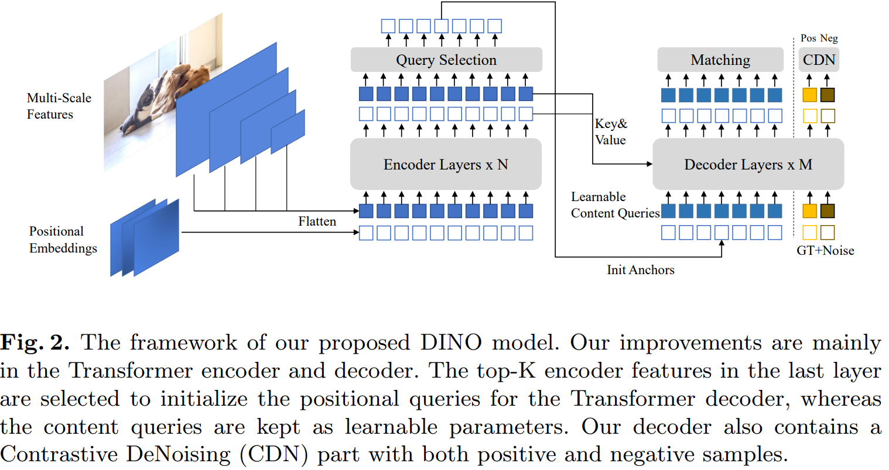
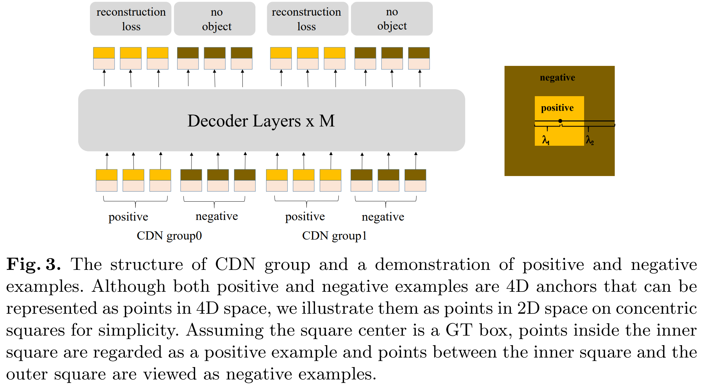
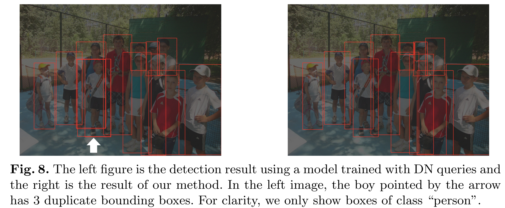
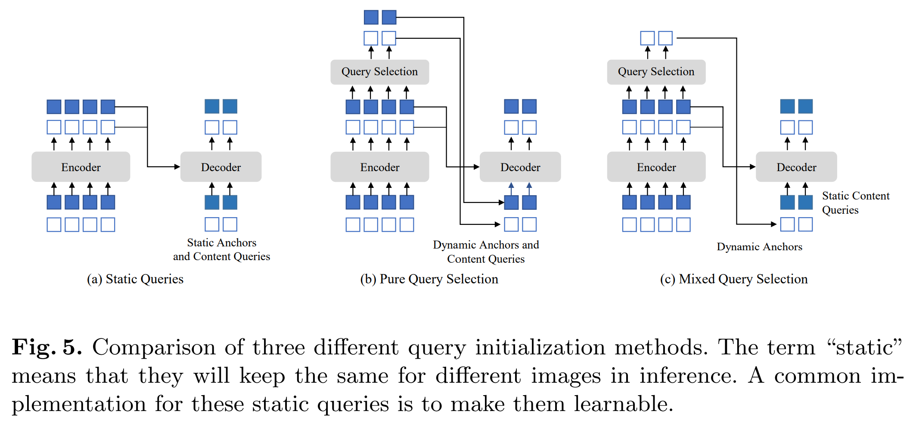
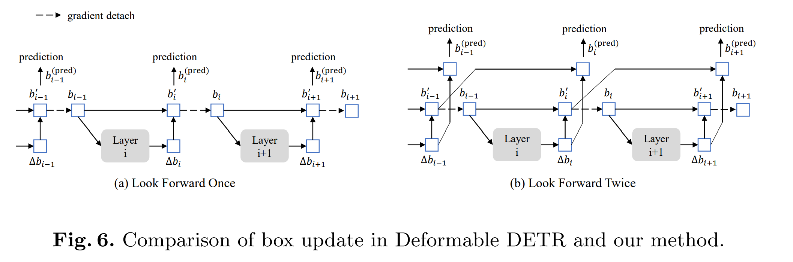

# DINO

> DINO: DETR with Improved DeNoising Anchor Boxes for End-to-End Object Detection
>
> META 也有 DINO 系列工作，是无监督学习图像特征，不要和那个搞混了，Grounding DINO 的前置工作是这个，做的是端到端目标检测器

目标检测是计算机视觉中的一个基本任务。经典的基于卷积的目标检测算法已经取得了显著的进展。

与经典检测算法不同，DETR是一种基于Transformer的新型检测算法。它消除了对手工设计组件的需求，并且通过与优化过的经典检测器如Faster RCNN相当的性能实现了目标。与之前的检测器不同，DETR模型将目标检测视为集合预测任务，并通过二分图匹配分配标签。它利用可学习的查询来探测对象的存在，并结合图像特征图的特征。

尽管其性能令人期待，但DETR的训练收敛速度较慢，且查询的含义不明确。即使提出了许多方法解决这些问题，但是如今最好的检测模型仍基于改进的经典检测器，两个主要原因是：

1. 之前的类DETR模型不如改进后的经典检测器。大多数经典检测器已经得到了充分的研究和高度优化，因此与新开发的类DETR模型相比，性能更好。
2. 类DETR模型的可扩展性尚未得到充分研究。目前还没有关于类DETR模型在大规模主干网络和大规模数据集上表现的报道。

本文旨在解决这两个问题。具体来说，通过改进去噪训练、查询初始化和框预测，我们将我们的模型命名为DINO（具有改进去噪锚框的DETR）。效果好。

作为类DETR模型，DINO包含一个主干网络、一个多层Transformer编码器、一个多层Transformer解码器和多个预测头：

- 我们将在解码器中将查询表述为动态锚框，并在解码器层之间逐步对其进行细化
- 我们将带有噪声的真实标签和框添加到Transformer解码器层中，以帮助在训练期间稳定二分匹配
- 采用了可变形注意力机制，因为其计算效率较高。
- 为了提高一对一匹配的效果，我们通过同时添加同一真实标签的正负样本来进行对比去噪训练。在向同一个真实框添加两种不同的噪声后，我们将噪声较小的框标记为正样本，另一个标记为负样本。对比去噪训练有助于模型避免对同一目标的重复输出。
- 动态锚框查询的表述将类DETR模型与经典的两阶段模型联系起来。因此，我们提出了一种混合查询选择方法，该方法有助于更好地初始化查询。我们选择初始锚框作为来自编码器输出的位置查询。然而，我们像之前一样使内容查询是可学习的，鼓励第一个解码层专注于空间先验。
- 为了利用来自后面层的精细化框信息来帮助优化其相邻早期层的参数，我们提出了一个新的两次前瞻方案，用来自后面层的梯度来校正更新的参数。

## 相关工作

早期的基于卷积的目标检测器分为两阶段或单阶段模型，这些模型基于手工制作的锚点或参考点。

- 两阶段模型通常使用区域提议网络（RPN）来提出潜在的框，然后在第二阶段进行细化。
- 像YOLO v2和YOLO v3这样的单阶段模型直接输出相对于预定义锚点的偏移量。
- 最近，一些基于卷积的模型如HTC++和Dyhead取得了顶尖的性能。

然而，基于卷积的模型的性能依赖于它们生成锚点的方式。此外，它们需要手工设计的组件如非极大值抑制（NMS）来移除重复的框，因此无法执行端到端的优化。

Carion等人提出了一个基于Transformer的端到端目标检测器，名为DETR（DEtection TRansformer），它不使用像锚点设计和NMS这样手工设计的组件。DETR中的查询由两部分组成：位置部分和内容部分，本文分别称之为位置查询和内容查询。

许多后续论文尝试解决由解码器交叉注意力引入的DETR训练收敛缓慢的问题。另一项研究致力于更深入地理解DETR中的解码器查询。许多论文从不同角度将查询与空间位置联系起来。

DAB-DETR明确地将DETR中的每个位置查询表述为一个4D锚框（x,y,w,h），其中x和y是框的中心坐标，w和h分别对应其宽度和高度。这种明确的锚框表述使得在解码器中逐层动态精细化锚框变得容易。

DN-DETR引入了一种去噪（DN）训练方法，以加速类DETR模型的收敛速度。研究表明，DETR中收敛缓慢的问题是由于二分匹配的不稳定性造成的。为了缓解这一问题，DN-DETR提出额外将带噪声的真实（GT）标签和框输入到Transformer解码器中，并训练模型重构真实标签。由于DN-DETR遵循DAB-DETR将解码器查询视为锚点的做法，带有噪声的GT框可以被看作是一种特殊的锚点，

除了原始的DETR查询外，DN-DETR增加了一个DN部分，它将带有噪声的GT标签和框输入到解码器中，以提供辅助的DN损失。DN损失有效地稳定并加快了DETR的训练，并且可以插入到任何类似DETR的模型中。

Deformable DETR是另一项早期工作，用于加速DETR的收敛。为了计算可变形注意力，它引入了参考点的概念，使得可变形注意力能够关注围绕参考点的一小组关键采样点。参考点概念使得开发几种技术以进一步提高DETR性能成为可能。

1. 第一种技术是查询选择，它直接从编码器中选择特征和参考框作为解码器的输入。
2. 第二种技术是通过在两个解码器层之间精心设计梯度分离来进行迭代边界框细化。我们在论文中将这种梯度分离技术称为“看一次”。

继DAB-DETR和DN-DETR之后，DINO将位置查询表述为动态锚框，并通过额外的DN损失进行训练。注意，DN-DETR还采用了来自 Deformable DETR的几项技术以实现更好的性能，包括其可变形注意力机制和在层参数更新中的“看一次”实现。DINO 进一步采用了来自 Deformable DETR的查询选择思想，以更好地初始化位置查询。在这个强大的基线基础上，DINO  引入了三种新方法来进一步提升检测性能

## 方法

作为一个类DETR模型，DINO 是一个端到端的架构，包含一个主干网络、一个多层Transformer编码器、一个多层Transformer解码器以及多个预测头。

1. 给定一张图片
2. 使用像ResNet或Swin Transformer这样的主干网络提取多尺度特征
3. 将其输入到带有相应位置嵌入的Transformer编码器中
4. 在通过编码器层进行特征增强后，我们提出了一种新的**混合查询选择策略**，将锚点初始化为解码器的位置查询。注意，该策略不初始化内容查询，而是让它们保持可学习状态。
5. 有了初始化的锚点和可学习的内容查询，我们使用可变形注意力结合编码器输出的特征，并逐层更新查询
6. 最终输出由精细化的锚框和通过精细化内容特征预测的分类结果形成。

如同DN-DETR，我们有一个额外的DN分支来进行去噪训练。在标准的DN方法之外，我们提出了一种新的对比性去噪训练方法，该方法考虑了硬负样本。为了充分利用来自后期层的精细框信息来帮助优化其相邻早期层的参数，我们提出了一种新颖的向前看两次的方法，用于在相邻层之间传递梯度

### 对比性去噪训练

DN-DETR 在稳定训练和加速收敛方面非常有效。借助DN查询，它学会基于附近有真实框（GT）的锚点进行预测。然而，它缺乏对附近没有物体的锚点预测“无物体”的能力。为了解决这个问题，我们提出了一种对比性去噪（Contrastive DeNoising，CDN）方法来拒绝无用的锚点。

DN-DETR 有一个超参数 *λ* 来控制噪声尺度。生成的噪声不大于 *λ*，因为DN-DETR希望模型从适度噪声的查询中重构真实情况（GT）。在我们的方法中，我们有两个超参数 $$\lambda_1$$ 和 $$\lambda_2$$，其中 $$\lambda_1 < \lambda_2$$

如图3中的同心正方形所示，我们生成了两种类型的CDN查询：正查询和负查询。

- 内正方形内的正查询噪声尺度小于 $$\lambda_1$$，他们被预期重构实际框
- 在内部和外部正方形之间的负查询噪声尺度大于 $$\lambda_1$$ 且小于 $$\lambda_2$$，他们被期望预测“无对象”

我们通常采用较小的 $$\lambda_2$$，因为靠近 ground truth 的难负样本对提升性能更有帮助。如图3所示，每个CDN组都有一组正面查询和负面查询。如果一张图片有n个GT框，一个CDN组将有2×n个查询，每个GT框生成一个正面和一个负面查询。

与DN-DETR类似，我们还使用多个CDN组来提高我们方法的有效性。重构损失采用l1损失和GIOU损失用于框回归，以及 focal loss 用于分类。将负样本分类为背景的损失也是focal loss。

> 我们的方法之所以有效，是因为它能够抑制混淆并选择高质量的锚点（查询）来预测边界框。当多个锚点靠近同一个物体时，就会发生混淆。在这种情况下，模型很难决定选择哪个锚点。这种混淆可能导致两个问题。
>
> - 第一个是重复预测。尽管类DETR模型可以通过基于集合的损失和自注意力来帮助抑制重复的框，但这种能力是有限的。如图8左图所示，当我们用DN查询替换我们的CDN查询时，箭头指向的小男孩有3个重复预测。使用CDN查询，我们的模型可以区分锚点之间的细微差别，避免重复预测，如图8右图所示。
> - 第二个问题是可能会选择一个远离GT框的不需要的锚点。尽管去噪训练已经提高了模型选择附近锚点的能力，但CDN通过教导模型拒绝更远的锚点进一步提升了这一能力。
>
> 

### 混合查询选择

在DETR和DN-DETR中，解码器查询是静态嵌入，不采用来自单个图像的任何编码器特征，如图5(a)所示。它们直接从训练数据中学习锚点（在DN-DETR和DAB-DETR中）或位置查询（在DETR中），并将内容查询设置为全0向量。

Deformable DETR同时学习位置和内容查询，这是静态查询初始化的另一种实现方式。为了进一步提高性能，Deformable DETR 有一个查询选择变体，它从最后一个编码器层中选择前K个编码器特征作为先验，以增强解码器查询。如图5(b)所示，位置和内容查询都是通过对选定特征进行线性变换生成的。此外，这些选定的特征还被输入到一个辅助检测头以获得预测框，这些预测框用于初始化参考框。

我们模型中动态的4D锚框查询公式使其与解码器位置查询密切相关，这可以通过查询选择来改进。我们遵循上述做法并提出了一种混合查询选择方法。如图5(c)所示，我们仅使用与选定的前K个特征相关的位置信息初始化锚框，但保持内容查询与之前一样静态。请注意，Deformable DETR不仅利用前K个特征增强位置查询，还增强内容查询。由于选定的特征是未经进一步细化的初步内容特征，它们可能对解码器来说含糊且具有误导性。例如，一个选定的特征可能包含多个对象或仅是对象的一部分。相比之下，我们的混合查询选择方法仅用前K个选定特征增强位置查询并保持内容查询如前所述可学习。它帮助模型更好地利用位置信息从编码器中汇总更全面的内容特征。

### Look Forward Twice

我们在本节中提出了一种新的框预测方法。在Deformable DETR中的迭代框细化通过阻断梯度反向传播来稳定训练。我们将这种方法命名为“看前一次”，因为第i层的参数仅基于辅助损失 $$b_i$$ 进行更新，如图6(a)所示。

然而，我们推测来自较晚层的改进的框信息可能更有助于纠正其相邻早期层中的框预测。因此，我们提出了另一种称为“看前两次”的方法来进行框更新，其中第i层的参数受到第i层和第(i+1)层损失的影响，如图6(b)所示。

对于每个预测的偏移 $$\Delta b_i$$，它将被用来两次更新框，一次用于$$b_i'$$，另一次用于 $$b_{i+1}^{(pred)}$$，因此我们将我们的方法命名为“看前两次”。

预测框 $$b_{i}^{(pred)}$$ 的最终精度由两个因素决定：初始框的 $$b_{i-1}$$ 质量和框的预测偏移 $$\Delta b_i$$。仅优化后者的“看前一次”方案，因为梯度信息与从第i层到第(*i*−1)层是分离的。相比之下，我们同时改进初始框  $$b_{i-1}$$ 和预测框偏移  $$\Delta b_i$$ 

提高质量的一个简单方法是使用下一层的输出 $$\Delta b_{i+1}$$ 来监督第 i 层的最终框 $$b_i'$$。因此，我们使用 $$b_i'$$ 与 $$\Delta b_{i+1}$$ 之和作为第−(*i*+1)层的预测框。

更具体地，给定第i层的输入框 $$b_{i-1}$$，我们通过以下方式获得最终预测框 $$b_{i}^{(pred)}$$：
$$
\Delta b_{i}=\mathrm{Layer}_{\mathrm{i}}\left(b_{i-1}\right), \quad \quad \quad b_{i}^{\prime}=\mathrm{Update}\left(b_{i-1}, \Delta b_{i}\right),\\
b_{i}=\mathrm{Detach}\left(b_{i}^{\prime}\right), \quad \quad \quad b_{i}^{\text{(pred)}}=\mathrm{Update}\left(b_{i-1}^{\prime}, \Delta b_{i}\right),
$$
 其中 $$b_i'$$ 是 $$b_i$$ 的未分离版本。通过预测的盒子偏移量 $$\Delta b_i$$ 来精细化盒子 $$b_{i-1}$$