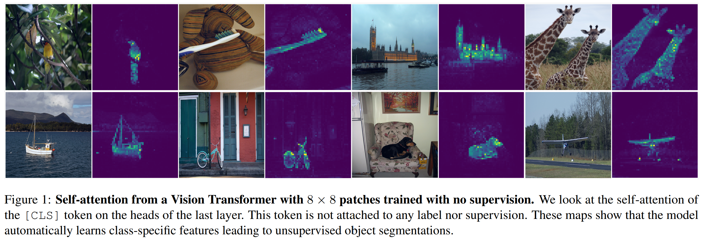
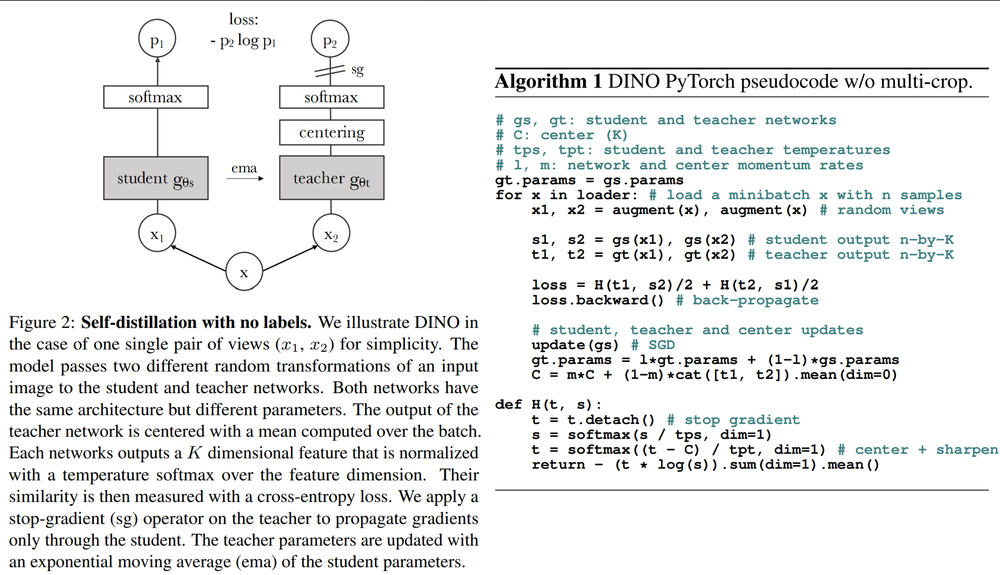
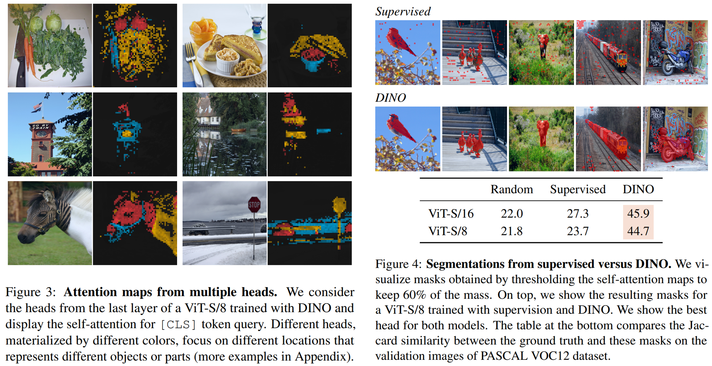
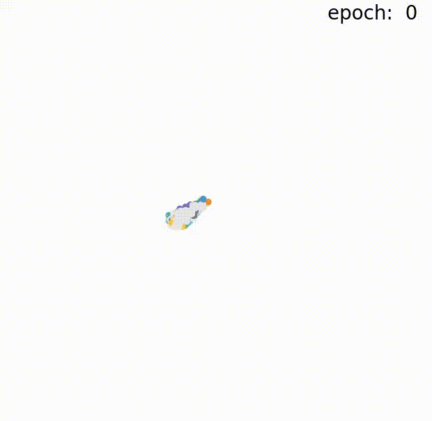

# DINO

> Emerging Properties in Self-Supervised Vision Transformers
>
> [参考](https://mp.weixin.qq.com/s?__biz=MzU1MzY0MDI2NA==&mid=2247499393&idx=1&sn=83e6eecb11e4dc03dde296d06d689e3c&chksm=fbed76a6cc9affb0095fa04452a111fd483720980208fc6edd09c0bd8f207e7f94d6c151a1cb&scene=21#wechat_redirect)

## TL;NR

`DINO` 是一种用于自监督视觉学习的深度学习模型，于 2021 年由 `Facebook AI` 提出。DINO 是最先探讨基于 `Transformer` 架构的自监督学习代表作之一，其通过在无标签图像上进行自监督训练来学习视觉特征表示。

相比于监督学习需要人为地提供标签告诉模型这是什么，自监督学习无须任何“显示”标签，只需输入图像通过某种机制便能让网络学会理解图像本身的语义信息。例如，我们可以通过图像旋转、随机裁剪等变换，使模型学习到不同角度、不同尺度下的特征。另外，也可以通过模型自身的预测来构建任务，例如预测图像的局部块、颜色等等。这些任务由于不需要人类标注，因此可以在大规模的无标签数据上进行训练，从侧面上提供了一种从无标签数据中学习特征表示的新方法，它可以帮助我们更好地利用现有数据资源，解决监督学习中的一些瓶颈问题。

回到正题，DINO 的核心思想便是通过在大规模的无标签数据集上进行对比学习，学习出一组具有可传递性的视觉特征表示。在 DINO 中，作者通过引入一个新的对比学习方法，将**原始图像的特征与随机裁剪的图像的特征进行对比**，从而学习到更好的视觉通用表征，最终也获得了非常出色的效果。

DINO 这个名称可以理解为是由 Distillation 和 NO labels 这两个词组成的缩写，既表达了DINO采用自蒸馏方法的特点，也突出了它是一种基于无监督学习的模型。具体来说，DINO 是使用一种称为“无监督自蒸馏”的方法，该方法通过自监督学习来学习模型的知识表示。在这个方法中，模型使用自身的输出来生成“伪标签”，然后使用这些伪标签来重新训练模型，从而进一步提高模型的性能和泛化能力。

## Intro

Transformers 作为卷积神经网络在视觉识别方面的替代方案而出现。它们采用 NLP 的训练策略，即在大量数据上进行预训练，然后在目标数据集上进行微调，由此产生的 ViT 与卷积网络竞争尚未显示出明显的优势：它们在计算上要求更高，需要更多的训练数据，且其特征没有表现出独特的属性。

我们质疑在视觉领域 Transformer 的成功是否可以通过在预训练中使用超视觉来解释。我们的动机是，在 NLP 中，Transformer成功的关键因素之一是使用了自监督预训练，这些自监督预训练目标利用句子中的单词来创建比预测每个句子的单个标签的监督目标更丰富的学习信号的预训练任务。同样，在图像中，图像级监督通常将图像中包含的丰富视觉信息简化为从预定义的几千个对象类别集合中选择的一个单一概念。

虽然NLP中使用的自监督预训练任务是特定于文本的，但许多现有的自监督方法已在具有卷积神经网络的图像上展示了它们的潜力。它们通常具有相似的结构，但包含不同的组件以避免平凡解（崩溃）或提高性能。在这项工作中，受到这些方法的启发，我们研究了自监督预训练对ViT特征的影响。特别值得关注的是，我们已经发现了一些有趣的性质，这些性质不会出现在监督的ViT中，也不会出现在ConvNets中，只在自监督的ViT出现：

- 如图：自监督的ViT特征明确包含了场景布局（scene layout），特别是物体边界。这些信息可以直接在最后一个块的自我注意力模块中访问。
- 自监督的ViT特征在没有微调、线性分类器或数据增强的情况下，仅使用基本的最近邻分类器（k-NN）表现尤为出色，在ImageNet上达到了78.3%的top-1准确率。

总体而言，我们对这些组件重要性的发现促使我们设计了一种简单的自监督方法，该方法可以解释为一种无标签的知识蒸馏。由此产生的框架DINO，通过使用标准的交叉熵损失，直接预测由动量编码器构建的教师网络的输出，从而简化了自监督训练。特别重要的是，我们的框架灵活，适用于卷积网络和ViT，无需修改架构，也无需适应内部规范化。

我们通过在ImageNet线性分类基准测试中，使用小块的ViT-Base以80.1%的Top-1准确率超越了之前的自监督特征，进一步验证了DINO与ViT之间的协同作用。我们还确认DINO可以与卷积神经网络配合使用，通过与ResNet-50架构的最新成果相匹配来证实这一点。最后，我们讨论了在不同场景下如何使用有限的计算和内存容量结合ViT使用DINO。特别是，用ViT训练DINO只需两台各配备8个GPU的服务器，在3天内就能在ImageNet线性基准测试中获得76.1%的成绩，这比基于尺寸相当的ConvNets的自监督系统表现更优，且显著降低了计算需求。

## 方法

对于知识蒸馏，我们训练一个学生网络 $$g_{\theta_s}$$ 以匹配给定教师网络 $$g_{\theta_t}$$ 的输出。给定一个输入图像x，两个网络都输出K个维度的概率分布，分别用 $$P_s$$ 和 $$P_t$$ 表示。概率P是通过用softmax函数对网络g的输出进行归一化得到的：
$$
P_s(x)^{(i)} = \frac{\exp\left(g_{\theta_s}(x)^{(i)}/\tau_s\right)}{\sum_{k=1}^K \exp\left(g_{\theta_s}(x)^{(k)}/\tau_s\right)}	
$$
其中，$$\tau_s$$ 为温度参数，控制输出分布的锐度。$$P_t$$ 公式同理。给定一个固定的老师网络 $$g_{\theta_t}$$ ，我们通过最小化交叉熵损失来学习匹配这些分布，
$$
\min_{\theta_{s}} H\left(P_{t}(x), P_{s}(x)\right)
$$

$$
H(a,b)=-a \log b
$$

我们解释一下上述伪代码和整个过程。首先采用多裁剪策略构建图像的不同扭曲视图或裁剪部分。即从给定图像生成一组不同视图的集合V。该集合包含两个全局视图 $$x_1^g$$ 和 $$x_2^g$$ 以及几个分辨率较低的局部视图。

所有裁剪部分都通过学生模型，而只有全局视图通过教师模型，从而鼓励“局部到全局”的对应关系。我们最小化损失：
$$
\min_{\theta_{s}}\sum_{x\in\left\{x_{1}^{g},x_{2}^{g}\right\}}\sum_{\substack{x^{\prime}\in V\\ x^{\prime}\neq x}}H\left(P_{t}(x),P_{s}\left(x^{\prime}\right)\right)
$$

> 这种“局部到全局”的对应关系是在无标签情况下自监督提升模型效果的核心 idea，把局部特征和全局特征分别交给不同的模型来学习，以便在处理整个图像时，能够更好地对局部细节和上下文进行综合判断。
>
> 这种损失是通用的，可以应用于任意数量的视图，甚至只有2个。然而，我们遵循多裁剪的标准设置，使用分辨率为 $$224^2$$ 的2个全局视图，覆盖原始图像的大部分区域（例如大于50％），以及多个分辨率为 $$96^2$$ 的局部视图，仅覆盖原始图像的小部分区域（例如小于50％）。除非另有说明，我们将此设置称为DINO的基本参数化。

两个网络共享相同的架构 g，但参数集 $$\theta_s$$ 和 $$\theta_t$$ 不同。我们通过使用随机梯度下降最小化方程 SGD 来学习参数 $$\theta_s$$ 

> 神经网络g由主干f（ViT或ResNet）和投影头h组成。用于下游任务的特征是主干f的输出。投影头由一个具有隐藏维度2048的三层多层感知器（MLP）组成，其后接 L2 规范化和一个权重规范化的全连接层，该层具有K个维度。

与知识蒸馏不同，我们没有预先给定的教师模型 $$g_{\theta_t}$$，因此，我们通过学生网络的过去迭代来构建它。在我们的框架中，冻结一个周期内的教师网络效果出奇地好，而复制学生的权重给教师则未能收敛。而在学生权重上使用指数移动平均（EMA），特别适合我们的框架，其中 *λ* 在训练期间遵循从0.996到1的余弦调度：
$$
\theta_t \leftarrow \lambda\theta_t + (1 - \lambda)\theta_s
$$

> 最初，动量编码器作为对比学习中的队列替代品被引入。然而，在我们的框架中，它的角色有所不同，因为我们没有队列也没有对比损失，可能更接近于自训练中使用的均值教师的角色。实际上，我们观察到这位教师执行了一种类似于Polyak-Ruppert averaging with an exponential decay的模型集成(model ensembling)。使用这种方法进行模型集成是提高模型性能的标准做法。我们观察到，这位教师在整个训练过程中的表现都优于学生，因此，通过提供更高质量的目标特征来指导学生的训练。这种动态在之前的工作中并未观察到
>
> 学生和教师网络均输出相同 `embeddings` 的情况容易出现模式崩塌(`mode collapse`)的现象。在《`Momentum Contrast for Unsupervised Visual Representation Learning`》一文中提出了一种解决方案，即应用“动量教师”(`momentum tearcher`)模型，可以简单地理解为就是教师的模型不是基于反向传播更新的，而是再对学生模型进行梯度回传后，在通过指数移动平均(`Exponentially Weighted Average, EWA`)，直接将学生网络学习到的模型参数更新给教师网络，换句话就是教师网络的权重更新自学生网络。

整体回顾下方法

几种自监督方法通过不同的操作来避免崩溃，例如对比损失、聚类约束、预测器或批量归一化。我们的框架通过对动量教师输出的居中和锐化处理也可以避免模型崩溃：居中防止某一维度主导但鼓励向均匀分布崩溃，而锐化则产生相反的效果。应用这两种操作可以平衡它们的效果，足以在存在动量教师的情况下避免崩溃。选择这种方法是为了避免崩溃而换取稳定性，减少对批次的依赖

> 在自监督学习中，mode collapse 是指网络的学习过程中出现了多样性减少的现象。具体来说，当网络学习到一组特征表示时，往往会出现多个输入数据映射到相同的特征表示的情况，这就是所谓的模式崩塌。这种现象通常是由于网络在优化过程中陷入了局部最优解，只能考虑到一部分数据的特征表示，而忽略了其它数据样本的模式和特征，从而导致了多样性缺失的现象，因此会对模型的鲁棒性产生很大的负面影响。

通过在教师softmax归一化中使用较低的温度值来获得输出锐化效果。

> 这种技巧通过在 softmax 函数中加入一个 temperature 参数，来强制让模型将概率分布更加尖锐化。由于小差异会被夸大，这会防止所有激活值都是相同的，因为小的差异也会被放大。这个技巧和中心化操作搭配使用，可以使得激活值不断变化，从而引导学生模型更好地了解哪些特征应该变得更加强大。

居中操作只依赖于一阶批量统计数据，并可以被解释为给教师添加一个偏置项c，中心c用指数移动平均值更新，这允许该方法在不同批量大小下都能很好地工作
$$
c \leftarrow m c + (1 - m) \frac{1}{B} \sum_{i=1}^{B} g_{\theta_t}(x_i)
$$

$$
g_{\theta_t}(x) \leftarrow g_{\theta_t}(x)+c
$$

其中 *m*>0 是一个速率参数，B 是批量大小。

> 这个操作的目的是使得激活值有时候是正的（当它们高于平均值时），有时候是负的（当它们低于平均值时）。由于 softmax 函数在处理负数时会给出较小的概率值，而在处理正数时会给出较大的概率值，因此这种操作能够防止任何一个特征占据统治地位，因为平均值会在值的范围中间。

## 实验

自我监督学习的标准协议要么在冻结的特征上学习一个线性分类器，要么在下游任务上微调特征。

- 对于线性评估，我们在训练期间应用随机调整大小裁剪和水平翻转增强，并在中心裁剪上报告准确率。
- 对于微调评估，我们用预训练的权重初始化网络，并在训练期间进行调整。
- 然而，这两种评估都对超参数敏感，例如在改变学习率时，我们观察到运行之间准确率的大方差。因此，我们还使用简单的加权最近邻分类器（k-NN）来评估特征质量，我们将预训练模型冻结，以计算和存储下游任务的训练数据的特征。然后，最近邻分类器将图像的特征与投票给标签的k个最近存储的特征进行匹配。我们遍历不同数量的最近邻，并发现对于我们的大多数运行来说，20个最近邻始终表现最佳。这个评估协议不需要任何其他超参数调整，也不需要数据增强，并且只需对下游数据集进行一次遍历即可运行，极大地简化了特征评估过程。

用最简单的k-NN的分类效果也很好

我们的自注意力图包含了关于图像分割的信息，我们评估了由这些注意力图生成的掩码进行图像分割的质量

相比于监督学习，DINO 的潜在空间也具有很好的分离类别，这意味着它的特征足够丰富，可以分离物体中的微小差异，这使得它非常适合下游任务和迁移学习。

最后，我们通过 t-SNE 可视化一起看看 DINO 的整个学习表征过程：

