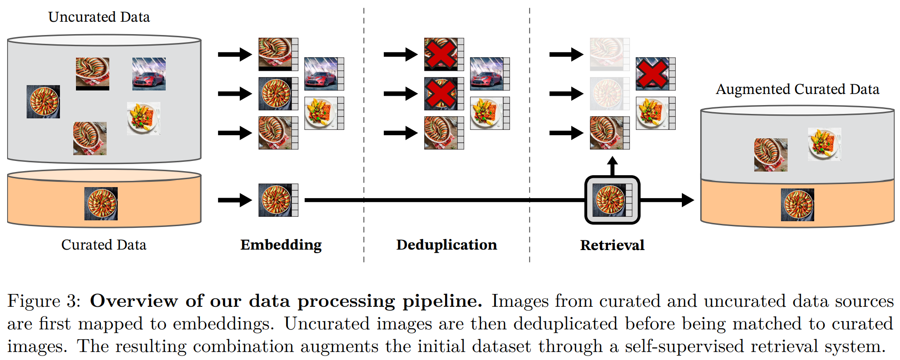
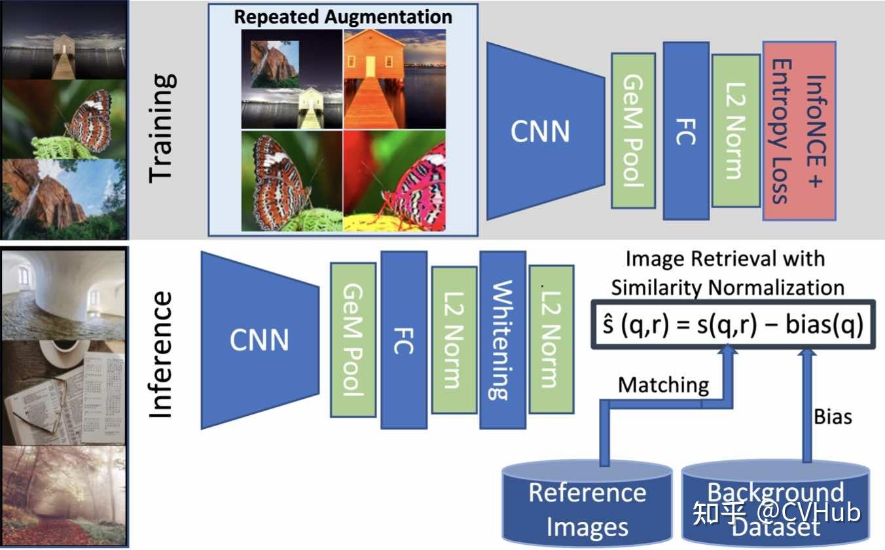
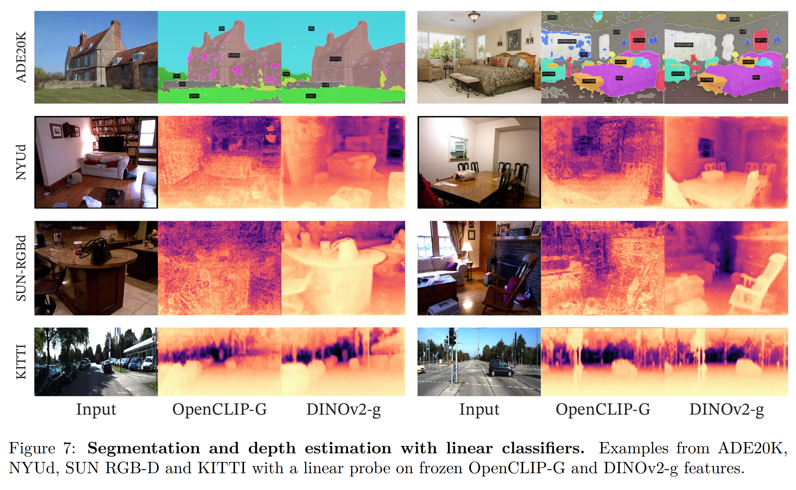

# DINOv2 (META)

> DINOv2: Learning Robust Visual Features without Supervision

学习任务无关的预训练表示已成为 NLP 的标准做法，我们预计 CV 也会出现类似的“基础”模型，这些模型应能在任何任务上直接生成有效的视觉特征，无论是在图像级别（例如，图像分类）还是在像素级别（例如，分割）。

大多数针对这些基础模型的有前途的努力都集中在文本引导的预训练上，即使用一种形式的文本监督来指导特征的训练，这种基于文本引导的预训练限制了可以保留关于图像的信息，因为标题只是近似图像中的丰富信息，复杂的像素级信息在这种监督下可能不会出现。此外，这些图像编码器需要对齐的文本-图像语料库，因此，它们没有文本的灵活性，即仅从原始数据中学习。

一种替代文本引导预训练的方法是自监督学习，其中特征是仅从图像中学习的。这些方法与语言建模等预训练任务在概念上更接近，并且可以捕捉到图像和像素级别的信息。此外，自监督模型输出的特征已被证明展现出各种有用的属性，并使得多种多样的应用成为可能。然而，尽管它们具有学习通用特征的巨大潜力，但大多数自监督学习的进展都是在针对小型精选数据集ImageNet-1k进行预训练的背景下取得的。一些尝试扩展这些方法超出ImageNet-1k的努力已经进行，但它们专注于未经过筛选的数据集，这通常会导致特征质量的显著下降。

在这项工作中，我们探讨了如果在大规模精选数据上进行预训练，自监督学习是否具有学习通用视觉特征的潜力。我们重新审视了现有的判别式自监督方法，这些方法在图像和块级别学习特征，并且我们在更大数据集的视角下重新考虑它们的一些设计选择。我们的技术贡献主要是为了在模型和数据规模扩展时稳定和加速判别式自监督学习。这些改进使我们的方法快了大约2倍，并且需要的内存比类似的判别式自监督方法少3倍，这使我们能够利用更长的训练时间和更大的批量大小。

关于预训练数据，我们构建了一个自动化的流程来过滤和重新平衡来自大量未筛选图像的数据集。这个流程受到自然语言处理中使用的流程的启发，其中使用数据相似性而不是外部元数据，并且不需要手动注释。在处理外部图像时的一个主要困难是重新平衡概念并避免对少数主导模式过度拟合。在这项工作中，一种简单的聚类方法很好地解决了这个问题。我们收集了1.42亿张小型但多样化的图片来验证我们的方法。

最终，我们提供了多种预训练的视觉模型，称为DINOv2，这些模型使用不同的Vision Transformers（ViT）架构在我们的数据上进行训练。我们在各种计算机视觉基准测试中验证了DINOv2的质量，这些测试在图像和像素级别进行，结论是仅通过自监督预训练本身就是一个良好的候选方法，用于学习可迁移的冻结特征，这些特征与最佳公开可用的弱监督模型竞争。

## 数据处理

我们通过从一个大型未策划数据池中检索与几个策划数据集中的图像接近的图像，组装了我们策划的 LVD-142M 数据集。我们的流程不需要任何元数据或文本，直接处理图像，如图所示。

**数据来源**。我们对 curated 数据集的选择包括ImageNet-22k、ImageNet-1k的训练集分割、  Google Landmarks 和几个细粒度数据集。对于 uncurated 数据源，我们从公开可用的网络爬虫数据仓库收集了一个原始未过滤的图像数据集。从仓库中的每个网页中，我们提取了``标签中的图片URL链接。我们丢弃不安全或受域名限制的URL，并对下载的图片进行后处理（PCA哈希去重、过滤NSFW内容以及模糊可识别的面部）。这得到了12亿张独特的图片。

**去重**。我们将拷贝检测流程应用于未整理的数据，并移除近似重复的图片。这减少了冗余，提高了图片之间的多样性。我们还移除了在本工作中使用的任何基准测试的测试集或验证集中包含的图片的近似重复项。采用《`A self-supervised descriptor for image copy detection`》这篇论文提出的`copy detection pipeline`进行图像查重，本质上也是通过深度学习的方法计算相似度

**自监督图像检索**。我们通过从我们的 uncurated 数据源检索与 curated 来源中的图片接近的图片来构建我们的预训练数据集。

1. 我们首先使用在ImageNet-22k上预训练的基于自监督ViT-H/16网络计算一个图像嵌入，并使用余弦相似度作为图片之间的距离度量。
2. 我们对 uncurated  数据进行k均值聚类，使得同一组内的图像在视觉上非常相似，以便在检索时能快速找到与查询图像相似的图像。
3. 给定一个查询图像，我们从与查询图像所在的聚类中检索N（通常为4）个最相似的图像。如果查询图像所在的聚类太小，我们会从聚类中抽样M张图像（M是由视觉检查结果后决定的，在这里， "视觉检查" 是指通过人工检查了一些从聚类中检索到的图像）。
4. 将这些相似的图像和查询图像一起用于预训练，那么便能够获得一个更加优质、精心筛选过的大规模预训练数据集

**实施细节**。我们流程的去重和检索阶段依赖于Faiss库来高效地索引并计算最近嵌入的批量搜索。整个处理过程分布在一个由20个节点组成的计算集群上，这些节点配备了8至100个32GB的GPU，并且生成 LVD-142M 数据集所需时间不到两天。

## 具有辨别力的自监督预训练

我们采用一种具有辨别力的自监督方法来学习特征，该方法可视为结合了DINO和iBOT损失以及SwAV的中心化。我们还加入了一个正则化器来扩散特征，并增加了一个短暂的高分辨率训练阶段。

> 这种自监督方法是由多个损失函数组成的，包括 DINO（Transformers之间的局部信息最大化），iBOT（特征之间的相似度最小化）和 SwAV（样本中心化）。同时，添加了一个正则项，以使特征在特征空间中更加均匀地分布。此外，DINOv2 中还进行了一个短暂的高分辨率训练阶段，以进一步提高特征的鲁棒性。

**图像级目标**。我们考虑从学生和教师网络提取的特征之间的交叉熵损失。这两种特征都来自ViT的 class token，通过同一图像的不同裁剪获得。

> 基本思想是将来自同一图像不同裁剪的视图作为正样本，将来自不同图像的视图作为负样本，使用交叉熵损失函数来衡量这些视图之间的相似性和差异性，从而训练一个学生网络。另外，使用指数移动平均方法构建一个教师网络，其参数是过去迭代的加权平均值，以减少训练中的波动。最终，我们使用这两个网络的类令牌特征作为特征表示。

- 我们将学生 class token 通过学生DINO head 。这个头部是一个输出“原型分数”向量的MLP模型。然后应用softmax得到 $$p_s$$ 
- 同样，我们对教师类标记应用教师DINO头部以获得教师原型分数。然后我们应用softmax函数，接着用 moving average（或后文详述的 Sinkhorn-Knopp centering）进行中心化处理，以获得  $$p_t$$。
- DINO损失项：$$\mathcal{L}_{\text{DINO}} = -\sum p_{t} \log p_{s}$$
- 我们学习学生的参数，并用过去迭代的指数移动平均值构建教师头部

**块级目标**。我们随机遮盖一些提供给学生的输入块，但不遮盖给教师的。然后我们将学生iBOT头部应用于学生遮盖标记。同样，我们将教师iBOT头部应用于对应于学生中遮盖的（可见的）教师块标记。接着我们像上面那样应用softmax和居中步骤，并得到iBOT损失项：
$$
\mathcal{L}_{\text{iBOT}} = -\sum_{i} p_{\text{ti}} \log p_{\text{si}}
$$
其中，i 指掩蔽标记的补丁索引。与上面类似，我们学习学生的参数，并通过指数移动平均值构建教师头部。 Patch 级别的损失与图像级别的损失相结合，以便在训练过程中兼顾整体和局部特征。

**在两个目标之间解开头部权重**。DINO和iBOT损失都使用可学习的MLP投影头部。它被应用于输出标记，并在其上进行损失计算。在周等人（2022a）的一项消融研究中显示，共享DINO和iBOT头部之间的参数可以获得更好的性能。在大规模实验中，我们观察到相反的情况，因此我们在所有实验中都使用了两个独立的头部。

**Sinkhorn-Knopp centering**。阮等人（2023年）建议用SwAV的Sinkhorn-Knopp（SK）批量归一化来替代DINO和iBot的教师softmax居中步骤。这个方法的核心思想是通过正则化来使学生和教师网络在特征表示上更加接近。我们运行Sinkhorn-Knopp算法的迭代次数为3次。对于学生模型，我们应用softmax归一化。

**KoLeo正则化器**。KoLeo正则化器源自 Kozachenko-Leonenko differential entropy estimator ，通过计算特征向量之间的差异来确保它们在批次内均匀分布。给定一组n个向量 $$(x_1,…,x_n)$$，其定义为
$$
\mathcal{L}_{\text{koleo}} = -\frac{1}{n} \sum_{i=1}^{n} \log \left(d_{n,i}\right)
$$
其中，$$d_{n, i} = \min_{j \neq i} \|x_{i} - x_{j}\|$$ 表示 $$x_i$$ 与批次内任何其他点之间的最小距离。在计算这个正则化项之前，我们还对特征进行了 L2 规范化。

**调整分辨率**。提高图像分辨率对于像素级的下游任务至关重要，如分割或检测，因为在低分辨率下小物体会消失。然而，高分辨率训练既耗时又耗内存，因此我们在预训练的末期通过一个短时间段将图像分辨率提高到 518×518 

**模型蒸馏**。对于较小的模型，我们通过从我们最大的模型ViT-g进行蒸馏（旨在通过最小化一组给定输入下两个输出之间的距离，用较小的模型再现大型模型的输出）来获得它们，而不是从头开始训练。

由于我们的目标函数是从教师网络向学生网络的蒸馏形式，我们利用相同的训练循环，但有几个例外：我们使用一个较大的模型作为固定的教师模型，保留一个备用学生模型的EMA，将其作为我们的最终模型，移除遮罩和随机深度，然后在两个全局裁剪上应用iBOT损失。

## 实验

特征的质量直接与预训练数据的质量相关。在大多数基准测试中，在精选的图片集上训练的效果比在未整理的数据上训练的要好。这证实了即使在自监督预训练的情况下，整理数据的好处。

对于小型架构，我们通过蒸馏较大的模型而不是从零开始训练它们。蒸馏出的模型在所有12个基准测试中都优于从零开始训练的模型，验证了我们针对小型模型的预训练方法。

