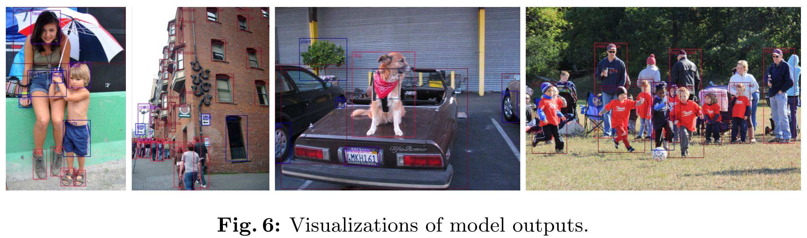
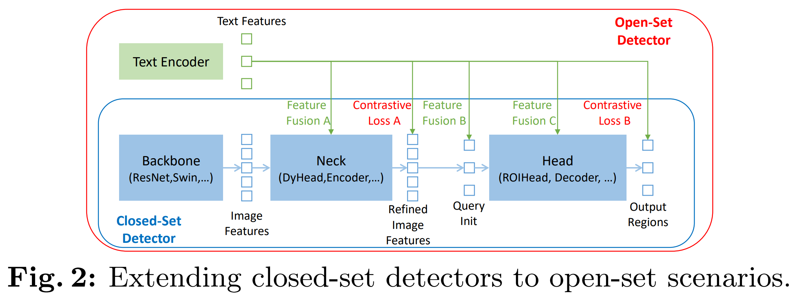
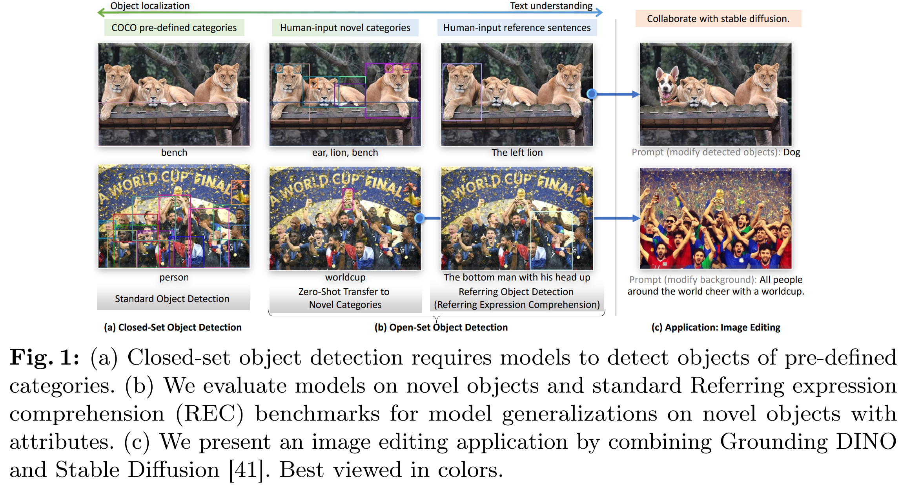
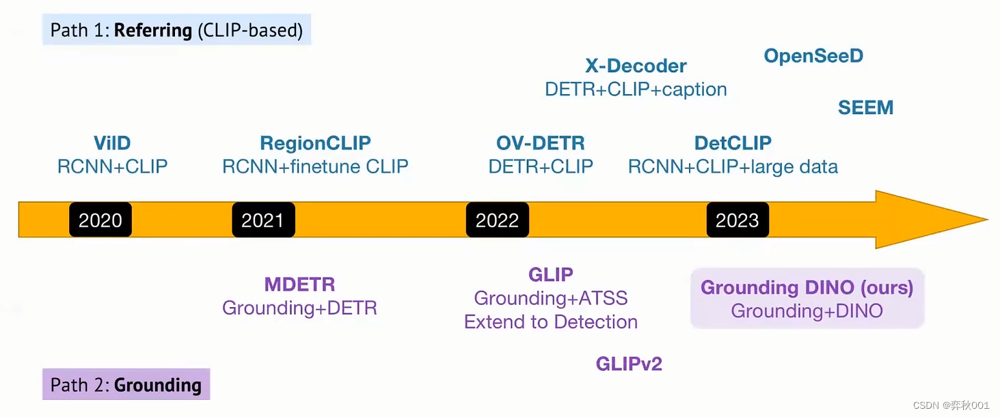
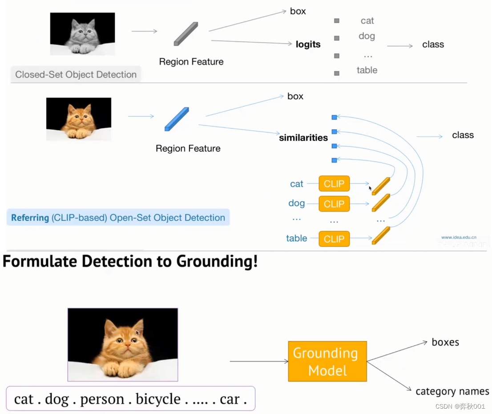
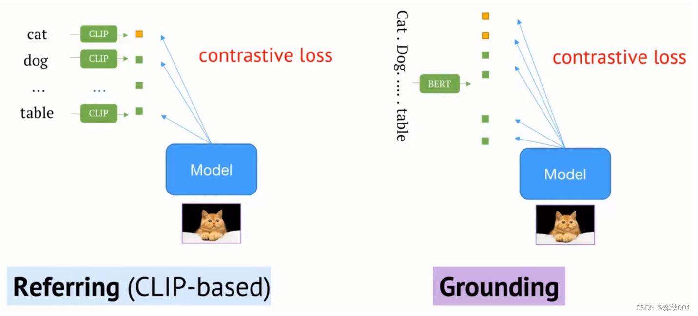
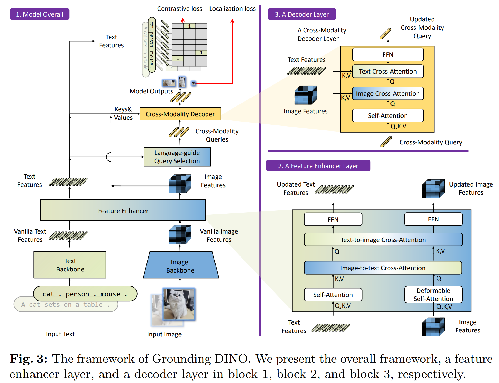
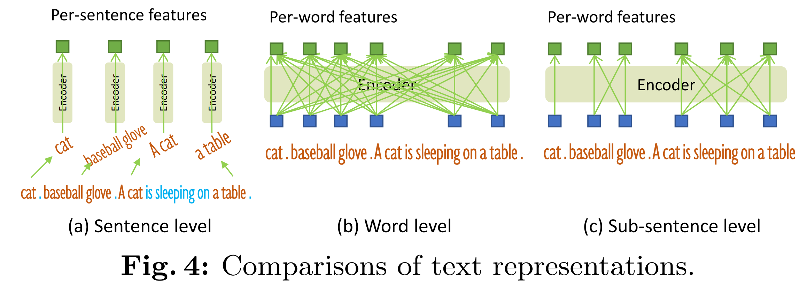
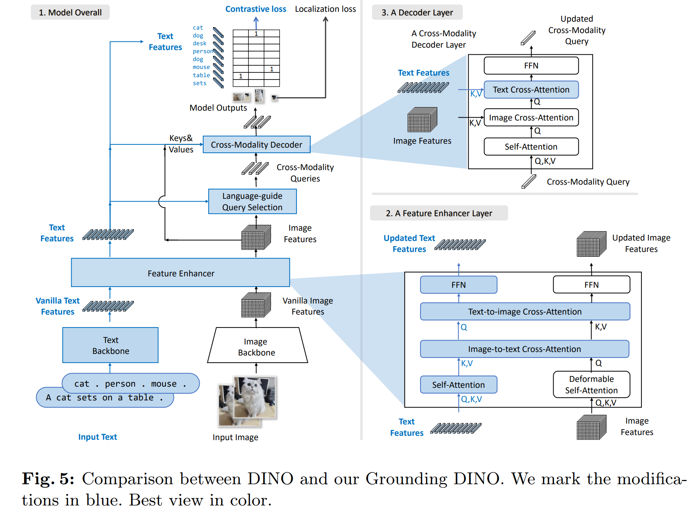

# Grounding DINO

既CLIP打破文字和图像之间的壁垒、DINO提高了目标检测精度的上限之后，Grounding DINO可以根据文字描述检测指定目标。例如你告诉它：“检测左边的狮子！”，它就会只把左边的狮子框选出来

## Intro

AGI 系统能力的关键指标是其处理开放世界场景的熟练程度。本文旨在开发一个强大的系统来检测由人类语言输入指定的任意对象，这一任务通常被称为开放集对象检测。

为实现这一目标，我们遵循两个原则设计了强大的开放集对象检测器——基于DINO的紧密模态融合和大规模 grounded 预训练以实现概念泛化。

### 基于DINO的紧密模态融合

开放集检测的关键在于引入语言以实现未见对象的泛化。大多数现有的开放集检测器都是通过将闭集检测器扩展到包含语言信息的开放集场景而开发的。如上图所示，闭集检测器通常有三个重要模块：

- 用于特征提取的主干
- 用于特征增强的颈部
- 用于区域细化（或框预测）的头部

闭集检测器可以通过学习语言感知的区域嵌入来泛化检测新对象，以便每个区域都能在语言感知的语义空间中被分类到新类别。实现此目标的关键是在颈部和/或头部输出处使用区域输出和语言特征之间的对比损失。

为了帮助模型对齐跨模态信息，一些工作尝试在最终损失阶段之前融合特征。特征融合可以分为三个阶段进行：颈部（阶段A）、查询初始化（阶段B）和头部（阶段C）。我们认为，在流程中引入更多的特征融合可以促进不同模态特征之间更好地对齐，从而实现更好的性能。

> 尽管概念上简单，但以往的工作很难在所有三个阶段都执行特征融合。像Faster RCNN这样的经典检测器的设计使得大多数块中与语言信息的交互变得困难。与经典检测器不同，基于Transformer的检测方法如DINO与语言块具有一致的结构。逐层设计使其能够轻松地与语言信息交互。

根据这一原则，我们在颈部、查询初始化和头部阶段设计了三种特征融合方法。更具体地说，我们通过堆叠自注意力、文本到图像的交叉注意力和图像到文本的交叉注意力作为颈部模块来设计一个特征增强器。然后，我们开发了一种语言引导的查询选择方法，用于初始化检测头的查询。我们还为头部阶段设计了一个跨模态解码器，该解码器包含图像和文本的交叉注意力层，以提升查询表示。

### 大规模 grounded 预训练用于零样本迁移

大多数现有的开集模型依赖于预训练的CLIP模型进行概念泛化。尽管如此，CLIP（尤其是针对图像-文本对预训练的）在区域-文本对检测任务上的有效性有限

> 相比之下，GLIP提出了一种不同的方法，通过将目标检测重新表述为短语定位任务，并在大规模数据上引入对象区域与语言短语之间的对比性训练。它在异构数据集上表现出极大的灵活性，并且在闭集和开集检测上有显著的性能。

我们采纳并改进了 grounded 训练方法。GLIP的方法涉及将所有类别以随机顺序连接成一个句子。然而，直接连接类别名称并没有考虑到在提取特征时无关类别之间可能相互影响的问题。为了缓解这个问题并在 grounded 训练期间提高模型性能，我们引入了一种利用子句级别文本特征的技术。它在词特征提取过程中移除了无关类别之间的注意力。

我们在一个大规模数据集上预训练了Grounding DINO，并在像COCO这样的主流目标检测基准测试中评估了其性能。此外，我们将该模型扩展到另一个重要场景——指代表达理解（Referring Expression Comprehension，简称REC）其中对象通过属性进行描述。

> 虽然一些研究已经考察了在“部分标签”框架下进行开集检测模型——在数据的一个子集（例如，基本类别）上进行训练，然后在额外的类别上进行测试——但我们主张采用完全零样本的方法来增强实际应用能力。

我们在所有三种设置上进行了实验，包括闭集检测、开集检测和指称对象检测，如上所示，以全面评估开集检测性能。grounding DINO大幅领先于竞争对手。

## 背景

目前开放数据集检测共有两条途径，Referring与Grounding

- 传统的卷积目标检测，是将类别输出投影到类别标签上，选出最大值作为当前box的类别。这里类别标签是预定好监督信号，输出logits不能超出这些类别。这是传统目标检测不能识别未见过的目标的根本原因。
- referring的做法是，提取box的方法不变。从外部输入文本提取类别token， 然后这些类别经过clip模型转换成tensor向量，这些向量与视觉模型提取的类别logits tensor求相似度，最大的值就是当前box的类别，这种做法是开集检测方法之一。
- grounding意思是，给定图片和文本描述，预测文本中所提到物体的在图片中的位置， 如给定多个物品类别，cat,dog，person。。。，组成文本。同时输入模型后，给出定位框box和类别值。

关于损失，

- referring对输入文本token后，每个类别token用clip提特征，然后与模型输出求对比损失
- grounding是把输入文本整体（要先经过token分词）用文本模型（如bert）提取token特征，然后与模型输出求对比损失，这里分词可能会把一个单词分词两个，那么这两个分词的标签都为1

这两种方法的损失函数通常都基于**对比学习 (Contrastive Learning)** 的思想，核心是**拉近匹配对的特征距离，推远不匹配对的特征距离**。一个非常通用的形式是 **InfoNCE Loss** (一种对比损失的变体)，它在形式上等价于多分类的交叉熵损失。

### Referring 的损失计算

对于图像中的每一个候选区域（Region Proposal），我们都提取了其视觉特征。同时，我们有一个包含所有可能类别名称的文本列表，并用CLIP的文本编码器为每个类别生成了文本特征。损失函数的目标是：对于一个正确的“区域-类别”对，最大化它们的相似度；同时最小化该区域与其他所有错误类别的相似度。

假设我们有 N 个候选区域，C 个类别名称。对于第 `i` 个区域，其视觉特征为 $$v_i$$，其真实类别标签为 $$y_i$$。第 `j` 个类别名称的文本特征为 $$t_j$$。损失函数可以表示为：
$$
\mathcal{L}_{\text{referring}} = -\sum_{i=1}^{N} \log \frac{\exp\left(\operatorname{sim}(v_i, t_{y_i})/\tau\right)}{\sum_{j=1}^{C} \exp\left(\operatorname{sim}(v_i, t_j)/\tau\right)}
$$

- $$t_{y_i}$$ : 第 `i` 个区域对应的正确类别文本特征向量。
- sim(v,t): 计算视觉特征 `v` 和文本特征 `t` 之间的相似度，通常使用余弦相似度 (Cosine Similarity)。

公式本质上是一个 **Softmax + 交叉熵损失**。它计算了在所有 C 个类别中，模型将区域 `i` 正确分类为 $$y_i$$ 的概率，并最大化这个对数概率。

### Grounding 的损失计算

Grounding 的损失更为复杂，因为它不仅要匹配类别，还要处理更自由的文本。通常，模型会为图像预测一组对象（每个对象包含一个边界框和对应的视觉特征），同时文本编码器（如BERT）会为输入句子的每个词元（token）生成一个特征向量。损失函数的目标是**最大化图像中某个对象与文本中描述它的词元之间的相似度**。这通常被建模为一个**集合对集合（set-to-set）**的匹配问题，并结合多种损失。

Grounding 模型的总损失通常是多个部分的加权和，但其核心的**分类/对齐损失**同样可以是对比损失。对于第 `i` 个预测出的对象（其视觉特征为 $$v_i$$），它在文本中标注的对应词元集合为 $$T_{\text{pos}}$$（正样本），句子中所有其他词元为 $$T_{\text{neg}}$$（负样本）。
$$
L_{\text{align}} = -\sum_{i=1}^{N} \sum_{t_{p} \in T_{\text{pos}}^{(i)}} \log \frac{\exp \left(\operatorname{sim}(v_{i}, t_{p}) / \tau\right)}{\sum_{t_{k} \in T_{\text{pos}}^{(i)} \cup T_{\text{neg}}^{(i)}} \exp \left(\operatorname{sim}(v_{i}, t_{k}) / \tau\right)}
$$
此外，总损失还必须包含**定位损失 (Localization Loss)**：
$$
L_{\text{loc}} = \sum_{i=1}^{N} \mathcal{L}_{\text{box}}(b_i, \hat{b}_i)
$$

$$
L_{\text{grounding}} = \lambda_1 L_{\text{align}} + \lambda_2 L_{\text{loc}}
$$

其中，$$\mathcal{L}_{\text{box}}$$ 用于计算预测边界框 $$b_i$$ 和真实边界框 $$\hat{b}^i$$ 之间差异的函数，常用 **L1 损失** 或 **GIoU/DIoU 损失**。详见下文

许多先进的 Grounding 模型（如 DETR 系列的变体）会使用**匈牙利算法 (Hungarian Algorithm)** 来寻找预测对象和真实标注之间的最佳匹配，然后基于这个匹配结果计算一个集合损失，其中包括分类损失（如 Focal Loss）和定位损失（L1 + GIoU Loss）。但其核心思想依然是加强图文特征的对齐。

### 边界框损失计算

$$ \mathcal{L}_{\text{box}}$$ 损失函数的核心目标是：量化模型预测的边界框 b 与真实的边界框 $$\hat{b}$$ 之间的差异。损失值越小，代表模型的预测越精准。

L1 损失，也称为**最小绝对误差 (Least Absolute Error, LAE)**，是最简单、最直接的回归损失函数之一。它直接计算预测边界框的四个坐标值与真实边界框的四个坐标值之间差值的**绝对值之和**。一个边界框通常由四个值定义，例如 `(中心点x坐标, 中心点y坐标, 宽度w, 高度h)`。L1损失会独立地计算这四个值各自的误差，然后将它们相加。

假设预测框为 $$b=(x,y,w,h)$$，真实框为 $$\hat{b}=(\hat{x},\hat{y},\hat{w},\hat{h})$$，则L1损失计算如下：
$$
L_{L1}(b,\hat{b}) = |x - \hat{x}| + |y - \hat{y}| + |w - \hat{w}| + |h - \hat{h}|
$$

> **缺点**:
>
> 1. **缺乏关联性**：它将 `x, y, w, h` 四个变量视为独立的，但实际上它们是相互关联的。
> 2. **尺度不敏感**：对于一个大物体，10个像素的误差可能微不足道；但对于一个小物体，10个像素的误差可能是致命的。L1损失对这两种情况给出的惩罚是相同的。
> 3. **与评估指标不一致**：目标检测最常用的评估指标是 **IoU (Intersection over Union)**，L1损失无法直接优化IoU，可能出现L1损失很低但IoU也很低的情况。
>
> 在实际应用中，更常用的是 **Smooth L1 Loss** (在Faster R-CNN等模型中被推广)。它在误差较小的时候表现像L2损失（平滑），在误差较大的时候表现像L1损失（稳健），结合了两者的优点。

由于L1损失的缺点，研究者们提出了一系列基于 **IoU (Intersection over Union，交并比)** 的损失函数，IoU 是两个边界框的**交集面积**除以它们的**并集面积**。它的值域在 [0, 1] 之间，值越大代表两个框重合得越好。
$$
\operatorname{IoU}(A, B)=\frac{|A\cap B|}{|A\cup B|}
$$
如果直接使用 $$L_\text{IoU}=1−\text{IoU}$$ 作为损失，会有一个严重问题：当两个框**完全不相交**时，IoU为0，损失值为1。此时，无论两个框相距多远，损失值都是1，梯度为0。模型将无法学习如何将预测框移动到真实框附近。

GIoU 解决了上述IoU损失在不相交情况下的问题。它引入了一个**惩罚项 (Penalty Term)** 来衡量两个框的分离程度。 具体来说，GIoU会找到一个能够同时**包含**预测框和真实框的**最小闭包区域 (Smallest Enclosing Box)**，我们称之为 `C`。然后，它计算这个闭包区域中不属于两个框并集的部分所占的比例，作为惩罚项。

假设预测框为 A，真实框为 B，能够同时包含A和B的最小闭包区域为 C：
$$
\begin{align}
L_{\mathrm{GIoU}} &= 1 - \mathrm{GIoU}(A, B)\\
&=1-\left(\mathrm{IoU}(A, B) - \frac{|C| - |A \cup B|}{|C|}\right)
\end{align}
$$

- 当两个框重合度越来越高时，IoU 接近1，惩罚项 $$\frac{|C| - |A \cup B|}{|C|}$$ 接近0，最终损失接近0
- 当两个框不重叠但距离很近时，惩罚项较小。当它们相距很远时，闭包区域 `C` 很大，惩罚项会变大，从而产生更大的损失。

> 在GIoU的基础上，后续又发展出了 **DIoU (Distance-IoU)** 和 **CIoU (Complete-IoU)** 损失，它们额外考虑了边界框中心点的距离、长宽比等因素，通常能带来更快的收敛速度和更高的精度。

## 方法

Grounding DINO 会为给定的（图像，文本）对输出多对物体框和名词短语。如上图所示，模型从输入图像定位到一只猫和一张桌子，并从输入文本中提取“cat”和“table”作为相应的标签。

物体检测和 REC 任务都可以与流程对齐。遵循GLIP，我们将所有类别名称作为输入文本来进行物体检测任务。REC 需要每个文本输入的边界框。我们使用得分最高的输出物体作为REC 任务的输出。

Grounding DINO 是一个双编码器-单解码器架构。它包含：

- 用于图像特征提取的图像主干
- 用于文本特征提取的文本主干
- 用于图像和文本特征融合的特征增强器
- 用于查询初始化的语言引导查询选择模块
- 用于框细化的跨模态解码器

对于每个（图像，文本）对，流程为：

1. 使用图像主干和文本主干分别提取普通的图像特征和普通文本特征
2. 这两个普通特征被输入到特征增强器模块进行跨模态特征融合
3. 在获得跨模态文本和图像特征后，我们使用语言引导查询选择模块从图像特征中选择跨模态查询
4. 这些跨模态查询将被输入到跨模态解码器中，以探测两个模态特征中的期望特征并更新自身
5. 最后一个解码器层的输出查询将用于预测对象框并提取相应的短语

### 特征提取与增强器

给定一个（图像，文本）对，我们提取多尺度图像特征，使用像BERT文本骨干网络提取文本特征，从不同块的输出中提取多尺度特征。在提取了普通的图像和文本特征之后，我们将它们输入到特征增强器中进行跨模态特征融合。

特征增强器包含多个特征增强层。我们在图3的块2中展示了一个特征增强层。我们利用可变形自注意力来增强图像特征，对文本特征增强器则使用普通自注意力。我们增加了图像到文本和文本到图像的交叉注意力模块来进行特征融合。这些模块帮助对齐不同模态的特征。

### 语言引导的查询选择

DINO旨在根据输入文本来指定检测图像中的对象。为了有效利用输入文本来指导对象检测，我们设计了一个语言引导的查询选择模块，以选择与输入文本更相关的特征作为解码器查询。

设图像特征为 $$\mathbf{X}_{I} \in \mathbb{R}^{N_{I} \times d}$$ ，文本特征为 $$\mathbf{X}_{T} \in \mathbb{R}^{N_{T} \times d}$$ 。这里， $$N_I$$ 表示图像标记的数量， $$N_T$$ 表示文本标记的数量，d对应于特征维度。我们的目标是从编码器的图像特征中提取 $$N_q$$ 个查询，用作解码器的输入。

> 在我们的实验中，特征维度 *d*=256 。通常，$$N_I$$ 的值超过10,000，而  $$N_T$$ 保持低于256。$$N_q$$ 设为900。

图像特征的顶部 $$N_q$$ 个查询索引，记作 $$\mathbf{I}_{N_{q}}$$，使用以下表达式选择：
$$
\mathbf{I}_{N_{q}}=\operatorname{Top}_{N_{q}}\left(\operatorname{Max}^{(-1)}\left(\mathbf{X}_{I}\mathbf{X}_{T}^{\mathsf{T}}\right)\right)
$$

- $$\operatorname{Top}_{N_{q}}$$ 表示选取前 $$N_q$$ 个索引的操作
- 函数 $$\operatorname{Max}^{(-1)}$$ 沿 -1 维执行最大值操作

语言引导的查询选择模块输出 $$N_q$$ 个索引。我们可以基于选定的索引提取特征来初始化查询。我们使用混合查询选择来初始化解码器查询。每个解码器查询包含两个部分：内容部分和位置部分。我们将位置部分构建为动态锚框，其初始值由编码器输出提供。另一部分，即内容查询，在训练期间被设置为可学习的。

###  跨模态解码器

我们开发了一个跨模态解码器，用于结合图像和文本模态特征，如图 3 所示。每个跨模态查询被送入一个自注意力层、一个图像跨注意力层以结合图像特征、一个文本跨注意力层以结合文本特征，以及每个跨模态解码器层中的一个全连接层（FFN）中。与 DINO 解码器层相比，每个解码器层多了一个文本跨注意力层，因为我们需要将文本信息注入到查询中以实现更好的模态对齐。

### Sub-Sentence 级别文本特征

在先前的探索中，我们探讨了两种类型的文本提示，我们将其命名为句子级表示和单词级表示，如图 4 所示。

- 句子级表示将整个句子编码为一个特征。如果短语基础数据中的一些句子包含多个短语，它会提取这些短语并丢弃其他词语。通过这种方式，它在丢失句子中的细粒度信息的同时去除了词语间的影响
- 词级表示能够用一次前向操作编码多个类别名称，但引入了类别之间不必要的依赖性，特别是当输入文本是任意顺序的多个类别名称连接时。如图4(b)所示，在注意力过程中，一些不相关的词汇会发生交互。
- 为了避免不希望的词汇交互，我们引入注意力掩码来阻止不相关类别名称之间的注意，称为“子句子”级表示。它在保持每个单词特征的同时消除了不同类别名称之间的影响，以实现细粒度的理解。

### 损失函数

Grounding DINO采用L1 loss和GIOU loss用作box regression，计算预测目标和文字token之间的contrastive loss用于分类。

模型会输出 N 个预测结果（每个结果包含一个分类 logits 和一个边界框）。为了计算损失，需要先用匈牙利算法为 M 个真实物体（Ground Truth）找到最佳的 N 个预测中的 M 个进行配对。这个配对的依据是**匹配成本 (Matching Cost)**，成本越低越好。

对于第 `i` 个真实物体 $$y_i=(c_i,b_i)$$ （其中 $$c_i$$ 是文本类别， $$b_i$$ 是真实框）和第 `j` 个预测 $$\hat{y}_j=(\hat{p}_j,\hat{b}_j)$$ （其中 p 是分类 logits，b 是预测框），它们之间的匹配成本 $$\mathcal{L}_{\text{match}}$$ 定义为：
$$
\mathcal{L}_{\text{match}}\left(y_{i}, \hat{y}_{j}\right) = \lambda_{\text{cls}} \mathcal{L}_{\text{focal}}\left(\hat{p}_{j}\left(c_{i}\right)\right) + \lambda_{\text{L1}} \mathcal{L}_{\text{L1}}\left(b_{i}, \hat{b}_{j}\right) + \lambda_{\text{GIoU}} \mathcal{L}_{\text{GIoU}}\left(b_{i}, \hat{b}_{j}\right)
$$

> 在 Hungarian matching 期间，我们将分类成本、框L1成本和GIOU成本的权重分别设为2.0、5.0和2.0 
>
> 关于 Focal Loss 的补充见下文

令 $$\hat{\sigma}$$ 表示匈牙利算法找到的最优匹配方案，$$\hat{\sigma}(i)$$ 是与第 `i` 个真实物体匹配的预测的索引。在找到最优匹配 $$\hat{\sigma}$$ 后，我们只对成功匹配的 M 对 `(真实物体, 预测)` 计算最终的训练损失。对于单个解码器层的输出，其总损失 Llayer 是所有匹配对损失的总和：
$$
\mathcal{L}_{\text{layer}}(y,\hat{y})=\sum_{i=1}^{M}\left[\lambda_{\text{cls}}^{\prime}\mathcal{L}_{\text{focal}}(\hat{p}_{\hat{\sigma}(i)}(c_{i}))+\lambda_{\mathrm{L}1}^{\prime}\mathcal{L}_{L1}(b_{i},\hat{b}_{\hat{\sigma}(i)})+\lambda_{\text{GIoU}}^{\prime}\mathcal{L}_{GIoU}(b_{i},\hat{b}_{\hat{\sigma}(i)})\right]
$$

> 在最终损失计算中，相应的损失权重分别为1.0、5.0和2.0 

Grounding DINO 的最终损失是**编码器输出的损失**与**所有解码器层输出的辅助损失**的总和。假设共有 `L` 个解码器层，则最终的统一损失公式为：
$$
\mathcal{L}_{\text{total}} = \mathcal{L}_{\text{layer}}(y, \hat{y}^{\text{enc}}) + \sum_{l=0}^{L - 1} \mathcal{L}_{\text{layer}}(y, \hat{y}^{\text{dec},l})
$$
其中，$$\hat{y}^{\text{enc}}$$ 表示编码器输出的预测结果，$$\hat{y}^{\text{dec},l}$$ 表示 第 `l` 个解码器层输出的预测结果。

### 补充：Focal Loss

在目标检测任务中，一张图片通常只有少数几个我们感兴趣的前景物体（**正样本**），但却存在成千上万个不包含物体的背景区域（**负样本**）。如果我们使用标准的**交叉熵损失 (Cross-Entropy Loss)**，大量的负样本（背景）通常很容易被模型正确分类（例如，模型能以99%的置信度判断一个天空区域是背景）。虽然每个简单负样本产生的损失值很小，但由于它们的数量极其庞大，累加起来的损失值会淹没掉少数正样本（前景物体）所产生的损失。

Focal Loss 的核心思想是：**动态地降低训练过程中简单样本（easy examples）对损失的贡献权重，从而让模型能够更专注于学习难分类的样本（hard examples）。**

它通过在标准的交叉熵损失前乘以一个**调制因子 (modulating factor)** 来实现这一点。这个调制因子能够根据样本被正确分类的置信度来调整其损失权重。

> 对于一个**分类非常准确**的样本（例如，模型预测其为背景的概率 p=0.99），调制因子会变得非常小，从而极大地降低这个样本的损失权重。
>
> 对于一个**分类错误或不确定**的样本（例如，模型预测其为背景的概率 p=0.1），调制因子会接近于1，对其损失的削弱作用很小，从而让模型重点关注它。

对于标准的二分类交叉熵损失 (Binary Cross-Entropy, CE)，令 $$p_t$$ 代表模型预测为**正确类别**的概率。交叉熵损失可以简洁地写成：
$$
\mathrm{CE}\left(p_{t}\right)=-\log\left(p_{t}\right)
$$
为了解决类别不平衡，一个简单的方法是引入一个权重因子 α∈[0,1]。给正样本赋予权重 α，给负样本赋予权重 1−α。我们定义 $$\alpha_t$$：
$$
\alpha_{t}=\left\{\begin{array}{ll}
\alpha &\text{if }y=1\\
1-\alpha &\text{if }y=0
\end{array}\right.
$$

$$
\mathrm{CE}_{\alpha}\left(p_{t}\right)=-\alpha_{t}\log\left(p_{t}\right)
$$

这虽然能平衡正负样本的重要性，但无法区分**简单/困难样本**。Focal Loss 在上述基础上，引入了核心的**调制因子** $$\left(1-p_{t}\right)^{\gamma}$$：
$$
\mathcal{L}_{\text{focal}}\left(p_{t}\right)=-\alpha_{t}\left(1-p_{t}\right)^{\gamma} \log \left(p_{t}\right)
$$
当一个样本被轻松分类时， $$p_t$$ 接近于1，这个样本的损失权重就被大幅削减。反之其损失基本不受影响，模型会重点学习它。其中 γ 为聚焦参数 (focusing parameter)，设置为0时，Focal Loss 就退化为带平衡因子的交叉熵损失，$$\gamma$$ 越大，对简单样本的抑制作用越强，可以设置为2

在 Grounding DINO 的 $$\mathcal{L}_{\text{focal}}\left(\hat{p}_{j}\left(c_{i}\right)\right)$$ 中，$$\hat{p}_{j}\left(c_{i}\right)$$ 代表模型第 j 个预测槽位认为是正确类别 $$c_i$$ 的概率。

### 改进总结

总结下，与原始 DINO 在架构上的改进包括

