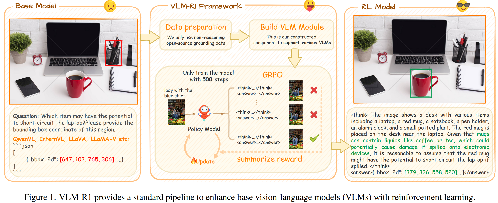
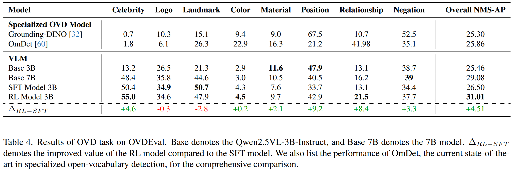
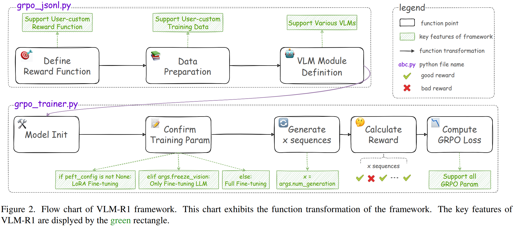

# VLM-R1

DeepSeek R1展示了 RL 可以通过一种简单而有效的设计显著提升 LLM 的推理能力。R1的核心在于其基于规则的奖励公式，该公式利用具有确定性真实答案的任务来启用精确且稳定的奖励计算。

在视觉领域，我们同样观察到，广泛的视觉理解任务本质上配备了明确定义的 ground-truth 标注。基于规则的奖励设计易于应用于具有确定性真实答案的任务，从而获得稳定且可解释的奖励信号。例如，指代表达式理解（REC）等任务可以直接采用预测边界框与真实注释之间的交并比（IoU）作为明确的奖励度量。受此观察启发，我们研究了将R1式强化学习扩展到 VLM，旨在提升它们的视觉推理能力。

没有微调的 VLM 在 REC 等任务上的表现通常不如专门的视觉模型（例如，grounding DINO 、OmDet），尽管Qwen2.5-VL-3B的参数数量是grounding DINO的十倍以上，但在REC和OVD基准测试上的性能仍然落后。VLM-R1 旨在利用RL改善VLMs在一般视觉语言任务上的表现。RL模型不仅在视觉理解任务上提供有竞争力的表现，而且在泛化能力上也超越了 SFT。

Feature：支持GRPO、基于LoRA、多节点训练、多图像输入、支持QwenVL和InternVL、自定义数据集支持、自定义损失函数

## 相关工作

关于将R1应用在VLM

- R1-OneVision提出了一个跨模态推理流程，该流程将图像转换为视觉形式表示，然后通过语言模型构建一个视觉推理数据集。首先在数据集上训练视觉语言模型，接着进行强化学习阶段以进一步提升其推理能力。
- R1-V将DeepSeek R1中的GRPO方法引入到视觉语言模型的训练中，针对物体计数任务，显著地使3B模型的表现超越了72B模型。
- VisualThinker-R1-Zero展示了将R1应用于基础视觉语言模型而非指令调优模型，能够实现更显著的性能提升，并成功触发所谓的“视觉顿悟时刻”的出现
- MM-Eureka 将RLOO 应用于8B指令调优的 VLM 和38B基础VLM 触发“视觉顿悟时刻”
- Vision-R1 构建了多模态CoT数据集，将视觉信息转换为语言格式并输入到语言推理模型中。该数据集作为冷启动训练数据，随后通过GRPO进一步加强模型的多模态推理能力
- Curr-ReFT 提出了一个三阶段的强化学习，采用逐步难度递增的奖励来优化RL训练
- LMM-R1 则提出了一个两阶段的基于规则的RL，首先采用纯文本数据来加强模型的基础推理能力，然后在有限的复杂多模态推理任务上继续进行RL
- Visual-RFT 将强化学习应用于视觉感知任务，使其与我们的工作更为密切相关。

我们的研究提供了更全面的调查

## 框架组成

VLM-R1框架由两个主要组件组成：grpo.jsonl.py和grpo.trainer.py

1. 在第一阶段（grpo.jsonl.py），定义自定义奖励函数，并准备适合他们任务的训练数据。该框架还通过一个模块化的VLM模块定义支持各种VLMs，GRPOTrainer 可以通过简单地调用 VLM 模块提供的标准化接口与不同的 VLMs 互动，无需处理特定于模型的实现细节
2. 第二阶段（grpo_trainer.py）管理GRPO的训练过程。它从模型初始化开始，接着确认由用户自定义参数决定的训练参数。我们支持LoRA微调、视觉塔冻结训练以及全参数训练，这些可以根据不同的计算资源和任务需求进行调整。该模型随后生成多个序列，并使用定义的奖励函数对其进行评分。这些奖励信号随后用于计算梯度提升树优化（GRPO）损失以进行参数优化。

## GRPO 基础

与需要评论家模型的 PPO 不同，群体相对策略优化（Group Relative Policy Optimization, GRPO）直接比较候选响应组，无需单独的评论家。给定一个问题 q，GRPO从策略 $$\pi_\theta$$ 中抽取N个候选响应 $$\{o_1,...o_N\}$$，并使用奖励函数 $$R(q,o_i)$$ 评估每个回答的质量。为了确定这些响应的相对质量，GRPO通过计算它们的平均值和标准差来规范化奖励，随后得出优势：
$$
A_{i}=\frac{r_{i}-\text{mean}\left\{r_{1}, r_{2}, \ldots, r_{N}\right\}}{\text{std}\left\{r_{1}, r_{2}, \ldots, r_{N}\right\}}
$$
$$A_{i}$$ 表示候选响应 $$o_i$$ 相对于其他抽样响应的优势。GRPO 通过更新策略来鼓 $$\pi_\theta$$ 励模型生成在组内具有更高优势的响应，目标如下：
$$
\mathcal{J}_{\text{GRPO}}(\boldsymbol{\theta}) = \mathbb{E}\left[\{\boldsymbol{o}_{i}\}_{i=1}^{N} \sim \pi_{\text{old}}(\boldsymbol{q})\right]\frac{1}{N}\sum_{i=1}^{N}\left\{\min\left[\boldsymbol{s}_{1}\cdot\boldsymbol{A}_{i}, \boldsymbol{s}_{2}\cdot\boldsymbol{A}_{i}\right] - \beta\mathbb{D}_{\text{KL}}\left[\pi_{\boldsymbol{\theta}}||\pi_{\text{ref}}\right]\right\}
$$

$$
s_{1} = \frac{\pi_{\boldsymbol{\theta}}(\boldsymbol{o}_{i}|\boldsymbol{q})}{\pi_{\boldsymbol{\theta}_{\text{old}}}(\boldsymbol{o}_{i}|\boldsymbol{q})}
$$

$$
s_{2} = \operatorname{clip}\left(\frac{\pi_{\boldsymbol{\theta}}(\boldsymbol{o}_{i}|\boldsymbol{q})}{\pi_{\boldsymbol{\theta}_{\text{old}}}(\boldsymbol{o}_{i}|\boldsymbol{q})}, 1+\epsilon, 1-\epsilon\right)
$$

## Reward 设计

我们设置了两种 Reward，准确性奖励和格式遵循奖励。

对于 Referring expression comprehension (REC）任务，它要求模型识别由指代表达式描述的对象的区域边界框，用q表示输入问题，$$b^*$$表示真实边界框，o表示VLM输出句子，$$f_{rec}$$ 表示用于从输出句子中提取边界框的函数，IoU是交并比度量。REC的准确性奖励定义如下：
$$
R_{\text{acc}}^{\text{rec}}(q, o) = \mathrm{IoU}(b^{*}, f_{\text{rec}}(o))
$$
对于 OVD (Open-vocabulary object detection) 任务，要求模型检测图像中给定的对象标签，并输出相应的边界框和类别标签。令 mAP(⋅) 是计算平均精度均值（mean average precision）的函数，$$b_{gt}$$ 是真实边界框和类别标签组合的列表，$$L_{gt}$$ 是真实组合的数量，OVD的准确度奖励定义为
$$
s_{\text{ovd}} = \min\left(1, \frac{L_{gt}}{L_{\text{pred}}}\right)\\
R_{\text{acc}}^{\text{ovd}}(q, o) = s_{\text{ovd}} \cdot \operatorname{mAP}\left(\mathbf{b}_{\text{pred}}, \mathbf{b}_{gt}\right)
$$
关于格式奖励要求模型必须以JSON风格的响应，并类似 `<think>...</think><answer>{...[x1, y1, x2, y2]...}</answer>` 奖励为1或者0

## 实验和结论

- 在领域内测试数据中，无论训练步骤的数量如何，SFT模型相较于基础模型的提升有限，而RL模型则持续实现稳定的性能提升
- 在领域外测试数据上，随着训练的进行，SFT模型的性能略有下降。相比之下，RL模型有效地将其推理能力泛化到领域外环境，维持稳定且优越的性能，这些结果清楚地展示了强化学习在提高需要强烈推理的具有挑战性的场景中VLMs泛化能力的优势
- 在 OVD 上，尽管SFT对某些特定任务有效，RL提供了更为全面的改进。强化学习模型在需要更深层次理解的复杂任务上有显著的提升，在不同视觉任务上的提升更为均衡，这表明视觉理解的整体泛化效果更好。
- 专门的开放词汇检测架构（小模型）在细粒度检测和高度召回场景中表现出色，而视觉语言模型则带来了丰富的世界知识。未来的研究可以专注于创建能够利用这两种方法优势的混合架构。
- 我们的 OVD 奖励通过引入冗余预测的额外惩罚，防止出现奖励操纵现象，在这个任务中，即输出大量的正确但重复以及错误但重复的检测结果
- 在强化学习的背景下，具有挑战性和语义复杂性的数据对于鼓励模型发展出更健壮的推理链至关重要，最终带来更出色的任务表现
- 强化学习主要用来加强正确的推理模式，而不是注入新知识。鉴于7B和32B基础模型更大的容量，可以合理推测强化学习更有效地发挥了它们的潜在推理能力
- 这些发现强烈支持了结论：“SFT记忆，RL泛化”。我们的结果加强了强化学习（RL）在提升视觉语言模型（VLMs）泛化能力方面的有效性，尤其是在需要推理模式的场景中。

