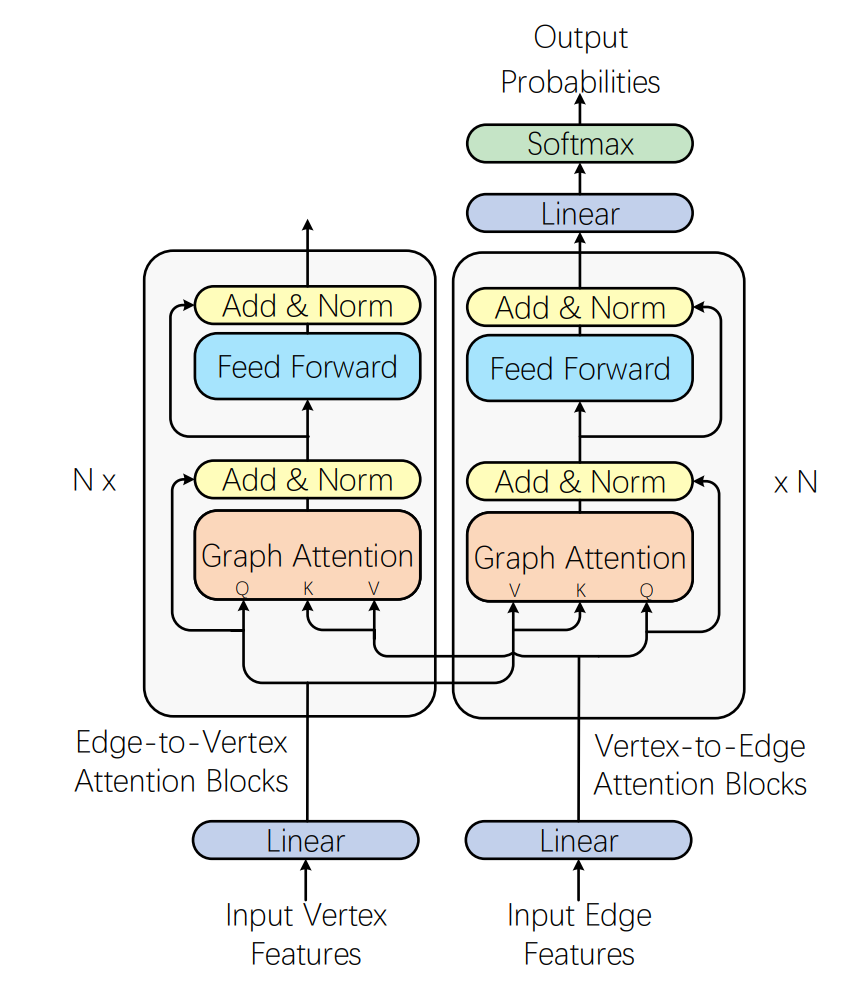

# Complicated Table Structure Recognition

> https://arxiv.org/abs/1908.04729

## 问题提出

现有的方法很难准确识别PDF文件中复杂表格的结构。跨行单元格是指至少占据两个列或行的单元格。如果一个表格包含跨行单元格，则称为复杂表格。

如图， (a) 是PDF文件中的表格。 (b) 是真实结构，也是这篇文章的目标。(c)(d)(e) 的识别结果较差。

这篇文章的贡献：

- 提出了一种新颖的图神经网络模型GraphTSR，来识别PDF文件中的表格结构
- 从很多latex论文中抽取表数据，构建了一个新的大规模表格结构识别数据集，包含15,000张表格及其对应的结构标签。

## 方法概览

1. 预处理(对应图中的a步骤）：从PDF中获取单元格内容及其对应的边界框
2. 图形构建：在这些单元格上构建无向图
3. 关系预测：使用我们提出的GraphTSR预测相邻关系
4. 后处理：从标记的图中恢复表结构

## 定义

考虑每个表格中的单元格可以被视为顶点，相邻关系（即垂直、水平）可以视为有标签的边。

因此，一个表格可以表示为带有有标签边的图T=(V,R)，其中V是一个顶点集，`R⊆V×V×{垂直，水平}` 是关系集。关系集R实际上是我们想要识别的表格结构。

给定一组表T的顶点V作为输入，问题是要找到一个关系R的近似值。

让 E⊆V×V表示图的 unlabeled edges，构建图的目标是建立这样的边集 E’，最简单的想法是在 E’=V×V 上构造一个完全图，然而，这在实践中不可行，因为它要求我们的模型编码 $$O(|V|^2)$$ 条边

因此这篇文章使用一种简单的K最近邻（KNN）方法来构造 E’ ，其中每个顶点连接到其 K个最近邻居，从而总边数将被减少为$$O(K|V|)$$

GraphTSR 以 unlabeled  E 作为输入，并将每条边分类为“垂直”，“水平”和“没有关系”的类别之一。

## GraphTSR

对于图神经网络，设计了一些特征作为顶点和边的初始表示。包括格子大小、绝对位置和相对位置在内的三种类型的顶点特征被设计出来。

对于边特征，我们使用了格子之间的几种距离度量，包括欧几里得距离、x轴距离和y轴距离。在绝对和相对距离上，我们还计算沿x轴和y轴的格子对重叠作为边特征。

如图所示。GraphTSR将图的顶点和边特征作为输入，然后分别通过N个 edge-to-vertex 的图注意力块和N个 vertex-to-edge 的图注意力块计算它们的表示。最后，它对这些边进行分类。

## SciTSR数据集

总共包含15，000张表格及其对应的结构标签，我们将其分为12，000张用于训练和3，000张用于测试。平均每个表格有约9行、5列和48个单元格。

特别地，我们关注那些具有至少一个跨行或跨列单元格的复杂表格。在训练集中有2，885张和测试集中有716张复杂的表格，分别占总数的24.0％和23.9％。这意味着SciTSR数据集中的大多数表格仍然是简单的网格表格。

SciTSR数据集的构建方式如图

1. 首先，我们从arXiv中爬取LaTeX源文件，其中包含大量以LaTeX格式编写的论文。
2. 然后，我们通过正则表达式提取所有表格片段，如图（b）一个表格片段是一个用于呈现表格的LaTeX代码片段，通常以“\begin{table}”命令开始，并以“\end{table}”命令结束
3. 之后，我们将每个表格片段编译成单独的PDF文件，如图（d）
4. 为了获得结构标签，我们使用“\”和“&”将每个表格片段分割为一系列单元格片段，如图（c），并获取其相应的坐标（即起始行、终止行、起始列和终止列）
5. 由于代码中有许多命令，例如“\textbf{}”和“\alpha”，因此单元格片段并不总是与实际PDF中的文本相同。所以我们把单元格片段编译成PDF文件，然后从中提取真实文本
6. 注意，在单元格片段中有一些类似于“\multirow{}”或“\multicolumn{}”的命令，这意味着这些单元格是跨单元格。因此，我们通过解析“\multirow{}”和“\multicolumn{}”命令重新计算它们的坐标。得到了所有单元格的内容及其坐标，即结构标签，并将其以JSON格式存储，如图（e）