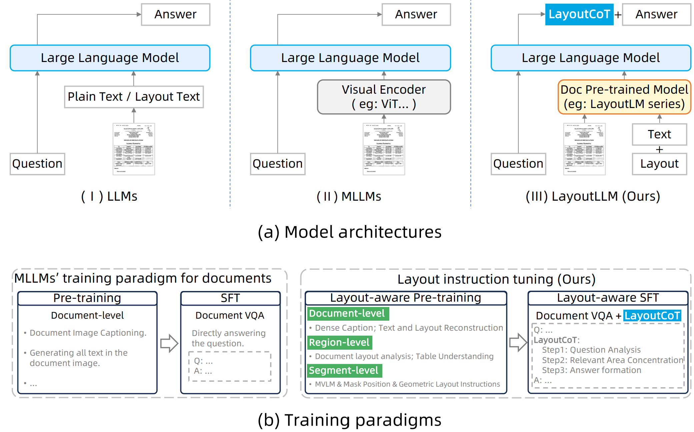

# LayoutLLM

> [LayoutLLM: Layout Instruction Tuning with Large Language Models for Document Understanding](https://openaccess.thecvf.com/content/CVPR2024/papers/Luo_LayoutLLM_Layout_Instruction_Tuning_with_Large_Language_Models_for_Document_CVPR_2024_paper.pdf)

## 问题提出

以前用于文档理解的大模型并未充分探索和利用**文档布局信息**，而文档布局信息对于精确文档理解至关重要。

本文提出的 LayoutLLM 的核心是一个专门设计的布局指令微调策略，旨在增强对文档布局的理解和利用。包括两个组件：布局感知预训练和布局感知监督微调。为了在布局感知预训练中捕获文档布局的特点，引入了三个组别对应的预训练任务，分别对应于文档级、区域级和段落级的信息。

此外，还设计了一个名为布局链式推理（LayoutCoT）的新模块，以使LayoutLLM能够关注与问题相关的区域并生成准确的答案。

## 方法对比

直接将文本输入到LLMs中难以传达文档布局信息。因此在上图（a）中，将文档表示为扁平化纯文本，或带有坐标等的布局文本，再作用于LLMs。

然而，扁平化文本完全排除了文档的任何布局信息，并不能保证LLMs能够有效地理解这种格式化的文本。

此外，基于文档的多模态大型语言模型 (Multimodal Large Language Model，MLLM)，将视觉模型与 LLM 集成用于文档理解。如上图（a）（b）它们通常在文档数据集上进行预训练和监督微调 (SFT)：

- 预训练阶段：诸如图像描述，或生成文档中所有文本作为扁平化纯文本，通常是常见的任务。但是这两种任务仅提供简要表示，并且无法捕获文档的布局信息。因此，在现有的预训练阶段很难让模型学习到文档布局。
- SFT阶段：经常使用与文档相关的VQA或信息提取数据。答案直接在SFT期间提供，缺乏对文档布局的明确学习。

综上所述，当前使用纯文本或布局文本来提示LLM并训练基于文档的MMLMs的方法尚未有效捕捉布局信息，限制了其零样本文档理解能力。因此，为了更好地利用LLM的力量进行文档理解，有必要研究如何有效地将布局信息整合到LLM中。

为此，LayoutLLM 在其中设计了一个布局指令微调策略来增强文档布局的理解。所提出的布局指令微调包括两个阶段：布局感知预训练和布局感知监督微调（SFT）。

- 布局感知预训练阶段：为了确保模型学习到不同层次的信息，提出了三个不同级别的预训练任务组：文档级、区域级和段落级。所有提出的预训练任务都统一为指令微调格式。
- 布局感知的SFT阶段：基于大型语言模型 (LLMs) 中的链式思维 (CoT) 能力，提出了一种 Layout CoT 方法。与现有方法直接由文档理解问题的答案进行监督不同，LayoutCoT 包含三个连续步骤：问题分析、相关区域集中和答案形成。

## 模型

LayoutLLM的整体架构如图所示。在LayoutLLM中，给定输入文档图像及其对应的文本和布局信息，需要预先训练的文档模型编码器获取多模态文档特征。然后，这些特征由多模态投影器进行编码，并与指令嵌入一起输入到LLM以生成最终结果。

本文使用了广泛使用的文档预训练模型 LayoutLMv3 作为基本的文档编码器。文档图像、文本和布局首先输入到文档预训练模型 (document pretrained model, DocPTM ) 中，然后由 DocPTM 编码以获得相应的特征如下：
$$
F_V,F_T= DocPTM(V,T,Box)
$$
V表示文档图像，T 和 Box 代表文档中的文本序列及其对应的边界框坐标。经过DocPTM编码后，文档的视觉特征 $$F_V$$ 和文本布局特征 $$F_T$$ 被获取。

为了将DocPTM中的多模态特征投影到LLM的嵌入空间中，使用两个不同的多层感知机（MLPs）作为视觉投影器和文本&布局投影器，获得编码的特征：
$$
H_V=P_V(F_V),H_T=P_T(F_T)
$$
最后，HV、HT和问题指令文本的嵌入 I ，一起输入到LLM中，生成目标答案

## 布局感知预训练

Layout-aware Pre-training 应用了三种不同的级别预训练策略：文档级、区域级和段落级。

### 文档级

为了使模型具备基本的全局文档理解能力，提出了预训练任务，即文档密集描述（Document Dense Description，DDD）和文本与布局重建（Text and Layout Reconstruction，TLR）。

类似于图像标题任务，DDD任务要求模型学习对输入文档进行描述。此外，在DDD任务中，文档图像的描述更加详细。通过DDD任务，模型可以获取基本的文档级别信息，例如文档类型和详细内容。

> 例如，在用于LLaVAR 预训练的文档图像标题数据集中，平均包含36.27个单词；而在本文提出的DDD任务的数据集上，描述平均包含373.25个单词。

TLR任务旨在重构文档的完整文字和布局信息，并以格式“<{box}, {text}>"输出。TLR任务将DocPTM输出的文字和布局嵌入与LayoutLLM中的LLM空间对齐。因此，它使得LayoutLLM中的LLM能够理解文档中包含的文字和布局信息。

### 区域级

文档特定区域的信息，如标题、图表、表格等是至关重要的。利用了两个预训练任务：文档布局分析（Document Layout Analysis，DLA）和表格理解（Table Understanding，TU）

DLA任务以两种方式实现。一种是根据布局类型定位布局区域，另一种是识别给定区域的类型。

此外，表格区域与其他区域不同，需要额外关注二维布局的理解。TU任务使模型能够了解文档中表格区域的基本行列信息。包括对行数、列数、逻辑坐标以及行内和列内的内容进行指令调整。

### 段落级

对于遮蔽视觉语言建模（masked vision language modeling ，MVLM）指令，随机遮蔽输入到LayoutLLM中的文本，并通过询问被遮蔽的单词并回答它们来调优模型。

对于掩码位置指令，在输入到LayoutLLM时，指定文本行的布局信息（坐标）被随机设置为0。该指令由询问零坐标文本行并要求模型响应原始坐标与文本内容组成。

对于几何布局指令，随机选择文本行，并通过询问它们之间的方向和距离来构建指令。

## 布局感知的监督微调

Layout-aware Supervised Fine-tuning，