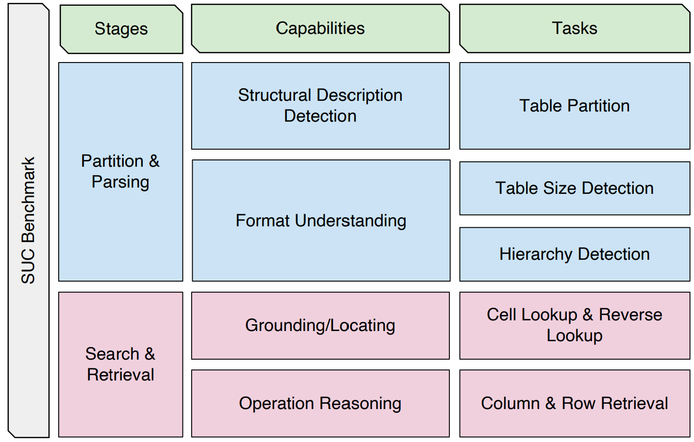
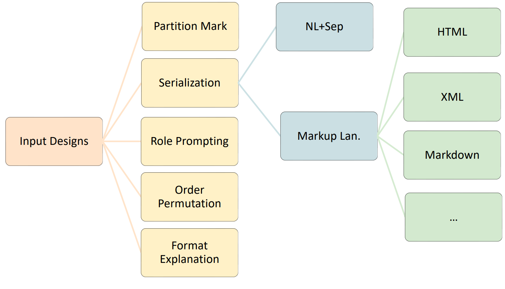
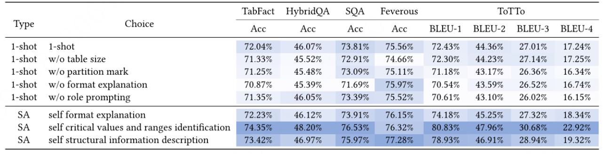
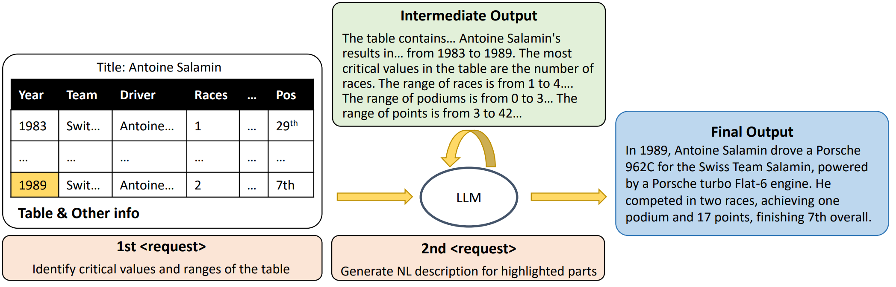

# Table Meets LLM

> [Table Meets LLM: Can Large Language Models Understand Structured Table Data? A Benchmark and Empirical Study](https://dl.acm.org/doi/pdf/10.1145/3616855.3635752) 大型语言模型能否理解结构化表格数据？基准和实证研究

## 问题提出

尽管表格可以作为序列化的输入提供给 LLM，但仍缺乏全面的研究来研究 LLM 是否真正理解此类数据。

> 结构化数据由预先定义的结构组织成文本块，以压缩重复信息。它使数据更加可管理，并且通过机器进行数据分析和处理。表格是一种这样的结构化数据类型

表格序列化是指将表格数据转换为线性、顺序的文本格式的过程。

- 一种简单的序列化函数是按行序列化表格
- TaPEx 使用特殊标记来指示组件，例如标题和行  
- TABBIE 通过行和列两种方式对表格进行序列化
- TableGPT 则采用模板方法来序列化每个表记录中的属性值对

本文的目标是回答以下问题：哪些输入设计和选择最能帮助LLM理解表格？LLMs在多大程度上已经具备了对结构化数据进行结构化理解的能力？

本文通过设计一个 Benchmark 来评估 LLM 的结构理解能力（SUC，structural understanding capabilities）。包括七个任务，每个任务都有其独特的挑战，例如单元格查找、行检索和大小检测。

通过对 Benchmark 评估获得的见解，我们提出了一种有效的结构提示自增强方法，激励LLMs通过内部检索自己的知识来生成中间结构知识，例如激励LLMs自己生成关键值/范围识别。结合精心选择的输入选项，这些结构提示方法导致了对各种表格任务的 LLM 性能的显着改进

主要贡献是：

- 提出SUC Benchmark 来评估LLMs的多结构理解能力
- 提出了一种利用内部知识增强LLM性能的方法，即自我增强，并在五个表格推理数据集上进行了验证
- 通过基准的全面实验，我们为未来的工作提供了表格输入选择的建议，即使用具有格式解释和分区标记等结构特征的标记语言（如HTML），结合自增强提示，充分利用LLMs内部知识

## SUC Benchmark

我们从人类的角度将理解表格结构的必要能力分为两个不同的类别，如图所示。



1. 分区和解析。表格数据集总是与来自其他来源的知识配对，以提供更多的上下文并解决一个特定的下游任务。然而，解决这些下游任务的前提是准确的数据划分，这反过来又需要区分表格和其他辅助信息的能力以及对表格结构布局的基本理解。
2. 搜索和检索。即从结构化数据中准确地搜索和提取特定位置的信息的能力。它使LLMs能够根据用户查询或请求有效地识别并提取结构化数据中的相关信息。

> 例如，考虑一个用户的问题：“在2014年之后举行的奥运会上，哪个项目有更老的旗手？”为了回答这个问题，LLM首先需要定位所有满足时间标准的所有奥运会比赛，然后比较每个事件中旗手的年龄，并最终确定并返回最老旗手的事件。通过仔细分析数据的结构并识别目标单元格或单元格，实现对结构化数据中相关信息的定位。

此外，各种表格存储格式（包括CSV、JSON、XML、Markdown、HTML和XLSX）具有不同的信息压缩级别，并且对LLMs理解表格内容提出了不同的挑战。例如，

- 以CSV格式存储的表格按行组织，列值之间用逗号分隔；
- 而以XML格式存储的表格则表示为嵌套标签集。

LLMs首先需要了解表格的格式或布局，然后掌握其内容。到目前为止，还没有任何工作讨论过这些不同存储格式的影响。我们旨在确定LLMs是否具备正确解析不同类型格式源的能力，并确定哪种输入设计最适合LLMs。也有可能是LLMs已经具备处理所有类型存储格式的能力。具体的输入设计可以在下图中找到。



我们设计了几个特定的任务来评估LLM对表格的理解能力。这些任务是按难度递增的。

- 表分区。该任务评估LLMs识别表格结构的能力。要求LLM检测给定用户输入设计中的表格边界。此输入设计可能包括各种类型的辅助信息，例如“描述”，“上下文”，“陈述”和“用户查询”。
  即给定一个输入D=d1,d2,…，其中每个部分di是一个包含辅助信息如描述、上下文、陈述或用户查询的“通用”序列。为了便于评价和比较，我们限制LLMs输出一个包含头 token $$b_h$$ 和尾 token $$b_e$$ 的表格边界的元组 $$B=(b_h,b_e)$$，包含表格内容
- 表大小检测。表大小特征代表了对表格中行和列编码的直接约束。例如，如果一个表格只有三个列，则输出不应考虑超出这个范围的答案。
  给定一个m行n列的表格，来自LLM的一个正确的答案应该是（m,n）。
- 合并单元格检测。合并单元格是表格构建中的特殊结构，在这里两个或多个相邻的单元格被组合成一个更大的单元格。为了测试LLMs的稳健性，我们将合并单元格作为层次化电子表格表单的一个特征。
  给定一张带有某些合并单元格的表格，要求LLM检测出合并单元格索引（ri,cj）。请注意，任何与条件匹配的合并单元格中的索引都将被认为是正确的。
- Cell查找和逆向查找。要求LLM准确地从特定位置搜索并检索出单元格值。
  在本任务中，如果发现多个具有相同值的单元格，则LLM应检索其位置 $$(p_i,p_j), ···, (p_i^n, p^n_j)$$；反之，给定一个特定的单元格位置 $$(p_i,p_j)$$，则LLM应该检索到相应的单元格值 $$c_i$$
- 列和行检索。这项任务评估了LLM通过列出单元格值来搜索和检索结构信息的能力。对于列检索，要求LLM从给定的表中列出特定列名Ci下的单元格值c j，cnj。同样地，对于行检索，要求LLM列出特定行索引下的单元格值。在评价过程中，我们认为预测值列表与地面真实值列表匹配时为正确。我们期望列/行检索任务的表现优于单元格查找和逆向查找任务，因为使用列/行索引来定位特定值列表更为常见。

## 自我增强提示

CoT（chain of thought，思维链） 被发现可以增强大型语言模型 (LLM) 的文本复杂推理能力，通过向模型提供几个推理链的示例，LLMs 可以学习遵循模板来解决困难且未见过的任务。受此启发，我们提出了自我增强提示（self-augmented prompting），用于基于内部检索 LLM 自身知识库生成中间结构化知识。

> 零样本思维链（Zero-shot-CoT）是一种后续的CoT，引入了一个极其简单的零样本提示。通过将“让我们一步一步思考”添加到问题末尾，LLM可以生成回答问题的思维链。
>
> 另一个后续的CoT是自我一致性，它生成多个思维链，并基于投票策略选择大多数答案作为最终答案。自我一致性已经在算术、常识和符号推理任务上显示出改进。即使常规的CoT被发现无效，自一致性仍然可以增强结果。

我们设计了几种从 LLM 中提取知识的方式（见下表）。例如，我们要求 LLM 生成格式规范，旨在由 LLM 自己澄清输入格式模式。



自我增强提示利用两次提示来利用LLMs在理解结构化数据方面的能力，如下图所示。



- 在第一个提示中，“request” 信息的任务被替换为一个简单的“识别与声明相关的最后一张表中的关键值和范围”的需求。这种替换的目的是解锁LLMs对复杂推理的理解能力。然后将提示文本输入到LLM模型中，该模型生成包含特定结构信息的后续句子。
- 在第二个提示中，生成的后续序列附加到任务请求并输入到LLM模型以生成最终答案。

## 结论

- 使用标记语言，特别是HTML，在性能上优于“NL+Sep”（自然语言和特定分隔符）
- 当系统处于 zero-shot 设置时，其性能相比 1-shot 显著下降
- 外部信息应该在表格之前出现。我们观察到当手动将诸如问题和陈述之类的外部信息放在表的后面时，在所有任务中整体性能下降了
- 分区标记和格式解释可能会削弱搜索和检索能力。分区标记在输入设计中常用。例如，在HTML格式的情况下，我们解释说：“每个表格单元格由一个 `<td>` 和一个标签 `</td>` 定义；每行表格开始于一个 `<tr> ` 并结束于一个标签 `</tr> `；th 表示表头。”然而，当涉及到Cell Lookup任务时，添加分区标记和格式说明实际上导致所有输入设计中的性能下降。这表明这种额外的结构信息可能会影响LLM对表格结构的搜索和检索过程。
- 但是，添加分区标记或格式说明确实对某些特定任务，如合并单元格检测，有一些好处。虽然它们可能会削弱LLMs的搜索和检索能力，但在下游任务中仍能提高整体性能。
- 模型在使用自增强提示时比单次提示表现更好
- 手动标记格式解释可能对下游任务（如 FEVEROUS）产生负面影响。这是因为 FEVEROUS 的表格结构更加不规则，包含许多段落和子表。此外，手工制作的知识更通用，并不能涵盖此类性质的详细信息。另一方面，自增强提示可以独立学习模式并生成更多全面且有用的线索来回答问题。下面展示了两个例子

> Format explanation example from FEVEROUS: 
>
> - Manual Prompt: 
>   ```
>   Each table cell is defined by a <td> and a </td> tag. Each table row starts with a <tr> and ends with a </tr> tag. th stands for table header.
>   ```
>
>
> - Self-augmented Prompt Generation:
>
>   ```
>   ’15 rows and 4 columns, with the first column being an index, the second column being empty, the third column being the name of the Marshal, the fourth column being the date of promotion, and the fifth column being the defence branch.\nThe table is defined by HTML tags, with each table cell being defined by a <td> and a </td> tag, and each table row starting with a <tr> and ending with a </tr> tag.\nThe table header is denoted by the th tag.’
>   ```