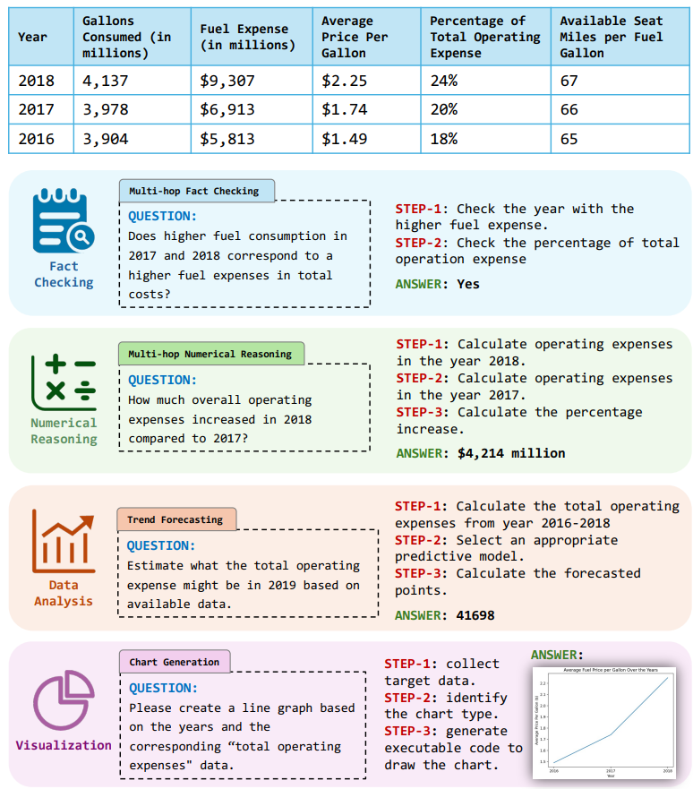

# TableBench

> [TableBench: A Comprehensive and Complex Benchmark for Table Question Answering](https://arxiv.org/abs/2408.09174)

## 问题提出

大型语言模型（LLM）的最新进展显著提高了对表格数据的解释和处理能力

但当应用于工业场景时，LLM仍面临重大挑战，特别是由于需要与真实世界的表格数据进行推理而增加了复杂性，这强调了学术基准与实际应用之间的明显差距。为了应对这一差异，我们详细研究了在工业场景中使用表格数据，做了一系列工作： 

- 提出TableBench，一个包含18个领域中886个样本的全面且复杂的表格问答基准，旨在促进事实核查、数值推理、数据分析和可视化任务。 
- 介绍了TableInstruct，这是一个大规模的表格问答指令语料库，涵盖了三种不同的推理方法。在TableInstruct上训练的TABLELLM作为TableBench的稳健基准。 
- 系统地评估了我们制作的TableBench上30多个模型的解释和处理能力，并在四个主要任务上创建了一个排行榜。全面而复杂的表格问答评估，可以在现实世界场景中真实地衡量，领先语言模型与人类能力之间的差距

## 数据集

我们全面分析了真实世界语境中的表格数据应用，并将其分为四个主要类别和18个具体子类。

我们提出了两个高质量的语料库：TableBench，一个包含886个样本的综合且复杂的基准；以及TableInstruct（总共有2万个样本），这是一个设计用于指导LLMs使用各种推理方法进行学习的巨大指令语料库。

1. 多步事实核查：涉及多个步骤，以确定不同年份之间事实的关系。
2. 多步数字推理：需要计算表格中未直接提供的特定年份的总运营费用。
3. 趋势预测：涉及基于历史数据分析来估计未来的数据趋势。
4. 图表生成：需要执行程序命令来创建图表。

## 构建流程

我们引入了一个结合手动和自动方法的注释框架，如下图所示，以提高注释效率。

### 步骤1表格数据收集

我们根据主题和大小选择表格，确保每个表格至少包含8行和5列。我们重点关注具有显著数值的表格以强调数字推理，从而确保数据表的复杂性。最终，我们收集了涵盖20个主要主题（如金融、竞争、体育、科学等）的3681张表格。

### 步骤2问题标注

我们选择手动构建更复杂的系列问题：

1. 我们精心制作一个种子问题和每个类别详细的定义，形成初始问题种子库。
2. 将这些初始种子问题作为示例纳入精心设计的提示中，引导GPT4代理根据特定类别约束生成问题。
3. 在最初的几轮中我们限制输出为五道问题。这些问题由人工标注以识别新的模式，并添加到种子库中。
4. 我们不断将代表性的问题加入到问题种子库中，促进基准质量的提升，最终保持在50个问题，作为TableBench测试集的问题。
5. 当达到每类50个问题时，我们会对样本进行手动标注（占30%），其余问题则通过另一个GPT-4进行问题验证，最终作为TableInstruct的提问。

### 步骤3答案标注

1. 在回答生成阶段，我们利用三个LLM代理，每个代理采用不同的推理方法（TCoT、SCoT 和PoT）来生成响应。为了减少由LLMs产生的答案中的偏见，我们对所有答案施加严格的格式要求，仅保留必要的准确内容，从而避免任何针对特定模型答案风格的偏好。
2. 我们引入一个投票机制来评估由不同代理产生的答案。如果投票系统识别出所有代理之间的有效一致性，则初步保留这些结果。
3. 然后，这些初步结果将接受手动审查和修改以产生最终的答案及其相关的推理细节。
4. 对于由于不一致而被排除的答案，特别是那些被认为对于LLMs来说难以生成适当响应的问题，我们随机选择过滤数据的30％进行手动注释，并随后将其纳入数据库中。

> 在上下文中学习 (ICL)是指优化输入以使大型语言模型LLMs（M）生成特定任务的指令(I)和少量输出示例(E)的实用输出。
>
> 文本链式推理 (TCoT)是指在生成最终答案之前，LLMs 使用文本提示逐步推导出一系列中间步骤或子目标的推理过程。这些中间步骤构成一个“思维链条”，最终引导模型得出正确的结果。Q 代表问题，A为结果，r 代表第k个推理步骤
> $$
> \mathcal{M(T,Q,E)}=\{r_1,r_2,.....r_k,\mathcal{A}\}
> $$
> 象征性链式思维（SCoT） 实现了一种利用基于 Python 的指令来促进逻辑推理的方法，包括三个主要步骤：重复执行直到得出最终结论。STEP-1：分析可用信息以确定下一步行动。STEP-2：使用 Python 编程语言命令生成指令。STEP-3：通过执行指令并分析结果模拟结果。ra 代表分析步，rp代表生成编程指令步，rs代表结果模拟步
> $$
> \mathcal{M(T,Q,E)}=\{(r_{a1},r_{p1},r_{s1}).....(r_{ak},r_{pk},r_{sk}),\mathcal{A}\}
> $$
> Program-of-Thoughts (PoT)通过将计算与推理明确区分开来提供了一种新颖的数值推理任务方法。PoT将问题分解为编程命令P，并利用像Python这样的语言解释器编译和执行最终代码。与SCoT不同的是，PoT通过在编程环境中实际执行生成的代码（P）来输出结果，从而实现通过结构化代码步骤进行推理。
> $$
> \mathcal{M(T,Q,E) \to P \to A}
> $$

## 评估与排行

即使是最先进的模型GPT-4，在TableBench上的表现仍然远远落后于人类性能，这强调了在实际应用程序中处理表格任务的挑战性。