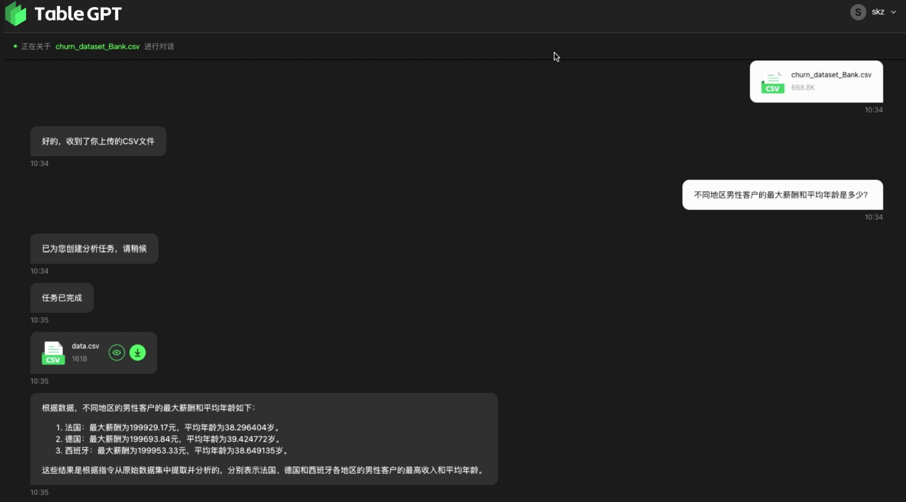
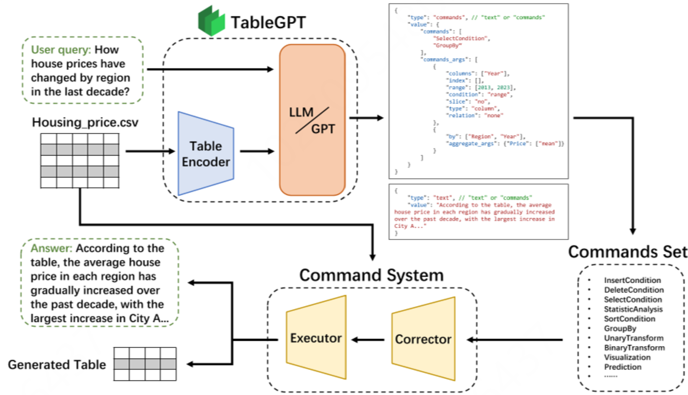

# TableGPT

> [TableGPT: Towards Unifying Tables, Nature Language and Commands into One GPT](https://arxiv.org/pdf/2307.08674)

## 问题提出

希望让 LLM 通过外部功能命令理解和操作表格，如问答、数据操纵、数据可视化、分析报告生成和自动化预测。下图为 Table GPT 使用截图。

然而，相比TableGPT，直接使用 ChatGPT 模型在表格领域表现不好，有两个原因：

1. 全局表理解：众所周知，GPT 由于受限制标记长度而无法阅读整个大表格，因此很难理解全局表格信息。
2. 网格域的泛化：它们的训练过程针对的是自然语言，因此在处理表格数据时不太通用。

我们的 TableGPT 框架将表格、自然语言和命令统一为一个 GPT 模型，几个核心组件包括：

- **全局表表示**：一种用于表格的全局表征学习范式，该范式将整个表格编码为一个向量。通过在大量的文本和表格数据上联合训练 LLM 和表格编码器，我们使编码器能够充分捕获输入表格中的全局信息。这使得 LLM 能够有效地感知和理解表格数据，从而提供对表格的更全局、增强的理解。
- **链条**：我们引入这个概念是为了强调有结构、分层次的任务执行的基本思想。就像一个协调良好的组织，每个指令都从较高的级别向下级传递，TableGPT遵循类似的命令链，将复杂的任务分解为简单的任务并逐步执行。此外，它还培养了拒绝模棱两可或不适当的命令的能力，就像真正的数据科学家一样，而不是盲目地遵循任何潜在的错误指示，从而提高了人与 LLM 系统在数据科学领域的交互。我们提出的命令集不仅更容易控制，而且减少了传统处理表格数据方法经常伴随的不确定性。
- **领域感知微调**：为了培养模型适应特定领域的表格及其相应文本材料的能力，领域感知微调需要通过定制训练来生成体现给定领域中相似风格和逻辑元素的文本，从而增强对特定领域数据的理解。 为了使这种方法能够扩展并且可行，我们还开发了一个数据处理管道，它可以在少量的数据上获得显著的改进，从而缓解了训练 LLM 的资源密集型特点，并支持私有部署。

## 模型

我们选择使用具有 70 亿个参数的 Phoenix 作为我们的微调基础模型，在一个包含2T个标记的文本数据和0.3M张表格的巨大语料库上进行了微调。

TableGPT的整体架构如图所示。当用户输入表格和查询时，它们会被接收并由 TableGPT 进行处理，后者由一个表编码器和一个语言模型 (LLM) 组成。

- 表编码器用于从输入表中提取向量表示。然后将这些表示与文本查询一起馈送到 LLM 中进行推理。
- LLM 确定用户的查询意图，并生成包含命令序列和文本响应的输出。
- 在将命令序列馈送给执行者之前，它会在命令系统的纠正器中进行错误更正。为用户提供最终输出，包括操作后的表格和文本响应。

## 表格的全局表示

一些研究试图直接将表中的样本行转换为类似句子的文本描述，而另一些研究则尝试通过基于模板提取列名、行业背景和其他元数据架构来人为定义表数据的全局表示，但是，这些方法只为 LLM 提供了从表数据中提取的部分信息，从而忽略了数据本身所固有的全局信息和行业背景。

与图像、视频和音频不同，表格数据本质上是一种高度抽象的结构化数据类型。例如，打乱行或列不会影响表格中的信息，这与图像和音频形成鲜明对比，后两者在相邻位置或序列中带有归纳偏见。正好，set transformer 最初是为了处理置换不变问题而设计的，与表格数据的固有结构很好地对齐。

因此，对于表格来说，需要将整个表格嵌入到一个单独的向量中。为此，我们提出了一种级联表编码器（cascading table encoder），它可以从元数据和整个数值条目中联合提取知识。

考虑一位经验丰富的数据科学家遇到一张表格的情况。他们通常会检查表格结构，如表头和特征列分布，以了解不同单元格的位置所隐含的意义，而不会过分关注每个单元格的具体数值信息。

我们提出了一种新颖的级联表编码器（cascading table encoder）。它将表格数据中的信息分为两部分：

1. 第一部分学习表的元数据表示，如架构、行业背景以及列名的意义，这可以帮助 LLM 理解表的整体结构信息。
2. 第二部分学习表的数值信息表示，例如不同列中值的分布和趋势，帮助 LLM 像人类专家一样理解表的整体数字信息。

我们将表中的行和列视为集合中的元素，并学习整个集合的整体表示。我们使用修改后的 set transformer 作为表编码器的基础。 我们用注意力机制来增强它，使其能够捕获表中不同行或列之间的相互依赖关系，从而使模型能够理解表数据的不同部分之间的关系。

该编码器是在 10,000 个表格数据集上使用掩码表建模方法预训练的，类似于用于 BERT 的掩码语言建模，但针对表格数据进行了调整。学习到的表格表示不仅可以用于表格理解，还可以提高下游分类器的预测性能。

## Chain-of-Command

大型语言模型（如GPT）在数值推理方面可能遇到困难，容易出现计算错误和幻觉，因此我们的方法不需要它们在其潜在空间中操作和计算。相反，我们为 LLM 提供了一系列预先打包的功能命令来调用。

然而，用户查询往往模糊且复杂，我们只能封装并提供一些基本的表操作命令。教会 LLM 解构复杂的、模糊的查询至关重要。例如，一个用户对特定对象列的查询可能是原始表中一列的同义词或翻译，或者用户可能只有模糊的意图而无法清楚地表达需求。

Chain-of-thought 方法强调将复杂的推理分解为一系列中间步骤。我们引入了链式命令（Chain-of-command，CoC）的概念，这是一种通过提供与这些中间步骤相关联的逐步指令来增强 Chain-of-thought 的方法。

> 例如，当用户询问“显示最高利润的五部电影”时，LLM 首先检查表中是否有一个利润百分比列。如果没有，它会生成算术指令来使用票房数据和成本数据计算利润百分比；接下来，它执行按利润百分比降序排列并选择前五部电影的指令。当用户的查询过于模糊时，比如“给我一些数字”，LLM 可能难以分解，并拒绝执行，相反，它会要求用户提供更具体的意图。

为了提高我们方法的性能和稳定性，我们在微调 LLM 以适应命令时构建了一个大型指令链数据集，并使用上下文学习为指令链序列中的多个步骤提供提示。

## 域数据处理管道

尽管大型语言模型 (LLMs) 可以通过在多样化的语料库上进行广泛的预训练来获得广泛的知识和对话能力，但它们通常在处理特定行业的微妙语言风格和逻辑时表现不佳。这主要是因为在训练阶段缺乏对专有领域数据的接触。为了解决这个问题，我们开发了一个高效的域数据处理管道（Domain Data Processing Pipeline）

我们的目标是通过最小化计算开销并加速模型迭代来简化大型语言模型的微调过程。为此，我们设计了一个流水线，利用主动学习的力量。这样，我们可以从域数据中精心挑选出一组微调示例，使 LLM 能够在较少的示例中实现更好的微调结果。这种资源的战略性使用加快了模型的学习过程，从而加快了其迭代速度。

此外，我们增强了 LLM 的文档检索能力。 我们使用向量数据库 和 LangChain 等技术来从大量专有文档中检索相关信息，进一步丰富了 LLM 从中学习到的内容。
