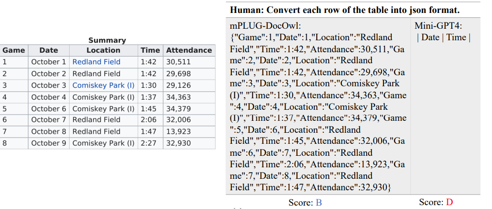

# mPLUG-DocOwl

> [mPLUG-DocOwl: Modularized Multimodal Large Language Model for Document Understanding](https://arxiv.org/pdf/2307.02499) 分布式多模态大型语言模型用于文档理解

## 问题提出

有两种模型可以理解包含丰富文本信息的图像：

1. 利用现成的OCR模型或API从图像中识别文本，然后设计预训练任务以促进视觉和文本输入之间的跨模态对齐。
2. 端到端的方法，在预训练阶段使用高分辨率图像编码器学习文本识别。

现有的多模型大型语言模型，包括mPLUG-Owl，在零样本设置下显示出了基本的无需 OCR 的文本识别能力。然而，如果没有域内训练，这些模型往往会忽略复杂的 OCR 特征，例如复杂的表格或大块文本，而这些对于无 OCR 的文档理解至关重要。

贡献：

- 在mPLUG-Owl基础上设计模块化框架，其中包含一个视觉抽象器（visual abstractor）模块，以连接预训练的 LLM 和视觉知识模块，实现文本和图像之间的对齐。mPLUG-DocOwl 是一种模块化的多语言、多模态、多任务学习模型，第一个基于统一指令调优来平衡仅使用语言、通用视觉与语言以及文档理解的任务。
- 为了增强各种文档理解能力，我们重新组织了下游的各种文档理解任务，并以相同的指令形式呈现。构建了一个精心设计的指令理解测试集，称为LLMDoc，其中包含人工评估来评估各种文档理解能力。

为了保持一般单/多模态能力，我们还包括仅由mPLUG-Owl使用的语言专用和通用视觉-语言指令数据集来训练mPLUG-DocOwl。在训练过程中，视觉知识模块和 LLM 解码器被冻结，只有 visual abstractor 和 LLM 中的LoRA 进行微调。

## 模型架构

mPLUG-DocOwl 的架构基于流行的多模态语言模型 mPLUG-Owl，组成包括：

- 视觉基础模型：负责从输入图像中提取视觉特征
- 视觉抽象器：使用一组可学习的标记对这些特征进行蒸馏
- 语言基础模型：然后将生成的视觉特征与输入句子的词嵌入连接起来，并馈送给语言模型以生成响应

当给定包含显著文本的图像时，mPLUG-Owl 表现出基础的OCR能力。受此启发，我们提出通过文档指令微调数据来进一步微调模型以提高文档理解性能，包括文档、表格、图表以及自然图像和网页。在微调期间，我们冻结视觉编码器和语言模型并训练视觉抽象器。我们还采用 LoRA 来增强语言模型的能力。

## 指令微调数据集

- 视觉问答：我们直接使用原始问题和答案作为{问题}和{答案}占位符。
- 信息提取：要求模型从输入图像中提取 key-value 对。 key（或“类别”）始终为固定集合。为了转换此任务以适应指令微调格式，我们将 {answer} 作为 value，并构造 {question} 为 `‘What is the value for the {key}?`当key不存在于图像中时，{answer} 被设置为 `None`
- 自然语言推理：一项二元分类任务，标签为“蕴含”和“矛盾”。给定一个陈述句，我们构造出 {question} 作为 `{statement}, Yes or No?`。 {answer} 是“是”或“否”，分别指代“蕴含”和“矛盾”。
- Image Captioning：目标是用流利的语言简要描述一张图片。我们将 caption 视为{answer}，并随机选择一个提示 prompt 作为{question}

## 关于表格的结果

