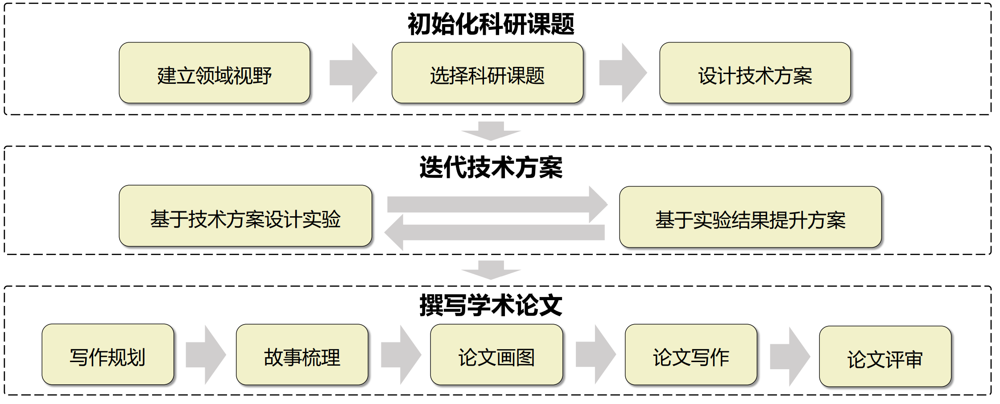
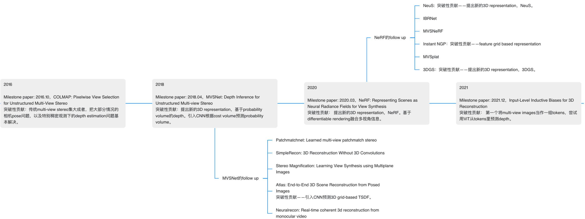

# 建立领域视野

## 课程目的

课程可以帮助阐明Research project的步骤和过程，解释规则，分享经验。

然而，以下能力只能通过实践经验来培养：

- 想Idea的能力（创新能力、技术能力）
- 进行实验的能力（编程能力、分析能力、技术经验、沟通能力）
- 论文写作能力（表达能力、英语水平、艺术水平、时间规划能力）

## 建立领域视野

领域的视野包括对“技术演变”的视野，和对“重要问题”的视野。初学者往往只需建⽴较为视野narrow的视野，当一个人越来越强，看的论文越来越多，视野也越来越大。当进入一个新的科研方向，开始读论文时，请问自己如下问题，这是后续课题选择等环节的基础

- 有哪些milestone papers？ 
- 领域技术如何随着时间的推移而演变?
- 这个领域的终极目标是什么？ 
- 该领域已经达到了什么水平？ 
- 还有哪些重要的问题仍未被解决？ 
- 现阶段的热点话题是什么？

> 例如，对于多视角重建这个科研方向：
>
> - 问题：多视角重建的技术如何随着时间的推移而演变?
>   答案：在2023年，是 One-2-3-45 这样发展
> - 问题：该方向还存在哪些重要的问题？
>   答案：在2023年，例如稀疏视角重建

建立领域视野可以遵循如下方式：

1. 确定该领域的 milestone papers
2. 查找之前和之后的论文，阅读论文以了解这些论文解决的问题和pipeline，以及他们的技术见解
3. 整理技术的演变轨迹，跟踪和预测**新技术**
4. 整理领域热点问题的演变，跟踪和预测**新问题**

关于识别Milestone papers，技巧是查找该领域被引用次数最多的论文，并按日期对它们进行排序，或者寻求经验丰富的研究人员的建议，以及观看知名研究人员的演讲。

> 例如，多视角重建的milestone papers：
>
> - 200?—2016，Colmap： Multi-view stereo 
> - 2018—2020，MVSNet：使用3D CNN在cost volume融合 
> - 2020—2023，NeRF： 定义global representation，使用differentiable rendering融合 
> - 2023—2024，DUSt3R：将图像tokenlize后，使用vit融合 
> - 2023—2024，CAT3D： 使用Multi-view Diffusion Model融合

关于查找两个技术里程碑之间的论文，就是找到 Milestone 引用了什么，和被什么文章引用，一个好用的工具: [Connected Papers](https://www.connectedpapers.com/main/428b663772dba998f5dc6a24488fff1858a0899f/NeRF/graph)

关于梳理技术发展脉络，可以绘制时间轴思维导图：

1. 首先，初始化一个时间轴，将论文列到时间轴、并阅读每篇论文，了解它解决的问题、pipeline和技术见解
2. 然后，确认哪些论文是milestone paper、哪些论文是follow-up，具体根据论文方法的创新性判断
3. 最后，总结这些论文，包括Milestone paper的技术范式，以及Follow-up papers作出的改进，看看每年的热点问题是什么，又是怎么解决的

## 问答式阅读论文

可以借助论文解析树，将阅读论文的过程转变为回答问题的过程，当然，这也是之后论文写作的好方式

另外一种方法是，给自己设立小的的算法改进任务，带着问题去阅读论文和代码
