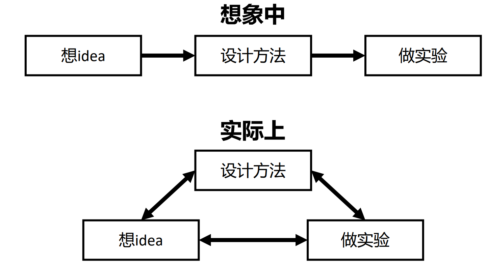
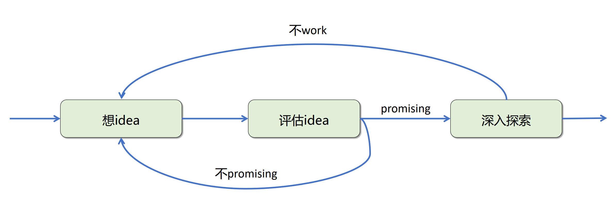
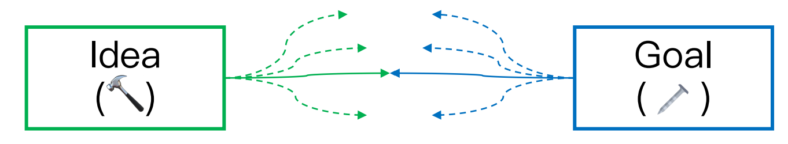
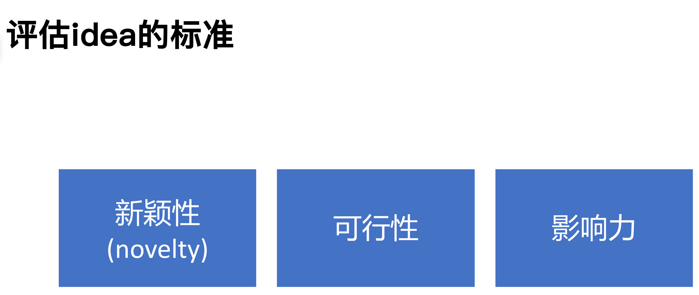

# 选择科研课题

选择课题需要从“已知”推测“未知”，伴随着很⼤的不确定性： 我选择的课题可能是⼀条“死路” 、我选择的课题可能有很多“分叉路”（⼀开始想做A，最后做成了B） 、其他⼈可能在同⼀条路上，可能先达到终点、整个道路的布局可能发⽣巨⼤的变化（出现新的技术突破）

- 拥抱不确定性：建立正确的心理预期（open-minded） 
- 降低不确定性：不断更新、加深自己对问题的认识

寻找科研课题本身也是科研！它是科研最关键的环节之⼀，常常会贯穿⼀个项⽬的始终

## 了解自己与所处环境

⾃身情况 

- ⾃⼰的兴趣，擅⻓什么（因为擅⻓所以喜欢，因为喜欢所以擅⻓）
- ⾃⼰所处的阶段（刚⼊⻔/有⼀定经验？） 
- ⾃⼰的⽬标（发表⼀篇顶会/深耕⼀个问题）
- 了解⾃⼰对什么⻛格的问题感兴趣，通过阅读论⽂和学术交流，可以⼤致判断⾃⼰对哪类⻛格的问题兴趣

> - 有的⼈追求实⽤性：做有重要实际应⽤的问题；提升效果和速度
> - 有的⼈追求新颖和有趣：做别⼈没做过的问题；酷炫的效果 
> - 有的⼈喜欢数学严谨性：喜欢能⽤数学解释的问题

⼩环境 

- 导师的⻛格 (⾃由探索/给特定⽅向？) 
- 实验室的情况（在某⽅向有⼀定积累/起步阶段？） 
- 合作者情况（有师兄师姐带/独⽴探索？） 

⼤环境 （建立在领域视野之上）

- 领域的发展阶段 
- 领域的活跃程度 
- 领域的发展潜⼒

## 兴趣与热情 first

兴趣很⼤程度上也决定了能不能做出来，以及做出来的影响⼒有多⼤

> - 当做⼀个⾃⼰兴趣⼀般的项⽬时：当⼀天和尚撞⼀天钟 
> - 当做⾃⼰兴趣浓厚的项⽬时：⽇思夜想，不⾃觉花很多时间在上⾯

浓厚的兴趣建⽴在对⼀个问题有过亲⾃探索、产⽣了深刻理解的基础上。多与他⼈交流，了解⼤家对什么感兴趣

> Noah⼀直对重建有对称结构的建筑物有深厚的兴趣，因为在他早年时候做SfM的时候， 有对称结构的建筑物重建总是失败

当然，时⽽没有热情是⼗分正常的（不是必需品），找到⼀个⾃⼰很感兴趣的课题是⼀件很幸运的事情，重要的是⼀直保持好奇⼼和求知欲

## 寻找idea

想idea的两种方法论：

- Goal driven： 有⽬标，寻找实现⽬标的⽅法
- Idea driven： 想到⼀个新的idea，看效果/看能解决什么问题

- 前提：建⽴对领域的认知（看上一篇文章）
- 阅读：对待⼀篇具体的⼯作，带着问题去阅读：这个⼯作有哪些不⾜的地⽅？ 这个⼯作开启了哪些新的可能性？ 这个⼯作跟我想解决的问题有什么关系？ 
  - 误区：完全关注在⼀个⼯作不⾜的地⽅；完全相信⼀个论⽂的结论
  - ⼴泛阅读： 横向⽐较，整理脉络，识别缺⼝
  - 阅读经典论⽂
- 与他⼈交流：寻找跟⾃⼰研究兴趣相同/技能互补的同学⼀起讨论idea；跟⽼师/资深的研究者交流帮助培养更宏观的视野；⽆⽬的的闲聊会有意外的收获（帮助你了解领域动态，可能诞⽣research ideas）
- 实践：上⼿跑代码，深⼊理解⼀个⽅法的机理；理解它的不⾜、可以提升的地⽅；提出新的解决⽅案来提升效果

**如何执⾏**？

- 有的⼈同时对不同的⽅向和ideas进⾏初步尝试，选出最promising的⼀个深⼊探索 
- 有的⼈会谨慎想好⼀个⼤概的⽅向，在这个⽅向内根据实际的反馈对idea进⾏调整和提升

**什么时候应当放弃⼀个idea**？

- 有硬伤： 
  - 核⼼idea已经被⼈做过了 
  - 核⼼的idea不work 
  - 核⼼的contributions不够，列出contributions并判断这些contributions是否达到⽬标期刊/会 议的标准（求助有经验的⼈） 
- 陷⼊瓶颈（不要完全放弃）： 
  - 尝试所有能想到的解决⽅案，总结他们不能解决问题的原因，这些原因是不是致命原因？ 
  - 跳出来看，是不是思路不对？考虑对问题进⾏重构 
  - 是不是有⼀个特定的模块缺失？发现/等待更好的⼯具出现

## 课题的novelty

- 越简单有效的idea，潜⼒越⼤
- 最好的idea让⼈读后感觉：这个好make sense，这个问题就应该这么解决！我之前怎么没想到?!
- 能给领域带来新的增量（信息/知识/技术）的⼯作都是novel的⼯作

> 所有⼯作⼀定程度上都是A+B，因为所有的⼯作都需要站在巨⼈的肩膀上，都会有前⼈⼯作的影响。但不同的是，这个A+B的组合是否是由你要解决的问题所驱动的⼀种⾃然（甚⾄ 必然）的解决⽅案。以及，这个A+B的组合是否是⼤家在类似的情景下已知能work的

## 课题的可行性

新兴的领域内课题**研究空间**通常较⼤，越成熟的领域和问题研究空间通常较⼩，衡ᰁ⽅法：针对⼀个⽅向试想⼀下，看⾃⼰能想到多少个不同的研究⽅法/⻆度，哪些是已经被别人做过的

课题的**难度**并不等同于问题本身的难度！

- 难度 = 相较于前⼈的⼯作做出更好的效果的难度。越成熟的领域难度越⾼（例：图像分割）
- 难度 = 相较于前⼈的⼯作挖掘新的⻆度的难度。即使领域不是很成熟，也有可能⼤家探索的⻆度已经⽐较全⾯了

难度是相对的，我们可以在做项⽬的时候调整课题的难度。如果⽬标太难，可以适当降低难度（简化问题设定）。每个⽅法都有⾃⼰的优缺点，想办法将⾃⼰⽅法的优点发扬光⼤，调整问题设定

⼤家越关⼼的问题**竞争**通常越⾼ (例：三维⽣成模型)。越容易想到的课题竞争度也通常越⾼ （例：把nerf的拓展⽅向做到gaussian splatting上）

应当尽量避免竞争激烈的问题，但如果有⽐较独特的⻆度或者优势（跟⾃⼰的背景很相关/⼿快/合作者给⼒），可以⼀试

其他考虑点：

- 我编程能⼒、数理基础怎么样？ 
- 我对所研究领域是否有充分的了解？ 
- 我对科研流程的把握能⼒怎么样？
- 问题定义的清晰程度：能否⽤简洁的语⾔描述我的核⼼研究问题？我要解决⼀个什么问题？ 我想的⽅法为什么能解决这个问题？ 解决了带来什么？
- 指导：我的导师能否给我有意义的指导，如果不能，我能否找到其他⼈来指导我？
- 反馈环：我能否及时得到反馈，还是要等⼏周/⼏个⽉才知道？
- 时间：这个项⽬所需的时⻓是否符合我的时间安排？
- 资源：是否有⾜够的计算资源、数据集⽀持我想做的课题？
- 灵活性：如果我想到的idea不work，有多少plan-B？有多容易“回收”我已探索的 成果？

> 对于刚⼊⻔的同学： 
>
> - 还需锻炼基本的科研技能 
> - 尽可能选择⻔槛⽐较低的、难度适中、⻛险较低的课题 
> - ⽬标：培养科研技能、建⽴科研的信⼼ 
> - 建议可以找⼀篇⾃⼰喜欢的、代码维护⽐较好的论⽂，深⼊理解⽅法，并在此基础上尝试对其 进⾏改进 
> - 尽可能选择⾃⼰能够得到⾜够⽀持和指导的课题
>
> 对于有⼀定科研经验的同学：可以选择深挖某个问题⾥的难点，尝试解决核⼼问题，也可以适当探索⼀些别的⽅向，丰富⾃⼰的技能和知识储备，更有可能产⽣好的idea

评估可行性：

- (阅读/与他⼈交流)：我想做的问题有没有⼈已经做过了？ 
- (阅读/与他⼈交流)：我想的⽅法有没有⼈在其他的领域尝试过？是否有过成功经验？ 
- (实践)：设计最简单的实验来快速验证核⼼idea

## 课题的影响力

⼯作的影响⼒ = ⼀个领域的总体关注度 x 我的⼯作的显著程度

越重要/越普适/越热⻔的问题关注度越⾼

> - 重要的问题例⼦：对应关系、单⽬深度估计
> - ⼩众的问题例⼦：解决⻥眼相机下⻢的姿态估计问题
>
> 普适度的考虑点：哪些⼈群会对我的课题感兴趣？
>
> - ⼀个⽐transformer更好的架构：所有AI领域从业者
> - ⼀个能从视频中得到更好相机参数的算法：做3D/4D重建的⼈，做内容⽣成的⼈（提升视频 模型的可控性）

影响⼒有不同的表现形式：

- 很有⽤：解决核⼼的问题/挑战
- 很特别：给⼤家留下深刻的印象，创意，美，独特，impressive

提升影响力的根本在于提升⼯作的质量，但是更好的呈现也会让⼈更容易关注到你的⼯作，像提升论⽂写作；及时开源代码；做好项⽬主⻚；更好的可视化来突出⾃⼰的⼯作的优势和特点

评估idea之影响⼒ 

- 如果⼀切顺利，所有的难点都得以解决，最终的效果是否⾜够惊艳？ 
- 如果我跟别⼈讲述最终可能实现的效果，他们是否对其感到兴奋？

## 杂谈

培养研究品味(research taste)的练习⽅法

- 写下一份研究思路清单。找一个靠谱的导师，给每个想法打分1-10.反思后，讨论你不同意的想法
- 找找和你想法相同的别人的实现的结果，要注意。结果与你的期望相比如何？（培养直觉）
- 采访你周围的研究人员，了解他们的品味。他们为什么选择在他们正在做的问题？他们如何挑选问题？他们的研究“大局”是什么？
- 阅读有关科学史的书籍。反思为什么一些研究人员专注于他们同时代人忽视的重要方向。
- 批判性地考虑你的研究品味，以及你周围人的品味。你的品味很可能受到你的研究群体（你的合作者、顾问等）的影响

⼀些tips

- 常⻅错误：对领域了解不够、对前沿的跟进不够，导致研究的⽅向明显不能达到 SOTA⽽不⾃知。本质上是没有在最好的⽅法的基础上进⾏改进，没有⽤最先进的⼯具。需要多读多问
- 常⻅错误：在深⼊探索⼀段时间后放弃⼀个项⽬，转⽽开始做⼀个不相关的项⽬（浪费了在⼀个⽅向上积累的insights和技能）解决⽅案：对这个项⽬进⾏重构，尽可能找到⼀个相关的项⽬，“重复利⽤”在这 个项⽬⾥学到的知识和积累的技能
- 维护⼀个⽂档，记录⾃⼰所有的research ideas，记录本身可以帮助⾃⼰理清思路，⽅便对不同的ideas进⾏⽐较和融合