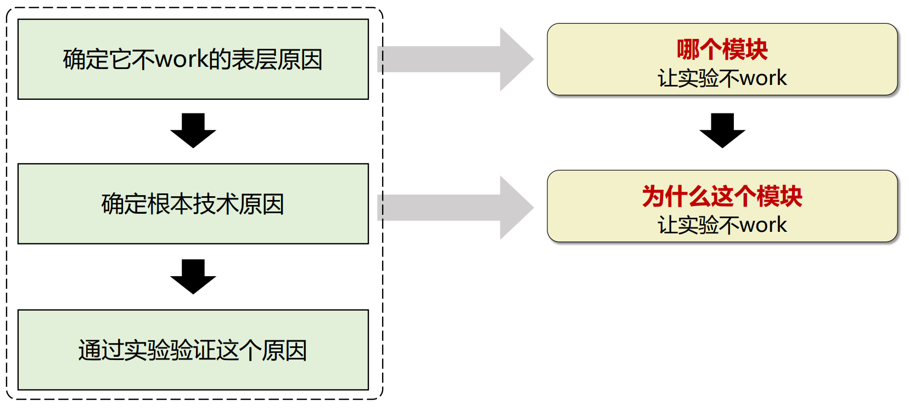

# 设计技术方案

在选定课题后，我们需要设计一种新颖的pipeline来达到SOTA performance。

> 为什么要有方法设计的系统性思路?
>
> - 大部分人不是天才，不能一拍脑袋就能找到一种技术方案。
> - 一个清楚的方法设计思路能更有效地解决问题并达到SOTA。 
> - 让我们提出的方法更有动机，同时使得论文的故事更吸引人。 
> - 保证了方法的技术创新性，以免审稿人说它没有novelty。 
> - 同时，该系统性思路可以有效提升我们的技术insights。

设计方法套路：

## 找到问题

找到一个合适的Base Line

- 好的会议
- 大组
- 代码开源
- 新

如何识别论文方法的不足？

- 在论文没提到的数据集上跑实验
- 如果要做成一个产品，还有哪些不足？

## 分析原因

分析原因是必要的，我们需要对当前SOTA效果不好的点去对症下药。很多时候我们可能想出来一个点子，但是我们并不知道这个点子要解决什么问题，实验了一下，发现不行，然后换下一个点子……这样匆匆忙忙地去实验可能会浪费很多时间。

> 什么是第一性原理：马斯克的例子
>
> 特斯拉研制电动汽车期间，曾遇到一个难题：电池成本居高不下。当时储能电池的市场价格是每千瓦时600美元，这个市场价格很稳定，短期内不会有太大的变动。
>
> 但是马斯克从第一性原理角度进行思考：电池成本为什么这么贵，电池组到底是 由什么材料组成的？这些电池原料的市场价格是多少？如果我们购买这些原材料然后组合成电池，需要多少钱？这个答案是，每千瓦时只需要80美元。从最本质出发，马斯克让电动车的商业化成为可能
>
> 科研例子：多视角重建
>
> 

如何找到技术原因：

- 深入学习 SOTA算法
  - 跑代码，学 习算法细节。
  - 收集算法的 failure case， 整理failure case的 pattern， 分析其中规 律。
- 做实验获取 更多观测，做消融实验， 定位哪些模块 或者哪些数据 导致了问题。
- 科研经验 带来的直觉
- 持续思考，根据实验现象， 不断思考根本 的技术原因
- 文献调研，阅读相关论文， 查看是否有工 作分析了这个 问题。
- 讨论，经常和他人交 流，获得不同 的观点和 insights。

## 如何分析SOTA不work

发现表层原因：首先确认那些能够work的数据或算法, 然后将其与不work的数据或算法进行比较， 查看他们之间的差异。

发现根本技术原因：尽可能地列出可能的技术原因

- 为什么切换到某个数据集后性能会下降？
- 为什么添加了某个模块后性能会下降？
- 为什么改变了某个参数后性能会下降？

在确定代码没有写错之后，调试算法：

1. 步骤1：查明导致问题的模块
   - 根据二元搜索方法缩小可能存在问题的模块范围
   - 根据变量控制方法确定导致问题的特定模块（消融实验）
2. 步骤2：分析根本技术原因
   - 依靠你积累的技术技能和经验来推断原因
   - 和他人讨论推断原因：实验目的（描述为什么要做这个实验，同时你希望通过这个实验获得什么）、实验设置（实验中用了什么样的数据，同时对算法做出了哪些改变）、实验现象（列出有明显规律的实验现象）、能确定的当前问题的范围、猜测的可能导致的原因。询问是否有其他想法

> 例子：4K4D Project中怎么定位K-Planes速度慢的原因
>
> K-Planes包含的模块：Ray Sampling、Point Prediction、Volume Rendering，在每个模块连接处打上断点，或者计时，发现 Point Prediction 最耗时，需要改进

## 实验结果检查表

- 代码调试检查表
  - 各模块的中间输出结果：每个模块代码的中间输出结果是否满足预期？
  - 代码bug的典型原因：积累一些导致代码bug的典型原因（如NaN值，段错误等）。
- 算法调试检查表（与数据相关的问题）
  - 在简单数据上的表现：在training data上（或者simpler one）的表现如何？
  - 两个数据集之间的差异：我们在 xx data有更好的结果。 为什么在这个数据上不能work？ 这两个数据集之间有什么差异？
  - 观察failure cases中是否存在特定的pattern？使用3D数据可视化工具进行调试（如Viser、Wis3D）
- 算法调试检查表（算法相关问题）
  - 找到一个能够work的算法：我记得xx算法在这个数据集上的表现并不差。为什么我们的方法不work？这需要进行消融实验来检查哪个模块有问题。
  - 检查各模块输出是否正确：我们是否可视化了xx模块的输出？检查输出结果是否满足预期或者是否有任何奇怪的现象发生。

## 设计方法

根据分析的原因，设计一种能达到SOTA的方法。

为了使创新和设计解决方案的过程更有迹可循。需要一个系统性的方法论。

> 我们不得不承认，所有的方法都是在创新地组合已有的技术。（但是关键是创新地组合，不是A+B，有没有创新的技术改进）
>
> - ResNet = CNN + Skip Connection 
> - NeRF = Neural Field + Radiance Field 
> - DreamFusion = ClipNeRF + SDS Loss

1. 列出原因：为什么原有SOTA方法不work？
2. 列出所有与技术原因相关的、有可能能解决该问题的技术
3. 选择近年来的新技术，需要是未被well-explored、有想象空间的技术
4. 每天仔细思考，如何基于这些技术构造pipeline？
5. 与周围的人进行广泛的讨论，获得insights，迭代优化pipelines
6. 等待灵感爆发的时刻，脑海中涌现出一个有效且有意思的pipeline

> 案例：4K4D
>
> 1. 已有SOTA：K-Planes，遇到的问题是速度慢。
> 2. 分析原因：采样点多且逐点渲染速度慢。
> 3. 相关的技术：Voxel-based Rendering、Point Rendering、Depth Guidance
> 4. 选择新技术：发现在动态场景，Point Rendering还未被较多探索
> 5. 设计方法：Point Cloud Sequence

另一个事实：好的方法通常由某些新技术组成。虽然是在已有技术上不断的积累迭代，但当量变产生质变，或者说迭代创新到一个程度，突然变得确实特别好用，可以蔓延到其他领域了。

> 例如dream fusion，ClipNeRF 本身是在2D generation领域的，结果 2D generation积累到了一定程度以后，stable diffusion巨好用，就直接拿 2D 的东西来找 3D generation里的一个问题了。

设计方法的三个方面的能力

- 技术积累：广泛的技术积累是方法设计的基础
- 深入思考：对技术和技术挑战的深刻理解
- 敏锐的洞察力：掌握前沿的技术，敏锐地发现如何使用它们解决已有问题

## 改进方法

## 理想的方法

理想的方法：用新技术解决问题

因为“新技术”和“有效性”一般来说有很强的关联，改进现有技术通常不会带来性能上的重大突破（不然已经被其他研究人员发现了）对于一个想解决有趣科学问题的前沿项目，如果不做方法创新，只停留在原来的技术水平上，就很可能无法带来明显的提升。

任意阶段的研究人员（初学者、大佬）都可以把使用新技术解决问题作为目标。只要想法多，初学者也能设计出创新且有效的pipeline

一个理想的方法有两个维度：

1. work程度
2. 技术创新强（通常有较大的创新空间。 在此基础上，follower可以比较容易地 作出改进，并发表论文。 因此有更大的影响力）

进一步，技术创新的几种类别（方法四和五一般中不了论文）

1. 一个崭新的范式（新的学习模型，新的表示） 
2. 基于已有pipeline提出非常新颖的模块 
3. 将几个已有的模块组合成新的pipeline 
4. 在已有pipeline中加入经过简单改进的模块 
5. 在已有pipeline中加入现有的模块

## 使用新技术

一个简单高效的设计方法的方式：利用其他领域的新技术（新的学习模型、新的表示、新颖的算法模块）解决自己领域的技术难题。

- 简单直接：就算是低年级学生也能做。 
- 启发性强：发掘新技术的应用潜力。 
- 先进前沿：如果新技术能work，就会有很多follow up。
- Ph.D学生也适合：努力成为一个专业能力很强的人，对新技术具有出色的学习、思考与分析能力。能够深入挖掘new and under-explored的技术，改进该技术以解决自己领域前沿问题。
- 审稿人的视角：审稿人希望论文有技术贡献，可能是因为他们想看到更多的技术创新和分析。如果一篇论文只是讲故事，但是不介绍新技术，它对这个领域其实没作出技术贡献，对于领域 而言，没有技术上的增量。新技术的论文很可能被录用。 

这个方式存在的问题：要求研究人员对“技术”有深入的思考，而不是简单拼接、当作工具使用。为了让新技术在一个新领域work，需要深入的思考和改进，因此研究人员要有很强的技术能力。

如何把新技术用到你的领域：

1. 分析新技术能解决的问题，列出新技术可能可以解决的技术难题
2. 整理自己领域的技术难题，以及整理它们背后本质的技术难题
3. 将新技术和当前领域的技术难题关联起来

> 案例：Neural Body：第一个将NeRF应用到人体建模的技术。技术做法挺直接的，但因为NeRF本身技术潜力大，所以后期改进的人较多。