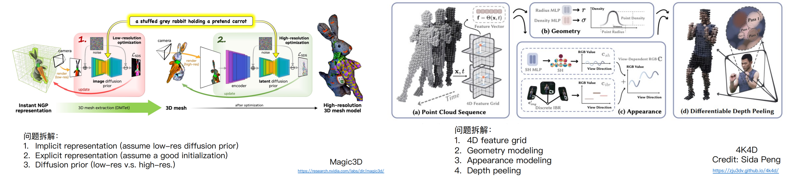

# 实验设计

## 拆解和细化想法

两个问题拆解的例子：

怎么拆解大的方法？把⽅法的流程图画出来，因为画图的过程就是在帮我们看清楚整体的框架。当然，流程图并不⼀定需要像paper⼀样完美, 目的是为了整理自己的思路

能提前预知好完美的拆解办法吗？可以边做实验边优化⾃⼰的分解⽅案。

> ⽐如把⼤象放进冰箱，⼀般⼤家会分解成“打开冰箱，放进⼤象，关上冰箱”，但也有可能有“找⼀个 ⼤象，找⼀个冰箱，打开冰箱，尝试放⼊⼤象，压缩⼤象，循环到放⼊⼤象成功，关上冰箱”。边做实验边优化的方式是：
>
> - 当打开冰箱的时候发现没有冰箱，那就需要先找到冰箱，但万⼀已经有了冰箱呢？
> - 当发现直接放⼤象放不进去的时候，那就需要压缩⼤象，但万⼀直接放进去了呢？

做实验时是先做整个pipeline的实验再做每个部分的消融，还是先验证每个部分的有效性再做整个pipeline的实验？**可以先搭好⼀个最基本的pipeline**，然后再去验证每⼀个部分

- 最基本的pipeline意味着每⼀部分可以很简单
- 让我们对宏观上的实验有更好的把握 （避免拆分得不完美）
- 以验证每⼀部分放到pipeline⾥⾯对最终结果的影响 （ 避免没法组合到⼀块）

类似的，即使一些方法是end-to-end的，我们同样可以把End-to-end 视作⼀个⼤问题。重点在于对技术⽅案进⾏拆分，把⼀个⼤的技术⽅案拆分成每⼀个可以独⽴验证的部分去分别研究（E.g. 该选⽤什么的data, 什么样的loss function, 怎么end-to-end training）

## 从简化小问题开始

在拆分问题之后，我们可以开始简化每一个小问题，从最简单的且能验证技术方案的实验开始 （Toy example 举例：研究3D的问题，可不可以先从2D开始？)

- 简化实验的setting
- 简化实验的数据 （比如：数据有噪声，相机参数不准确）
- 排除其他因素的干扰，假设这个系统里面别的模块都完美
- 在训练神经⽹络之前先优化⼀个简单例⼦（确定这个神经⽹络能overfit）

简化并不意味着忽略原本的问题，简化是原本问题的提炼 （帮助我们理解原本的问题，debug code)。从简化得到的方法需要重新被用到原本的问题 (原本的实验数据不能被简化）

## 实验执行

对自己为什么要跑⼀个实验有⼀个宏观的认识：

- 为什么要跑这个实验，这个实验是为了证明什么 
- 分析实验给了我们什么结果，实验A跟实验B对⽐可以说明结论C 
- 不要盲⽬得跑了⼀堆实验，但是没有得到有⽤的结果分析 
- 写⼀个实验列表

对于实验有优先级的排序：

- 资源的限制
- 找到idea的核⼼点在哪，什么实验是最有可能有⽤的，能给我们正确的结果或者是效果提升
- 找到之前实验的问题在哪，如果效果⽐别⼈差，那么具体差在什么地⽅？

> Q&A：在计算资源有限的情况下，如何有效的缩短实验时间？
>
> - 写好代码，Profile model的compute bottleneck在哪
> - GPU利⽤率是不是100%，如果不是，问题在哪？
> - 多卡并⾏会不会变慢
> - 有没有类似的代码可以借鉴？（Diffuser, NerfStudio, ThreeStudio)
> - 同⼀个实验室可以维护同⼀套代码

建⽴⼀个checkpoint：

- ⽐如每周写⼀个实验总结（⽐如PPT的形式），可以⽤于跟导师meeting，先给导师很多信息（实验或者想法），然后导师才能根据这些信息更有效地指导学生
- 整理⾃⼰的实验思路，把它写下来 （确保⾃⼰在⼀个正确的道路上）

可重复实验：

- Coding上的注意，例如固定random seed，不然不可重复
- 代码备份，更改实验设定可以 git 新增一个branch，觉得有用再 merge 到 master（代码可以追溯回到之前的历史）
- 存log, 以及Run实验的时候复制一份代码到log

控制变量：

- 控制变量避免了同时有两个变量在影响结果，帮助我们对实验结果进⾏逻辑分析，从⽽得到正确的结论。
- 控制变量的核心是指**我们要run的每⼀个实验都有相应的对比实验来说明结果**
- 在coding上，就是能不能只改⼀个option就能实现不同的experiment settings，例如使用基于YAML的config file，每次实验在python脚本里面读YAML文件获取超参数

> Q&A：在控制变量的环节，假设有n个布尔类型的变量，我们需要做2^n级别的消融实验吗？
>
> 事实上，没有⾜够的资源去做2^n次实验，但是可以在这些⽆序中找到有序，基于过去的经验对未来作出判断。
>
> - 能不能先对这n个变量排序？哪个（或者哪个组合）最有可能有影响结果？
> - 能不能先对2^n进⾏剪枝？删除掉⼀些不需要实验的组合？

## 面对失败

实验失败是科研的常态（>90% are failure, from Kaiming He) 这与个人能力没有关系，有时候确实是idea不work，心态放平就行。

不要过早得宣布失败。能不能排除是coding的问题？也许只要改某一个地方就成功了

- 多做visualization，⽐如3D最容易弄错相机坐标，看看RGB值域范围等
- 把每⼀步的结果输出出来看看来判断他是不是Coding的问题
- 不要把它当作失败，当成经验的积累。换句话说，这是一次获得technical insights的机会，在努力解决问题的过程中，你可能会对问题有更深入的了解，这有助于你完善idea或找到新的解决方案。

实验失败是未来成功的基石。重要的是分析失败的原因：为什么它失败了？

- 多看一些实验的中间结果找到失败的原因
- 通过控制变量的对比实验分析
- 什么地⽅效果不好？什么例⼦效果不好？Worst case⻓什么样⼦？
- 是idea本身的问题，还是这个实验setting不适合这个idea？
- 如果确实是idea有缺陷，有没有办法弥补？
- 如果是实验setting不对，可不可以换个setting？

何时放弃一个idea：

- 我们发现了当前idea的根本缺陷
- 我们发现资源不足以支持这个idea（计算资源、数据资源）

