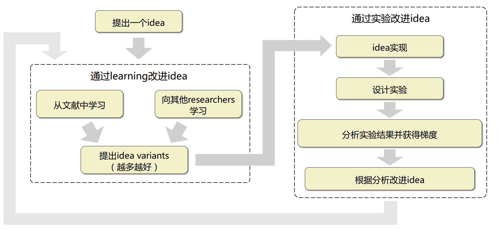
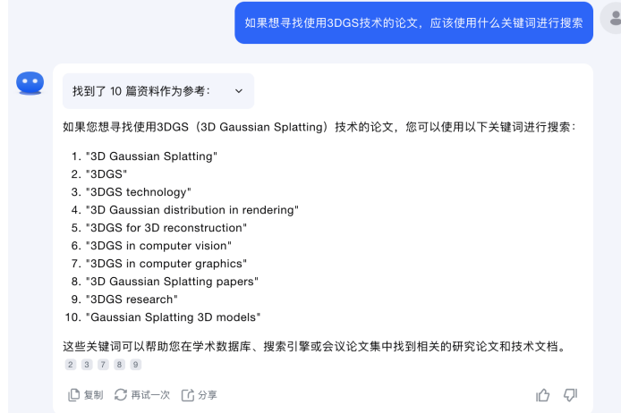
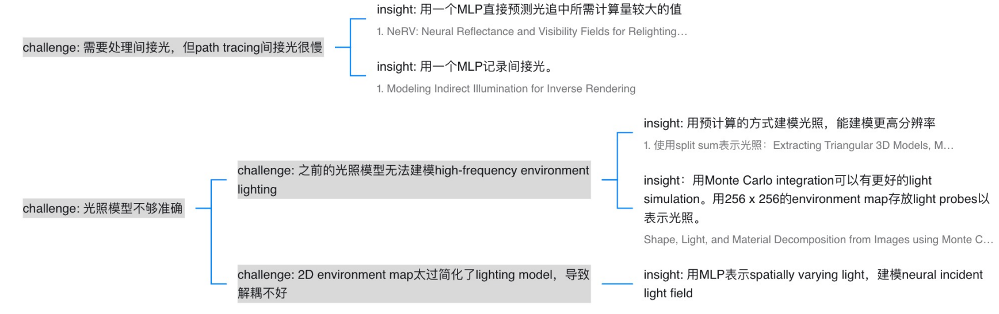

# 方案改进

初始提出的方法，95%的情况下都是不 work 的。需要根据实验结果改进方案。

## 从文献中学习

寻找相关技术论文的三个目的

- 检查novelty：是否有类似的文章？
- 获得技术insights：相关论文如何分析相关技术的insights和技术优势？
- 学习关键tricks：相关技术方法wrok的关键tricks是什么？

主要找两类论文（从相关工作章节中找）：

- 有关该任务的先前论文
- 使用类似技术的先前论文

> 也可以使用大语言模型（LLM）推荐搜索关键词，有效的关键词搜索需要对一个领域有基础了解
>
> 

然后我们阅读这些论文以了解相关技术的动机和技术优势，一种有效的学习方法是通过challenge-insight tree总结这些论文。不过我们通常不会阅读论文的代码，除非它与我们研究的内容非常相关。

> 案例：4K4D
>
> 初始的Idea：发现在动态场景，Point Rendering还未被较多探索，设计方法：Point Cloud Sequence
>
> - 学习volumetric videos里面实时渲染的pipelines 
> - 学习static view synthesis里面实时渲染的pipelines 
> - 学习领域现有工作怎么用点云的、学习他们的技巧

## 与他人讨论

目的：

- 找到机会组织你的idea：在与他人讨论时，必须清晰地组织你的思路。
- 获得对自己idea的反馈：与他人讨论可以帮助你获得对自己idea的反馈，这包括潜在的问题和改进建议。
- 激发新的idea variants：有时，一次简单的对 话可以引发新的问题 或解决方案。

方法：

1. 首先，找到一个你可以讨论的群体（Senior advisors、实验室同学、具有类似研究兴趣的同行）
2. 然后，通过报告来介绍你的问题和方法（五个要点：任务设定、Failure case与本质的技术原因、解决问题的直觉和动机、想讨论的问题、粗略的 pipeline）

## 更多idea variants

- 避免陷入local minima：类似于优化过程，我们设定几个seed以防止陷入local minima，避免陷入惯性思维
- 培养技术创造力：培养技术洞察力、技术创新能力和创造力。
- 一个常见的**误区**是直接使用导师提供的coarse pipeline进行实验， 而不进行深入思考改进。

从文献中学习，现有的pipeline和关键tricks。或者向其他研究人员学习，同行对当前pipeline的评估，推荐的相关pipeline或tricks。加上自我反思与总结

## 实现idea与实验

基本做法： 在优秀的代码框架上实现你的idea

更好的做法：最好在自己的代码框架内重构他人的代码

- 节约时间：与从头实现相比，重构他人的代码可以降低实现难度并避免陷入陷阱。
- 了解关键的tricks：在重构代码的过程中，你会加深对算法的理解，提高技术insights，并学习到有效的tricks。
- 为后续实验做好准备：使用自己的代码框架，便于未来的idea改进。

设计实验核心原则：减少实验中包含的探索点的数量

- 分解pipeline：将idea分解为不同的组件，从可控的idea开始，不断添加探索性和创新性的框架/模块。
- 分解实验设置：从一个简单的setting开始探索，然后逐渐增加难度，之后进入到真正的setting。
- 还应该考虑exploration points的重要性，进行实验优先级排序

## 分析实验结果

分析结果可以加快idea迭代改进：更好的改进方向、 减少实验所花费的时间。核心动机：避免项目被scooped

保持良好的实验记录习惯

- 实验目的：描述为什么要做这个实验，同时你希望通过这个实验获得什么
- 实验设置：实验中用了什么样的数据，同时对算法做出了哪些改变。
- 实验结果：记录成功和不成功的结果，其中包括量化结果和可视化的结果。
- 实验结果分析：分析实验为什么work或者不work。
- 下一步骤：思考如何进行下一步并列出下一步要进行的实验。

> 如何分析为什么实验不work？之前提到了（复习一下之前的），确定它不work的表层原因和根本技术原因。首先确认那些能够work的数据或算法, 然后将其与不work的数据或算法进行比较， 查看他们之间的差异

## 基于分析改进idea

推测技术原因：

- 依靠自己积累的技术能力和经验
- 查阅相关论文，并尝试从中寻找技术解决方案
- 与他人讨论并从他们那里学习技术insights
