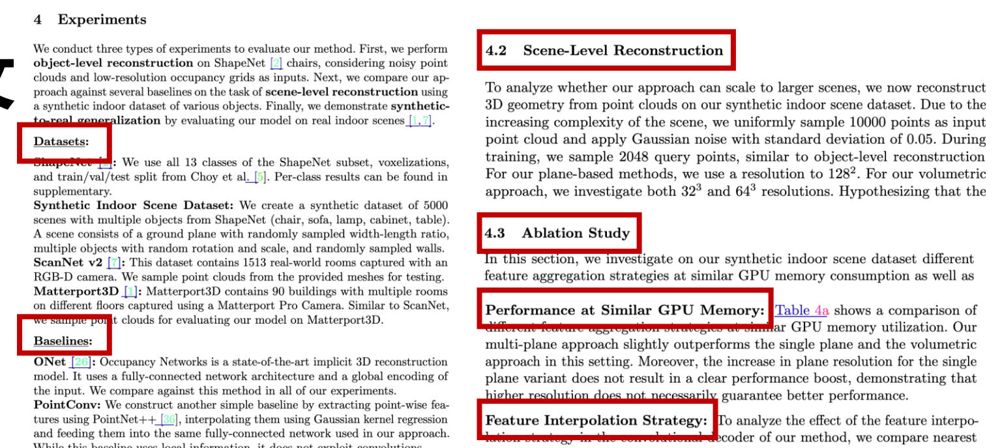

# 论文管理

> 一些问题：
>
> - 离截止日期只剩一周了，我主要的实验有问题还要重新跑，文章也只有个题目？？ 
> - 离截止日期只剩一天了，我的引言和方法怎么还是空的 ？？ 
> - 离截止日期只剩一个小时了，我文章怎么还超了2页？？ 
> - 离截止日期只剩一分钟了，怎么提交的系统宕机了？？ 
> - 离截止日期已经过去了一小时了，哎？？完犊子了，我忘记把合作者的意见删了

论文投稿管理能帮助你赶上截止日期！能大大降低你的投稿的心理和生理压力，送你一个愉快的投稿经历，可以大大提升论文质量，提升中稿概率

核心方法：从粗到细，先列每小节的标题，再每个小节里面列要点，不断迭代完整要点（为每个部分预留多次迭代的时间），最后整合成这一小节的内容

好处： 列要点本身很容易开始，防止拖延、更容易去确认上下文的逻辑、更轻松的和合作者一起迭代、由要点再转化成成段的文字非常容易

## 写作方法

### 第一步：列每小节标题

- Introduction引言一般没有小节
- Related Work：Voxels • Point Clouds • Meshes • Implicit Representations
- Method：Encoder、Decoder • Occupancy Prediction • Training and Inference
- Experiments：Datasets & Baselines & Metrics、Object-Level Reconstruction、Scene-Level Reconstruction、Ablation Study、Reconstruction on Real-World Data

### 第二步：每小节列要点

以Related Work里的Implicit Representations小节为例（Voxels • Point Clouds • Meshes • Implicit Representations）

> 要点之间不需要有逻辑，想到什么写就行了

- 近期工作，开始用网络预测占有场 (Occupancy) 或者符号距离场 (SDF) 
- 另外一些工作开始用局部特征，但是只在二维的图像域上面应用 
- 我们的方法把三维和二维的卷积网络用上 
- 我们方法可以大场景重建 
- 有两个同期的工作，一个只有三维卷积，一个只考虑图形先验

### 第三步：扩充要点填充内容

以Related Work里的Implicit Representations小节为例 

- 近期的隐式表征工作，开始考虑用网络预测占有场(Occupancy) 或者符号距离场 (SDF)
  - 显示表征需要离散化，这会让结果分辨率低以及用更多内存 
  - 他们的连续性可以模型相对复杂的拓扑结构，但是因为使用全局特征，过于平滑了
- 另外一些工作开始用局部特征，但是只在二维的图像域上面应用 • PIFu and DISN 用了像素对准的局部特征来做单个物体的重建 
- 我们的方法把三维和二维的卷积网络用上 
  - 和前面的方法不一样，我们提出了在三维空间汇总局部特征，同时探索了二、三维
  - 这样，我们这个世界中心的表征不受相机位姿和输入的影响 
- 我们方法可以大场景重建，就像在teaser figure里面展示的那样 
- 最后，我们发现有两个同期的工作，一个只考虑三维卷积，一个只考虑图形先验 
  - 一篇工作和我们的区别是他只考虑三维卷积做物体重建，而我们提出了三种方式 
  - 另一篇考虑图形先验，但是他们需要点云的法线作为输入

### 第四步：夯实汇总转化文字

以Related Work里的Implicit Representations小节为例 

> 也可以用大模型来转化文字，但是会带有大模型的写作痕迹，自己取舍

近年来，更为先进的隐式占用和距离场模型使用神经网络，根据任意输入的三维点来推断占用概率或距离值。与之前提到 的需要离散化（例如，按体素、点或顶点的数量）的显式表示不同，隐式模型能够连续地表示形状，并自然地处理复杂的 拓扑结构。隐式模型已被用于从图像中学习隐式表示、编码纹理信息、进行四维重建以及基于基本体元的重建。然而，所 有这些方法都局限于相对简单的单个物体的三维几何形状，无法扩展到更复杂或大规模的场景。主要的限制因素在于其简 单的全连接网络架构，无法整合局部特征或引入如平移等变性等归纳偏置。 

值得注意的例外是 PIFu 和 DISN，它们使用像素对齐的隐式表示来重建穿着衣服的人体或 ShapeNet 对象。虽然这些方 法也利用了卷积操作，但所有的操作都在二维图像域中进行，这限制了这些模型只能接受基于图像的输入并重建单个物体。 相反，在我们的工作中，我们提出了在物理三维空间中聚合特征，利用二维和三维卷积。因此，我们的以世界为中心的表 示与相机视角和输入表示无关。此外，我们展示了如图 1c 所示的场景级隐式三维重建的可行性。 

在同期的工作中，Chibane 等人提出了一个与我们的卷积体积解码器类似的模型。与我们相比，他们只考虑了单一变体的 卷积特征嵌入（三维），对三维点云编码使用了有损离散化，并且仅在单个物体和人体上展示了结果，而非完整的场景。 在另一项同期工作中，Jiang 等人利用形状先验进行场景级隐式三维重建。与我们不同的是，他们使用了三维点法线作为 输入，并且在推理时需要进行优化。

## 论文迭代流程

最后写结论和摘要

## 投稿管理

领导合作者/导师：

- 可以请资深的合作者帮忙写引言和相关工作等章节，画流程图和teaser figure 
- 提前请合作者帮忙一起跑实验 (跑基线方法，跑消融实验，等等） 
- 有策略的寻求帮助：比如问能不能帮忙给某一段或者列的要点提提建议

给自己设置小的截止日期：CVPR的理想投稿时间线（不用熬夜）

1. 投稿一个月前：3-4页左右初稿，需要包含引言和方法列好的要点，一定要有计划好的每一个实验。和合作者/导师讨论一遍这里面的点 
2. 投稿前两周：7-8页左右的比较完整的稿，流程图，teaser figure，实验的图表 都已经有一些初步版本了，可能还欠缺一些实验 
3. 投稿前一周：有一个8-10页的稿，绝大部分实验已经完成，合作者最好已经看 过以及修改了一遍文字和图，之后主要精力就专注打磨文章和图表 
4. 投稿前2-3天：非常完整的终稿，不再跑任何实验，专注文章润色，对于细节修改。导师过最后一遍，投稿，开香槟

> 可以自由探索，找到适合自己的方式。论文撰写尽早开始， 这样也会给你理清思路，更知道论文需要什么实验。

额外的建议：

- 借鉴：精读这个领域之前的几篇你觉得最好的文章，分析他们写作逻辑，列他们文章的要点，分析优劣，模仿 
- 简单文字：避免用大词，如果能用最简单的词就能说清楚的，就够了 
- 视觉吸引力：多花时间在提升文章里面图的质量
- 井井有条：把所有和这个项目相关的材料都组织好

是否建议idea与实验不太完善的文章尝试投稿？

- 如果你觉得文章本身的确有很有意思的发现，可以考虑投一个相关的workshop， 一般workshop都会有4页的投稿，这比较适合。
- 但是如果文章本身暂时还没有太多有意思的东西，个人不建议投稿，这不仅会 浪费审稿人的时间，同时如果还放arXiv的话，也会浪费读的人的时间

## Q&A

方法自认为还有可以改进的地方，我是继续改进呢，还是把继续改进的 点放到下一篇工作？取决于你的“可以改进”的点是不是足够支撑新的文章，或者能让当前文章变得更强。也要看你的时间够不够

在文章投稿出版后，发现文章有错误（不影响模型和结论），应该如何处 理，是否会造成“学术污点”？

- 如果有错误，但是不影响结果和结论的话，请立刻更改论文，并列举修改的所 有东西，然后立刻联系对应的期刊和会议提出更改，然后arXiv也请更新，并在 comment里面加修改了的要点
- 如果是结论有错，那请立即请求撤稿