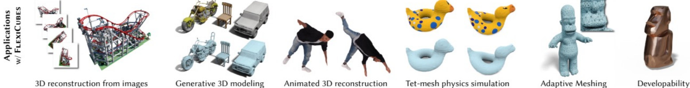

# 论文图表设计

## 技术方案流程图

### 组成元素

什么需要被放到流程图⾥⾯？

- 论⽂的**核心贡献**需要被突出，着重介绍的内容
  - Tips: 写intro的时候就会确定⽅法的核⼼贡献
- ⽅法的核⼼步骤，输⼊输出的对应关系，让读者看明⽩⽅法的整体流程
  - Tips: 利⽤箭头表明输⼊输出的对应关系
- 与论⽂的Method section对应，帮助读者理解⽅法
  - Tips: 图⽚中的每个⼩模块对应着论⽂中解释⽅法时候每⼀个模块

### 一些Tips

把技术⽅案想象成⼀个流程图，如下，错误的例子中左右没有联系。可以通过箭头来表示输⼊与输出在每⼀个模块之间的连接关系

选择适当细节进⾏展示（非核心不画），想想如果这个简化了会不会影响别⼈理解你的⽅法，少即是多

尽量⽤图⽚去展示每⼀部分内容，⽂字只是附带的解释，图⽚胜似千⾔

流程图和论⽂相呼应，不要⽤过多的⾊彩，⼀张图⾥⾯不要有超过三种⾊调

> 论⽂配⾊
>
> - https://colorhunt.co/ 
> - https://jrnold.github.io/ggthemes/reference/tableau_color_pl.html 
> - https://coolors.co/palettes/trending

对⻬⽂字，图⽚，线段，善于 PPT 中的对齐工具

### 绘制方法

从最简单的流程图开始，先画出来轮廓

提升细节 

- 能⽤图⽚的就不⽤⽂字 
- 能删掉的就删掉
- 换更好看的图⽚
  - 背景从⿊⾊变成⽩⾊ 
  - 三维的示意图表示⽹络结构
- 字体，线段，图⽚对⻬

写Caption，解释图⽚，做到读者能够只看这张图+caption理解我们的⽅法

## 片头Teaser图

Teaser是⼤家第⼀眼看到的图⽚，核⼼是需要突出重点，⽅法最核⼼的贡献

- 简洁，清晰，切中要害
- 多⽤图⽚，⽽不是⽂字
- 去掉不必要的部分
- 对⻬与⾊彩
- 重视 Caption

举例：

更好的performance

更难的（新的）任务，新的⽅法能被⽤到更多的场景？把到底在做什么画出来

别⼈不能做的任务？

能不能引起别⼈思考？⽂章的motivation能不能⽤⼀个图⽚来展示？实验那个章节展示了哪些让⼈眼前⼀亮的结果？

也可以是解释具体的任务是什么，把任务的输⼊输出解释清楚

## 实验结果Quantitative图

核⼼依然是需要突出重点，如果⽐别⼈好，好在什么地⽅？突出有提升的地⽅，对它进⾏标亮

⽅法上与别⼈不⼀样, 不⼀样的地⽅在哪？有没有⼀个例⼦能说明我们跟baseline ⽅法上的不⼀样？

把实验结果分类处理 （有条理）对⽐的Baseline是不是可以分成两个类别？

让图⽚变得好看

- ⽤Blender渲染，加阴影 (三维效果），加光 （三维效果）学习使⽤Blender -> Blender的python接⼝ -> 批量渲染
- 调⼀个⾃⼰喜欢的颜⾊，不要⽤超过三种颜⾊

> https://github.com/HTDerekLiu/BlenderToolbox

## 实验结果Qualitative图

让读者看明⽩要展示的内容

- 坐标轴的意义标清楚
- 如果是热量图，记得带上color-bar
- 不同的⽅法标出来legend
- 去掉多余的空⽩的地⽅
- 字体弄⼤⼀点 （matplotlib default⽐较⼩）
- 从 [gallery](https://matplotlib.org/stable/gallery/index.html) 挑一个想要的，改改就拿过来用

## 表格

方法对比表格

实验结果表格

- ⾃⼰先对实验结果进⾏整理
- 让读者看明⽩表格，把最好的结果标亮，[工具](https://github.com/jonbarron/tabilize/blob/main/tabilize.ipynb)
- 让表格美观：使用 \toprule, \middlerule，尽量不要太多竖线，表格整理分类

## 视频设计

特别是图形学相关，做3D相关、视频⽣成的只能通过视频来展示 

突出你想突出的重点

- 3D重建/⽣成效果好：把所有的结果360旋转⼀遍、Swipe between geometry&RGB
- 光照材质预测：旋转lighting，re-lighting
- 实时渲染：录制⼀个视频
- 把结果在时序上展现

> 具体的视频demo查看www.bilibili.com/video/BV1RitTezEa9?p=7