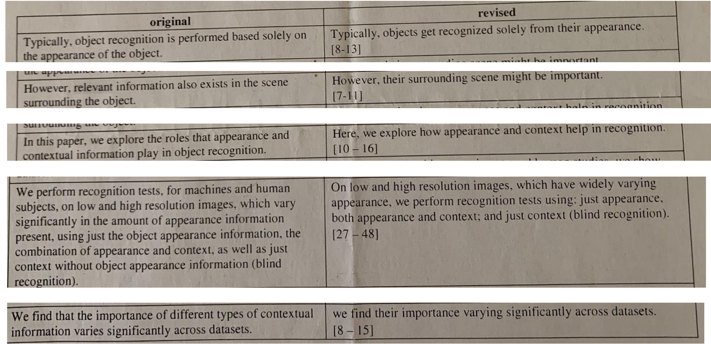

# 论文写作

> 可参考的内容：
>
> - Michael Black: Writing a good scientific paper 
> - Bill Freeman: How to write a good CVPR submission 
> - Fredo Durand: Notes on writing 
> - Devi Parikh: Shortening papers to fit page limits 
> - Jia-Bin Huang: Paper writing tips

复习一下之前的内容，我们已经聊过了：

- 以分层方式迭代论文 （从粗到细，先列每小节的标题，再每个小节里面 列要点，不断迭代完整）
- 梳理文章故事 （目标-问题-解决方案 的循环）我们在解决的问题是什么？ 为什么这个问题很重要？ 之前的方法有哪些，他们有什么问题？ 我们方法核心是什么，有什么是只有我们可以做到的？ 我们（将）获得什么新的认知？
- 论文图表的设计 (流程图，Teaser图，实验结果图，表格，实验结果视频)

## Title

标题是应该是论文核心贡献的浓缩表达

标题可以分为 吸引人和信息详实两种类型。前者让人印象深刻，但后者更为重要

> 什么标题非常吸引人？1%的文章会起一个有趣的名字，注意不要弄巧成拙，哗众取宠
>
> - Build Rome in a Day. ICCV’09 
> - What Makes Paris Look like Paris? SIGGRAPH’12 
> - Seeing the World in a Bag of Chips. CVPR’20 
> - Unbiased Look at Dataset Bias. CVPR’11 
> - Everybody Dance Now. ICCV’19 
> - The Sound of Pixels. ECCV’2018 
> - Where Do People Draw Lines? SIGGRAPH’08 
> - Track Everything Everywhere All at Once. ICCV’23 
> - Segment Anything. ICCV’23

吸引人+信息详实：吸引人可以在缩写词 (acronym) 体现，你的文章也更容易被记住

> - SMPL: A Skinned Multi-Person Linear Model. TOG’15 
> - BAD-SLAM: Bundle Adjusted Direct RGB-D SLAM. CVPR’19 
> - NICE-SLAM: Neural Implicit Scalable Encoding for SLAM. CVPR’22 
> - Are we ready for Autonomous Driving? The KITTI Vision Benchmark Suite. CVPR’12 
> - Nerfies: Deformable Neural Radiance Fields. ICCV’21 
> - Infinite Nature: Perpetual View Generation of Natural Scenes from a Single Image. ICCV’21 
> - No Pose, No Problem: Surprisingly Simple 3D Gaussian Splats from Sparse Unposed Images.

- 不要选不好念的缩写词，记不住
- 可以尝试一些网站，比如acronymify.com，或者使用LLM帮助生成
- 如果工作不强，不要选一些已经有意义的词，如果 transformer 不火的话，现在搜出来的结果大概率是变形金刚

## Abstract

摘要是引言的精炼版本，核心为 目标 – 问题 – 解决方案

- 我们在解决的问题是什么？ 
- 为什么这个问题很重要？ 
- 之前的方法有哪些，他们有什么问题？ 
- 我们方法核心是什么，有什么是只有我们可以做到的？ 

好模板：来自于: Writing a good scientific paper, Michael Black

```
_____ is widely used in computer vision and has applications in ____.
Recent work has addressed this problem by _____ .
Unfortunately, all of these approaches _________.
In contrast, we do something different (insert nugget of an idea).
This fixes ___, however, it does not solve ___.
Consequently, we develop a novel ____.
While promising, ___ is non-trivial.
Therefore, we further do something ____.
We evaluate ___ qualitatively and quantitatively on ___ and find that it is more accurate than the state of the art.
(Code and data will be available for research purposes.)
```

## Method

考虑你的读者：你当然理解你的故事，但是不了解这个领域的TA们能理解吗？目标是让读者容易读和理解，所以方法的flow非常重要，宏观上，还是要先梳理好故事

- 仔细检查方法中每句话的动机是否是清楚的。让读者时刻清楚一件事：为什么要 执行这句话中的“内容”
- 仔细检查保证句子之间是否是flow的
- 文本-公式-图形的循环呈现有助于论文的流畅性和节奏感

可以参考的方法

1. 整体：画流程图的草图 
2. 串联：组织章节之间的写作思路：方法的每一个章节对应一个模块 
3. 细化：组织章节内每一个module的写作思路 
   - 和上文串联 
   - 为什么我需要这个module (motivation) 
   - 我们是怎么做的 (how)

## Conclusion

不要等到最后一刻才写结论

结论应该简洁地回顾关键洞察和结果。与摘要不同的是，结论可以稍微深入分析 结果，因为此时读者已经阅读了全文并了解了细节。

未来工作 (Future Work): 努力不让导致审稿人认为我们试图“占据”整个研究 领域。因此，要找到一个平衡点。可以将你的局限性 (Limitation) 表述为未来工作，这样可以展示尽管当前有局限 性，但解决这些问题有明确的实践路径。这种写法既承认问题，又展现了积极进 取的态度

## Bibliography

按数字顺序排列：例如 [3, 9, 23, 64]，而不是 [23, 9, 64, 3]。虽然这看似细节， 但对读者更方便，并且能展示你对细节的关注

> 直接用 `\usepackage[numbers,sort,compress]{natbib}`

引用质量：避免遗漏重要的相关工作

- 引用最新且权威的版本：例如，如果一篇论文发表在 CVPR，不应该引 arXiv 版本
- 引用的格式保持一致

## Proofreading

一篇好的论文通常会经过多次校对，由多个人完成

- 逐字校对。 阅读标题、图注、每一个公式和每一个词，直到你对它厌倦为止。这 很难，需要自律
- 以审稿人的视角阅读。 假装自己第一次看到论文，完全不了解任何背景知识：不 懂缩写，不懂数学公式，也不熟悉相关文献。以审稿人的眼光批判性地阅读。这 同样需要练习和耐心
- 同实验室的同学可以互相看

认真完成这些步骤，你的论文会更清晰、完整，并能更好地通过审稿人的考验。

## Supplementary Material

所有不能很简洁描述就放在正文的：完整的表格数据、更多的可视化结果、推导的完整步骤、实现细节

补充材料

- 兑现论文中提到的内容：确保补充材料中包含论文中承诺提供的细节或内容
- 努力和论文一样精致：如果粗制滥造，读者会以此判断你的整体工作质量
- 简洁明了：读者只会花很少的时间看补充材料，因此内容应短小精悍，清晰易懂
- 添加更多结果展示：包括未经过滤的结果图像，也应该展示失败案例

补充视频（CV方向）：审稿人很可能先看视频，因此首印象非常重要

- 任何文章我都建议要有视频，因为是一个非常好的故事讲述工具
- 事实上，比起论文，会有更多的人观看你的视频
- 不要把视频当成最后时刻赶出来的结果集合。比起论文，会有更多的人观看你的视频

> 以 Jon Barron 的 [mip-NeRF](https://www.youtube.com/watch?v=EpH175PY1A0) 视频为例 （MJB称这个视频effectively perfect）
>
> 1. 他教了文章的主要idea， 清楚地解释了概念 
> 2. 他没有复制论文结构，而是独立讲述故事 
> 3. 通过动态演示将复杂概念形象化，
>    1. 5:29左右: 动态演示 Positional Encoding 
>    2. 6:07左右：通过逐步展示方法结果，增加了叙事的悬念和趣味性。 
> 4. 配音：语音讲解比让观众自己阅读文字好得多 (很多AI现在已经非常好）

## 精炼语言

在会议截止日期临近时，论文往往会超出页数限制

大多数人都会优先考虑删除内容（或移到补充材料中），或者使用 `\vspace{}`, 而不是尝试用更少的词来表达相同的内容，实际上，有大量内容明明可以用简洁的语言，却被很冗长的句子所占据了，读起来不得劲

大词感觉好像更正式，但是我个人觉得越简单越清楚越好

> ref：Twitter: How to write clear and concise sentences? Jia-Bin Huang
>
> - utilize ➡ use 
> - initiate ➡ begin
> - terminate ➡ end 
> - ascertain ➡ find out 
> - constitute ➡ make up
> - disintegrate ➡ break down

删去不必要的词 (Needless Word)

> - at the time when ➡ when 
> - owing to the fact that ➡ since 
> - in spite of the fact that ➡ though 
> - the reason why is that ➡ because 
> - this is a subject that ➡ this subject 
> - the question as to whether or not ➡ whether



ref:  Shortening papers to fit page limits. Devi Parikh

## AI辅助写作

请仔细查看会议的要求！！如果不允许使用AI来帮助写作或者审稿，请别用！

AI写作一般都会有一些特定的风格，母语者非常容易就看出来，这样很容易印象不好。同时AI时长会生成不真实的内容，比如引用，所以谨慎使用！

但是AI基本能保证语法和单词是正确的，所以至少可以用来润色一下

copilot 可以通过注释写代码，同样的，也可以通过注释来扩充大纲

copilot给出来的词汇不一定准确， 用LLM来润色

LLM很适合去帮理清你的要点

借助LLM对写作思路进行改进：

1. 编码：将raw text转换为high-level写作思路 
2. 在思路上分析：回答以下两个问题，以期找到思路逻辑的不合理之处： 
   - 该思路是否体现了想表达的内容？ 
   - 思路逻辑是否流畅？ 
3. 在思路上改进：针对不合理之处，修改思路 
4. 解码：将high-level写作思路转为raw text

## 其他建议

写一个“糟糕的初稿”，越早越好 （甚至啥结果没有的时候可以写引言）

所有优秀的论文一开始都是糟糕的，打磨很重要

避免缩写 （ don‘t应写成 do not），不能用感叹号

避免过度夸大 (To the best of our know, we are the first…可能令人反感)

不要低估自己的贡献，务必清晰地陈述你的创新点, 不要撒谎！

务实：从现有内容找闪光点，并努力发挥它价值，讲好一个小故事

借鉴：学习最好的文章，分析他们写作逻辑，分析优劣，模仿
