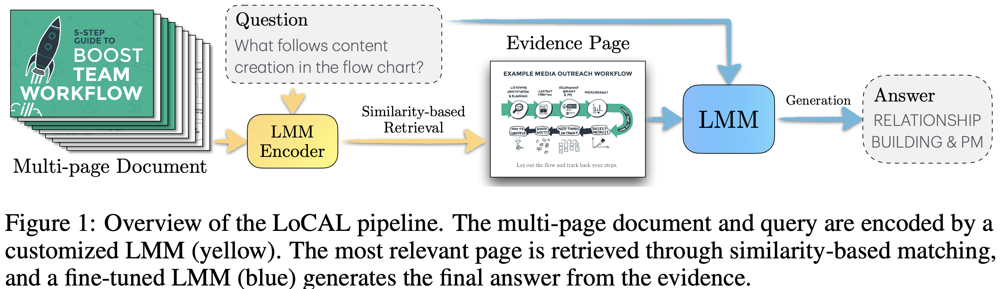
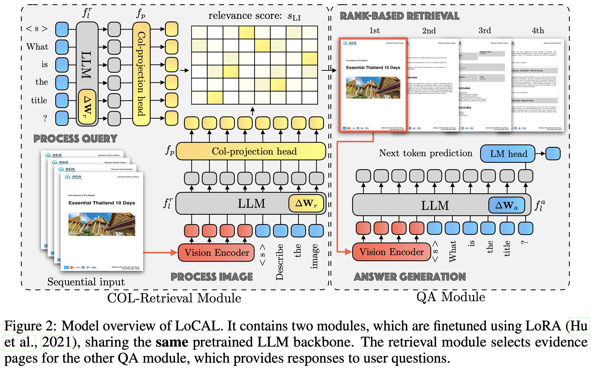
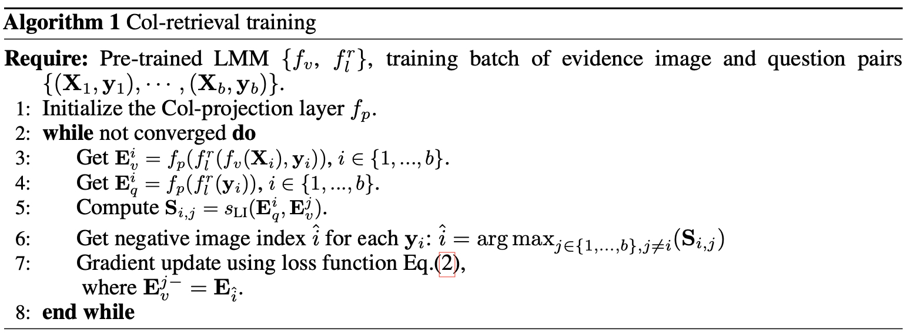
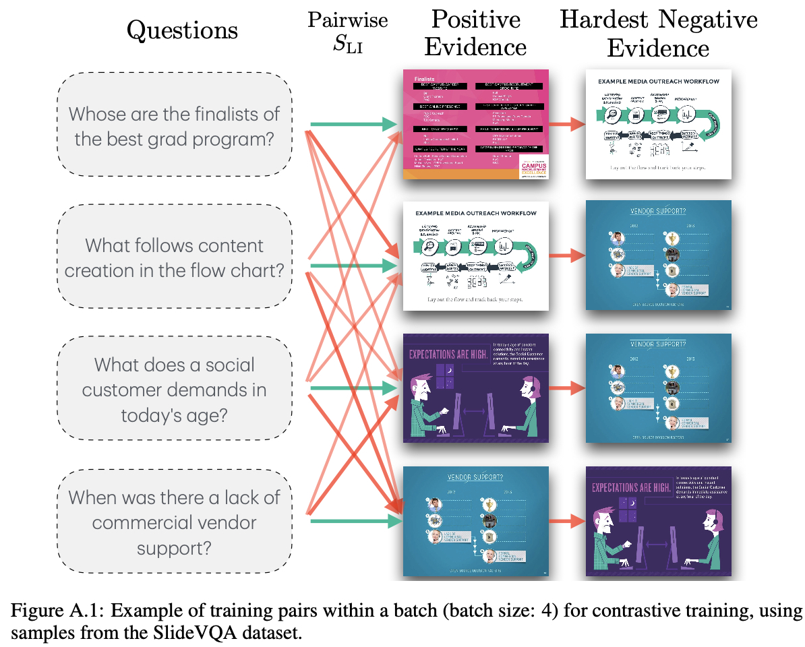
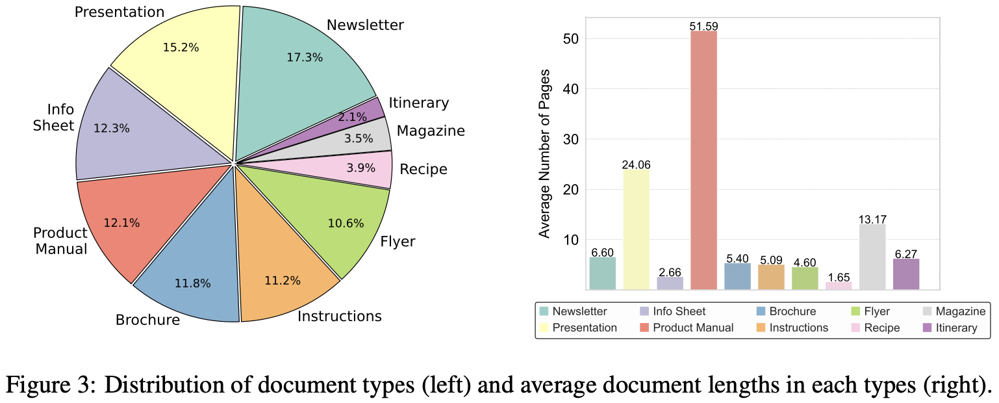
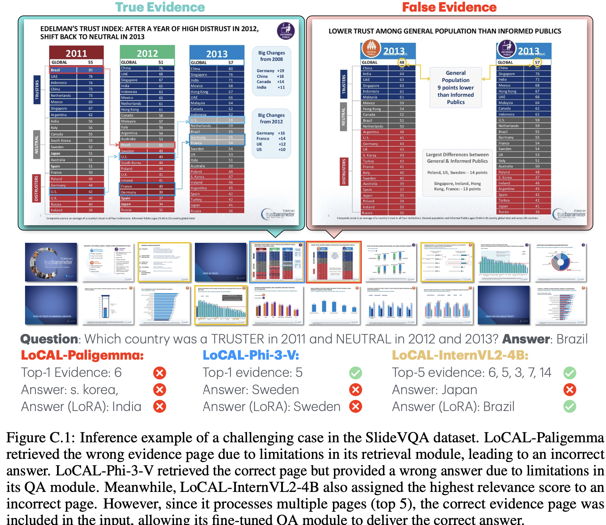
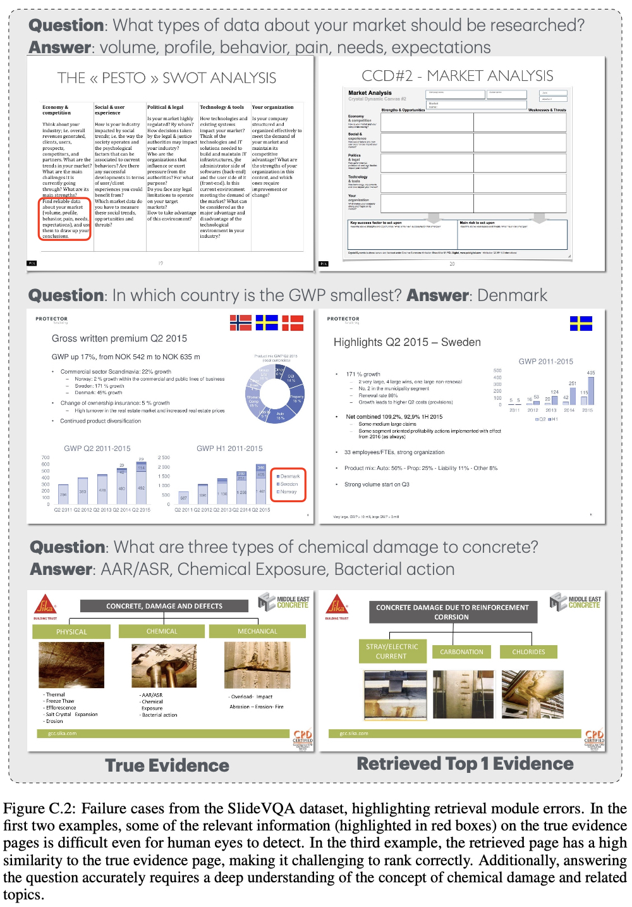
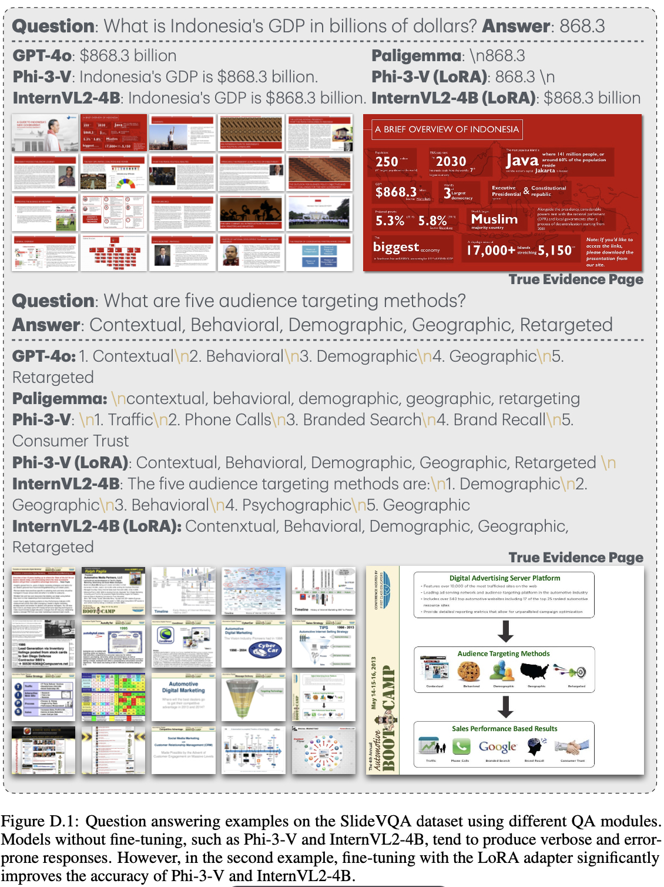

# LoCAL

LORA-CONTEXTUALIZING ADAPTATION OF LARGE MULTIMODAL MODELS FOR LONG DOCUMENT UNDERSTANDING：使用LoRA-上下文适配大型多模态模型，用于长文档理解

大型多模态模型在单页文档任务中的表现突出。在实际应用中，数十或数百页的文档对LMM提出了新的挑战

- 一种方法是利用经典的文档解析器提取信息并为LLM生成 prompt ，这很难在prompt中恢复布局，并且会受到文档解析器性能退化的影响
- 另一种方法是利用大型模型的长上下文窗口，允许它们一次处理多个页面。然而，大部分输入页面与用户请求无关，当文档包含数百页时效率将会降低

不同于使用经典的文档解析器，我们提出使用LMM作为信息编码器，获得每个页面的嵌入后，我们进一步利用上下文相关的后期交互进行相关性评分，然后从数百个页面中选择top-k页并提供给LMM回答用户关于文档的问题

我们的贡献可以总结如下:

- 使用中间LMM隐藏嵌入进行高效的基于问题的页面检索
- 通过双LoRA适配器对LMM进行微调，用于页面检索和问题回答，使LoCAL对页面边缘友好，具有极高的内存效率
- 收集了一个视觉丰富的文档QA数据集LoCAL-bench，包括杂志、传单、通讯录、产品手册和演示文稿等九个领域。该数据集建立在网页爬虫文档上，包含226份文件和471对问题答案
- 效果好

## 方法

检索器Col-Retrieval模块基于在ColPali中介绍的方法，我们使用一个修改后的大型多模态模型进行检索，包含：

- 视觉编码器 $$f_v$$
- LLM $$f_l^r$$
- Col投影层 $$f_p$$

过程：

1. 我们将一个 n 页的文档视为一系列图片 $$\mathbf{X} = \{\mathbf{x}_1, \mathbf{x}_2, \ldots, \mathbf{x}_n\}$$ ，对于输入图像，视觉编码器计算一系列视觉嵌入 $$f_v(\mathbf{X})$$
2. 然后与来自固定文本prompt：“\nDescribe the image.” 的token嵌入 $$\mathbf{y}_v$$ 结合
3. 结合后的嵌入喂给 LLM，得到最后一隐藏状态
4. 投影层 $$f_p$$ 将LLM的最后一隐藏状态转换为低维特征空间，产生特征序列 $$\mathbf{E}_v = f_p(f_l^r(f_v(\mathbf{X}), \mathbf{y}_v))$$ 
5. 对于输入问题q，首先通过模板增强为 $$\mathbf{y}_q$$，然后经过类似处理得到 $$\mathbf{E}_q = f_p(f_l^r( \mathbf{y}_q))$$
6. 计算特征序列之间的后期交互分数作为相关性 $$s_{\text{LI}}(\mathbf{E}_v,\mathbf{E}_q)$$，找到相关页面
7. 问答模块使用类似于经典LLaVA的架构，利用视觉编码器 计算视觉嵌入，并将其与 token 嵌入结合并由LLM 处理。然后，LLM通过下一个单词预测生成文本答案

事实上，不一定要使用最后一隐藏状态来作为低维特征空间，在之后的消融实验中，第21层的隐藏状态具有最高的准确性。特别是，在推理期间使用早期层的隐藏状态可以显著降低计算成本，从而实现更快的检索。

传统的做法是从解析步骤开始提取文档中的内容元素，如图片、表格和表单，然后使用LLMs生成答案。在这里，我们首先考虑使用LMM来处理这个任务，并避免了基于规则的文档解析过程，就是将每个页面直接转换成一张图片

在流程中，我们利用上下文化的后期交互技术（contextualized late interaction, Col）来计算证据检索的关联分数。与传统的单向编码器（CLIP）不同，Col 技术引入了一个序列间相似度指标称为后期交互得分，它捕获了更精细的问题图像相关性。长度为n 的文本特征序列 $$\mathbf{E}_q= \{\mathbf{e}_{q_1},\mathbf{e}_{q_2},...\mathbf{e}_{q_n}\}$$ 和长度为m 的视觉特征序列 $$\mathbf{E}_v= \{\mathbf{e}_{v_1},\mathbf{e}_{v_2},...\mathbf{e}_{v_m}\}$$ 之间的后期交互得分定义如下：
$$
s_{\text{LI}}(\mathbf{E}_q, \mathbf{E}_v) = \sum_{i=1}^{n} \max_{j \in \{1, \ldots, m\}} \mathbf{e}_{qi} \cdot \mathbf{e}_{vj}^T
$$
我们训练检索模块，最大化问题与相关图像之间的晚期交互得分（作为相似度分数），将这些视为正样本。然后，将最相似但未关联的图像形成最难的负样本，并最小化其得分，损失函数和算法过程如下
$$
\mathcal{L} = \log(1 + \exp(s_{\text{LI}}(\mathbf{E}_q, \mathbf{E}_v^-) - s_{\text{LI}}(\mathbf{E}_q, \mathbf{E}_v^+)))
$$

正负样本的例子如下：

为了减少内存使用，我们在检索部分和问答部分共享一个LLM。为了适应每个模块的不同任务要求，我们使用LoRA方法向 $$f_l$$ 中插入了两种适配器集，检索模块为 $$\Delta \mathbf{W}_r$$，问答模块为$$\Delta \mathbf{W}_a$$。这样，我们可以使用单个LLM和视觉编码器支持两种任务，并且仅增加约2％的额外参数

## 数据集

从网络上爬取了约4000个PDF文件，并通过文档解析器提取这些文档的内容，只保留包含图表的文档。

我们使用预训练的CLIP模型ViT-L/14-336对提取的图表进行分类，并保留其中的6种图表，包括表格、地图、图表、信息图、数据图表、工作流程和屏幕截图（其他的一些图表，例如徽标和横幅，信息量较少，舍弃了）并标注了文档类型。

文档解析器以JSON格式返回所有文档元素，并将图像单独保存为图像文件。我们检索文档的JSON文件，以获取每个图像上下文。然后我们将图像与其上下文结合在一起，并使用GPT-4o生成问答对。

为了确保生成的质量，我们仅向GPT-4o提供图像，并询问其生成的问题；如果GPT-4o能够正确回答它，则我们会保留该问答对在LoCAL Bench中。

最终，LoCAL-Bench包含226个文档和471个验证的问答对，分布如下：

## 实验

训练部分，我们尝试了使用PaliGemma、Phi-3-V、nternVL2-4B 作为检索和问答模块的主干LMM。我们遵循第双适配器设计来调整检索和问答两个模块。我们使用ColPali的原始训练数据、DocMatix-IR、PFL-DocVQA来训练Col检索模块。我们使用SlideVQA 数据集的训练集进行QA 模块的微调，SlideVQA 数据集包含1,919张幻灯片训练集，400张测试集，300张开发集，每张幻灯片由20页组成。训练集包含10,290个样本。所有实验均使用PyTorch实现并在Nvidia A100 GPU上运行。Col-retrieval模块通过使用AdamW优化器和LoRA适配器对所有线性层进行微调，在一个批次大小为32、学习率为5e-5的4个epoch中进行训练。LoRA rank 设置为32

评估数据集包括SlideVQA、MMLongBench-Doc、DocVQA、DUDE以及我们提出的LoCAL-Bench数据集。两种设置：single-evidence (SP) 和 cross-evidence (MP) ，即问题需要长文档中的单个页面还是多个页面回答。我们使用几个关键指标来评估模型在证据检索和问题回答方面的性能：Top-k Accuracy,  Exact Match (EM) ,  Generalized Accuracy (G-Acc) ,  Average Normalized Levenshtein Similarity (ANLS)  和  Partial Normalized Levenshtein Similarity (PNLS)

> - Top-k准确度 ：衡量了正确的证据图像在前k个最相似的图像中出现的比例
> - 精确匹配：允许大小写不敏感和额外空格。对于微调模型而言，该指标非常有效；但对于大型语言模型的响应来说，这个指标就不太合适了，因为它们通常包含完整的句子。因此，带有额外上下文的正确答案可能会被不公平地惩罚
> - Generalized Accuracy ：一种基于规则的评估协议，该协议依赖于GPT。模型响应使用GPT-4o进行简化，并根据答案类型特定规则进行评分。然而，G-Acc有两个局限性：它引入了来自GPT随机输出的随机性，并且依赖于答案类型的注释，限制了其在数据集之间的适用性
> - ANLS：使用Levenshtein距离来衡量预测文本和真实文本之间的相似性，通过较长字符串的长度进行标准化。它输出一个介于0到1之间的相似分数。ANLS允许不匹配、插入和删除，使其在不需要精确匹配的OCR和文档理解任务中非常有用
> - PNLS：通过不惩罚额外的前缀或后缀，并允许匹配区域内的错误、插入和删除，扩展了ANLS。这使得它更适合评估LLM响应，这些响应会为了改善用户体验偏长

我们的模型表现很好，分析如下：

- LMM的主要问题是长文档被转换为过长的视觉 token 序列，导致显著的内存负担。在MMLongBench-Doc和DocVQA等数据集上，一些文档超过数百页，即使在配备有8个A100（80GB）GPU的服务器上也会出现内存不足错误
- 相对于只使用top1页面，使用前五个页面效果提升，可能是因为检索精度得到改善，这对于较长文档来说更为重要
- 微调主要增强了模型的关注度和答案格式化，提高回答性能，但可能会损害LLM的一般性
- 随着证据页面数量的增加，QA模块的内存消耗也随之增加，当使用A100 GPU时，图片（1024×768）数量达到13张时，超过了80GB的限制，导致出错。相比之下，检索模块的内存使用量保持较低水平，在页检索过程中，LoCAL独立处理页，其内存成本相当于单页推理。具有可扩展性

## case分析

如下是SlideVQA数据集中一个具有挑战性的推理示例。LoCAL-Paligemma由于其检索模块的局限性，检索到了错误的证据页，导致答案错误。LoCAL-Phi-3-V虽然检索到了正确的页面，但因其问答模块的限制，给出了错误的答案。同时，LoCAL-InternVL2-4B也将最高相关性分配给了错误的页面。然而，由于它处理多个页面（前5个），因此正确的证据页被包含在输入中，使得其微调的问答模块能够提供正确答案。

------

如下是来自SlideVQA数据集的失败案例，突出了检索模块的错误。在前两个例子中，真实证据页上的部分相关信息（用红框标出）即使对人眼来说也很难检测到。在第三个例子中，检索到的页面与真实证据页非常相似，使得正确排序变得具有挑战性。此外，要准确回答问题，需要对化学损伤及相关主题有深入理解

------

如下是在SlideVQA数据集上使用不同问答模块的示例。未经过微调的模型，如Phi-3-V和InternVL2-4B，往往会产生冗长且易出错的回答。然而，在第二个示例中，使用LoRA适配器进行微调显著提高了Phi-3-V和InternVL2-4B的准确性。

