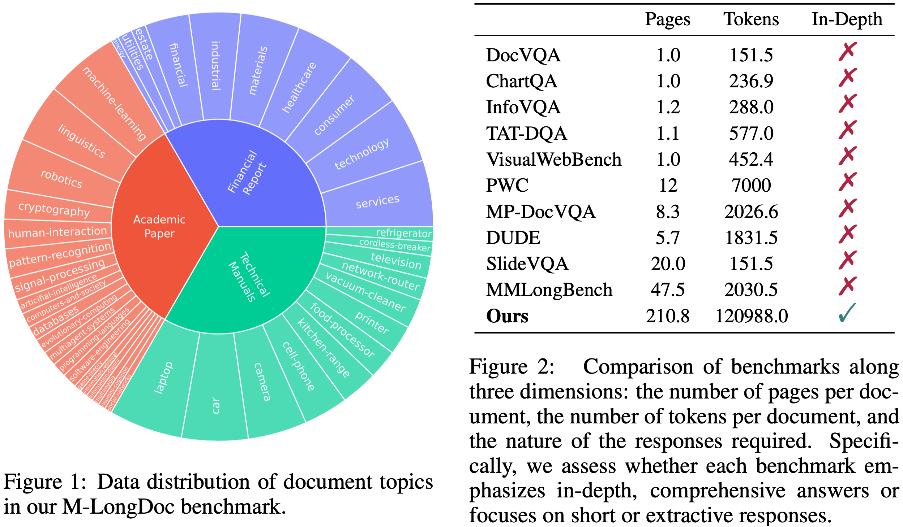
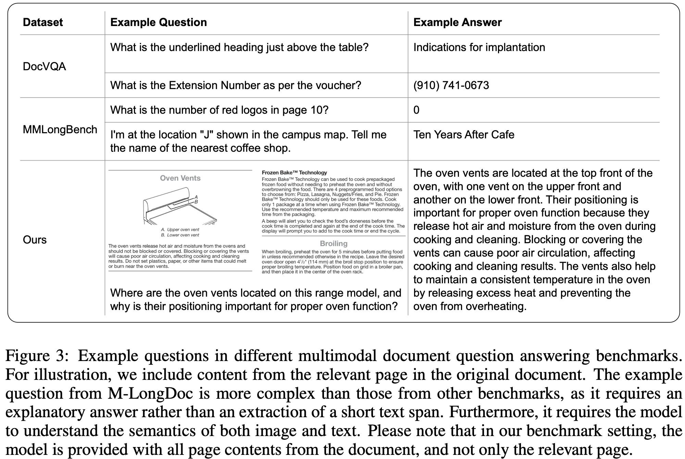
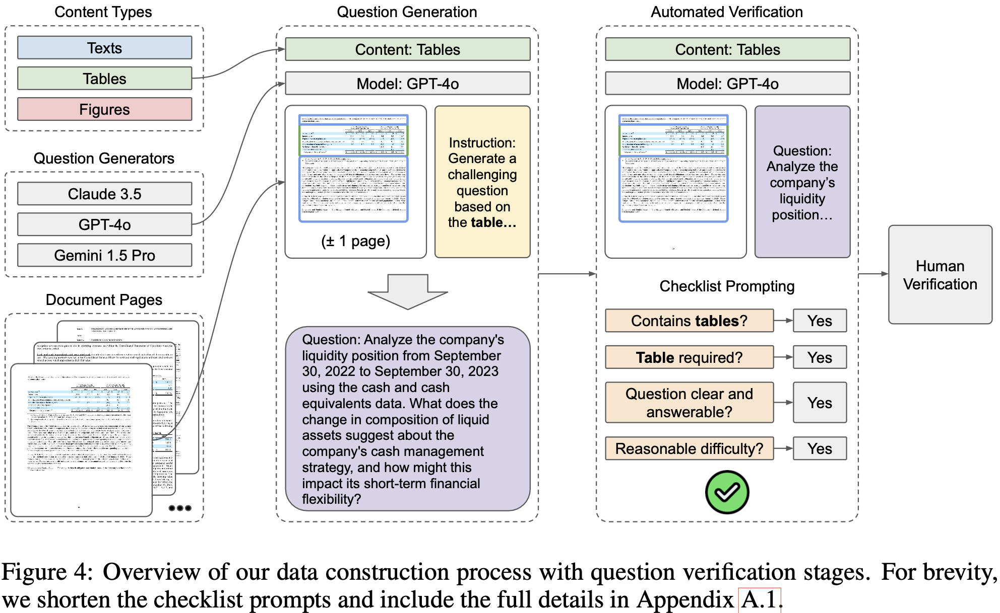
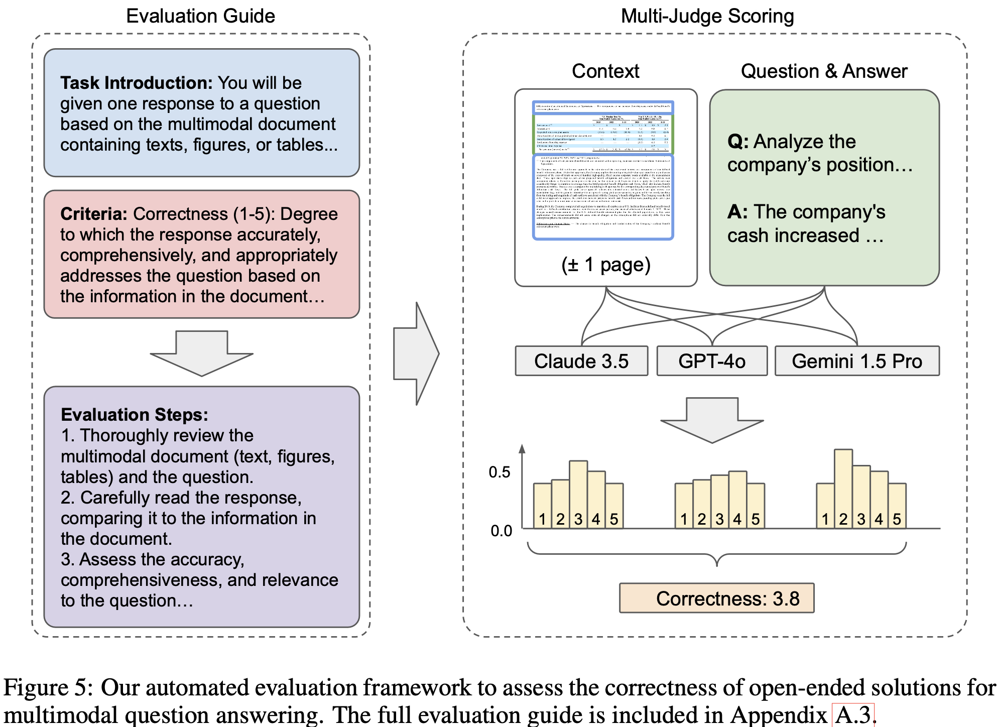
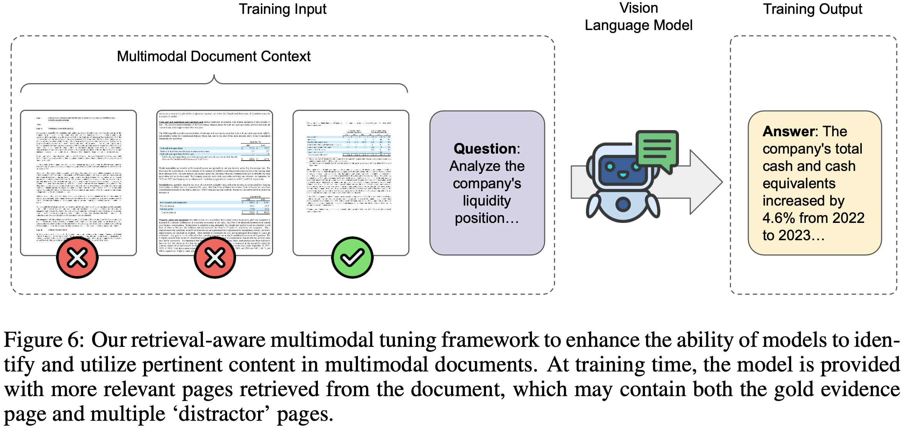
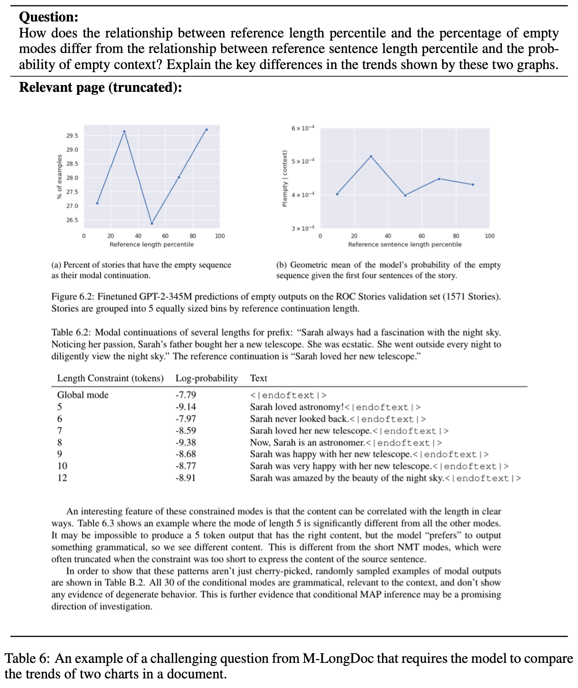
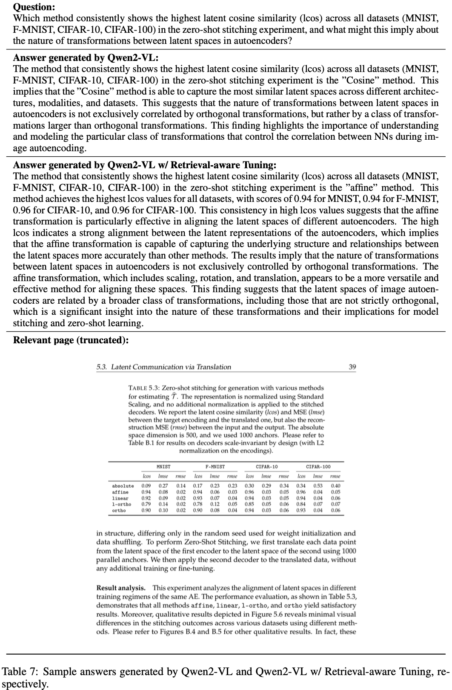

# M-LongDoc

A BENCHMARK FOR MULTIMODAL SUPER-LONG DOCUMENT UNDERSTANDING AND A RETRIEVAL-AWARE TUNING FRAMEWORK 一种多模态超长文档理解基准和检索意识的调优框架

理解长而复杂的多模态文档很重要。现实世界的文档往往面临重大挑战，包含文字、图表、表格等各种形式的信息。然而，传统的基准中，文档少于50页，并仅限于基于提取的问题





为了应对这些限制，我们引入了M-LongDoc，这是一个由851个样本组成的全面基准测试，专门设计用于评估大型多模态模型在长而多样文档上的性能。

- 问题是基于平均超过200页的非常长的文档
- 盖了学术、金融和产品领域，在每个领域都有多个主题
- 超越了简单的提取式问题，要求模型提供开放式的解决方案，展示对文档内容的深入理解 

另一个需要克服的挑战是，由于多模态文档的内容冗长和深入解决方案，开放式问题回答任务的评估变得棘手。为了以可扩展且标准化的方式评估此类开放式解决方案，我们设计了一个不需要参考答案或人工注释的自动化评价框架，用详细的评价指南以及多个评判模型来评分每个生成方案的正确性。

模型很容易被文档页面中的无关内容所分散注意力，即使使用检索增强生成也是如此，并且处理图表问题时比文本问题更困难。为了克服问题，我们提出了一种针对多模态文档阅读的检索感知微调方法。该框架通过将其他模态和页面中与当前查询无关的内容纳入每个文档来统一监督微调和检索增强生成。因此，我们的模型能够有效地整合多模态文档中的领域知识，同时忽略与给定查询无关的内容。与其他现有的训练方法相比，这是第一个解决丰富文档布局的检索增强多模态训练的方法。为了支持这个训练框架以及开源模型的改进，我们进一步构建了一个包含10,070个样本的问题回答训练集。

## benchmark

### 数据来源

我们在学术、金融和产品领域分别获取研究论文 、公司报告和产品操作手册，涵盖多种文档格式和领域。由于研究论文通常需要专业知识，我们限制学术领域的主题为计算机科学。

为了减少评估现有模型时的数据污染或记忆风险，我们将文档的发布时间限制在 2024 年 1 月之后

我们使用 PyMuPDF 工具自动从每一页中提取文本，为了从每页中提取图表和表格，我们利用了一个现有的对象检测模型。因此，经过处理的文档包含交错的文字和视觉内容，其中视觉内容是提取自图表和表的图片。

### 问题生成



我们利用了一个半自动管道构建问题，如上图。

1. 在给定特定内容类别后，首先从包含该特定内容类别的文档中随机选择一页，例如文本、表格或图表
2. 从一组领先的多模态模型池中随机选择一个问答生成器，并指示它根据文档页面生成具有挑战性的问题，为确保问答生成器有足够的上下文信息，我们在问答生成过程中还提供上一页和下一页作为额外输入
3. 为了提高生成问题的质量，我们进行了一次自动验证过程作为初步筛选不适合的问题，遵循多步骤的检查清单来验证该问题
4. 最后，我们使用一个由注释者组成的团队对每个问题进行最终验证。在学术领域，我们聘请了计算机科学专业的博士生以上的专家注释员；而在金融和产品领域，我们则聘请了专业注释员。为保持一致，我们在自动化验证阶段提供类似的检查表和说明

第三、四步的具体检查清单如下，{category}指的是表格、图表或文本

```
1. Does the content contain any {category}? 
2. Does the question require information from the {category}? 
3. Is the question clear and answerable based on the {category}? 
4. Is the question of reasonable difficulty and answer cannot be simply copied?
```

们发现有80.1％的生成问题通过了自动化验证。在这其中，通过自动化验证的问题中又有80.9％也通过了人类验证。因此，我们只保留了同时满足自动化和人类验证的851个问题

### 自动评估

鉴于我们多模态长文档基准的挑战性，拥有可扩展和标准化的评估方法至关重要。然而，由于劳动力成本高且缺乏可重复性，全面的人工评价不太可行。

我们提出一个基于多个多模态裁判员委员会的评估框架。具体来说，我们利用多个领先的多模态模型根据正确性的标准对每个问题的答案进行评分。guide如下

```
You will be given one response to a question based on a multimodal document containing texts, figures, or tables.
Your task is to rate the response on correctness using a 1-5 scale. Please read and understand these instructions carefully, and keep them open for reference while reviewing.
Correctness (1-5) refers to how accurately, comprehensively, and appropriately the response addresses the question based on the information in the document.
5 - Fully Correct: Completely accurate, comprehensive, fully integrates relevant information from all parts of the document, and provides a coherent answer.
4 - Mostly Correct: Largely accurate with only minor errors or omissions, addresses most main points, and integrates information well.
3 - Partially Correct: Contains a mix of accurate and inaccurate information, addresses some key points but misses others, and partially integrates information.
2 - Mostly Incorrect: Has multiple inaccuracies, addresses only a small portion correctly, and shows minimal integration of information.
1 - Completely Incorrect: Contains significant errors, is irrelevant, or fails to address the question based on the document.
Evaluation Steps: 1. Thoroughly review the multimodal document and question. 2. Carefully read the response, comparing it to the document information. 3. Assess the response’s accuracy, comprehensiveness, and relevance. 4. Assign a correctness score from 1 to 5 based on the criteria.
Question: question Response: answer
Evaluation Form (score only without explanation) Correctness:
```



为了提供更可靠的评估并减少模型内部偏见，我们利用多个评审员对每个候选答案进行评估。具体来说，每个评审员模型 $$M_j$$ 都会获得评价指南 g、真实evidence页面作为上下文 c、问题 q 和候选答案 $$\hat{a}$$，并被指示为从 1 到 5 分配一个正确性分数。然而，即使使用相同的评审员模型和输入，输出分数也有差异。因此，我们从每个评审员模型 $$M_j$$ 中采样多个分数并将这些分数汇总以获取一种精细粒度且连续的评分，这种评分更好地反映了候选答案的质量：
$$
\text{Score} = \frac{1}{J \cdot K} \sum_{j=1}^{J} \sum_{k=1}^{K} s_{j,k} \sim M_j(g, c, q, \hat{a})
$$
其中J = 3是裁判模型的数量，K = 5是每个裁判模型的采样分数数量。尽管我们的框架可能在一定程度上具有主观性，但后续部分的分析表明它与人类偏好基本一致且偏差较小。因此，我们认为该自动评估框架可靠且更具可扩展性

### 初步实验结果

为了研究现有模型的局限性，我们对来自我们的M-LongDoc基准测试集的一个子集（100个随机样本）进行了初步研究。具体来说，我们选择Gemini和Qwen2-VL ，ColPali作为最先进的多模态检索器，并利用多模态内容的前k页作为上下文。

- 在图和表格的基础上提出的问题的性能明显低于文本问题
- 增加检索的内容量不一定能提高整体性能，并且可能会导致更差的表现或内存不足 (OOM) 的问题，这表明现有的多模态生成器模型很容易被较长上下文中的无关内容所分散注意力

## 多模态检索感知微调

RETRIEVAL-AWARE MULTIMODAL TUNING



我们提出了一种简单有效的检索感知多模态文档微调方法，在训练过程中包括了来自真实证据页面以及可能不相关的页面的检索上下文。如上图所示，我们的方法呈现了一个更现实且与测试时多模态内容检索面临的挑战相似的训练范式。因此，模型学会了处理潜在的嘈杂检索上下文，并提高了其文本理解和视觉感知能力以利用最相关文档的内容。

使用benchmark相同的问题生成 pipeline，构建了包含300个文档的10,070个样本的训练语料库，并且使用各自的问答生成模型也根据每个地面真实证据页面产生高质量的答案。

对于所有模型，我们使用温度T = 0的贪婪解码来减少方差。在我们的训练框架中，我们将训练轮数设置为1，批处理大小设置为16，并将学习率设置为1e-4。为了降低由于计算资源有限而导致的培训成本，我们利用LoRA 的训练方法进行训练，其中秩为64和alpha为32。由于与其他开源模型的训练不稳定性，我们主要关注Qwen2-VL-7B-Instruct 模型的训练实验，该模型与相似大小的模型相比表现出领先性能

- 效果好
- 开源模型在回答表格相关的问题时表现较差。这种差异强调了增强表格理解能力的需要
- 对于基于文本的问题，当移除图像输入时，性能略有增加，表明图像可能会在罕见情况下误导模型。然而，我们认为这是可以接受的，因为在实践中，问题可能涵盖各种各样的多模态内容
- 仅使用渲染页面图像作为输入而不是分别提取文本、图表和图表可能是不理想的。虽然渲染页面图像确实包含了原始文档信息和布局，包括文本、图表和图表，但模型可能无法区分文本和图表之间的内容

## Case 分析

下图是 M-LongDoc 指标中一个具有挑战性的问题的例子。测试模型识别和分析不同图表中的趋势，并进行比较的能力。



下图显示了M-LongDoc中的一个示例问题，以及由Qwen2-VL和Qwen2-VL（微调）生成的答案。

- Qwen2-VL生成的回答表示，余弦方法在所有数据集上始终显示出最高的潜在余弦相似性，这是错误的。事实上，零样本缝合实验并未涉及余弦方法。看来Qwen2-VL可能被其他地方出现的关键字“余弦”误导
- Qwen2-VL （微调）生成的答案正确地识别出，在所有数据集中，仿射方法始终获得最高的潜在余弦相似性（lcos）。这表明我们的检索意识调整方法能够提高模型理解检索上下文的能力的有效性。


