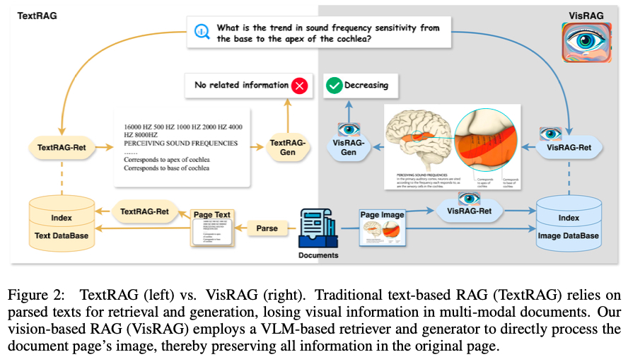
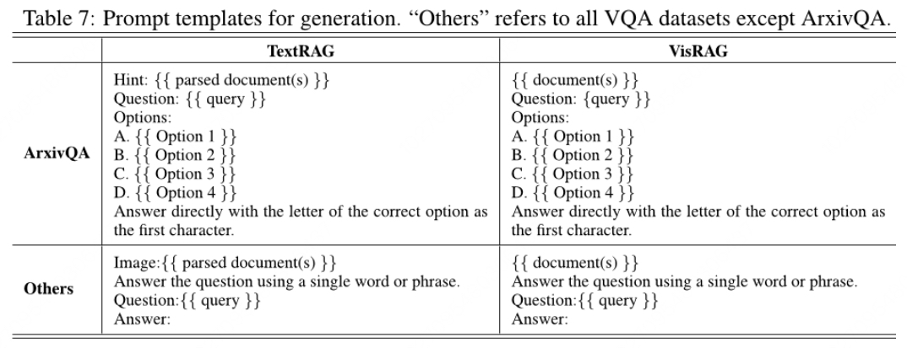
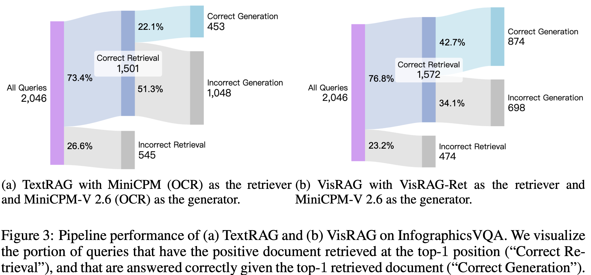
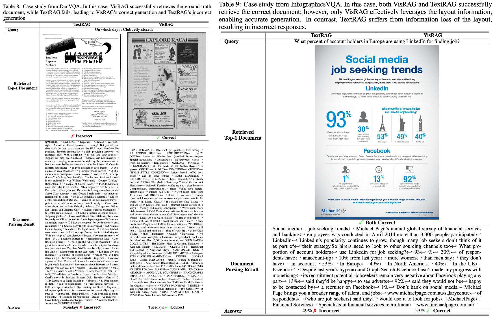

# VisRAG

> 基于视觉的多模态文档检索增强生成
>
> - https://arxiv.org/abs/2410.10594
> - https://github.com/openbmb/visrag

当前，RAG 仅基于文本，无法利用像布局和图像这样的视觉信息，但这重要，通过建立一个基于视觉-语言模型（VLM）的 RAG 流程来解决这个问题。

传统的 RAG 以分段文本作为检索单元进行操作，在实际场景中，知识通常以多模态文档的形式呈现，如教科书和手册，这些文档可能包含文字和图像交错在一起。为了从这样的数据源获取文本，通常会采用解析阶段，这通常涉及一系列过程的级联，包括布局识别、光学字符识别（OCR）、以及诸如文本合并等后处理步骤，不可避免地引入错误，而且仅利用了文本信息，忽略了潜在的信息

> 之前，RAG的研究主要集中在
>
> - 通过生成器反馈改进检索器，该检索器通常是文本编码器产生文本嵌入
> - 通过监督微调、在上下文预训练或高级提示来增强生成器
> - 开发先进的RAG管道以处理长格式或多跳问题回答

我们的方法中，而不是首先解析文档以获取文本，而是直接使用 VLM 将文档嵌入为图像，并然后检索以增强 VLM 的生成。与传统的文本 RAG 相比，VisRAG 最大限度地保留并利用原始文档中的数据信息，消除了在解析过程中引入的信息损失。

> 视觉语言模型（VLM）方面的进步极大地提高了精细的多模态理解能力。一些工作将语言模型与CLIP风格的视觉编码器连接起来，扩展了大型语言模型(LLMs)处理视觉输入的能力。

VisRAG由基于VLM的检索器VisRAG-Ret和生成器VisRAG-Gen组成。继承了文本密集检索器中双编码器的设计。

- VisRAG-Ret将查询和文档映射到嵌入空间，但直接利用文档中的图像而不是依赖提取出的文字内容。
- 嵌入是通过在输入文字或视觉 token 的最终隐藏状态上应用加权平均池化获得的。
- 检索到top-k文档图像后，VisRAG处理这些图像来生成答案

对于支持多图像输入的VLM来说，使用起来很简单；而对于只能接受单个图像的VLM，则我们提出了页面拼接和权重选择技术，以便处理多个文档。在整个过程中，VisRAG保留所有信息的原始视觉格式，从而防止传统RAG管道中可能发生的潜在信息损失或变形。

为了评估VisRAG在真实世界多模态文档中的性能，我们从开源的视觉问答（VQA）数据集和基于网络爬虫PDF的合成查询文档对中构建了数据集。

## 方法



VisRAG-Ret 旨在从给定q的语料库D中检索一组页面。们遵循基于文本的密集检索模型中的双编码器范式，但使用VLM而不是LLM来编码查询和页面。

具体来说，在VLM中，将 query 和 page 分别作为文本和图像进行编码，并产生一系列隐藏状态序列。为了获得最终嵌入，考虑到我们使用的生成型VLM具有因果注意力机制，我们采用最后层VLM隐藏状态的位置加权平均池化，对偏后的 token 赋予更高的权重：
$$
\mathbf{v} = \sum_{i=1}^{S} w_i \mathbf{h}_i
$$
其中，$$\mathbf{h}_i$$ 是第i个隐藏状态，S是序列长度，$$w_i = \frac{i}{\sum_{j=1}^{S} j}$$ 是第i个权重，$$\mathbf{v}$$ 是 query 或者 page 的 embedding

相似度得分通过余弦相似性计算 query 和 page 的 embedding

isRAG-Ret使用InfoNCE损失进行优化：
$$
l(q, d^+, D^-) = -\log \frac{\exp(s(q, d^+)/\tau)}{\exp(s(q, d^+)/\tau) + \sum_{d^- \in D^-} \exp(s(q, d^-)/\tau)}
$$
其中，$$d^+$$是q的正文档，$$D^-$$ 是负文档集，s(q,d)是q与d之间的相似度得分，τ为温度

VisRAG-Gen 专注于根据用户查询和检索页面使用VLM生成答案。提出以下机制来使VisRAG-Gen在DR中处理多个检索页面进行生成：

**页面合并**。一种简单的方法是将检索出来的候选集 $$\mathcal{D}_R$$ 的所有页面中合并成一个图像，以适应大多数VLM，这些VLM被训练接受单个图像，在本文中，我们实验了水平拼接。
$$
a \leftarrow \text{VLM-Single}(q, \text{Concat}(\{d \vert d \in \mathcal{D}_R\}))
$$

------

**加权选择**。另一种方法是让VLM为top-k中的每个页面生成答案，并选择一个置信度最高的最终答案最终的置信度定义为答案的加权生成概率
$$
P(a \vert q, \mathcal{D}_R) = P(a \vert q, d) \cdot \lambda(q, d)
$$
  其中，$$P(a \vert q, d)$$ 是根据单个文档d生成答案a的困惑度倒数，λ(d,q) 是规范化检索分数
$$
\lambda(q, d) = \frac{e^{s(q, d)}}{\sum_{d' \in \mathcal{D}_R} e^{s(q, d')}}
$$

------

**接受多个图像的 VLM**。一些最近的VLM，如MiniCPM-V 2.6 和Qwen-VL 2 ，设计并训练以输入多张图像进行跨图像推理。直接用就行
$$
a \leftarrow \text{VLM-Multi}(q, \{d \vert d \in \mathcal{D}_R\})
$$

> MiniCPM 是一个大型语言模型（LLM），具有24亿个非嵌入参数，其能力与更大的模型相当，例如Llama2-7B和Gemma-7B。在本文中，我们使用MiniCPM构建基于文本的检索器baseline 和生成器
>
> MiniCPM-V 2.0 是基于SigLIP-400m和MiniCPM构建的视觉语言模型（VLM），具有非嵌入参数28亿个。它可以处理任意纵横比下的单张图像，最大像素数为18百万（例如，1344×1344）。我们使用MiniCPM-V 2.0来构建VisRAG-Ret 和VisRAG-Gen ，以及文档解析模型
>
> SigLIP 是一种多模态模型，旨在将文本和视觉表示对齐。它包含Flash Attention 2、最大分辨率增加到980×980，并采用NaViT策略允许（a）可变分辨率图像和（b）保持纵横比的图像。在本文中，SigLIP被用于开发基于视觉的检索器的基础模型
>
> MiniCPM-V 2.6是MiniCPM-V 2.0和MiniCPM-Llama3-V 2.5的升级版。它基于SigLIP-400M和Qwen2-7B，拥有总计8.5亿个参数，在性能上显著优于MiniCPM-Llama3-V 2.5。与之前的模型不同，MiniCPM-V2.6可以接受多个图像作为输入，并进行多模态in-context学习。它还展示了更强的OCR能力。我们使用MiniCPM-V 2.6构建了VisRAG-Gen 和一个文本生成基准MiniCPM-V 2.6（OCR）

## 数据集

为了有效地构建和评估多模态文档上的RAG管道，我们使用视觉问答（VQA）数据集来构造我们的数据集。这些数据集都包含可以使用单个文档（页面）回答的问题，除了SlideVQA，它包括多跳问题需要来自多个页面的信息。

> 针对不同的文档类型：工业文档的MP-DocVQA（Tito等人，2023年），学术论文的ArXivQA (Li等人，2024年)，图表类型的ChartQA (Masry等人，2022年)，信息图类型的InfographicsVQA (Mathew等人，2022年)，以及各种图表类型的PlotQA (Methani等人，2020年)，还有幻灯片类型的SlideVQA (Tanaka等人，2023年)

从VQA数据集提取的一些查询是上下文相关的。例如，“会议在哪儿举行？”的答案取决于上下文文档。将这些上下文相关的问题用于开放检索任务是无效的，因为它们与文档没有很大关联。

也通过从在线资源中获取公开可用的PDF并使用 GPT-4o 生成查询来增强我们的训练集，prmopt 为：

```
Hello, I have a super rich document library. Assume you are a curious but very ignorant human. You often ask me questions (queries) to seek a precise document as a reference for your question or request.

- Now, you have received another task:
- Here is a document image. This is a reference (target) that I provided from the rich document library based on your query. Your task now is to imagine various different angles of questions that I might ask.

### Your goal is to accurately find this document target as a potential reference document candidate through queries in a very rich document library. 
### The questions I ask might need references from the text, images, charts, or implicit meanings in the document. 
### Maximum number of query-answer pairs is 6.

Below is your output format:
'''json
{
	"result":[ 
    {
      "answer": "",
      "query" : ""
    },
    {
        "answer": "",
        "query" : ""
    },
		...
    {
        "answer": "",
        "query" : ""
    },
	]
}
'''
{{ document }}
```

VQA数据集中的大量查询是上下文相关的，并且不适合检索。使用如下 pormpt 来过滤

```
I have some QA data here, and you can observe that the questions can be divided into two categories:

The category #A: When you see this question alone without a given document, you are sure to find a unique document in a corpus to provide a unique answer.

The category #B: When you see this question alone without a given document, you will find hard to locate a document to give a deterministic answer for this question, because you will find multiple candidate documents in a corpus, which may lead to different answers for this question.

The number mentioned on the right of the leftside margin? #B
What is the date mentioned in the second table? #B
What is the full form of PUF? #A
What is the number at the bottom of the page, in bold? #B
Who presented the results on cabin air quality study in commercial aircraft? #A
What is the name of the corporation? #B
To whom this is addressed? #B
How many one-on-one interviews were completed during April 10th through the April 12th? #A
What is the subject of the document/letter? #B
Who sent the letter? #B
Heading of the document? #B
What is the slope mentioned in the first table? #B
Where were the two magnesium containing papers made at? #A
what is the date in the letter? #B
What is the date mentioned in the letter? #B
Which part of Virginia is this letter sent from? #B
who were bothered by cigarette odors? #A
which cigarette would be better if offered on a thicker cigarette? #A
Cigarettes will be produced and submitted to O/C Panel for what purpose? #A
What is the heading of first table? #B
What is RIP-6 value for KOOL KS? #A
Which hetero-atoms does polar compounds contain? #A
One variable that has implicitly not been controlled? #B
Which corporation’s letterhead is this? #B
what is the contact person name mentioned in letter? #B
what is the date mentioned in this letter? #B
Another model of the 83mm with zero ventilation will be made at Semiworks within how many weeks? #A
Hand sheets were made utilizing a 30% level of which component? #A
What is the source? #B
What is the heading of the document? #B
What is the subject? #B
Which test is used to evaluate ART menthol levels that has been shipped? #A
How much percent had not noticed any difference in the odor of VSSS? #A
What is the cigarette code of RIP-6(W/O Filter) 21/4SE? #A
What is the meeting date? #B
what is the subject of this letter? #B
what is the index for Retention of Franchise? #B
What is the heading of second table? #B
What is the full form of POVC? #A
what mm Marlboro Menthol were subjectively smoked by the Richmond Panel? #A
What sort of communication/letter is this? #B
According to the listed requirements, what must be the age group of female smokers? #A
How many one-on-one interviews were completed during April 10th through the April 12th? #A
During the process of prototype production and ringtipping, some cigarettes were observed to have burn holed in which paper? #A
How many distinct mechanisms appear to play a role in the breakup of a smoke column into a multi-dimensional flowfield? #A
Where was the conference held? #B
Who is in cc in this letter? #B
Under BOLD, primary production of Blend #24- will be completed by which date? #A
{{ query }} #
```

对于检索，我们使用MRR@10和Recall@10来评价性能。对于生成，与源数据集上使用的相同方法一致，我们报告答案的准确率，采用一个宽松的精确匹配度量标准，允许数值响应有5％的误差

## 实验

### 文档解析

了评估VisRAG与TextRAG的性能，我们采用特定的文字提取方法，有两种方法：

- OCR：在最初阶段利用 PPOCR 来识别文字区域，然后将垂直对齐和水平相邻的文字框组合起来以减少碎片化
- Captioner：应用MiniCPM-V 2.0 ，该模型是通过在配对文档图像和提取文本数据上进行微调而获得的，直接从文档图像中解析出文字

方法一：PyTesseract。PyTesseract是Google的Tesseract光学字符识别引擎的Python包装器，提供了一个简单的界面来从图像中提取文本。与更复杂的方法不同，PyTesser-act需要最少的预处理。通过调用图像到字符串函数，OCR在单个步骤中进行，并直接返回提取的文字。Tesseract内部处理边界框、置信度分数和方向校正。

------

方法二：基于PPOCR的方法。PaddleOCR（PPOCR）广泛用于文档文本提取，包括文本检测、分类和识别。首先，一个文本检测模型识别出文本区域并生成边界框。然后，这些区域由一个分类模型处理以纠正旋转或翻转等问题。接下来，一个识别模型从校正的边界框中提取文本内容，并返回带有置信度分数的已识别文本。只有置信度分数高于0.6的结果会被保留下来，同时存储边界框坐标以及已识别的文字，以便进一步处理。我们采用以下策略来获得最终解析结果：

- 相邻合并：为了增强文本一致性，此策略根据垂直接近性（小于等于 15 像素）和水平对齐（小于等于 100 像素），将相邻的文本框进行合并，从而减少文本碎片。该迭代合并过程将符合条件的文本框整合为统一边界框，并将文本连接起来。最后，剩余边界框中的文本与换行符一起组合成最终结果
- 布局保持：此策略根据其空间位置对文本框进行排序，以保留原始文档结构。在文本区域之间动态插入空格和换行符以反映水平和垂直间隙。这种方法确保提取的文本与原始文档布局一致，并在最终结果中保留其格式

基于PPOCR的方法比pytesseract表现出显著更好的性能，相邻合并和布局保留的结果相似。因此，我们在“（OCR）”使用相邻合并策略。

------

方法三：我们还使用MiniCPM-V 2.0模型解析方法直接将文档图像转换为文本。这种方法被称为“(Captioner)” 

为了训练这个模型，我们从两个来源收集数据：a）ALLaVA图像和标题对，b）由GPT-4V生成描述的VQA文档。我们使用下列prompt来指示GPT-4V从DocVQA、ChartQA、SlideVQA、InfographicsVQA、TextVQA（Singh等人，2019年）、ArxivQA中生成详细描述。

```
Based on the layout information, output the text in the image. Try not to modify the text, but you need to indicate the structure such as title, body text, subtitle, table, etc. 
Note: 
If there are charts or graphs, they should be described in detail. 
If you feel that there are more than 4000 words or most of the text in the image is unclear or most of the text contents in the image are not written in English, then directly return <none>. 
{{ document }}
```

我们使用批处理大小为2048和学习率为5e-6对MiniCPM-V 2.0进行训练，共训练了1个epoch

### 检索实验

关于**检索实验**：VisRAG-Ret是基于MiniCPM-V2.0构建的文档嵌入模型，MiniCPM-V2.0是一个将SigLIP作为视觉编码器和MiniCPM作为语言模型的视觉语言模型。为了确保公平比较，我们组织了三个设置：

- Off-the-shelf：直接评估，包括BM25（OCR），一个词典模型；bge-large-en-v1.5（OCR） 和NV-Embed-v2 (OCR)，大小分别为335M和7.85B的最先进的文本嵌入模型；以及SigLIP，一种CLIP风格的视觉模型，作为MiniCPM-V系列的编码器
- Out-of-domain：此类模型仅在合成数据上进行训练，并且在VQA数据集上进行评估，缺乏域内监督，以展示模型的泛化能力。这些模型包括文本模型MiniCPM（OCR）、MiniCPM（Captioner）和视觉模型SigLIP。MiniCPM（OCR）和(Captioner)是基于MiniCPM的文本嵌入模型，在提取的文字上进行训练和评估。
- In-domain：在VQA训练数据和合成数据的混合体上进行训练。我们评估与域外设置相同的模型集，以显示在有监督标签可用时模型的表现。我们也运行ColPali，一个页面嵌入模型，它将页面编码为多个向量

实验结果：

- VisRAG-Ret在训练数据为 Out-of-domain 数据的情况下，优于所有现成的基准，包括文本模型和视觉模型。
- 尽管bge-large在像MTEB这样的基准上优于BM25，但在我们的数据集上却失败了，这表明使用干净文本训练的文本嵌入模型难以处理从真实世界文档中解析出的文字。
- VisRAG-Ret优于文本模型MiniCPM (OCR)&(Captioner)，以及视觉模型SigLIP。这种优势在跨域设置中更为明显，这表明与文本和视觉为中心的模型相比，VisRAG-Ret具有更好的泛化能力。
- 尽管都利用了相同的VLM MiniCPM-V 2.0进行解析，但MiniCPM(Captioner)的表现却不如VisRAG-Ret，这表明直接编码到VLMs的效果要好于使用VLMs进行解析。这是因为当多模态信息被转换为文本时不可避免地会丢失一些信息
- MiniCPM专注于文本，而SigLIP专注于视觉信号。VisRAG-Ret基于MiniCPM-V 2.0构建，使用SigLIP编码器和MiniCPM语言模型，结合了两者的优势，在所有数据集中表现良好，并从文档中捕获更全面的信息
- ColPali使用1030个128维向量来表示一个页面，VisRAG-Ret仅使用单个2304维向量。这使得VisRAG-Ret更适合于在实际应用中扩展到数百万或数十亿文档

实施细节：VisRAG-Ret使用一个批次的负样本对一个epoch进行微调，在8个NVIDIA A100 80GB GPU上以批处理大小为128的方式进行训练。InfoNCE中的温度参数设置为0.02。基准检索器与相同的超参数一起进行微调，并且文本基准利用提取的数据作为文档侧输入。生成部分没有进行任何微调；我们直接使用离线的LLM/VLM进行生成。

### 生成实验

关于**生成实验**。为了评估生成性能，我们固定检索模型为VisRAG-Ret，并报告各种生成模型和方法的性能。

分别基于三种场景来实验

- 基于文本的生成(TextRAG-Gen)
- 仅接受单张图像作为输入的VLM MiniCPM-V 2.0的生成性能
- 接受多张图像作为输入的VLM的生成性能

下图展示了VisRAG-Gen和TextRAG-Gen的prompt



实验结果：

- 当模型仅提供给真实文档（“Oracle”）时，VisRAG-Gen 模型显著优于依赖提取文本的 RAG-Gen 模型。这突出了视觉在文档中寻找线索和提取答案的重要性。
- 加权选择方法在处理2或3个检索文档时的表现优于页面拼接。简单的拼接可能会使VLM超载不必要的信息，而加权选择则基于每个文档的多个VLM输出对答案进行过滤，从而减轻信息负担。
- 只有最先进的处理多个图像的VLM，例如GPT-4o，随着检索到的文档数量的增加，其表现明显提高。这表明当前的VLM在推理多个图像上仍是一项具有挑战性的任务。

### 端到端性能



我们通过比较Vis-RAG管道与TextRAG管道来研究Vis-RAG管道的有效性。VisRAG比TextRAG更准确地检索文档，并且在从准确检索的文档中生成正确答案方面显示出显著改进。



### 训练数据效率

检索是RAG管道中的瓶颈，因此需要有效的检索组件来维持最佳性能，我们通过评估不同合成训练数据量下VisRAG-Ret的性能来研究其训练数据效率。

- 相同训练数据下，VisRAG-Ret可以超越bge-large（OCR）、NV-Embed-v2（OCR）
- 这表明了VisRAG-Ret的高训练数据效率和强泛化能力，因为所有模型都是在 out-of-domain 进行评估的
- 通过扩大训练数据规模，VisRAG-Ret有望实现进一步的性能改进

### 在不同数据子集上的性能

在ArxivQA和InfographicsVQA中，根据相关文档的长度将查询分为等长的桶。对于每个桶，我们计算并绘制VisRAG与TextRAG之间的平均性能差异，以及VisRAG(SigLIP)与TextRAG之间的差异，以比较每种模型相对于TextRAG的表现如何。

- 随着相关文档长度的减少，VisRAG和VisRAG(SigLIP)的相对性能有所提高。这表明带有视觉编码器的模型可以更好地理解强调视觉信息的文档。
- VisRAG(SigLIP)在整个数据子集中始终表现不佳，并且在某些情况下甚至比TextRAG更差。相反，VisRAG始终优于TextRAG，表明VisRAG中的底层语言模型对于更好地理解通过视觉线索传达的意义至关重要。

