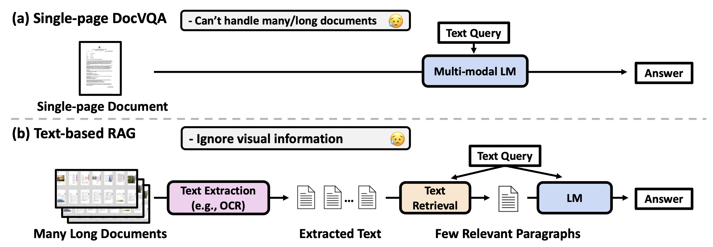
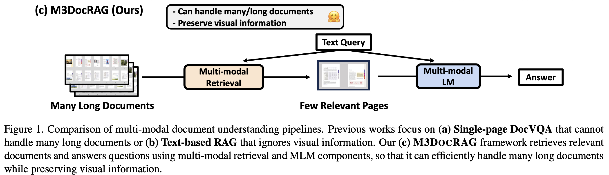
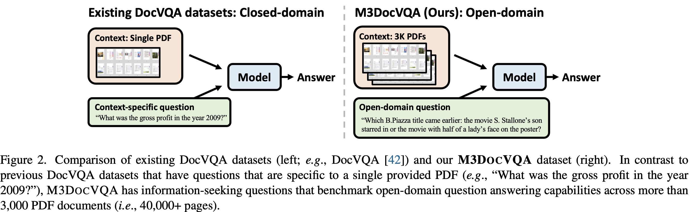
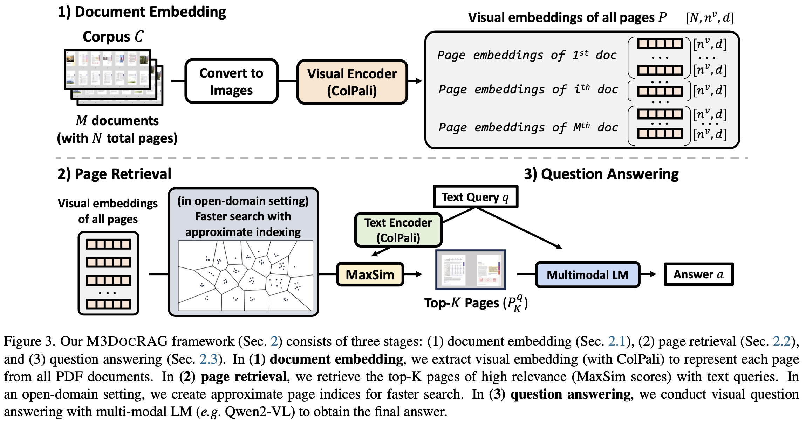
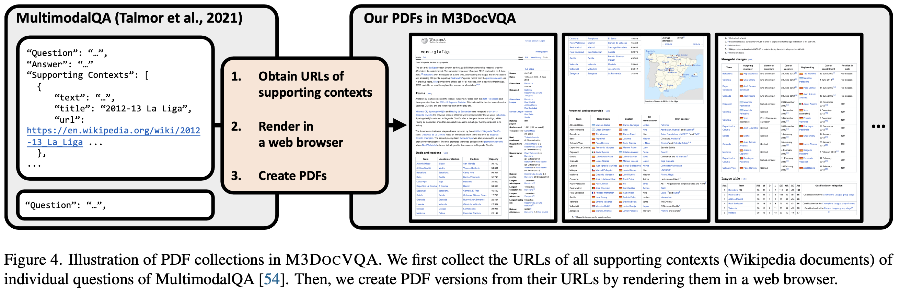
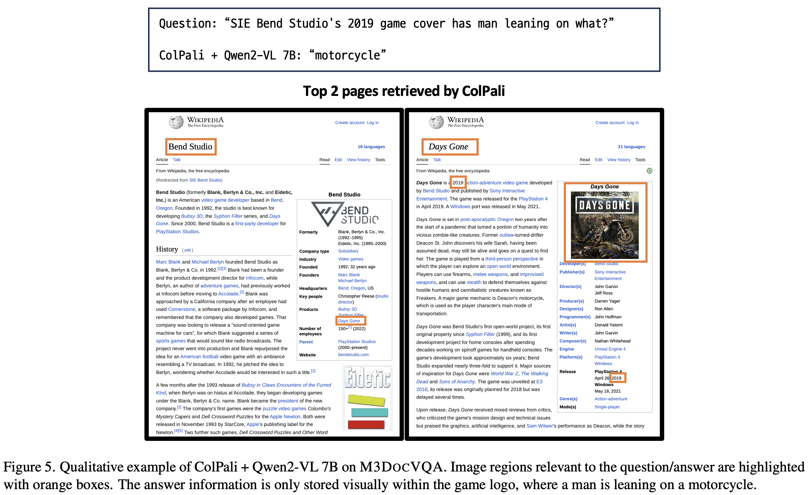
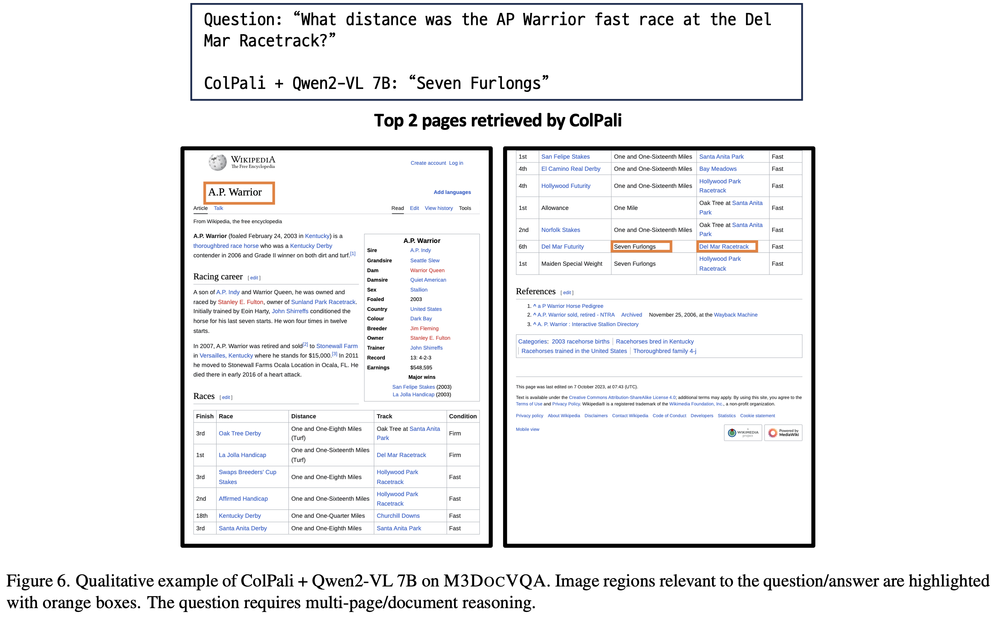

# M3DocRAG

文档视觉问答（DocVQA）是一种多模态任务，通过解释包含在文档图像中的信息来回答文本问题。

现有方法专注于处理多模态语言模型 (MLM) 的单页文档，或者依赖于使用光学字符识别 (OCR) 等文本提取工具的基于文本检索增强生成 (RAG)，但这些方法在实际场景中应用存在困难：

- 问题通常需要跨不同页面或文档的信息，而 MLM 不适合处理许多长文档；
- 文档经常包含重要信息，如图表和图像等视觉元素，但是文本提取工具会忽略它们。

M3DOCRAG，这是一种新型多模态 RAG 框架，它灵活地适应各种文档上下文——封闭域（即单个文档）和开放域（即大量文档），以及问题跳转（单跳和多跳）和证据模式（文本、图表、图片等）。M3DOCRAG 使用多模态检索器和 MLM 来查找相关文档并回答问题，因此它可以高效地处理单个或多个文档，并保留视觉信息。

由于以前的 DocVQA 数据集是在特定文档的上下文中提出问题的，例如“2009年的毛利润是多少？”所以我们还提出了一个新的基准 M3DOCVQA，这是一个开放域的数据集，用于评估超过 3,000 多份 PDF 文件的开放领域 DocVQA，其中包含 40,000 多个页面，多跳问题2,441个 

##  方法

多模态文档检索和回答的目标是使用文档集合C（包含多个文档，一个文档包含多个页面）中的可用多模态信息准确地回答给定的问题q，首先，我们识别出与查询q最相关的前 K 个页面，这些页面来自全局页面集P；然后，我们通过输入已检索到的页面图像和查询q来获取最终答案。

- 封闭域问题回答——查询q应该从给定的单个文档中可答
- 开放域问答 - 查询q可能需要整个文档库C中的单个或多个文档的信息

在M3DOCRAG中，文本查询q和页面图像P都使用ColPali 投影到共享的多模态嵌入空间。文档中的每个页面都被视为固定尺寸（宽度×高度）的单张图片。

> ColPali是一种基于晚期交互机制的多模态检索模型，它将文本和图像输入编码为统一向量表示，并检索前K个最相关的图像。ColPali从Col-BERT 中采用了训练目标和相似度评分，该方法利用共享架构来编码文本或视觉输入。

从一页的图像中，我们提取一个密集视觉嵌入 $$E^p\in\mathbb{R}^{n^v\times d}$$，其中 $$n^v$$ 表示每页的视觉token数，而d表示嵌入维度(例如，128)。对于文档集合C中的N页图像，就是$$E^C\in\mathbb{R}^{N\times n^v\times d}$$。对于文本查询q，我们也同样获得一个嵌入$$E^q\in\mathbb{R}^{n^q\times d}$$，其中 $$n^q$$ 是文本token的数量

查询q和页面p之间的相关性是通过MaxSim分数计算的
$$
s(q, p) = \sum_{i=1}^{n^q} \max_{j \in [n^v]} E_{i,\cdot}^q \cdot E_{j,\cdot}^p
$$
其中，· 表示点积运算，$$E_{i,\cdot}\in \mathbb{R}^d$$ 表示嵌入矩阵 $$E^p\in\mathbb{R}^{n\times d}$$ 的第i行（向量）。然后我们识别出$$P_K^q$$，即与查询q最相关的前K个页面：
$$
P_K^q = \{p_1^q, p_2^q, \ldots, p_K^q\} = \text{argtop-}k_{p \in P} \, s(q, p)
$$
在大型文档库中搜索页面耗时且计算成本高。关于创建索引：

- 当需要更快的搜索时，我们通过在离线应用近邻搜索(approximate nearest neighborhood search) 来创建页面索引，基于Faiss 
- 对于封闭域页面检索，我们使用精确搜索
- 而对于开放域设置，则采用倒排文件索引（inverted file index, IVF）（Faiss中的IVFFlat），这可以将页面检索延迟从每页查询20秒减少到不到两秒

文本查询q和检索页面图像 $$P_K^q$$ 将输入到一个多模态语言模型以获得最终答案。

## 数据集

为了创建M3DOCVQA，我们从短上下文VQA数据集扩展到更复杂的场景，包括：1）PDF文档和2）开放域上下文。具体来说，

1. 使用来自MultimodalQA 的多模态问题对，其中模型需要基于来自维基百科的短多模态上下文（例如，简短文本段落、1-2张图片或表格）回答多跳问题。
2. 检索了所有用作 Multi-modalQA 开发集问题上下文的维基百科文档的 URL
3. 通过在Chromium网络浏览器上渲染它们，生成所有用于任何Multi-modalQA开发划分问题中的Wikipedia页面的PDF版本（使用Playwright Python包） 。这些PDF保留了所有的矢量图形和元数据，确保放大功能并保持操作超链接，页面分割不会分割图像等信息。

在传统的MultimodalQA中，模型被给予简短、经过整理的上下文，例如一段直接包含回答问题所需的信息的段落，简化了任务。M3DOCVQA 提供了一个开放域设置，在此模型必须从 3,368 个 PDF 文档的多样化集合中检索信息才能尝试回答任何问题。这不仅需要处理大规模文档检索，还需要处理分布在多个文档中的多模态内容：文本、图像和表格，挑战加大

## 实验

我们对三个PDF文档理解数据集进行了基准测试，

- M3DOCVQA (开放域DocVQA)，3,000个PDF文件，总计超过4万页，使用精确匹配（EM）和F1来评估答案准确性
- MMLongBench-Doc  (封闭域DocVQA)，每个问题最多需要处理有120页的PDF，从模型输出中使用GPT4o提取短答案，并根据规则基线报告准确率和F1分数
- MP-DocVQA  (封闭域DocVQA) ，每个问题最多需要处理20页的PDF，使用ANLS报告答案准确率和页面检索准确率

我们主要实验了ColPali v1 检索模型和各种最近的开源多模态LM，包括具有<10B参数的Idefics 2 、Idefics 3、InternVL 2  和Qwen2-VL 。还使用结合了广泛使用的文本检索和语言模型：ColBERT v2  和Llama 3.1 的文本基RAG管道进行实验。 

其他细节：

- 在文本RAG基准中使用 Tesseract 作为OCR工具
- 使用Faiss 来进行文档索引
- 使用pdf2image  库将每个PDF页面转换为分辨率DPI = 144的RGB图像
- M3DOCVQA中，8.5 (width) × 11 (height) in inches，1224 (width) × 1584 (height) 像素
- 在MP-DocVQA和MMLongBench-Doc数据集中，页面略有不同。为了处理这种情况，我们将页面图像调整到 1700 (width) × 2200 (height) 像素
- 所有实验均使用单个H10080GB GPU进行操作。我们为我们的多模态LMS提供最多4页作为视觉输入，这是我们在单GPU上能够容纳的最大数量的图像

结果：

- 开放域上，M3DOCRAG（ColPali + Qwen2-VL 7B）显著优于文本RAG（ColBERT v2 + Llama 3.1 8B）
- 封闭域上，尽管传统方法可以结合所有截图页面为 1 或者 5 张图片以满足上下文长度限制，但是ColPali+ Qwen2-VL 7B表现更好，这表明多模态检索比拼接低分辨率图像来处理多个页面的效果更加显著
- 提供更多的检索页面作为上下文通常会提高文本RAG和M3DOCRAG效果
- 使用精确搜索（FlatIP）进行简单的索引很慢（每个query 21秒），使用近似索引如inverted file(IVFFlat) 和 product quantization  (IVFPQ)  可以保留大部分准确度，并且使搜索显著更快 (每个query 2秒）

## 示例

下图：答案信息仅以视觉方式存储在游戏标志内（“人靠在摩托车”），而M3DOCRAG能够找到该信息。

------

下图：问题需要跨不同页面/文档进行多跳推理，并且M3DOCRAG可以从多个检索到的页面中结合信息。

