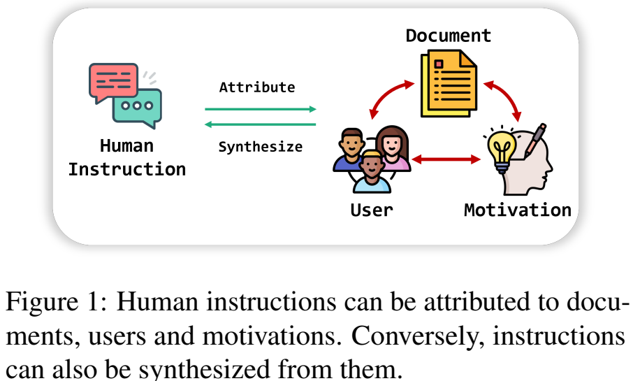
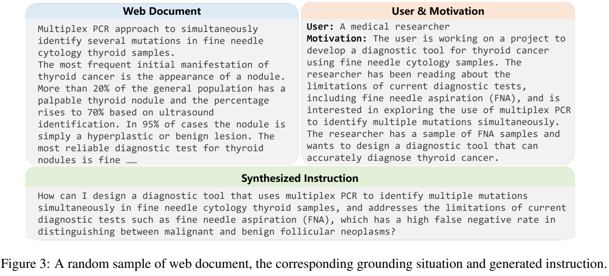
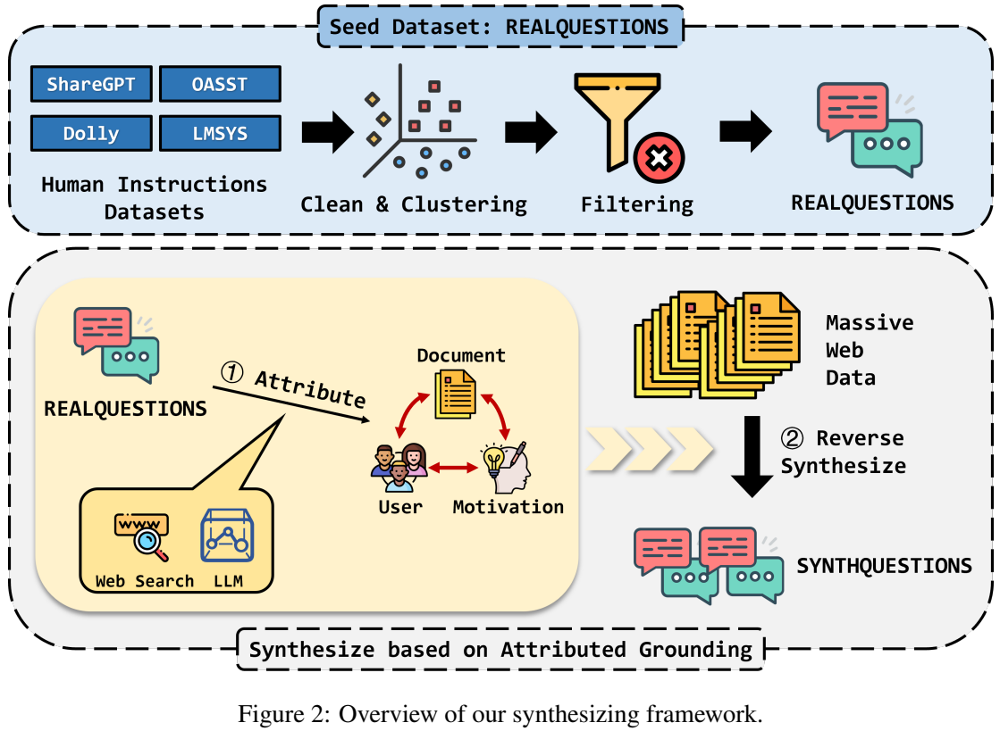
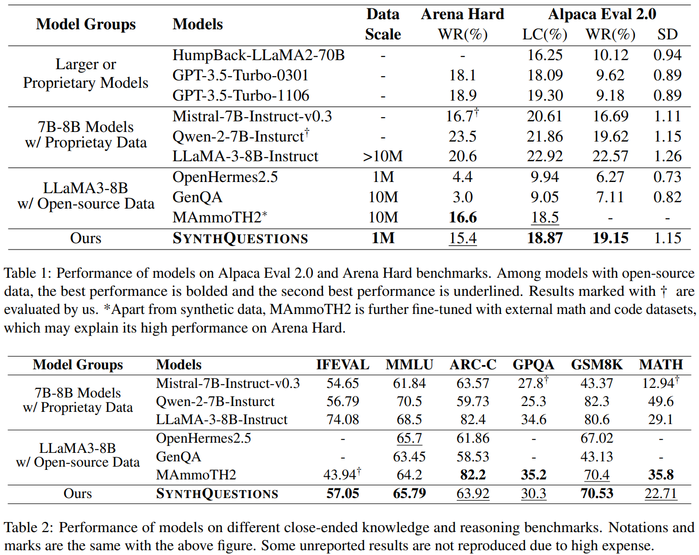

# From REAL to SYNTHETIC: Synthesizing Millions of Diversified and Complicated User Instructions with Attributed Grounding

> https://aclanthology.org/2025.acl-long.517/
>
> Outstanding Paper

对齐训练已成为指令遵循大型语言模型的一项基本技术，旨在通过训练指令-响应对，使语言模型的行为与人类在接收到特定指令时保持一致。为了获得强大的指令遵循和推理能力，需要足够多样化、复杂且规模化的指令数据（例如那些刚好超出学习者能力范围的任务促进最大的认知增长）

然而，收集此类指令是一项难以完成的任务，最近一些合成方法不可避免地陷入某些局部分布（例如，来自维基百科的知识和概念、有限的种子教学模式等），且多样性、生动性、复杂性不足

语言理解基于世界知识，这种知识是情境化的，部分是其发展和使用的活动、背景及文化的产物。鉴于这一理念，我们认为确保生成的指令与现实世界紧密联系至关重要。我们提出了一个基于归因于情境的核心思想的合成框架，该框架包含两个主要部分：自上而下的归因和自下而上的合成。在我们看来，一条人类指令可以归因于三个关键因素

1. 文档：指令中涉及的背景知识
2. 用户：提出这条指令的人
3. 动机：为什么用户需要大型语言模型来为他们完成任务

通过这些因素，一条指令就与现实世界紧密联系。相反，我们可以根据文档构建包含用户和动机的情境，并据此合成指令。由于大量多样的网络文档可以毫不费力地获取，因此有可能生成具有高复杂性和多样性的预训练级指令数据。

- 收集常用的带有人工标注的SFT数据集
- 对指令进行清洗和去重，并保留质量最高的，将得到的种子数据集称为RealQuestions
- 在归因步骤中，我们根据RealQuestions中的每条指令检索网络文档，基于这些文档，我们利用先进的LLM构建一个逼真的场景，包括用户和动机
- 在合成步骤中，我们从现有的网络文档开始，提示LLM生成带有新指令的情境

上述过程以语境学习的方式进行，由RealQuestions中的示例驱动。我们收获了一个大小为1M的数据集SynthQuestions，该数据集的多样性高于其他合成数据集。在SynthQuestions上微调的模型在各种基准测试中取得了领先的结果，并且与用10倍的数据和偏好训练训练的模型相当，这证明了我们的方法的有效性。

## RealQuestions

RealQuestions 是我们构建的一个高质量人类指令数据集，作为种子数据集，后续将被赋予具体情境，并驱动合成过程作为演示。真实问题的构建步骤如下：

1. 数据收集。我们从7个常用的人类标注指令数据集中收集对话数据，共收集了192万条原始对话数据
2. 数据清洗和去重。
   1. 丢弃不完整或未使用英语的对话
   2. 移除用户指令与我们的评估基准Alpaca Eval 2.0和Arena Hard相似的对话
   3. 由于对话中的用户指令任务表现出高度重复，我们根据它们的语义进行去重
3. 数据过滤。具有挑战性的任务对模型性能特别有益。
   1. 为了筛选最具挑战性的指令，我们修改了Arena Hard 的标准来对其进行评分，其中指令在7个维度上进行评估
   2. 使用LLaMA-3-70B-Instruct作为评判模型。对于指令满足的每个维度，将增加1分
   3. 将获得满分的2.9万条指令作为我们的种子数据集RealQuestions
   4. 在RealQuestions上微调了一个LLaMA-3-8B，实验结果显示其质量优于现有的指令数据集

## Attributed Grounding

RealQuestions 中的指令将被归因于文档、用户和动机。

自上而下归因首先通过收集**文档**开始，即相关的现实世界信息，用于 RealQuestions 中的指令，在我们的实现中这是通过网络搜索完成的。我们使用LLaMA-3-70B-Instruct提取每条指令的关键概念，并使用这些关键概念作为查询从谷歌召回网页。我们将每条指令的搜索结果中排名最高的一条作为文档。

有了提供关于现实世界背景知识的文档，我们可以进一步模拟指令出现的情况。我们将文档与指令一起提供给LLaMA-3-70B-Instruct，并提示它构想一个**用户**与文档互动并提出该指令的情境，出于某种**动机**。为了改进这一过程，我们用手工制作的 demonstrations 进行提示，得到了被赋予的 SynthQuestions，我们称之为：
$$
RQ^{\alpha} = \{(i, d, u, m)\}
$$
i、d、u 和 m 分别指代指令、文档、用户和动机。

------

在自下而上的合成过程中，根据现有网页文档构建包含用户和动机的情境，并在此基础上合成新的指令

我们使用 FineWeb（Penedo 等人，2024年）作为主要**文档**来源。为了进一步扩大数据集在复杂推理能力方面的优势，我们还融入了来自 PILE（高等人，2020年）和 MathPILE（王等人，2023b年）的涉及数学和编程等困难推理任务的文档。

对于每篇文档，我们提示 LLaMA-3-8B-Instruct 构建一个包含用户和动机的情境。为了生成更合理且有根有据的情境，在此过程中使用来自  $$RQ^{\alpha}$$ 的样本作为演示：
$$
\left(u^{\prime}, m^{\prime}\right)=\operatorname{LLaMA}\left(P_{g}, d^{\prime}, \text{demo}\right)
$$
在生成用户和动机输出 *u*′ 和 *m*′ 时，输入 $$P_g$$，$$d'$$ 以及demo分别对应于用于联系上下文的提示、上述语料库中的文档以及来自 $$RQ^{\alpha}$$ 的演示。

最后我们要求模型扮演用户角色，并在置于上述联系上下文情境中时说出尽可能多的**指令**：
$$
i^{\prime}=\operatorname{LLaMA}\left(P_{i}, d^{\prime}, u^{\prime}, m^{\prime},\text {demos}\right)
$$
在生成新指令后，我们首先使用之前的方法对其进行评分，并丢弃所有得分低于3的指令。选择阈值3是因为我们注意到，特异性、问题解决能力和技术准确性是有效指令的三个基本要求，而未能满足这三个要求的指令往往不够清晰或含糊。由于这是一个启发式设置，我们设定阈值为3而不是直接过滤掉不符合这些要求的指令，以显示更多的宽容性。

为了确保数据集的多样性，我们采用BERTopic进行主题建模，并通过在每个主题中得分最高的指令构建了一个包含100万个条目的最终数据集。我们将这个最终数据集称为 SynthQuestions

## 实验

关于合成数据

- 我们在 RealQuestions 上微调了一个LLaMA-3-8B，实验结果显示其质量优于现有的指令数据集
- 我们的方法生成的数据平均对话轮数最多，这表明 SynthQuestions 的**复杂性**
- 使用MTLD算法计算出的词汇**多样性**方面，SynthQuestions 在所有合成数据集中排名最高
- 从上述每个数据集中抽取10,000条指令，并使用all-mpnet-base-v2模型计算句子嵌入。然后应用t-SNE将语义嵌入投影到二维空间我们的方法合成的数据集涵盖了更**多样化**的主题或科目
- 提供Vendi Score作为数据**多样性**的补充定量指标，对之前为每个数据集抽取的10,000个数据点计算Vendi Score，SynthQuestions的 Vendi Score 最高
- 从所有合成数据集中随机抽取10,000条未过滤指令，并使用Arena Hard的标准对其进行评分，SynthQuestions 的指令更**复杂**

我们在 SynthQuestions 上训练了 LLaMA-3-8B，上述实验结果证明了 SynthQuestions 在提升模型能力方面的有效性。

我们通过应用DPO进一步调查我们合成数据集的潜力。我们从不同数据集中随机抽取10万份指令，用LLaMA-3-70B-Instruct生成5个响应（T=0.8），并用ArmoRM-Llama3-8B-v0.1 标记偏好。我们将得分最高的响应设为选定项，得分最低的设为拒绝项。我们训练SFT模型。在SynthQuestions 上训练的模型不仅超越了所有最近合成的数据集，还击败了LLaMA-3-8B-Instruct。我们的模型甚至在Alpaca Eval 2.0胜率上也超过了数据生成器LLaMA-3-70B-Instruct。然而，在Arena Hard上的表现远远落后，这可能表明解决更困难的任务仍需要增加模型规模。

扩大数据规模对提升模型性能的积极影响，同时也展示了我们通过合成更多指令来持续提升模型能力的潜力

SynthQuestions 在GPQA上的表现并不那么强劲，这可能表明它还需要在生物学、物理学和化学等学科上进行加强