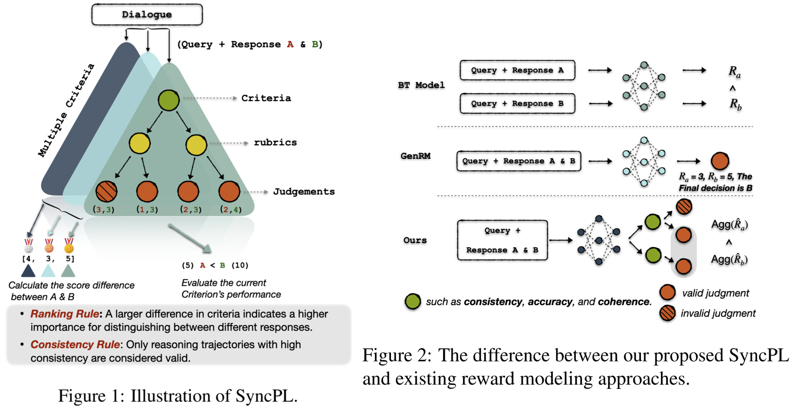
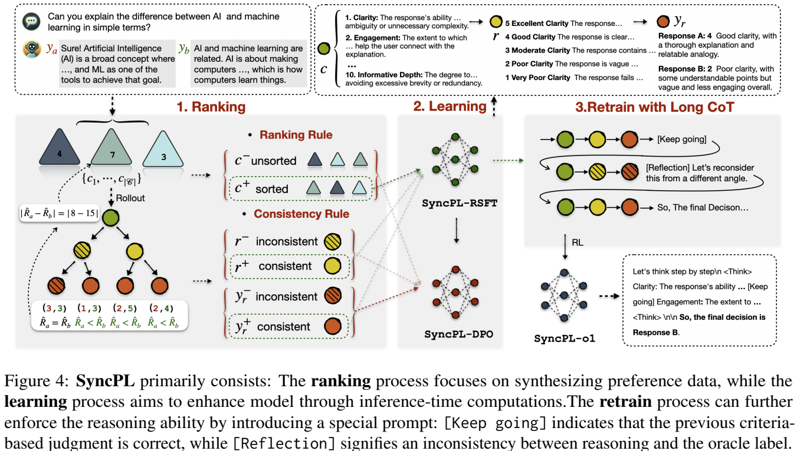
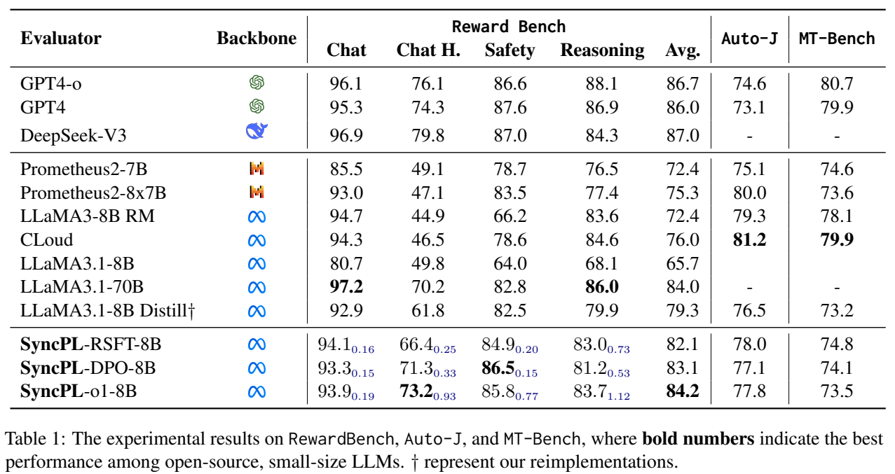

# Generative Reward Modeling via Synthetic Criteria Preference Learning

> https://aclanthology.org/2025.acl-long.1297/
>
> 从现成数据集提取 query 和 response A、response B，训练一个奖励模型能更加符合人类偏好。由 LLM 生成多个评分标准，选择正确且评分数值差距最大的那一个，认为这个是最好的 CoT ，拿这个来训练模型

通过人类反馈强化学习（RLHF）LLMs 可以有效地遵循用户指令并生成符合人类价值观的回应。传统的判别性奖励模型缺乏明确的推理过程，导致显著的过度优化问题，并且经常在分布外数据上表现恶化

> 奖励模型 RM 在给定用户查询以及候选者A和B的回应下，为策略模型提供奖励信号，两种主要方法是 discriminative RM 和 generative RM。
>
> 容易受到奖励操纵，也称为过度优化，因为它容易学习数据和偏好标签之间的虚假关联，例如冗长但帮助不大的回应通常获得更高的奖励分数

推理模型展示了强大的CoT推理能力是性能提升和可扩展性的关键。最近的研究使用 LLM 来合成基于标准的CoT，用于响应评估。然而，合成CoT的复合误差阻碍了模型通过自我改进而提升，因为模型难以验证CoT轨迹的正确性。为了解决这个问题，我们预先定义了两个规则作为元标准来过滤高质量轨迹。

我们提出的SyncPL方法中的CoT轨迹由三个基本要素组成：标准、评分指南和判断。

- **标准（Criteria）**：从用户查询中提取的评估维度（如准确性、流畅性等），由LLM生成。
- **评分细则（Rubrics）**：为每个标准制定细化的评分规则（1-5分）。
- **判断（Judgments）**：基于标准和细则对候选回答（A/B）打分，生成偏好选择。

此外，我们将利用蒙特卡罗展开策略将CoT轨迹扩展成偏好树，这提供了一种估计不同轨迹预期奖励的方式。为了识别和优化关键标准，我们的方法包含两个阶段：

- 在排名阶段，我们首先计算各种推理轨迹中响应 A 和 B 之间的分数差异。通过聚合这些差异，我们确定每个标准的重要性。具体来说，排名规则识别标准的相对重要性，而一致性规则过滤掉置信度低和不一致的判断轨迹
- 在学习阶段，我们利用这些排序后的轨迹通过拒绝采样微调和直接偏好优化（DPO）来优化大型语言模型。

SyncPL 在多个偏好基准测试中实现了显著的性能提升，无论是在分布内还是在分布外（OOD）场景下。得益于严格的数据筛选，我们在多个偏好基准测试中均取得了显著的性能提升，包括在分布训练中。我们证明了SyncPL-o1-8的有效性，其性能超越了LLaMA3.1-70B。简而言之，我们的贡献如下：

- 将基于树的偏好学习引入到生成式奖励建模中，以优化合成标准轨迹
- SyncPL-DPO 优先考虑关键和高质标准，有效降低推理成本
- 通过基于标准的流程监督，为 GenRM 展示并实施了类似 o1 的长 CoT 格式

## 背景

在奖励建模中，所需的比较次数往往远超过可用的偏好对数。虽然稀疏的比较有助于降低人工注释成本，但它们引入了未能捕捉真实顺序关系的风险。人类偏好（ $$y_a$$ 或 $$y_b$$）可以被视为基于不同标准 $$\mathcal{C}$$ 的多个 $$\hat{\mathcal{R}}$$ 的加权组合
$$
\begin{aligned}
\mathcal{R}\left(x, y_{a},y_{b}\right) &=\sum_{i}^{\mid\mathcal{C}\mid}\boldsymbol{\alpha}_{i}\hat{\mathcal{R}}\left(x, y_{a},y_{b},c_{i}\right),\\
\hat{\mathcal{R}}\left(x, y_{a},y_{b},c_{i}\right) &\sim\mathcal{P}\left(y_{r}\mid c_{i},x,y_{a},y_{b}\right),\\
c_{i} &=\mathcal{P}\left(c\mid x,y_{a},y_{b}\right) .
\end{aligned}
$$
然而，这个加权系数 $$\alpha$$ 在很大程度上是启发式确定的，使其无法获得具体值。同样，BT模型和 非CoT GenRMs 也依赖于对人类偏好的隐性学习，而不是提供明确的奖励信号，这使得它们难以对复杂的偏好关系进行建模。考虑到整体奖励 $${\mathcal{R}}$$ 是由基于标准的子奖励 $$\hat{\mathcal{R}}$$ 组合而成的，我们能否使大型语言模型生成这些子奖励，从而促进明确的生成性奖励建模呢？

对齐的大型语言模型本质上充当基于标准的奖励模型，然而这种能力还需要进一步的指导。出现“compounding errors”的主要原因是每个 CoT 轨迹中缺乏人类监督。因此，我们的主要目标是通过对显式训练和优化来提高基于标准的CoT的质量。此外，多步推理引入了显著的推理成本，这对实际部署提出了挑战。

> compounding errors 指代 LLM 生成中的初始错误会随着序列长度的增加而传播

一个自然的问题是，大型语言模型能否优化并优先考虑最关键的标准？基于这个想法，我们将奖励建模进一步优化：
$$
\mathbb{I}\left\{\mathcal{R}\left(x, y_{a},y_{b}\right)\right\}=\mathbb{I}\left\{\hat{\mathcal{R}}\left(x, y_{a},y_{b},c^{*}\right)\right\}, \\
c^{*}=\arg\max _{c_{i}}\hat{\mathcal{R}}\left(x, y_{a},y_{b},c_{i}\right),
$$
其中 $$c^*$$ 代表最关键的标准，这一目标需要明确优化子奖励 $$\hat{\mathcal{R}}$$ ，但实际上我们缺乏明确的奖励信号。为了解决这一限制，基于结果的奖励学习必须转变为基于过程的奖励学习。具体来说，在训练数据中，我们只有 $${\mathcal{R}}$$  而非 $$\hat{\mathcal{R}}$$ ，必须通过搜索和学习来识别。

> 需要注意的是， $$c^*$$ 不是当前偏好问题的全局最优解，而是在我们工作中有限标准候选空间内的一个局部最优解

## 方法

实现上述目标，我们将其分解为两个部分：

1. 获得子奖励 $$\hat{\mathcal{R}}$$ 的估计值：首先根据合成标准对CoT判断进行排序，为各种轨迹生成子奖励估计
2. 微调大型语言模型以输出最关键的标准 $$c^*$$ ，确保它们在模型的预测中得到显著体现。

SyncPL首先在**标准**节点和**判断**节点之间引入一个额外的**评分指南** rubric 节点，定义如下：
$$
\mathcal{P}(r) = \mathcal{P}(r \mid x, c_i) \\
\mathcal{P}(y_{r}) = \mathcal{P}(y_{r} \mid x, y_{a}, y_{b}, c_{i}, r_{i})
$$
生成式奖励模型需要为每个轨迹生成**标准**、**评分指南**和**判断**的序列。判断是由 LLM $$\mathcal{P}$$ 生成的文本序列，包括针对 $$(y_a,y_b)$$ 的显式评估分数 $$( \hat{\mathcal{R}}_a,\hat{\mathcal{R}}_b)$$，谁分数高谁好

给定数据集 $$\mathcal{D}=\left\{\left(x, y_{a},y_{b},l\right)_{i}\right\}_{i=1}^{N}$$ ，我们使用蒙特卡洛展开策略构建偏好树，其中每个父节点生成多个子节点（实际操作中为两个）。偏好标签 $$l$$ 由人类标注为真实值。在实现中，每个标准的子树被表示为一个完全二叉树，包含4个不同的评估分数。从根节点到叶节点的每条路径代表一个完整的评估轨迹 $$\mathcal{T}=\left\{x, y_{a},y_{b},c_{i},r_{i},y_{r}\right\}$$ 

需要注意的是，我们采用两种不同的展开策略：对于**标准**，我们使用大型语言模型直接生成与用户查询相关的文本序列 $$c_1,...c_{|\mathcal{C}|}$$，类似于头脑风暴。对于**评分指南**和**判断**，我们采用基于输出概率的采样策略。

为了根据不同的标准优化 LLM 政策，我们利用预言家标签l和预定义规则对各种标准进行信用分配。不同于传统蒙特卡洛展开估计置信度分数的做法，我们不依赖每个标准的偏好分数。相反，这些子奖励分数是基于预言家的偏好和预定义规则来估计的：

- 排名规则：分数差距较大的标准表示LLM对其评估的信心更高。因此，当前标准的评估轨迹应被赋予更高的优先级生成。
- 一致性规则：在以该标准作为根节点的每个子树中，当出现冲突判断时，多数投票结果可以被视作最终判断。这表明偏离多数的判断很可能是错误的

根据这些规则，我们可以从不同树节点收集成对的偏好训练数据：

我们计算所有**标准**的分数差异 $$( |\hat{\mathcal{R}}_a-\hat{\mathcal{R}}_b|)$$，并根据排名结果对输出序列  $$c_1,...c_{|\mathcal{C}|}$$ 进行重新排序。重新排序后的序列记为*c*+，而原始序列作为*c*−。

对于基于标准合成的每个**评分标准**和**判断**，我们应用一致性规则来过滤子树：不一致的结果被视为被拒绝的样本（ $$r^-, y_r^-$$），而具有较大分数差异的一致结果被选为选中的样本（ $$r^+, y_r^+$$）。

RSFT 使用选中的样本 （ $$c^+,r^+, y_r^+$$）作为训练数据，而DPO则利用配对偏好进行训练。奖励模型可以通过偏好学习优化合成过程，例如标准的损失函数定义如下：
$$
\mathcal{L}_{\text{DPO}}\left(\pi_{\theta} ; \pi_{\text{ref}}\right)=-\mathbb{E}_{\left(x, c^{+}, c^{-}\right) \sim \mathcal{D}}\left[\log \sigma\left(\beta \log \frac{\pi_{\theta}\left(c^{+} \mid x\right)}{\pi_{\text{ref}}\left(c^{+} \mid x\right)}-\beta \log \frac{\pi_{\theta}\left(c^{-} \mid x\right)}{\pi_{\text{ref}}\left(c^{-} \mid x\right)}\right)\right]
$$
OpenAI的o1系列模型通过长CoT推理过程引入推理时扩展。受此启发，我们还探索利用长CoT进行GenRM，借助由SyncPL-SFT生成的基于高质量标准的判断。具体来说，我们通过在选定和拒绝轨迹之间交替来重组训练数据，旨在激发模型的反射能力。随后，我们基于LLaMA3.1-8B使用DPO像之前一样重新训练SyncPL-o1

拒绝采样旨在通过对无效轨迹应用一致性规则来消除低质量合成数据。该过程确保只保留与多数投票和预言标签一致的评价结果。如果每个样本包括10个不同的标准，则合成数据所需的轨迹数量是 ((2+4)×10)。显然，这个过程涉及大量低效采样。为了提高数据合成的效率，我们在RSFT合成期间只为每个对话的一个标准生成评估轨迹。对于DPO，我们同时合成所有10个标准的轨迹以保证全面的偏好学习。这将使速度提升近10倍。在DPO期间，我们仅选择主干模型和RSFT模型之间不一致的样本，从而移除大约70%的总数据集。

## 实验

我们采用三个不同的人类偏好基准来评估奖励模型。对于基线模型，采用GPT-4、GPT-4o和DeepSeek V3，对于判别式RM，我们选择了使用BT目标的 LLaMA3-8B RM with ultrafeedback。对于生成式RM，我们选择了由GPT-4合成数据训练的Prometheus2。此外，CLoud利用LLaMA3-405B通过混合方法生成CoT推理路径以进行模型训练。

对于域外奖励建模，我们使用 Qwen2.5-32B-Instruct-GPTQ-Int8 构建CoT数据，并训练 LLaMA3.1-8B 蒸馏模型作为我们的主干模型。**SyncPL利用来自UltraFeedback和OffsetBias的对话数据作为训练集来构建一个细粒度的奖励模型**。值得注意的是，这些训练数据集的分布与评估基准测试的分布有显著差异，这意味着表1中的结果可以被视为域外（OOD）评估。通过RSFT，SyncPL在人类偏好方面实现了更优的对齐，比LLaMA3.1-8B蒸馏模型高出2.8个百分点。此外，SyncPL-DPO进一步增强了奖励建模能力，提升了3.8个百分点。

SyncPL-o1在由SyncPL-SFT生成的合成数据上进行训练，因为它能够产生被拒绝的数据，从而更好地指导模型的反思能力，相较于SyncPL-DPO。通过强化学习，SyncPL-o1取得了卓越的性能，超越了LLaMA3.1-70B。虽然它通过单次推理步骤获得了最佳性能，但这主要依赖于SyncPL优化过程级数据（基于标准的判断）的能力。引入过程监督信号确保了长CoT中推理链的正确性，完全释放了其潜力。

对于域内评估，我们使用Fen-nec训练数据对Mistral-7B-Instruct进行微调，采用一致性（AGR）和连贯性（CNS）作为性能指标，RSFT和DPO模型在Auto-J和Fennec上相较于大多数基线方法表现出显著的性能提升，获得了最高的58.41的一致性得分

GenRM的核心能力是识别并纠正对话中的缺陷，从而提高整体质量。为了评估这一点，我们测试了我们的模型评估和改进由Alpaca-13B和LLaMA2-7B在MT-Bench中生成的对话的能力。与以往成对的评估不同，MT-Bench是一个多轮对话评估基准，它使用GPT-4对AI响应进行从1到10的评分，然后根据这些分数建立排名关系。具体来说，我们对响应生成多个判断，并对得分低于3的判断进行改进。经过改进后，Alpaca-13B和LLaMA2-7B聊天机器人的得分都有所提高。此外，DPO模型的校正效果优于RSFT模型，表明改进的评估反馈可以显著提高评估质量。

随着评判标准的增加，蒸馏模型和SyncPL-SFT的性能都显著提升

SyncPL-o1在几乎所有子数据集上与其他模型相比均能持续获得优异的结果

## 限制

一个直观的限制在于 LLM 在判断过程中考虑的候选标准空间，这直接影响模型是否能选择最佳标准来作出判断。在我们的工作中，我们依赖LLMs自主生成评估标准，这使得这种方法的有效性部分依赖于模型的内在能力。扩展候选空间的可能方式包括但不限于

1. 使用更强大的LLMs进行数据合成
2. 构建候选池列表并根据需要检索相关标准

