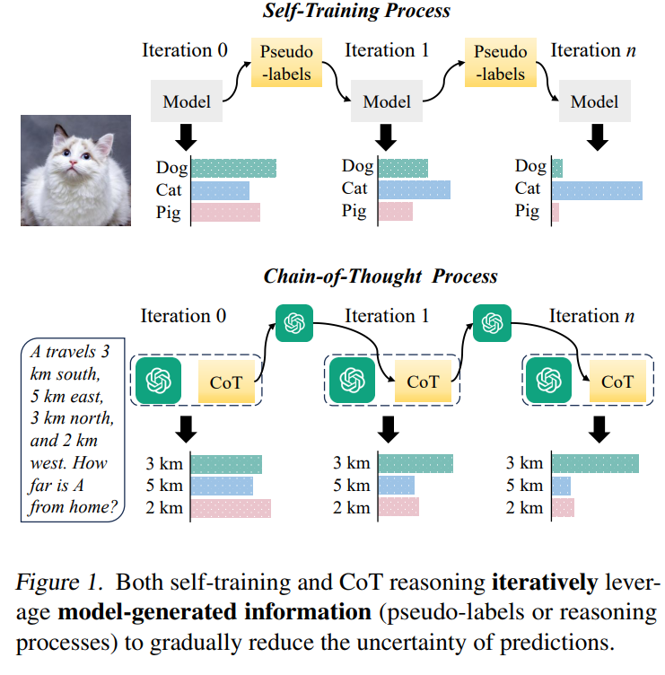
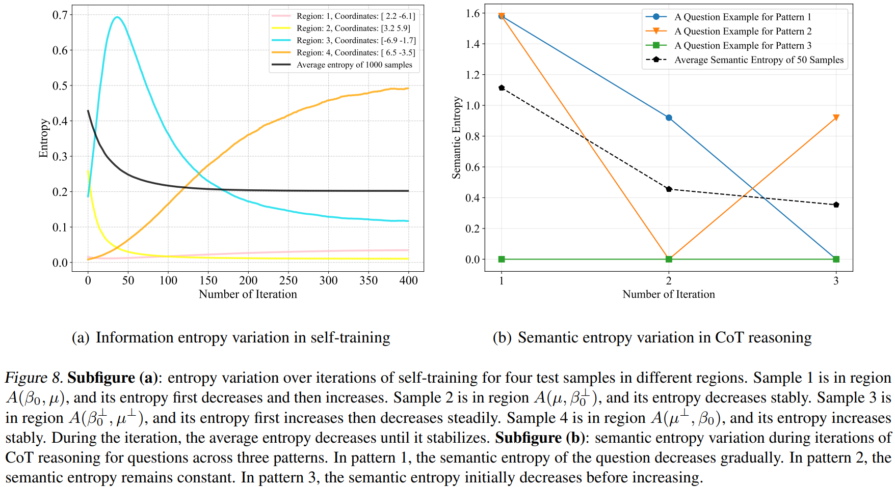
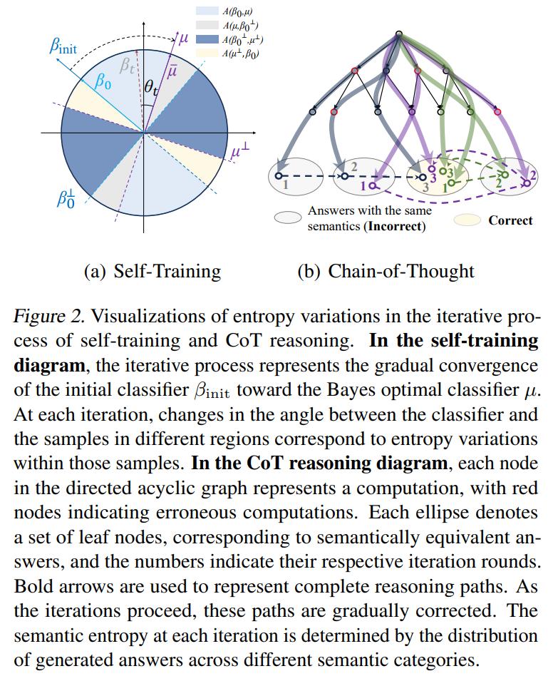
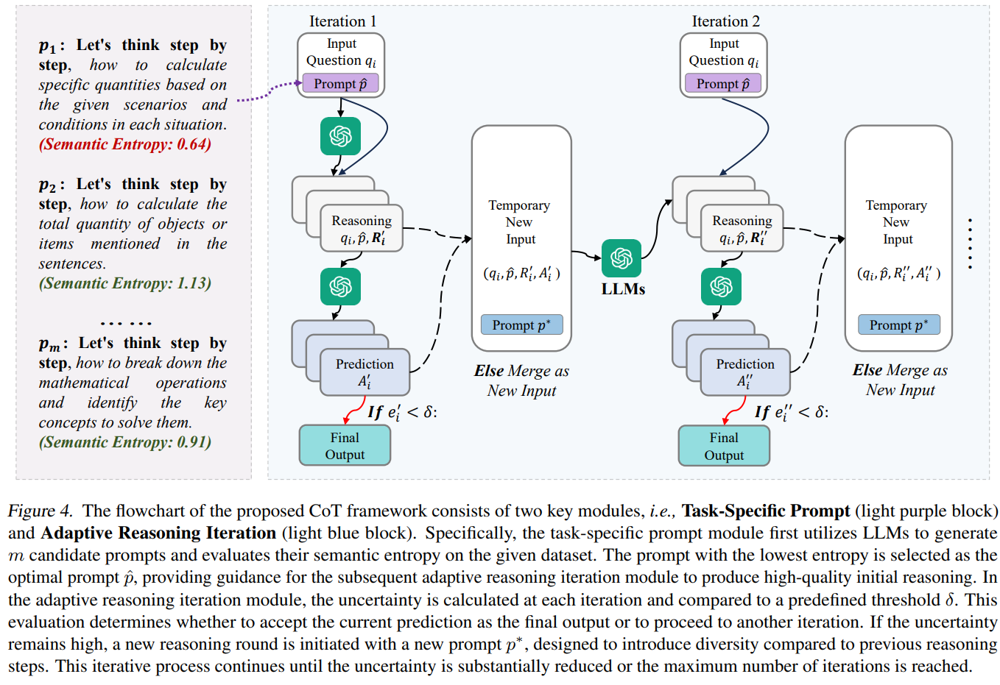
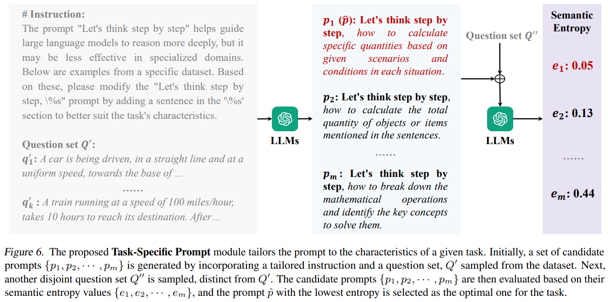
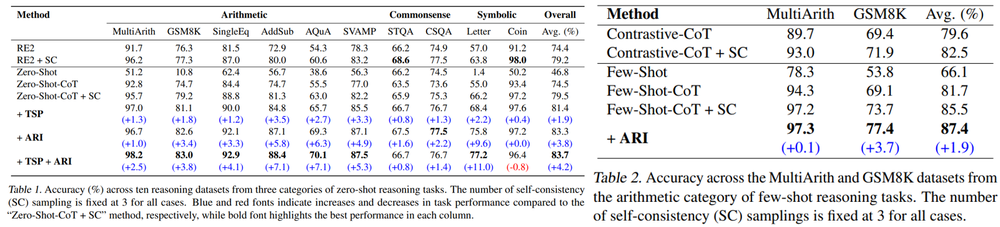
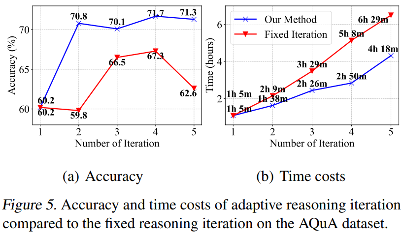

# Rethinking Chain-of-Thought from the Perspective of Self-Training

CoT 利用LLMs的生成能力来增强与问题相关的信息，有效地提高了推理的可靠性。此外，这种信息增强的过程可以迭代应用，更深入的迭代使LLMs能够处理更复杂的推理任务，这与自训练（一个经过验证的半监督框架）在许多概念上有相似之处，都涉及利用迭代生成的模型信息来提升任务性能

> 自训练是半监督学习中一种广泛应用的方法，旨在通过伪标签技术扩展标记的数据集。有效的伪标签策略确保分配给未标记数据的伪标签与标记样本的分布很好地对齐



自训练中，预测样本的整体不确定性呈现出下降趋势。CoT推理也迭代地利用中间推理过程逐步降低对预测问题的不确定性。基于CoT推理是一个不确定性最小化过程的洞察，我们提出了一个新的CoT框架来提升推理性能，该框架包括两个主要组成部分，即任务特定提示和自适应推理迭代。

具体来说，任务特定提示模块旨在**搜索具有最小不确定性的最优提示**。不同于通用提示（例如，“让我们一步步思考”），我们定制的提示有效地引导大型语言模型生成与任务一致的初始推理过程。任务的内在特性显著减少了 LLM 获得正确答案所需的迭代次数。

在建立了初步的CoT推理过程之后，**进一步的迭代细化有助于改进推理过程**。一种直接的方法涉及将问题、推理过程和输出整合成一个新的输入，并重新使用提示进行另一轮推理。然而，这种直观的方法遇到两个主要挑战：（i）早期迭代中的正确预测可能在多轮后变得不正确，我们称之为过度推理现象；（ii）新一轮迭代的推理通常与前一轮推理极为相似。

为了应对这些挑战，我们实施了**自适应推理迭代模块**来评估预测问题的不确定性。当不确定性低时，当前预测被采纳为最终输出，有效缓解了挑战（i）。然而，如果不确定性仍然很高，推理过程会继续进入下一轮。在这些后续迭代中，我们引入新的提示，并使用推理相似性指标（例如，the Jaccard index）来指导LLMs探索替代的推理路径。通过促进推理迭代之间更大的多样性，我们解决了挑战（ii），从而增强了LLMs有效处理复杂推理任务的能力。

主要贡献可以概括如下：

- 发现自训练和CoT推理共享一个核心目标，即迭代利用模型生成信息以逐步降低预测的不确定性（即熵最小化），从而将一些早期错误的预测转变为正确的预测
- 设计了一个特定任务的提示模块来搜索生成高质量初始推理过程的最佳提示，从而显著减少大型语言模型在CoT推理中获取正确答案所需的迭代次数
- 提出了一个自适应推理迭代模块，动态完善CoT推理过程，并解决过度推理和连续推理迭代之间高相似度的问题

## 关于不确定性

自训练的主要目标是利用模型生成的伪标签来减少预测的不确定性，其中不确定性可以使用信息熵来量化，如图，样本预测的平均熵在整个迭代训练过程中逐渐下降。这种减少促使一些样本从最初的错误预测被纠正为准确预测。



然而，并非所有样本都表现出预期的信息熵减少。这种偏差可能是由于伪标签中的错误注释导致的，我们发现中间分类器更新过程是初始分类器向贝叶斯最优分类器的旋转。自训练迭代过程中的熵变化可以分为四种模式：(i) 先减少后增加；(ii) 一致减少；(iii) 先减少后增加；以及 (iv) 一致增加。这些模式在下图中进行了可视化，其中浅蓝色、灰色、深蓝色和黄色区域分别对应于各自的熵变化模式。



- 在自训练过程中对分类器的更新可以解释为初始分类器逐渐旋转至贝叶斯最优分类器 *μ*
- 虽然样本的整体熵通常减少，但这一趋势并不适用于每个独立样本
- 大多数样本呈现单调的熵变化
- 自训练的有效性源于经历熵减少的样本，这使得它们能够从错误预测转变为正确预测
- 在某些情况下，熵的增加可能导致预测反转，使先前正确的样本被错误分类
- 这些熵变化与样本和分类器  $$\beta_{init}$$  及 µ 之间的空间关系存在内在联系

思维链（CoT）推理类似于自训练，依赖于模型生成的信息来提升任务表现。具体来说，CoT旨在通过利用模型自身生成的中间推理过程来减少 LLM 的预测不确定性。

假设推理树是由大型语言模型构建的有向无环图（DAG），推理路径则是从问题 *q* 到答案的特定路径/计算步骤。对于最终所有可能的答案集合，假设这个答案集可以被划分为若干不相交的语义簇，其中恰好有一个簇包含正确答案。令 $$g(C|q,p;\tau)$$ 表示在语义簇上的概率分布，那么语义熵定义为
$$
e=\mathbb{E}_{C}[-\log g(C\mid q,p;\tau)]
$$
实际操作中，让LLM生成*N*个不同的答案并取离散的概率分布，我们取语义熵的近似值
$$
\hat{e}=-\sum_{j=1}^{k} g_{j} \log g_{j}
$$
在自训练中，伪标签引导初始分类器朝着贝叶斯最优分类器的方向发展。同样，在CoT中，推理过程旨在引导大型语言模型（LLM）的预测走向正确道路，从而得出正确答案。分类器*β*通过使用未标记数据进行信息增强来进行更新。相比之下，CoT推理中推理路径的更新是通过深入的问题分析来实现的，将问题转化为更易处理的子问题，并直接唤醒LLM内未被使用的内部知识以辅助问题解决。

迭代CoT是一个在连续迭代中精炼推理路径的过程，是基于原始问题*q*、一个适应性提示*p*′以及先前生成的路径历史生成的新推理路径，随着语义熵*e*的降低，具有CoT推理的大型语言模型产生对问题*q*的正确答案的可能性增加

那么，应用CoT推理解决复杂问题的迭代过程可以解释为大型语言模型逐步产生并校正，从一个初始推理路径开始搜索最优推理路径。这个过程通常伴随着语义熵的逐渐减少，熵的减少反映了预测的精细化，使得能够纠正初始错误并生成正确答案。

与自训练类似，并非所有问题在CoT推理过程中都显示出预期的语义熵减少。理想情况下，随着迭代次数增多，所有过程不断收敛，最终得出相同的语义答案，不确定性可能减少至零。尽管迭代CoT推理不更新模型参数，但它动态调整上下文（推理路径集合）。这个过程本质上实现了生成空间中分布的收紧。

- 尽管问题的整体语义熵通常在下降，但这种趋势并不适用于每一个单独的问题
- 当新迭代的推理过程与前一次迭代的推理过程过度相似时，某些问题的语义熵可能没有变化
- CoT推理的有效性源于经历语义熵减少的问题，有助于从不正确预测过渡到正确预测
- 对于一些问题，熵的增加可能导致预测反转，即之前正确的预测变成错误
- 这些语义熵的变化与LLM在给定问题上使用CoT推理时的初始状态与最优推理路径之间的空间关系有关

## 方法

基于对CoT推理中语义熵变化分析的结论基础上，我们提出了一个新的CoT框架以提升推理性能



一个高质量的初始CoT推理过程有效地减少了初始状态与最优推理路径之间的距离，从而减少了大型语言模型收敛到正确答案所需的迭代次数，因此非常有必要提升 prompt 质量。但是，之前的CoT方法通常依赖通用提示（例如，“让我们一步步思考”）来指导推理过程。尽管这些提示对通用任务有效，但它们常常无法捕捉到特定领域或细粒度任务的细微差别，导致推理过程不充分。

为了解决这一限制，我们提出了一个**特定于任务的提示模块**，该模块能够自动搜索适合任务特点的最佳提示。具体来说，我们的方法首先构建一个指令：

```
# Instruction: “Let’s think step by step” is a general prompt that can guide the LLMs to produce reasoning processes. However, in specialized domains, this prompt may lack accuracy and clarity. Below is a dataset sample. Please enhance the “Let’s think step by step, %s” prompt by adding a sentence in the %s section to better fit the dataset’s characteristics.
```

然后我们从数据集 $$\mathcal{Q}$$ 中抽取一个问题集 $$Q'=\{q'_1,....q'_k\}$$ ，代表任务分布，这个集合*Q*′与指令连接在一起，输入到大型语言模型中，进行m轮采样，生成一个候选的任务特定 prompt 集 $$P=\{p_1,...p_m\}$$

接下来，我们从Q中抽取另一个不相交的问题集 $$Q''=\{q''_1,....q''_k\}$$。来自P的每个候选提示与*Q*′′中的问题连接起来，用于零样本CoT推理。在推理过程中，计算每个候选提示下*Q*′′中所有问题的平均语义熵，得到集合 $$E=\{e_1,....e_m\}$$。

为了清晰起见，我们定义了一个简单的映射函数 $$f:P\rightarrow E$$ 来表示候选提示与其对应平均语义熵值之间的关系。较低的语义熵对应于更好的CoT性能。因此，具有最小语义熵的提示可以被视为最优提示：
$$
\hat{p}=f^{-1}\left(e_{\arg\min_{i}\{e_{i}\mid e_{i}\in E\}}\right)
$$
在测试阶段，我们将最优提示 $$\hat{p}$$ 与问题连接起来，并将组合文本输入到大型语言模型中。按照自洽性CoT方法（Wang等人，2022年)，我们执行N轮采样以生成多样化的推理过程 R，然后将得到的串联文本输入到大型语言模型中以生成预测 A，相当于对于每个问题，我们得到了多个结果：
$$
R_{i}^{\prime}=\left\{\operatorname{LLM}(\operatorname{Concat}\left(q_{i},\hat{p}\right))_{j}\mid j=1,2,\ldots, N\right\}\\
A_{i}'=\left\{\operatorname{LLM}(\operatorname{Concat}(q_{i},\hat{p},r_{i,j}^{\prime}))\mid j=1,\ldots,N\right\}
$$
在此阶段，有两种选择：

1. 从 A' 中的 N 个答案中选择出现频率最高的类别作为最终输出（迭代终止）
2. 将问题 q、推理过程 R和预测 A 连接起来，进行新一轮的推理和预测

如果选择选项 (2)，应该在何时停止迭代？同时，我们如何确保新生成的推理和预测超越之前的？一旦推理过程引导大型语言模型得出不确定性低的预测，更深层次的迭代并不会进一步降低语义熵。相反，这样的迭代往往会引入噪声信息，从而损害预测准确性。我们将这种现象称为过度推理，它有可能在后续迭代中改变正确的早期预测。

为了解决这个问题，我们计算预测 $$A_i'$$ 的语义熵 $$e_i'$$ 并与预定义的阈值 *δ* 进行比较。如果  $$e_i'\leq \delta$$ ，则接受，如果相反，则推理过程进入下一轮迭代以进一步减少不确定性。

一个简单的解决方案涉及将前一轮迭代的问题 q、推理过程 R和预测 A 进行串联，同时复用 prompt  $$\hat{p}$$ 。然而，这种方法通常导致新的推理过程与前几轮迭代极为相似，这种高度的相似性可能会阻碍进一步的熵减少。

为了克服这一点，我们提出在推理迭代之间引入更大的差异，具体来说，我们设计了一个新的提示 $$p^*$$ 来取代  $$\hat{p}$$ ，鼓励大型语言模型批判性地反思先前的信息，产生超越并不同于之前的推理步骤：

```
Based on the above thoughts, reevaluate from alternative perspectives to produce deeper, solution-oriented insights that go beyond prior inferences. Focus on identifying unexplored assumptions or challenges in the question context, and propose new processes.
```

之后连接要素，生成新一轮的推理：
$$
R_{i}^{\prime\prime}=\left\{\operatorname{LLM}\left(\operatorname{Concat}\left(q_{i},\hat{p}, r_{i,j}^{\prime}, a_{i,j}^{\prime}, p^{*}\right)\right)\mid j=1,\ldots, N\right\}
$$
为了确保新推理与先前推理之间具有足够的差异性，我们使用杰卡德指数（Jaccard&Agrawal，2016年）来衡量它们的相似度：
$$
s_{i}^{\prime\prime}=\mathbf{Sim}\left(R_{i}^{\prime\prime}, R_{i}^{\prime}\right)=\frac{\left|R_{i}^{\prime\prime}\cap R_{i}^{\prime}\right|}{\left|R_{i}^{\prime\prime}\cup R_{i}^{\prime}\right|}, s_{i}^{\prime\prime}\in\mathbb{R}
$$
如果 $$s_{i}^{\prime\prime}$$ 大于一个预定义的阈值 *τ*，则进行重采样，直到满足条件。最后，大型语言模型丢弃早期推理和预测，仅基于新推理生成新预测
$$
A_{i}^{\prime\prime}=\left\{\operatorname{LLM}\left(\operatorname{Concat}\left(q_{i},\hat{p}, r_{i,j}^{\prime\prime}\right)\right)\mid j=1,\ldots, N\right\}
$$

## 实验

我们在10个推理数据集上评估了我们的CoT框架，使用GPT-3.5-turbo-0125作为所有实验的基础模型。基线包括

- 直接将问题输入到大型语言模型中进行无提示的零样本推理
- 零样本CoT，采用通用提示和贪婪解码来生成答案
- 具有自一致性的零样本CoT，通过多次解码尝试和投票机制提高了准确性
- 此外，我们还比较了两种流行的CoT方法，即RE2和对比性CoT

在这些基线的基础上，我们提出了一个包含两个模块的新颖CoT框架，即任务特定提示（TSP）和自适应推理迭代（ARI）。TSP模块通过用任务特定的提示替换通用提示来改进初始的CoT推理过程，而ARI模块则通过对推理过程的迭代细化进一步提高任务性能



所提出的ARI模块在零样本和小样本任务中都提升了性能，展示了其作为适用于所有CoT方法的即插即用解决方案的潜力。同样，TSP模块也可以应用于零样本方法，以提高初次迭代的推理质量。



此外在AQuA数据集上将其准确性和时间成本与固定迭代推理方法进行了比较，我们的自适应迭代在有效性和效率方面均优于固定迭代，早在第二次迭代时就实现了两者之间的最佳平衡，突显了其实用性和强劲的性能。

总的来说，我们提出的方法通过有效应对两个关键挑战显著超越了固定推理迭代：

- 解决了过度推理的问题，我们引入了一种机制，使用语义熵来量化大型语言模型预测的不确定性。一旦达到低不确定性状态，迭代过程就会终止，确保在最佳阶段进行预测
- 解决了连续迭代之间高度相似的问题。为了这个问题，我们提出了一个新的提示*p*∗，以鼓励后续推理迭代中出现更大的差异性，引入杰卡德指数来量化这种多样性。如果检测到多样性不足，则重新采样推理过程，直到满足预定义条件

