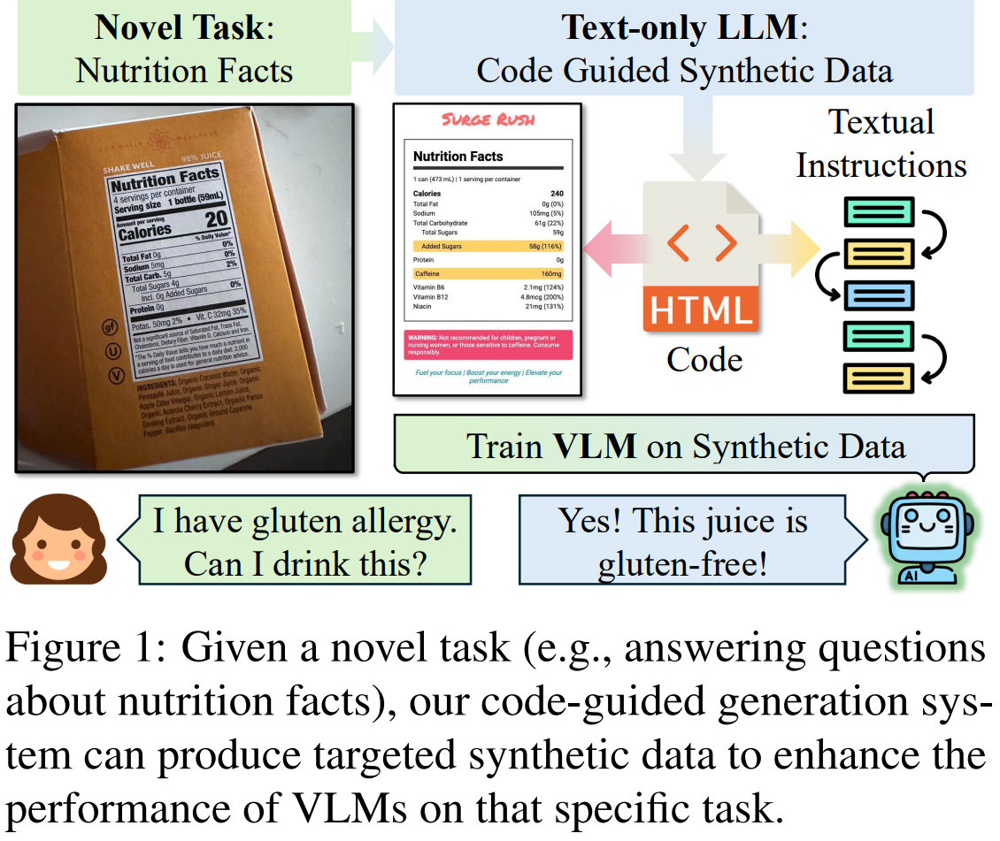
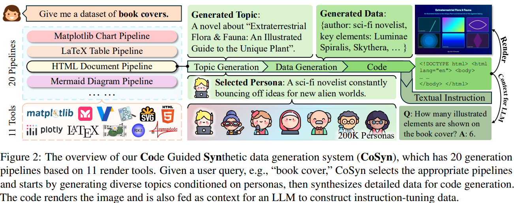
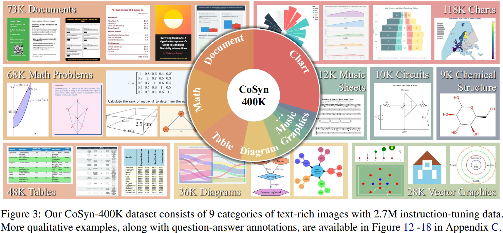
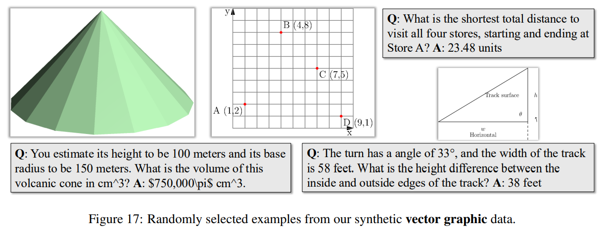
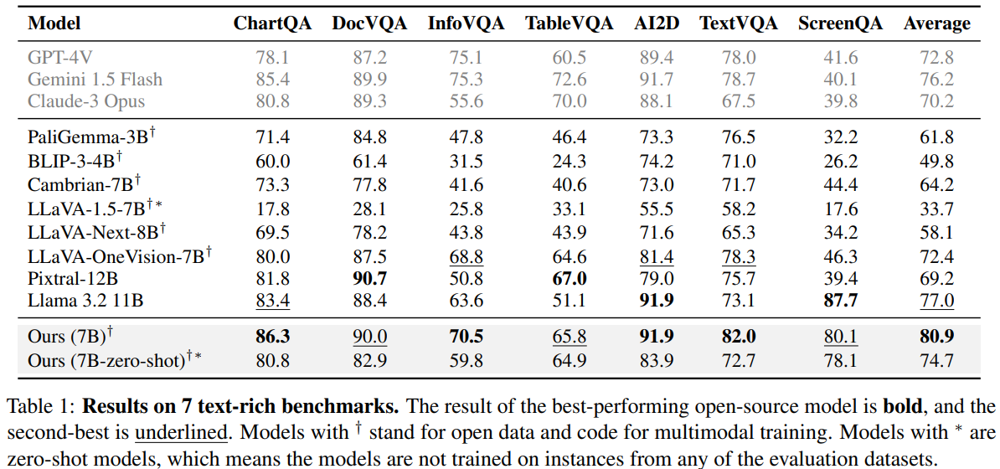
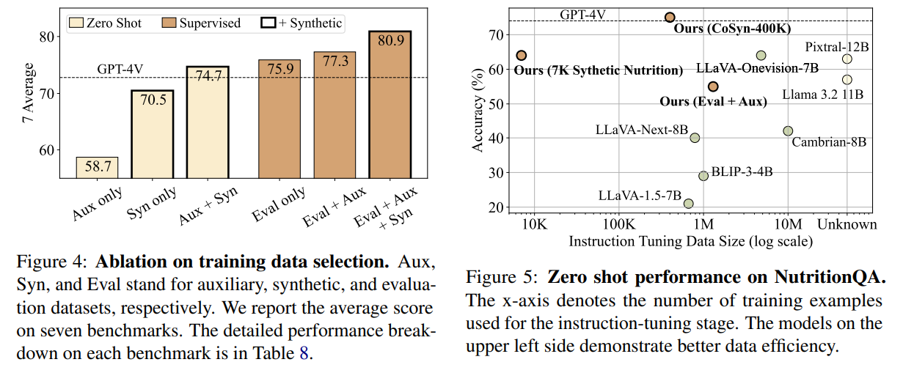
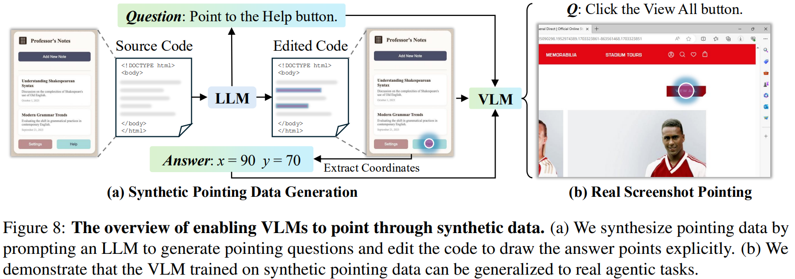

# Scaling Text-Rich Image Understanding via Code-Guided Synthetic Multimodal Data Generation

> https://aclanthology.org/2025.acl-long.855/

指令微调的 VLM 在一系列多模态任务中表现出色，然而，这些任务通常专注于自然图像的一般图像理解，而不是对图表、文档、图表、标志、标签和屏幕截图等富文本图像所需的专门推理。有效解释这些结构化视觉格式需要文本理解和空间推理，但当前高质量数据有限

受到通常由代码渲染的富文本图像的启发，我们开发了Code Guided Synthetic data generation system (CoSyn)用于生成多样化的合成富文本多模态数据，以进行视觉语言指令调整。

CoSyn可以从简短的自然语言查询（如书籍封面）生成各种目标领域的多模态数据。CoSyn利用LLM使用11种支持渲染工具（例如，Python、HTML、LaTeX）渲染多样化富文本图像的数据和代码。基于图像的底层代码表示，纯文本LLM还生成了文本指令，以创建视觉语言指令调整数据集。

使用此框架，我们构建了CoSyn-400K，这是一个大规模且多样化的合成视觉语言指令调整数据集，专为富文本图像理解定制。我们全面评估了在七个文本丰富的视觉问答基准测试中，使用CoSyn生成的合成数据进行训练的有效性。使用CoSyn合成数据进行训练能够实现样本高效学习，用较少的数据达到更强的性能。此外，CoSyn可以合成思维链（CoT）推理数据提升了需要多跳推理的任务的性能。



我们确定了开源视觉语言模型的一个关键局限性，即它们难以泛化到未接受过训练的领域外任务。如图1所示，我们引入了NutritionQA，这是一个理解营养标签照片的新颖基准测试。即使在数百万张图片上进行训练，开源视觉语言模型在这一新任务上的表现仍然不佳。然而，通过在CoSyn-400K上进行训练，我们的模型在零样本设置下强烈适应这一新颖领域，且所需训练数据显著减少。值得注意的是，通过使用CoSyn生成仅7K个领域内合成营养标签示例进行微调，我们的模型超越了大多数在数百万图像上训练的开放视觉语言模型（VLMs）。这突显了CoSyn的数据效率以及通过有针对性的合成数据生成帮助VLMs适应新领域的能力。

总体而言，我们的工作表明，合成数据是推进理解富文本图像的视觉语言模型并解锁其作为多模态数字助理在实际应用中潜力的一种有前途的解决方案

## 相关工作

关于富文本图像理解：

- 图表理解和富文本图像理解继续挑战最先进的模型，因为自然发生的支持训练以理解富文本图像的视觉-语言数据仍然稀缺
- 除了图表和图形之外，许多数据集涉及其他类型的富文本图像，如文档、信息图、图表和插图，以及屏幕截图
- 这些基准测试在规模、范围、可视化类型和问题类型多样性方面有限，使其适合评估但不适合用于可能导致泛化性能的训练数据

关于用于 VLM 的合成数据：

- 在视觉-语言数据有限的领域中，使用基于已有信息生成合成图像和标注已被广泛使用。这种方法已应用于图表和图形的问答（VQA），通常使用有限的小图表类型集合，并通过实例化手工制作的问题模板。
- 一些方法探索使用纯文本的大型语言模型从表格或与图表相关的文本描述生成注释，以训练视觉语言模型。
- 其他近期方法探索生成数据和代码来渲染合成图表
- 这些工作生成的合成数据在主题多样性、图表类型和渲染流程方面仍然非常有限，这对于泛化到分布外的任务非常重要。我们将范围扩展到图表之外，包括更广泛的多样文本丰富图像

## 背景

给定一个关于图像类型的文本查询q，例如流程图，我们的目标是创建一个合成的多模态数据集 $$\mathcal{D}_q=\{(I,T)\}$$，其中I是图像，T是文本指令调整数据（例如，问答对）。$$\mathcal{D}_q$$ 用于训练视觉语言模型，以提高其理解与q相关的图像的能力。我们方法的核心思想是使用代码C作为中间表示来桥接图像和文本。整体生成过程可以分解如下：
$$
P(I,T|q)=P_{\mathrm{LM}}(C|q)\cdot P(I|C)\cdot P_{\mathrm{LM}}(T|C)
$$

- $$P_{\mathrm{LM}}(C|q)$$ 表示提示语言模型生成代码C
- 该代码被执行以渲染图像 $$P(I|C)$$
- $$P_{\mathrm{LM}}(T|C)$$ 使用没有图像的代码C作为上下文，LLM 生成文本指令调整数据

## 方法



- 该系统接收一个语言输入，如“生成一组书籍封面数据集”，并输出一个多模态数据集。
- 根据输入查询，CoSyn 从基于11个渲染工具构建的20个生成管道中选择一个
- 过程从主题生成开始，该主题受控于指导风格和内容的采样人物角色。
- 系统生成数据内容并将其转换为代码，然后执行代码以渲染合成图像。
- 使用代码作为上下文，我们提示大型语言模型生成相应的文本指令

我们整合了各种渲染工具来生成不同类型的图像，形成了CoSyn在富文本图像生成能力的基础。我们为每个工具实现自定义功能，以执行由大型语言模型生成的代码，并获得相应的渲染图像。这些工具共同使CoSyn能够制作出大量高质量的、富含文本的合成图像。

> 例如，Matplotlib、Plotly 和 Vega-Lite 用于创建不同类型的图表。LaTeX 和 HTML 用于文档和表格，而 Mermaid 和 Graphviz 生成图表。我们使用SVG和Asymptote来创建矢量图形和数学相关内容。对于特定任务，我们依赖Lilypond生成乐谱，以及RDKit处理化学结构。
>
> 我们设计了20个基于11个渲染工具的生成流程，以支持创建九类富文本图像：（1）图表：Matplotlib VegaLite、Plotly、LaTeX、HTML；（2）文档：LaTeX、HTML；（3）表格：LaTeX、Matplotlib、Plotly、HTML；（4）图表：Graphviz、LaTeX、Mermaid；（5）数学问题：LaTeX；（6）矢量图形：SVG、Asymptote；（7）乐谱：LilyPond；（8）电路图：LaTeX；（9）化学结构：Rdkit。此外，我们还实现了一个独立的流程，使用HTML作为渲染工具来生成指向数据。

我们基于11个渲染工具设计了20条管道。每条管道遵循相同的程序：（1）主题生成，以定义这个合成示例的主题，（2）数据生成，以填充详细内容，（3）代码生成，以创建可执行的代码来渲染图像，以及（4）根据代码生成指令，包括问题、答案和用于思维链推理的解释。每个阶段都由针对图像类别和渲染工具定制的提示所控制。

大型语言模型通常仅依靠采样参数难以生成多样化的合成数据，偏差导致不同运行结果重复。最近的研究表明，在提示中融入人物角色可以通过使模型从不同视角生成来提高多样性。CoSyn在主题生成阶段采用人物角色来增强多样性。每个人物角色都是一个描述个性或身份的简短句子。

> 例如，如图2中间所示，我们抽取了一个人物角色“一位喜欢外星世界的科幻小说作家”，这导致生成书籍封面图像的主题是“一部关于外星植物群与动物群的小说”。我们使用了Ge等人（2024年）发布的20万个角色。

## 实验

CoSyn建立在DataDreamer库，支持稳健的多阶段合成数据生成管道，易于维护、复制和扩展。DataDreamer 记录了提示词和每一代使用的参数，并实现了几种高效技术，如并行生成和响应缓存，以优化性能。在数据生成和代码生成阶段，我们使用Claude-3.5-Sonnet，它在编码任务中表现良好（Anthropic，2024b）。对于指令微调数据生成，我们选择GPT-4o-mini（OpenAI，2023），因为其成本效益高。





我们使用CoSyn生成了包含九个类别的大规模合成数据集，共40万张图片：图表、文档、数学问题、表格、图表、矢量图形、乐谱、电路图和化学结构。由于CoSyn通过语言输入进行控制，它可以通过改变输入查询来轻松生成多样化的、细粒度的图像类型。例如，我们使用超过100个查询来生成涵盖收据、简历、饮食计划等的文档数据。

们遵循与Molmo相同的图像预处理和架构，该模型使用MLP层来连接视觉编码器和预训练的LLM。我们选择OpenAI的CLIP（ViT-L/14336像素）作为视觉骨干，Mistral-7B 作为语言模型。策略包括两个阶段：（1）在PixMo-Cap的密集字幕上进行预训练；（2）在三个类别数据集上进行有监督微调，包括合成数据集

我们表现最佳的模型使用了上述所有三个类别的数据集。我们还仅使用辅助数据和合成数据（不包括评估数据集中的任何示例）训练了一个零样本模型，该模型仍表现出具有竞争力的基准性能

我们将最近的开源大规模视觉语言模型（7B参数规模）进行比较，包括PaliGemma-3B 等。我们还包括了专有模型：GPT-4V 等



平均而言，我们的7B模型实现了性能最佳的模型。并且的零样本模型（表1中的最后一行）在不对评估数据集中的任何训练实例进行接触的情况下，表现优于大多数开放和封闭模型。相比之下，这些竞争模型通常依赖于基准训练数据，因此并非真正的零样本模型。这一结果证明了从我们的合成数据中学到能力可以有效转移到下游任务。

在零样本设置中，



- 当模型在辅助数据集（超过100万个训练图像，不直接来自评估任务）上进行训练时，它无法有效泛化到评估任务
- 仅使用40万份合成样本就能达到与GPT-4V相当的表现
- 当联合训练合成数据和辅助数据时，我们最好的零样本模型超越了GPT-4V
- 监督设置下，仅使用领域内数据进行训练就能获得强劲的性能
- 添加100万个辅助样本只能带来1.4%的适度提升，而结合合成数据则能带来更好的效果

视觉语言模型通常依赖领域内数据来在特定任务上有良好的表现，对于新任务较难泛化，然而，我们的CoSyn系统能够实现可控的数据生成。以任务名称为输入，CoSyn可以生成特定于任务的数据来微调模型。我们标注了一个小型评估数据集，称为NutritionQA。开源和没有在合成数据上训练的模型效果差，然而，在40万份合成样本上进行训练后，我们的模型与GPT-4V的性能相匹配，**泛化性提高**。此外，我们使用CoSyn生成了7K份合成营养标签样本，并仅利用这7K数据对模型进行了微调。由此产生的模型在NutritionQA任务上优于大多数 VLM

现有的文本丰富的数据集，如ChartQA只标注有简短答案，没有CoT的思考过程。我们的CoSyn-400K在简短答案旁边包含了解释文本。每个指令微调示例由一个（问题，解释，简短答案）三元组组成，使模型能够学习思维链（CoT）推理。在微调过程中，我们为合成数据设计了两种提示模板：

CoT Prompt:

```
<Question> Provide reasoning steps and then give the short answer.
<Explanation> Answer: <Answer>
```

Short Answer Prompt:

```
<Question> Answer with as few words as possible. <Answer>
```

这些提示允许视觉语言模型在两种回答风格之间切换，并**在必要时进行CoT推理，取得了较好的效果**

在ChartQA问题上，一些问题是人工注释的，另一些问题是机器生成的，仅在ChartQA上训练的模型往往过度拟合机器生成的问题，不过在训练期间加入合成数据可以将这一差距缩小，这表明**合成数据可以减轻基准测试中的过拟合**

为了量化我们合成数据集 $$\mathcal{D}=\{(I,T)\}$$ 中图像和文本的多样性，我们提出以下两个指标来计算多样性：
$$
\text{Diversity}(\mathcal{D})_{\text{Image}}=\frac{1}{|\mathcal{D}|^{2}-|\mathcal{D}|}\sum_{I_{i}\in\mathcal{D}}\sum_{I_{j}\in\mathcal{D}}^{i\neq j}\left(1-\text{sim}\left(I_{i}, I_{j}\right)\right)\\

\text{Diversity}(\mathcal{D})_{\text{Text}}=\frac{1}{|\mathcal{D}|^{2}-|\mathcal{D}|}\sum_{T_{i}\in\mathcal{D}}\sum_{T_{j}\in\mathcal{D}}^{i\neq j}\left(1-\text{sim}\left(T_{i}, T_{j}\right)\right)
$$
这两种度量都计算数据集中每个实例的特征之间的平均成对余弦距离。对于图像多样性，我们使用CLIP提取特征，而对于文本多样性，我们使用Sentence-BERT来获得问答对的嵌入。我们的合成图表在图像和文本多样性方面显著比现有数据集中的图表（如ChartQA）更多样化。

使用多种工具可以产生更高的图像多样性

除了多样性之外，合成数据的规模也会影响模型的表现

增加合成图表图像的数量可以提高ChartQA上的表现。这表明扩大合成数据的规模可以进一步增强下游任务上的 VLM 性能。由于资源限制，我们的最终数据集包含40万张图像，花费了我们大约8000美元。未来的工作可以探索扩大数据集规模，以推动合成数据潜力的边界

由 Claude-3.5- sonnet 生成的合成数据比GPT-4o产生了显著更好的结果。我们的定性观察发现，GPT-4o在代码生成中的失败率更高，特别是对于不太常见的编程语言或库。这一结果强调了强大的LLM对于视觉语言模型成功合成数据是至关重要的

- 无论是零样本还是监督设置下，合成数据都显著贡献。加入我们的合成数据一致性地提升了每项基准测试的表现
- CoT推理在ChartQA、TableVQA和NutritionQA上提升了表现，这些问题需要多跳和数学推理，与语言任务中的发现相一致。然而，由于简答题提示的注释偏见倾向于简洁的回答，CoT回答往往更为冗长，可能不完全匹配真实答案，导致表现下降

## 补充：指向数据

指向功能使视觉语言模型能够通过提供图像上的特定点来回答问题。这使得模型能够将它们的响应根植于与环境互动的视觉内容，这对于开发数字代理至关重要。我们发现我们的编码系统可以合成指向数据。由于我们可以访问所有生成图像的源代码，我们可以提示大型语言模型（LLM）修改代码以明确地在图像上绘制点。



我们将图像的源代码作为上下文输入到LLM中，LLM生成一个指向性问题并编辑代码以用预定义颜色绘制点。通过提取这些点的像素值，我们可以获得它们的精确（x，y）坐标。然后我们使用这个指向数据来训练视觉语言模型（VLMs），使其能够通过提供点坐标来回答问题。总共，我们为65K张合成图像生成了指向数据。

使用65K合成指向样本，我们的模型取得了与在155K人工注释样本上训练的模型相当的表现。在结合合成数据和人类数据时，我们的模型达到了最先进的性能

提高合成数据的多样性和真实感以更好地支持高度可变或不断发展的领域中的模型，是未来研究的一个合理方向

