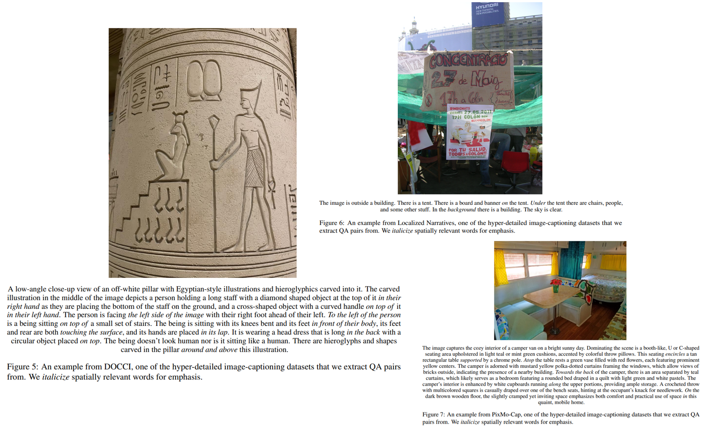
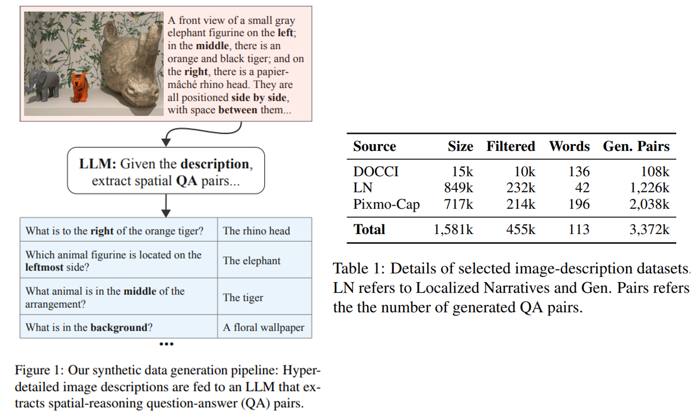
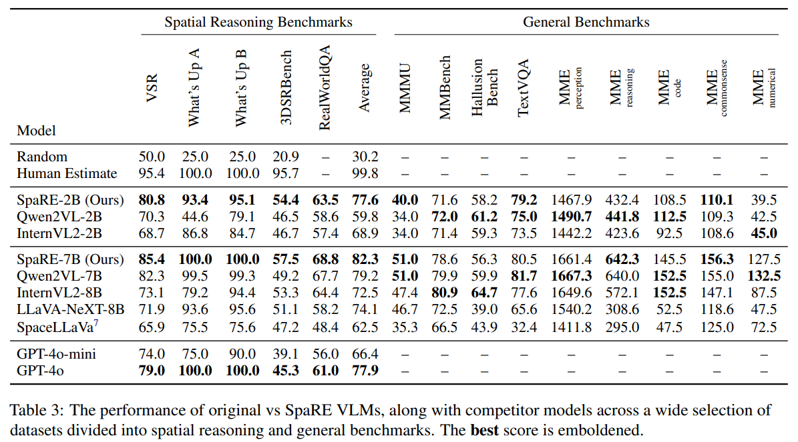

# SpaRE: Enhancing Spatial Reasoning in Vision-Language Models with Synthetic Data

> https://arxiv.org/abs/2504.20648

VLM 在例如图像标注、视觉问答（VQA）、图像-文本检索以及零样本图像分类取得了令人印象深刻的进展，但这些模型在空间推理方面始终存在困难，例如，VLMs可能会正确识别图像中的物体，但无法理解它们的空间布局，这对于场景理解和导航等任务至关重要。

现有的视觉语言数据集中很少包含空间关系（见表2）。常见的关系（如“上”、“左”和“下”）占主导地位，而较少出现的关系（如“面对”、“相对”和“环绕”）则严重缺乏代表性。实际上，前17%的关系占据了所有空间关系示例的90%以上（见附录中的表10）。这种不平衡使得VLMs在处理各种空间关系方面能力不足。

关于相关工作

- Johnson等人，2017年；Agrawal等人，2023年 提供了结构化和受控的环境，但它们依赖于简化的几何形状和合成生成的图像，这些图像无法推广到现实世界数据
- 类策划的数据集（Liu等人，2023a年；Kamath等人，2023年）在数量和空间关系的多样性方面都有限，导致性能持续不佳

我们利用最近长篇图像字幕数据集中未被挖掘的潜力，即超详细的 caption，这样的数据集包含丰富的详细图像描述，通常包括对空间关系和物体交互的明确描述。凭借这些资源，我们使用Qwen2.5-3B-Instruct提取专注于空间关系的合成问答（QA）对。具体来说，我们从超详细的字幕中提取空间信息，并构建多样且复杂的问答对，以探究空间推理的各个方面。通过使用真实世界的图像保持视觉真实性，我们的方法使模型能够在实际应用中遇到的上下文中学习空间推理技能，有效解决了由合成视觉引入的领域差距。

总结来说，我们的贡献主要体现在三个方面：

1. 空间推理数据少：我们分析了当前数据集中的空间关系，发现前17%的数据大约占样本的90%
2. 生成合成空间数据：我们开发了一种方法，利用先进的LLM从超过一百万张真实世界图像的超详细标题中生成合成空间推理问答对
3. 我们的方法显著提高了VLM的空间推理能力，最高可达49%，且不会影响一般VLM任务的性能

## 方法

为了生成大量的空间推理数据，我们选择了以下三个超详细的图像描述数据集：DOCCI（Onoe等人，2024年）、Localized Narratives（Pont-Tuset等人，2020年）和PixMo-Cap（Deitke等人，2024年）。

- DOCCI 以长篇幅、人类注释的英文描述为特色，包含原始策划的图像，旨在应对空间关系和世界知识等挑战，每个描述提供细致的细节
- Localized Narratives 通过同步转录的口语描述（即语音描述）与COCO、Flickr30k、ADE20K等图像上的鼠标轨迹，提供了一种独特的多模态图像注释形式，以增强诸如受控图像字幕生成之类的应用
- PixMo-Cap 是一个高质量预训练数据集，它包含一系列多样化的图像，这些图像与由大约70个主题上的注释者转录并精炼的口头描述所创建的详细、密集的字幕配对，以提供丰富的上下文信息用于模型训练

我们使用Qwen2.5-3B-Instruct 从图像描述中生成专注于空间推理的问答对。生成过程涉及以下步骤：

1. **预过滤** 从每个数据集中，我们仅筛选出包含明确空间信息的描述。我们提示Qwen2.5-3B-Instruct来识别给定描述中的空间关系，以这种方式过滤后，我们的组合数据集减少了约65%
2. **提示词构建和问答对生成**，我们构建了一个详细的prompt，以指导大型语言模型提取相关且多样的、仅限于空间推理的问答对。在生成过程中，我们以0的温度进行解码，最多生成8192个新标记。我们还强制生成结构化的输出，以JSON列表的形式呈现问答对，以便于解析。生成的问答对被引导以涵盖位置、方向和距离，同时排除非空间细节
3. **生成后质量保证** 为了确保我们在最终数据集中产生高质量的、与空间知识相关的问答对，我们应用了一套自动化验证技术，并剔除未通过这些技术检验的问答对。

关于生成后质量保证，包括如下环节，问答对根据前述自动化标准逐步筛选，这些标准按计算需求递增的顺序列出并应用

- **去重** 我们检查每个样本生成的问答对集合中的重复项并移除它们。具体来说，我们对问题进行全文匹配，并使用CLIP的语义相似性，阈值设为0.95，该阈值是通过手动测试25个样本图像中的一组问答对选定的
- **参考检查** 我们通过匹配关键词如“提及”和“描述”，过滤出那些引用描述而非直接询问图像的样本
- **答案-描述一致性检查** 我们检查答案是否出现在原始描述中以最大化其关联性。具体来说，我们验证答案的子集（如关键短语）是否出现在描述中，即使整个答案并未完全匹配
- **图片-问题一致性检查** 我们比较问答对中图片与问题的语义相似度以评估对齐情况。具体来说，我们使用CLIPScore，阈值设为0.25，该阈值是通过手动测试100个问答对样本选定的
- **空间关系验证** 我们过滤掉任何不构成空间推理问题的问答对
- 过滤掉了与我们无法下载的图片相关的问答对。这导致我们丢弃了大约5万份样本，主要来自PixMo-Cap

为了进一步验证我们数据集的质量，我们从数据集中抽取了一个代表性的400个样本子集，我们观察到问答对的错误率约为4%，我们认为对于合成数据集来说这是合理的。

> 400 的数字来源于finite population公式
> $$
> n=\frac{N Z^{2}p(1-p)}{E^{2}(N-1)+Z^{2}p(1-p)}
> $$
> 其中，*N*=455,494（数据集大小），*Z*=1.96（95%置信水平），*p*=0.5（最大方差），以及 *E*=0.05（误差幅度）。代入这些值后，我们得到 *n*≈384，为了稳健性，我们将它四舍五入到400

在我们的初步研究中，我们发现幻觉的主要原因是描述中没有任何实际的空间关系。这一洞察促使我们对这类描述实施了积极的过滤策略。经过这种重新限定后，幻觉变得可控，关系和对象幻觉率分别降低到大约4%和3%

我们的流程生成了45.5万份样本，包含340万个问答对，有助于解决视觉语言模型（VLM）数据集中缺乏空间推理数据的问题。通过提供跨越各种空间关系和上下文的多样化示例，我们提高了视觉语言模型学习和泛化空间推理的能力，从而在相关任务上取得了更好的表现。

关于训练目标，通过优化模型预测的文本标记概率与真实文本标记概率之间的交叉熵损失来训练 VLM，对视觉标记不计算损失。给定一个输入图像 I 及其对应的文本输入X（即一个问题）以及目标输出序列（即答案）$$Y=\{y_1,...y_T\}$$，模型旨在最小化给定输入的目标标记的负对数似然，$$\theta$$ 为模型参数，$$p_{\theta}\left(y_{t}\mid I,X,y_{<t}\right)$$ 是在给定图像I、问题X以及之前的 token 的情况下，在位置t生成标记 $$y_t$$ 的概率
$$
\mathcal{L}=-\sum_{t=1}^{T}\log p_{\theta}\left(y_{t}\mid I,X,y_{<t}\right)
$$

## 实验

我们选择Qwen2-VL-2B-Instruct和Qwen2-VL-7B-Instruct作为我们微调的基础VLMs，对于2B模型，所有权重都进行了训练；而对于7B模型，我们使用LoRA来节省内存。

我们在这些空间推理基准上进行评估，此外，为确保空间推理的改进不会牺牲整体性能，我们在一般视觉语言基准上进行评估。

使用准确性作为所有空间推理基准测试的主要指标。对于选择题任务，我们提示视觉语言模型预测正确答案，然后应用字符串匹配将输出与真实答案进行比较。对于二元分类任务，我们通过预测真或假来评估二元准确性。

- 我们微调的模型在空间推理基准测试中表现出显著的提升
- 微调后的模型在一般视觉语言任务中与原始模型的表现不相上下，差异微小。这表明融入合成空间推理数据并不会损害整体能力
- SpaRE模型在RealWorldQA数据集上，相较于原始的2B和7B模型分别提高了4.9%和1.1%，显示出其空间推理能力扩展到了真实世界数据，而不仅仅是合成或受控环境
- 但在3DSRBench上的表现相对较弱，视觉语言模型在共情式空间推理方面存在困难。这意味着它们在推理空间关系时未能采纳他人的视角。这种源于源数据集的以自我为中心偏见也出现在我们的合成数据集中。

