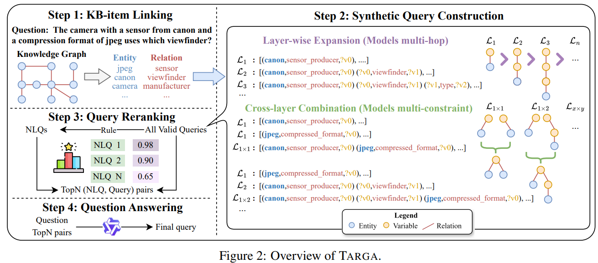
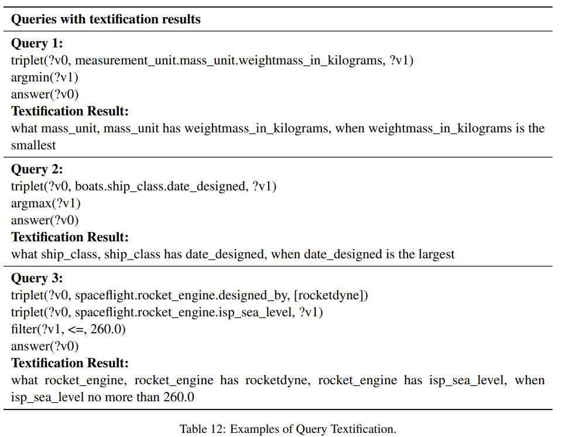
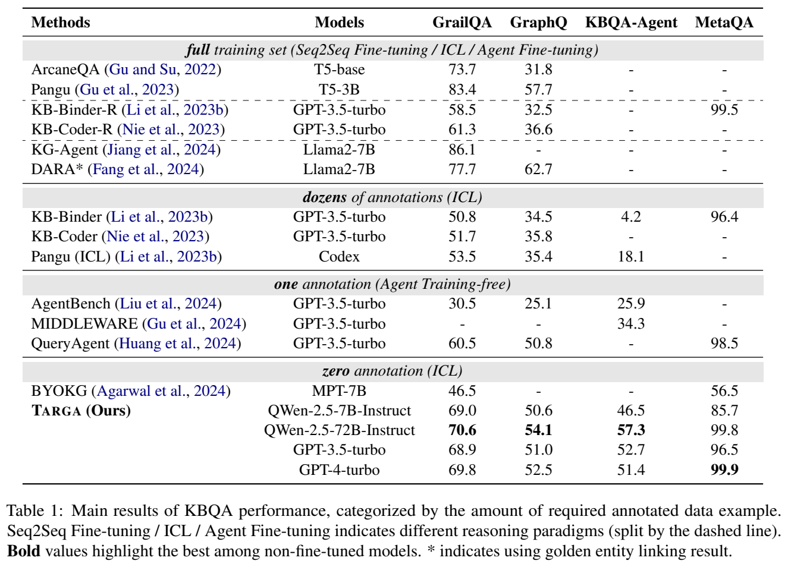

# TARGA: Targeted Synthetic Data Generation for Practical Reasoning over Structured Data

> https://aclanthology.org/2025.acl-long.137/

在结构化环境（如知识库、数据库和网页）中进行推理已成为 LLM 的关键能力，语义解析作为主流技术脱颖而出，并日益受到研究人员的关注。通过将自然语言问题（NLQ）转换为逻辑形式，语义解析实现了与结构化环境的无缝交互，从而提升了用户体验和可访问性。

然而，当前的语义配对方法通常面临两个重大挑战：

- 依赖注释。以往的方法通常依赖于大量的手动注释数据。是劳动密集型的且耗时
- 有限的泛化能力。即使能够访问大型注释数据集，以往的方法在泛化到未见过的示例时仍然存在问题。无论采用何种范式（例如，上下文学习或微调），任何依赖静态的、离线收集的数据集的方法都不可避免地受到数据集分布的影响

为了应对上述挑战，在这项工作中，我们提出了一个实用的语义解析框架，称为目标合成数据生成（TARGA），它不需要任何手动注释的数据，并且能够高效地处理70亿参数的模型。具体来说，TARGA通过动态合成与给定问题高度相关的测试问题示例作为**上下文学习的演示**来应对这些挑战。从可能与给定问题相关的知识库项目（实体、关系）开始，我们通过逐层扩展（为子结构添加新边）和跨层组合（组合不同子结构）构建逻辑形式，逐渐从简单结构演变到复杂结构。为了进一步提升相关性，我们对合成的逻辑形式进行重新排序，选择最相关的内容，并生成相应的自然语言问题，这些自然语言问题随后被用作推理的演示。通过这种自动数据合成，进一步增强了相关性，我们重新对合成的标注任务进行排序。此外，演示是基于给定问题生成的，因此自然而然地避免了泛化的挑战。

在没有数据注释的情况下，TARGA在多个复杂的知识图谱问答数据集上显著优于所有未微调的方法，特别是在非独立同分布设置中表现尤为突出。值得注意的是，TARGA仅使用一个70亿参数的模型就实现了这一目标，而大多数基线依赖高级闭源模型，例如gpt-3.5-turbo，从而实现更快且更具成本效益的推理。即便只有一次演示，TARGA在GrailQA上的表现仍然超越了所有未微调的方法。此外，TARGA在对抗性设置中展现了显著的鲁棒性。

## 相关工作

最近的研究采用大型语言模型作为知识图谱问答的后端，现有的基于上下文学习的知识图谱问答工作通常从手动注释的训练集中检索最相似的例子作为演示。然而，这一策略常常导致在涉及未见结构或知识图谱项的非独立同分布问题上性能下降。

另一条知识图谱问答方法线，即基于 Agent 的方法，将问题分解为单独的步骤来解决。虽然逐步解决问题符合人类直觉，并展现了显著的泛化能力，但它带来了高计算成本，并在构建轨迹方面提出了挑战。此外，基于代理的范式的有效性严重依赖于先进 LLM 的计划和泛化能力，因此在较弱模型（如某些开源变体）上的表现不佳。这种依赖性强调了当无法获得或由于资源限制而无法实际使用更优秀的大型语言模型时，基于代理的方法的局限性。

与我们类似的其他工作需要耗时的离线数据收集阶段。更重要的是，像其他方法一样，它们依赖于对预先收集的静态数据集进行推理，这仍然存在着泛化问题。在TARGA中，我们系统地设计了一个框架，以动态在线合成相关示例。它避免了冗长的数据收集过程，使我们能够动态地为每个测试案例获取最相关的示例，而不受静态数据集的限制。

## 背景

关于知识库问答，设E为一组实体，P为一组关系，C为一组类别，I为一组文字。知识库 $$\mathcal{K}\subseteq E\times P\times(E\cup C\cup I)$$ 是一组三元组(s,p,o)，其中s∈E是主体实体，p∈P是谓词，o∈(E∪C∪I)是对象实体、类别或文字值。知识库问答任务可以形式化为学习一个函数f，该函数接收自然语言问题q作为输入，并以SPARQL等形式化语言输出一个结构化查询q′=f(q)。理想情况下，结构化查询q′应编码输入问题q指定的实体、关系和约束条件，以便在知识库K上执行q′能够得出q的正确答案。

In-context learning允许大型语言模型仅通过观察输入中提供的示例来执行新任务，而无需更新其内部参数。直观地说，模型从上下文中“学习”，并使用它为类似任务生成适当的响应，依赖于它从给定示例中识别出的模式。

在知识图谱问答（KBQA）的背景下，三个层次的泛化：

- 独立同分布（I.I.D.）泛化指的是模型正确回答从与训练集相同分布中抽取的问题的能力，这假设测试数据遵循类似的模式和框架
- 组合泛化指的是模型处理在训练期间见过但配置之前未遇到过的知识库（KB）项目（例如，实体和关系）的新颖组合的能力
- 零样本泛化指的是模型回答涉及全新KB项目的问题的能力，比如训练集中从未出现过的未见过的实体和关系。

> 零样本设置意味着给定问题包含训练集中未见过的实体或关系。组合设置涉及的是训练集中虽存在但从未一起出现过的实体和关系的组合

仅依赖独立同分布的数据集限制了知识图谱问答（KBQA）模型的实际应用，因为现实世界的问题通常涉及不熟悉的实体或需要新颖推理。这一限制在组合和零样本设置下现有KBQA方法的性能相较于独立同分布设置下降是显而易见的。因此，实用的KBQA模型应该具备在所有三个层次上的内置泛化能力，以更好地处理多样化的现实世界问题。

## 方法

我们的目标数据合成框架TARGA由四个部分组成。

1. 给定一个自然语言问题nlq，首先收集候选知识库项，如实体 $$E_{nlq}$$ 和关系 $$R_{nlq}$$ 作为初始化
2. 从简单到复杂结构探索有效的查询图来构建合成查询Q。
3. 通过排名过滤高相关性的候选查询
4. 使用这些高质量合成数据作为问答推理的示范

对于候选实体，我们采用顾等人（2023年）提供的链接结果进行公平比较。对于候选关系，我们基于文本嵌入ada-0022计算问题与Freebase关系的相似度，并保留最相似的20个候选。

> 与以往微调方法（叶等人，2022年；胡等人，2022年）不同，这些方法通常需要训练一个关系链接模型以获得更高的精确度和召回率，我们的方法不依赖于这些项目的精确度。这是因为，尽管所有检索到的知识库项目都与问题相关，但它们并不一定能在特定的图结构中形成有效的组合。

通过这种方式，后续查询构建步骤可以被视为一个联合的实体-关系消歧过程，从而显著减少无效查询的数量。

现在需要构建针对问题的查询，以促进后续的问答推理。给定一个知识库 G 和与问题 nlq 相关的检索到的知识库项目集合，我们探索可能的查询结构 Q，这些结构是有效的（即，产生非空的执行结果）。具体来说，我们使用 PyQL（黄等人，2023a）来表示构建过程中的逻辑形式。

然而，枚举所有可能的结构可能会导致难以管理的组合爆炸。为了缓解这一问题，我们对候选查询的探索遵循从简单到复杂的方式，我们只进一步探索那些从已验证为有效的子结构派生出的新结构。从图2中最简单的结构（L1）开始，我们逐步通过逐层扩展（用于多跳结构）和跨层组合（用于多约束结构）来搜索更复杂的查询结构，逐渐扩展所获得的查询图，直到达到期望的复杂性。

逐层扩展被用来模拟多跳结构（查询图的深度），这些结构是类似链条的、非分支的查询结构，起源于单个实体。我们定义 $$\mathcal{L}_k$$ 为查询集合，其中实体到链式查询结构中最远变量的距离为k。具体来说，我们首先确定 $$E_{nlq}$$ 与 $$R_{nlq}$$ 之间所有可能的连接，形成最简单的查询结构 $$\mathcal{L}_1$$ ，其中实体s通过单一关系*p*与变量o相连。EXEC(*q*,G)表示查询q针对G的执行结果。
$$
\mathcal{L}_{1}=\left\{(s, p,o)\mid s\in E_{nlq},p\in R_{nlq},\operatorname{EXEC}((s, p,o),\mathcal{G})\neq\emptyset\right\}
$$
然后我们通过将终端变量节点与另一个关系连接起来，以构建一个新的变量，从而逐步向外扩展，形成 $$\mathcal{L}_2$$ ，依此类推。通常， $$\mathcal{L}_{k+1}$$ 是通过在上层 $$\mathcal{L}_k$$ 的有效查询中加入一条额外的边来形成的。
$$

\mathcal{L}_{k+1}  =\left\{q \cup\left(o_{i}, p^{\prime}, o_{j}\right) \mid q \in \mathcal{L}_{k}, o_{i} \in \mathcal{O}(q),\right. 
p^{\prime}  \left.\in R_{n l q}, \operatorname{EXEC}\left(q \cup\left(o_{i}, p^{\prime}, o_{j}\right), \mathcal{G}\right) \neq \emptyset\right\} .
$$
其中，O(*q*) 表示变量q中的变量集合，$$o_j$$ 是一个新引入的变量。当达到复杂度阈值（例如，3跳）时停止扩展过程，因为对于一个连贯且合理的问题，一个特定实体到最终答案之间的距离通常不会超过三跳。

跨层组合模型通过合并两个查询来组合多约束结构（查询图的宽度），从而对同一变量应用多个约束。给定两个查询q和*q*′，我们选择每个查询中的一个变量（对于q是 $$o_i$$，对于*q*′是 $$o_j$$）作为它们的公共变量，然后通过这个共享变量将这两个查询组合成一个更复杂的查询。

我们定义 $$\mathcal{L}_{x\times y}$$ 为通过组合来自 $$\mathcal{L}_{x}$$ 的一个查询和来自 $$\mathcal{L}_{y}$$ 的一个查询形成的查询集合。具体来说，我们从最简单的组合开始，比如合并 $$\mathcal{L}_1$$ 中的两个查询，然后逐渐探索更复杂的组合模式，这个组合过程可以正式表达为：
$$
\mathcal{L}_{x\times y}=\left\{q\cup q^{\prime}\mid q\in\mathcal{L}_{x},q^{\prime}\in\mathcal{L}_{y},\exists o_{i}\in\mathcal{O}(q),o_{j}\in\mathcal{O}(q^{\prime}),\mathcal{E}\left(o_{i}\right)\cap\mathcal{E}\left(o_{j}\right)\neq\emptyset,\operatorname{EXEC}\left(q\cup q^{\prime},\mathcal{G}\right)\neq\emptyset\right\}
$$
其中，$$\mathcal{E}(o_i)$$ 指的是在查询q对图G执行结果中对应于变量 $$o_i$$ 的实体集合。一旦查询结构达到五个边，这种组合就会终止，这对于模拟当前数据集中大多数问题是足够的。

通过这种方式，我们规避了大量的无效查询，从而以相对较低的查询开销获得了大部分潜在相关的查询。每个问题的平均有效候选查询数只有几十的范围，这在由交互式内容学习（ICL）模型管理的上下文长度限制之内。

为了获得后续问答任务最相关的例子，我们使用基于它们与问题的相似性的 bge-reranker-v2-m3 模型对所有有效查询进行重排。此外，我们采用了一个称为“**查询文本化**”的过程，通过启发式规则将合成查询转换为更接近自然语言的格式。这一步骤有助于弥合文本嵌入模型与查询之间的差距，进一步提高排名的质量。

> 关于 textification 的细节，首先用它们的标签替换三元组中的实体和关系，将主题、谓词和宾语连接起来创建一个描述。对于两个嵌套的描述（多跳），我们用“a have b”的层次形式表示它们。对于两个连词描述（多约束），我们用“ and ”连接这两部分。我们还对过滤器应用了一些简单的处理，比如使用“多于”和“少于”来连接比较对象。
>
> 

为了解决复杂查询指数级增长引起的不平衡问题，我们实施了一种分层排名策略。对于源自同一父查询（该查询派生的子查询）的所有查询，我们只保留前n个候选项。最终的候选查询池是所有排名靠前的候选项的并集：
$$
Q_{\text{ranked}}=\bigcup_{a \in \mathcal{A}} \operatorname{Argmax}^{(n)}_{q \in Q, \operatorname{Parent}(q)=a} \operatorname{SCORE}(QT(q), nlq)
$$
其中Q表示在查询构建过程中生成的查询集合，SCORE衡量相似性，QT是查询文本化。PARENT (*q*) 表示q的父查询，A 指具有子查询的父查询集合。这种方法确保候选池的大小以可管理的速率增长，同时保留高质量的查询以供下游处理。

为了帮助大型语言模型理解所提供的查询的语义，我们为每个生成的 query 配备其相应的自然语言问题（natural language questions，NLQ），形成（NLQ，查询）对。具体来说，我们直接使用文本化结果作为自然语言问题，确保效率和信息完整性的保留。然后，我们采用上下文学习范式来生成目标查询。最后，我们解析并执行大型语言模型输出的查询以获得答案。

## 实验

我们使用四个复杂的知识图谱问答数据集进行实验。使用F1分数作为知识图谱问答的评估指标，使用文本到SQL的去噪准确率。我们将TARGA与各种基线范式进行比较，包括微调、上下文学习和代理，我们在原始论文中报告了性能。我们使用Qwen-2.5-7B 在我们的实验中作为基础 LLM，对所有数据集进行10个demonstrations

- TARGA在基于先进闭源大型语言模型的所有非微调方法中取得了最佳性能
- 我们的方法既不需要任何手动注释的语料库，也不需要昂贵的闭源模型。此外，我们没有加入自一致性来提升性能。这可以归因于合成数据的高质量，它降低了任务难度，并减少了对强大大型语言模型能力的依赖。而且，与其他包含40-100个演示的基于ICL的方法相比，TARGA仅使用10个演示就能达到最佳性能，显示出显著的数据效率
- TARGA动态地为不同问题合成最相关的数据，使其能够无缝适应来自任何分布的问题。此外，TARGA生成的合成数据是在线生成的，无需耗时的离线数据收集阶段
- 预先收集大量示例最终是一个不完整的解决方案，并且在遇到真正未见过的实际问题时往往会失败
- 如果与消耗的令牌相比，TARGA使用了显著较少的令牌，因为它需要的示例演示更少，并且不使用自一致性。因此，令牌成本仅为其他基于ICL方法的大约1/10
- 在不同规模的 LLM 上有效
- 我们调整了我们的框架以适应Text2SQL任务，以展示我们的方法在其他语义解析任务中的通用性
- A case study 可见 Table 15

