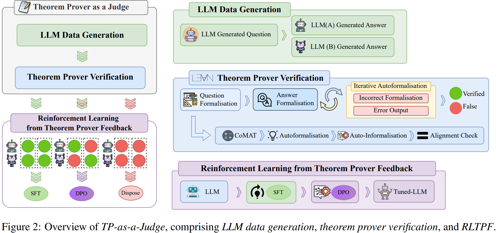

# Theorem Prover as a Judge for Synthetic Data Generation

> https://aclanthology.org/2025.acl-long.1448/

LLMs越来越能够解决数学问题，尽管这些方法在基准测试如GSM8K上取得了成功，但它们容易出现重大缺陷。具体来说，大型语言模型生成的CoT推理步骤可能经常包含错误，导致即使最终答案看起来合理，也会得出错误的解决方案

为了解决这些缺陷，基于编程的工具如Python和SMT求解器如Z3求解器已被广泛用于提高推理能力，还有定理证明器如Lean和Isabelle。这些系统提供了对大型语言模型推理步骤逻辑有效性的形式化验证。尽管如此，它们并非没有挑战；自动形式化错误通常会导致在复杂任务的定理证明器验证过程中执行失败

合成数据生成作为一种增强数学推理的有前途的方法出现了。一种常用的验证方法是大型语言模型作为裁判，其中大型语言模型评估并生成推理数据。然而，这种方法通常引入偏见。

对于推理数据生成，像蒙特卡洛树搜索（MCTS）这样的迭代技术被应用于改进推理步骤并实现准确解决方案。虽然MCTS提高了推理质量，但由于展开次数众多，其计算开销巨大，限制了其在大规模应用中的可扩展性。

为了克服这些挑战，我们首先通过提出迭代自动形式化来解决自动形式化中的执行失败问题，该方法将自动形式化错误作为反馈整合，从而确保每个中间推理步骤都得到验证。具体来说，我们使用Lean证明器作为我们的自动形式化验证器。

> 与基于Python的方法不同，后者改进执行轨迹，迭代自动形式化验证形式系统内的个别证明策略、定理和逻辑步骤。随着问题复杂性的增加，需要额外的迭代来进行准确的自动形式化。仅仅在单次失败后丢弃问题，有可能引入对较简单问题的偏见。

在此基础上，我们引入定理证明器（Theorem Prover）作为裁判（TP-as-a-Judge），一种在数学推理任务中生成合成数据的新颖框架。TP-as-a-Judge 集成了一个定理证明器，利用其逐步验证来确保逻辑正确性。

然后我们提出了从定理证明器反馈中进行强化学习（RLTPF），这是一种新颖的方法，定理证明器通过提供形式化反馈来替代人类注释者。通过应用 TP-as-a-Judge 和RLTPF，我们在GSM8K和AIME 2024数据集上取得了与在更大数据集上微调的模型相竞争的绩效。这证明了中间推理在数据质量中的重要性，并提高了模型训练的数据效率。

## 方法

关键阶段：

- LLM数据生成，其中大型语言模型生成问题和答案
- 定理证明器验证，定理证明器评估模型在生成数据上的推理有效性，并继续进行RLTPF，利用验证结果通过监督微调（SFT）和直接偏好优化（DPO）来精炼模型。

我们将逆向问答方法应用于数学领域，构建我们的初始合成数据集。该技术涉及向模型提供几个示例解决方案，并指导其生成与这些解决方案一致的相应问题。我们使用的数据集来源于两个主要来源：GSM8K数据集和MATH数据集。这种方法使我们能够涵盖广泛的数学问题。在我们的设置中，我们主要关注三个核心领域：问题解决、代数以及计数与概率。

生成样本后，我们使用gpt-4o和chatgpt-4o-latest作为两个主要模型来生成合成问题的解决方案。随后，使用gpt-4o进行自动形式化，之后将输出传递给定理证明器进行验证。定理证明器验证过程分为两个阶段：**问题与答案的形式化**。

在问题形式化阶段，每个问题都通过定理证明器进行形式化和验证，作为过滤缺乏清晰度的问题的过滤器。该过程遵循四阶段方法

- 从原始问题（s0）开始
- 在第一阶段（s1），我们应用CoMAT方法将s0转换为符号表示
- 第二阶段（s2）涉及自动形式化，其中使用定理证明器对符号表示进行形式化和验证
- 因为缺乏评估正确性的明确指标，造成了问题自动形式化的困难。我们引入了第三阶段（s3），自动非形式化，其中形式化的陈述是通过gpt-4o翻译回自然语言
- （s4）对齐检查，使用第二个gpt-4o验证步骤来确保s0和s3之间的对齐。这作为一个一致性检验，确认自动形式化过程的正确性。

设Q表示所有生成问题的集合。自动形式化函数s将每个问题q ∈ Q映射到其形式化表示s(q)
$$
s:Q\rightarrow S, s(q)=s_4(q)
$$
其中S是成功验证的问题及答案的集合，$$s_4(q)$$ 是经过四阶段过程后的最终表示。不符合要求的问题，即 $$s(q) \neq s_4(q)$$，被标记为逻辑不一致或表述不当，并从答案形式化中排除。

在答案形式化阶段，模型将每个有效问题 $$q\in Q_{\text{valid}}$$ 的推理结果a(q)转换为一种形式化表示：
$$
a'(q) = \text{Formalise}(a(q))
$$
然后使用定理证明器验证推理的每一步 *a*′(*q*)，确认每一步的有效性。例如，模型可能会进行计算或生成特定策略来证明其进展；这些策略由定理证明器正式验证，以确保遵循数学原理，如图所示。

设 $$\{a_i'(q)\}$$ 表示在 a'(q) 中的证明步骤序列。验证过程对每个答案产生三种可能的结果之一，

1. Verified：步骤被定理证明器验证
2. False：定理证明器驳斥了任何一步
3. error：如果自动形式化未能通过定理证明器执行

任何导致 false 的答案要么从合成数据集中移除，要么保留用于强化学习定理证明反馈（RLTPF），如表所示，而 error 将通过迭代自动形式化进行进一步改进。通过形式化问题和答案并严格验证它们，我们确保整体推理链符合数学逻辑和标准，从而提高数据集质量。

尽管形式化过程可能在初始迭代中引入 error，我们提出了一种迭代自动形式化的方法，即模型在自动形式化过程中从其 error 中学习（算法1）。我们的方法侧重于数学自动形式化，纠正每一个单独的步骤，提示模型使用定理证明器来修订和重新验证自动形式化。这种迭代过程反映了形式化的本质，因为即使是人类专家也需要多次尝试才能正确形式化复杂问题。模型可能需要尝试不同的定义，完善假设，或尝试部分证明以识别缺失的条件。我们展示了在最多五次迭代后，迭代细化将Lean证明器形式化代码的执行率从60%提高到87%。

在传统的RLHF中，人类评估者提供结构化反馈，帮助模型区分在有效和无效推理之间。相比之下，RLTPF用定理证明器替换了人类评估者，该证明器验证每一个形式化的推理步骤。在我们的框架中，定理证明器基于验证结果对训练数据进行分类，确保模型从经验证的推理模式和需要进一步细化的案例中学习。

具体来说，当两个大型语言模型（LLM）生成的答案都经过定理证明器的验证时，相应的数据集被用于监督微调（SFT）。当一个LLM产生正确答案而另一个产生错误答案时，配对的数据集被用于直接偏好优化（DPO）。然后在经过验证的数据上使用SFT对模型进行训练，之后使用配对数据集通过DPO进行进一步的优化。

## 实验

合成诱导型数学问答（SIMQA）是我们的初始训练数据集，包括3,508个样本，其中1,876个是从GSM8K合成生成的，1,632个来自MATH。我们在一系列多样化的数学基准上进行评估。

在创建我们的SIMQA数据集时，我们使用OpenAI的gpt-4o模型，包括gpt-4o-2024-08-06和gpt-4o-2024-11-20以及ChatGPT-4o-latest，交替用于SIMQA合成数据集创建过程。

对于RLTPF，我们采用两阶段训练策略，包括一个监督微调（SFT）周期，接着是三个直接偏好优化（DPO）周期进行强化学习。

我们将其应用于多种 LLM，使用低秩适配 LoRA 作为微调的基线，以提高计算效率。使用三种基线进行比较：（1）标准提示，模型被指示提供答案而不进行任何推理；（2）CoT提示，以及（3）模型训练，涉及对合成数据集中的3,508个样本执行RLTPF训练。

- TP-as-a-Judge 在大多数数据集上一致优于传统的CoT
- 更先进的模型则表现出更强的推理能力，并取得了更高的准确性
- 仅通过应用RLTPF于仅有3,508个样本的数据集，TP-as-a-Judge在与所有其他合成数据生成模型（这些模型都经过大量数学数据集的微调）的竞争中取得了有竞争力的基准测试成绩
- 对TP-as-a-Judge在验证模型解决方案方面的有效性进行了分析。30%在问题形式化阶段失败，可能被归类为问题表述不清。在剩余的70%中，大约有5%在答案形式化阶段出现了来自Lean证明器的执行 error
- 尽管gpt-4o、o1和o3-mini模型在GSM8K数据集上取得了高准确率，但当回答合成问题时它们的性能显著下降。这突显了模型处理自我生成问题的能力存在显著差距，证明了定理证明器在验证中的重要性，以及现有大型语言模型在数学推理方面的潜在差距
- 关于正确验证推理步骤，TP-as-a-Judge强于仅使用o1-mini作为基于大型语言模型的判断器。这些结果展示了Lean证明器内迭代自动形式化的稳健性，并突显了TP-as-a-Judge在验证中间推理步骤中的有效性
- 50%的自动形式化尝试需要多次迭代才能产生一个正确的自动形式化，使其能够通过Lean证明器成功评估。这表明迭代自动形式化在改进推理步骤中的重要性
- 发现大约40%的样本需要迭代精炼以增强形式化，大多数需要迭代自动形式化的成功自动形式化是在第三次迭代时实现的，这表明多轮错误校正显著地有益于模型。
- 这些错误通常是由Lean生成的错误定理或策略，或者模型产生无效的Lean语法所导致，通常需要进一步的一到两次迭代来纠正。通过迭代自动形式化来自Lean的反馈使模型能够精炼语法和定理选择，从而正确地验证每一个理由。
- 迭代次数与序列长度（以标记计算）呈现强烈的正相关关系，因为更复杂的推理自然会产生更长的标记序列，随着迭代次数的增加，该方法适应了越来越复杂的推理案例

## 局限

- 定理证明器在数学推理中非常有效，但在其他领域仍然具有挑战性，使其超出数学领域的扩展成为一个开放的研究问题。虽然形式化方法相较于标准方法增强了验证能力，但它并非完美无缺，需要进一步改进以增强其广泛适用性
- 我们当前的实现主要集中在代数、计数、概率和解决问题数据集上。扩展到其他数学领域可能会提高泛化能力和模型性能
- 数据集复杂性受限于大型语言模型可靠解决问题的能力。在生成更具挑战性的问题时，模型常常失败，限制了合成数据的复杂性，并阻止了更高级数学问题的创建。
- 计算限制影响了可扩展性，特别是对于超过80亿参数的模型，需要大量资源进行大规模验证和训练
- 形式化的迭代性质带来了高计算成本，因为需要多个改进周期来确保正确执行。解决这些挑战将使合成数据生成更加高效且可扩展。