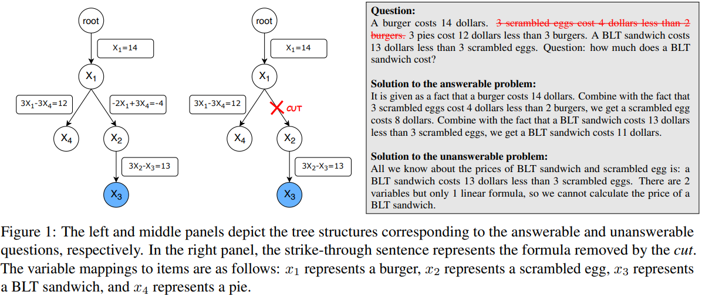

# TreeCut: A Synthetic Unanswerable Math Word Problem Dataset for LLM Hallucination Evaluation

> https://aclanthology.org/2025.acl-short.84/

LLM 在数学推理能力方面取得了显著进展，通过利用诸如思维链提示之类的技术达到了较好效果。与此同时，有一系列研究质疑大型语言模型在表面变化下的推理能力，这些变化不会改变底层逻辑：

- 大型语言模型容易被不相关的上下文或不会改变推理任务底层逻辑的标记级扰动所分散注意力
- 数据集中的问题中的数值被改变时，大型语言模型的表现会下降
- 对现有数学文字题目的细微修改，以创建**无法回答的变体**，并发现大型语言模型通常会为这些无法回答的问题生成幻觉般的答案，即使它们在原始可回答的数据集上表现良好

对于**挑战大型语言模型不去回答无法回答的问题的能力**，依赖于现有的数学文字题目资源，使其容易受到训练数据污染的影响，范围有限，并且缺乏用于扩展研究的丰富结构。我们提出了TREECUT，一个能够系统生成无限数量无法回答的数学文字题目及其可回答对应题目的合成数据集。TREECUT考虑由树表示的问题，节点代表变量，边代表公式。通过移除一条边来生成无法回答的问题。

此外，TreeCut允许对每个问题的结构组件进行精确控制，使得能够详细调查大型语言模型何时以及为何产生幻觉。我们的分析强调，更深的树、复合项目名称以及移除路径中间附近必要的条件都会增加产生幻觉的可能性。

## 方法

我们旨在完全控制决定数学文字题潜在结构的各种因素：实体的名称、数值以及问题的复杂性。此外，我们寻求通过精确移除我们自己选择的特定必要条件来可靠地生成无法解答的问题。

为此，我们从一种特殊类型的可解答数学文字题开始，它可以表示为一棵树，如图1所示。在这样的树中，每个非根节点代表一个变量，而根节点是唯一定义的保留节点。根边缘赋予变量一个值，而两个变量之间的边代表两个相邻节点的线性公式。给定这样的树，可以沿着从根到表示变量的节点的唯一路径计算任何变量。

这种解决程序不需要解线性方程组，因为解决方案只包括沿路径执行基本算术运算。为了保证算术运算完全在当前前沿大型语言模型的能力范围内，我们进一步限制每个食品项目的单价为5到15之间的整数，并且每个线性方程的系数取-3到3之间的非零整数值。最后，变量被随机映射到物品上，然后使用模板将公式翻译成自然语言。

从上述可回答的数学问题描述中，我们通过移除从根到被问变量的路径上的一条边来生成一个不可回答的问题。在图1中，x3是被问变量。沿着到根的路径，我们移除了x1和x2之间的边（用切割标记），使得x2和x3变得不确定，因此使问题变得不可回答，因为我们关于x2和x3的全部知识只是一个单一的线性方程。这种生成程序的一个关键好处是，被问变量到切割点的距离也完全可控，因为我们将看到这一因素在触发大型语言模型幻觉中起着重要作用。

总结来说，我们可以通过以下参数控制问题的结构：

- numVars：变量的总数，
- ansDepth：从根到被问变量的距离，
- compositeName：布尔值，问题中的项目是否有复合名称（例如，“Nice小酒馆的汉堡”与“一个汉堡”），
- cutDepth：如果需要生成无法回答的问题，从被问变量到切割点的距离

## 实验

我们使用TREECUT评估了几种最先进的LLM。此外，我们分析了GPT-4o在不同TREECUT参数配置下生成的无法回答问题的幻觉率。

对于每组生成参数，我们随机生成500个问题。除非另有说明，我们采用一种零样本提示模板，明确指导模型指出何时一个问题因条件不足而无法回答。除了o3-mini1之外，所有模型都加入了思维链系统消息。

- 没有一个大型语言模型给出了令人满意的结果。Llama 3.1 8B、Qwen2.57B 和 72B 在识别无法回答的问题方面几乎没有成功
- Llama 3.1 70B 和 GPT-4o 在处理更复杂的问题（ansDepth=6,8）时遇到了困难
- o3-mini 在 ansDepth=6,8 时具有最低的幻觉率
- 然而，在 ansDepth=2 的最简单情况下（在这种设置下，每个问题只提到了4个变量），o3-mini 显示出了做出幻觉性假设的偏差
- o3-mini 从少样本提示中受益
- 对于较短的问题，o3-mini 倾向于在推理过程中认识到缺乏条件，但选择做出不合理的假设以得出最终答案。少量示例指导它避免这样做。其他模型的幻觉率基本保持不变。这表明，除了o3-mini之外的五个模型在识别无法解答的数学文字题时面临内在挑战
- 每个模型在解决可解答问题和识别无法解答问题之间的能力存在显著差距。例如，GPT-4o在ansDepth =8时正确解决了84%的可解答问题，但只能正确识别36%的无法解答问题
- 随着提问变量深度的增长，幻觉率增加。比较同色实线和虚线，更复杂的树结构在不同ansDepth值下始终导致更高的幻觉可能性
- 复合项目名称始终比简单项目名称导致更高的幻觉可能性
- 当切割发生在路径的中点附近时，GPT-4o更加困惑，与发生在根或受质疑变量附近相比

由TREECUT生成的无法回答的数学单词问题在大语言模型中有效地诱发了幻觉，包括GPT-4o和o3-mini，在最坏情况下的诱发率分别为61%和42%。专注于GPT-4o，我们进一步观察到，当问题表现出（i）更深的树结构，（ii）更复杂的树结构，（iii）复合项目名称，或（iv）位于路径中间位置的切割时，幻觉更有可能发生。这些结果强调了大型语言模型在处理无法回答的数学问题方面面临的挑战