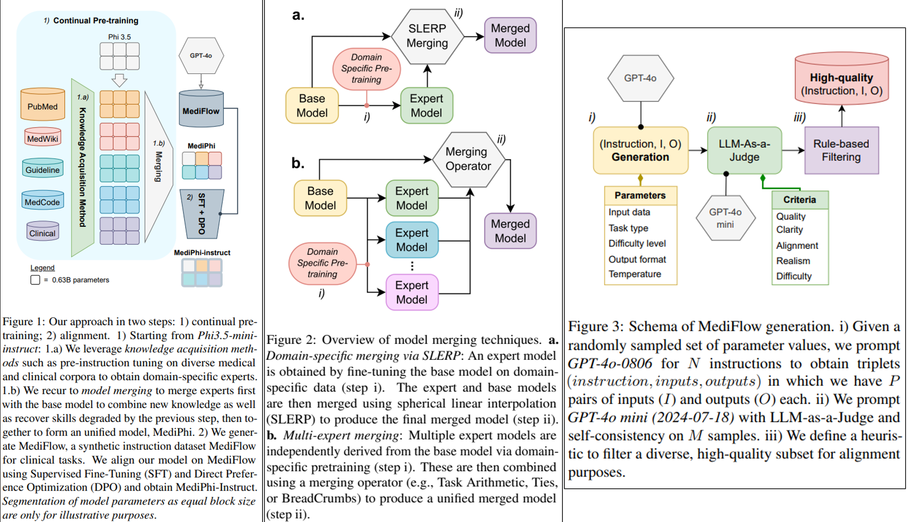
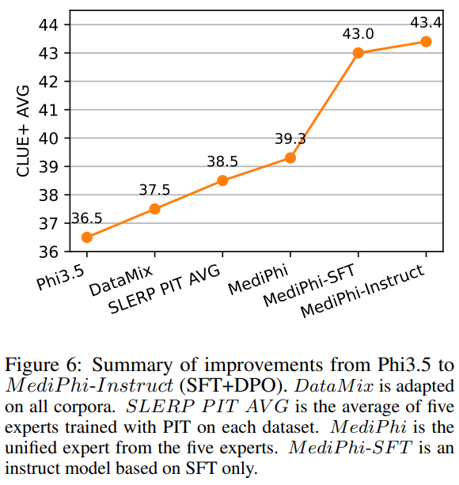

# A Modular Approach for Clinical SLMs Driven by Synthetic Data with Pre-Instruction Tuning, Model Merging, and Clinical-Tasks Alignment

> https://aclanthology.org/2025.acl-long.950/

随着 LLM 进步因扩展带来的回报递减，专门针对领域特定性能、降低计算需求和实际临床整合进行了优化的专业小型语言模型（SLMs）提供了一个可行的替代方案

由于临床数据的不可获取性，这些数据敏感且受到严格许可保护，例如根据HIPAA保护的卫生信息，阻碍了高质量临床语言模型的开发。当前的医疗大型语言模型在多项选择题数据集上表现良好，但在处理现实世界的临床复杂性方面却面临困难。此外，临床数据的不易获取以及当前针对临床任务的持续预训练方法的不匹配，在小型语言模型的背景下是重大的限制因素，因为这些模型的容量有限。解决这些差距需要针对小型模型量身定制的创新训练策略。

本项工作介绍了一种用于构建高性能医疗SLMs的模块化框架，利用预指令调整、模型合并和临床对齐。通过预指令调整，我们使用具有38亿参数的Phi3.5 mini进行了适配。我们利用这些模型，通过模型合并成一个统一的单一语言模型（SLM），保留了基准测试的改进成果。通过与MediFlow（一个关于临床任务的新合成指令数据集）对齐来完成训练。

贡献

- 推出了MediPhi系列，这是首个在商业许可下用于医疗和临床应用的高性能SLM集合。该集合包括一个通用专家模型及多个专门变体
- 发布了一个基于GPT-4o代理流程生成的250万个高质量合成指令的MediFlow数据集
- 通过增加6个至12个数据集将CLUE扩展到CLUE+基准
- 展示预训练调优在医学领域适应中的有效性，该方法不仅限于问答任务，还包括命名实体识别、关系抽取和总结

## 方法

临床语言模型方法包括两个步骤：

1. 由领域知识获取方法和模型合并组成的持续预训练
2. 在生成的合成数据上进行有监督微调和直接偏好优化的训练后处理

### Continual Pre-Training

我们搜集了具有宽松许可证的医学和临床语料库，这些语料库被用来将我们的语言模型适应为五个专家。我们将这些分为五组：PubMed、Clinical、MedCode、Guidelines和Med-Wiki

我们考虑了三种方法来增强语言模型的领域知识：领域适应预训练（DAPT）、类似教科书的合成材料（Explainer）和预指令调整（pre-instruction tuning，PIT）。后者在我们的实验中显示出相当大的改进。我们将这些技术应用于基础模型，从我们的五组数据集中获得了五个医学和临床领域的专家。

- DAPT 领域适应预训练是一种通过在特定领域的语料库上进行下一个词元预测来使深度学习模型适应特定领域的技术。在PubMed组上训练的模型遵循标准的DAPT，因为它比其他组大几个数量级。我们还使用DAPT在所有数据上训练了一个DataMix基线，但我们的方法表现更好
- Explainer 类似教科书的材料，证明了在由强大的大型语言模型生成的教科书质量数据上训练语言模型的有效性。因此，我们使用GPT-4o-0806为MedCode数据集组生成了一个类似教科书的“解释器”，因为网页的密集格式阻碍了模型的学习
- PIT 通过首先在类似指令的数据上进行微调，然后在指令数据和预训练语料库的合并数据上进行训练，相较于传统训练范式显示出显著改进。

PIT需要对语料库中每个文档生成任务数据。虽然最初使用问答（QA）作为主要任务，我们将该方法扩展为包括摘要、命名实体识别和关系抽取。我们使用GPT-4o-0806在MedCode数据集的ICD10CM子集上为所有四个任务生成输出，以此作为初步案例研究。基于这些结果，我们将此过程扩展到剩余的四组数据集——Clinical, MedCode, Guidelines和MedWiki——以训练多个专家模型。

每个专家在两个阶段中进行顺序训练。第一阶段涉及对单个任务生成的输出进行微调。如果任务包含多个元素，如几个问答对，则它们被连接成一个序列，用句子结束（EOS）标记分隔。在第二阶段，模型在任务数据和原始文档的合并数据上进行微调

在拿到5个专家模型后，我们考虑模型合并。使用SLERP将每个专家模型分别与基础模型合并，因为PIT增强了领域特定学习，但也导致了灾难性遗忘——降低了模型的初始能力，如指令遵循、长上下文处理和多种语言支持。在PIT之后与原始指令模型合并可以缓解这些退化，保留一般能力的同时最大化领域适应。

第二个方法将所有五个专家结合成一个统一的SLM，形成MediPhi。多模型合并涉及三种主要技术：Task Arithmetic, TIES, and BreadCrumbs。鉴于多模型合并的巨大配置空间，我们通过MergeKit采用了一种进化算法来优化合并过程。

然而，由于缺乏验证数据和框架不兼容，我们基准测试的优化并不可行。为了解决这个问题，我们生成了与我们的基准任务一致的合成验证集。具体来说，我们提示GPT-4o-0806创建了多个选择题问题集，这些集合与我们的评估任务保持上下文一致性。进化算法设定在500次评估后终止，以这些验证集的平均准确率为指导

关于评估指标，我们主要测量CLUE+上的平均准确率然而，我们还认为专家获得均匀改进很重要，尤其是在具有相似准确率的专家之间。为此，我们使用#DG，即模型获得收益的数据集数量，以及CVΔ，即收益/损失的变异系数
$$
CV \Delta=\frac{\sqrt{\mathbb{E}_{d \sim \mathcal{D}}\left[\left(\delta_{d}-\mu_{d}\right)^{2}\right]}}{\left|\mu_{d}\right|}
$$
其中，$$\delta_{d}$$ 是基准数据集D中第*d*个数据集的专家准确率减去基线准确率，$$\mu_{d}=\mathbb{E}_{d\sim\mathcal{D}}\left[\delta_{d}\right]$$ 表示所有数据集中平均后的专家准确率减去基线准确率。较小的交叉验证（CV）Δ 表示各数据集之间均匀的收益或损失，而较高的值表示在少数几个数据集上的收益或损失。

### Clinical Alignment

关于MediFlow数据集的生成流程

1. 我们用元提示提示GPT-4o-0806，以同时生成多个三元组（指令、输入、输出），这些三元组根据五个参数进行条件控制：输入数据类型、任务类型、难度等级、输出格式和温度。对于这一步，我们还应用1.0（数据集的70%）或1.25（数据集的30%）的温度，以在准确性和多样性之间取得平衡。具体来说，我们一次请求10条指令，每条指令包含四个输入输出对
2. 用 LLM-as-a-Judge 的方法，在温度为1.0的情况下，针对M=5个样本使用自一致和思维链以提供对合成指令的关键评估。我们在提示中提供了五个标准，按1到4的等级评分：质量、清晰度、一致性、真实性和难度。我们通过将各个分数 s 乘以其各自的计数 c 来计算第j个标准的最终得分 $$S_{j}=\frac{1}{M}\sum_{i=1}^{M}c_{i}\cdot s_{ij}$$
3. 我们使用启发式方法根据质量标准将集合缩减为其前K个最高质量的样本

从MediFlow生成MediFlow-DPO，我们从按任务类型、输入数据类型和输出格式分层的130k个高质量样本中筛选，以进一步使 SLM 与SFT后的直接偏好优化（DPO）保持对齐。我们生成了些许错误的输出（即被拒绝的输出），提示GPT-4o-0806作为一个错误诱导器。

> 即随机抽样的错误类型引入一个轻微错误的输出，作为被拒绝的输出。错误类型包括：歧义、部分正确、过度冗长、简洁不足、细节不平衡、风格问题、事实不准确、逻辑缺陷、误解、类塑性推理、语法错误和拼写错误。

我们通过在Med-iFlow上进行有监督微调（SFT）来训练MediPhi，这个多专家合并的SLM，以获得MediPhi-SFT。然后我们将MediPhi-SFT与DPO对齐，从而得到MediPhi-Instruct（SFT+DPO）

## 实验

虽然CLUE专注于使用临床笔记和出院小结作为输入数据的六个任务，我们通过添加额外的临床输入文档（例如，放射科报告、医患对话）和任务（例如，信息提取、医疗错误检测）来扩展它，以获得对临床能力的更广泛评估。我们引入了CLUE+基准测试，增加了六个额外数据集

- DAPT使性能降至随机水平。在 Explainer 上微调的模型在基线水平上提高了6%。PIT通过生成摘要进一步提高性能，提升了8%
- 与合并前的基础模型相比，SLERP有效提升了效果
- 对五个医学和临床专家进行适配的数据集组，并使用SLERP与基础模型合并模型的实验：虽然所有语料库上训练的DataMix合并模型都取得了相对于基础模型的改进，但各个专家的改进更大
- 对于多模型融合技术，Task Arithmetic, TIES, and BreadCrumbs 差距不大
- SFT 与 DPO 进一步改进了效果
- 医学编码专家在ICD10CM基准测试中超过了GPT-4-0125，并且将MediPhi与MediFlow对齐后，平均提高了CLUE+性能18.9%

## 限制

MediFlow语料库有一些限制

- 我们将范围设定为单轮指令而非像UltraChat（丁等人，2023年）那样的多轮对话数据集
- 任务数量有限，这些任务都非常复杂（即多步骤推理任务），并且输入输出也非常长
- MediFlow仅为英文临床语料库。为了扩大MediFlow的范围，未来的工作可能会使用来自临床语料库的种子数据，并扩展我们的代理流程

虽然通过模型合并，MediPhi和MediPhi-instruct可能会保留Phi3.5-mini-instruct（即多语言、对话式、安全性对齐等）的能力，但我们假设这些能力可能会受到影响，而这种影响在医疗和临床能力以及指令遵循能力之外尚未被研究。因此，我们的建议是仅在临床自然语言处理任务中使用MediPhi集合。我们还强烈建议由特定医学领域的专家对模型输出进行验证

CLUE+基准测试在任务、输入数据和数据集方面扩展了CLUE的覆盖范围。尽管临床领域的覆盖范围很广，但仍有一些空白。信息提取任务仅由SDoH数据集表示，没有关于护理子领域（例如护士与患者的对话或笔记）的输入数据