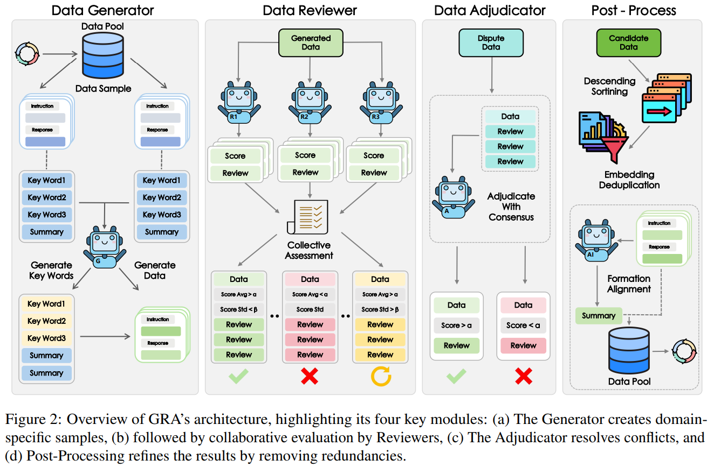
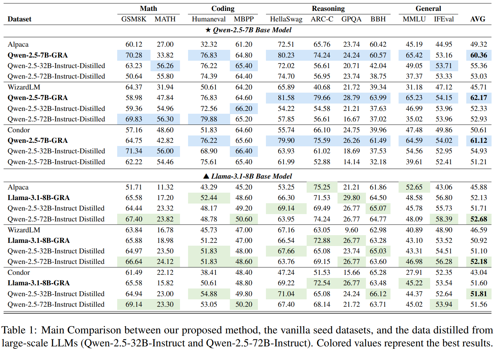
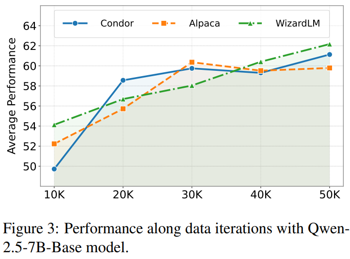
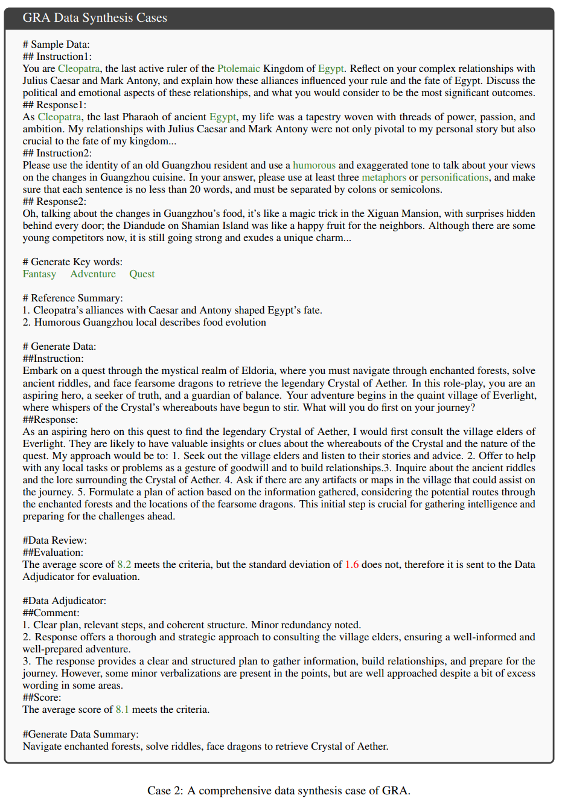

# A Strategic Coordination Framework of Small LLMs Matches Large LLMs in Data Synthesis

> https://arxiv.org/abs/2504.12322

拥有数千亿参数的LLM具有显著的能力，但它们需要巨大的计算资源和能源，这对于部署在资源受限的场景，如边缘设备或延迟敏感应用构成了重大障碍。这一悖论激发了开发更小规模LLM的兴趣，这些LLM平衡了效率和有效性，使得紧凑而强大的模型成为可持续AI领域的一个关键研究前沿

为了提升小型 LLM 的性能，知识蒸馏（通过数据合成从大型模型转移能力）已成为主导范式。缺点包括隐私敏感、安全关键场景下需要本地执行、成本过高、难以匹敌其较大对手合成的数据的质量、多样性和可靠性

这就提出了一个关键问题：我们能否设计一个资源高效的框架，使小型模型能够集体匹敌单体LLMs的蒸馏能力？

为了应对这一挑战，我们提出了GRA，一个受到人类同行评审机制启发的协作框架。与传统单一模型蒸馏不同，GRA协调多个专业小型LLMs扮演三个协同角色：

1. 生成器，提出候选数据样本
2. 评审者，通过迭代批评评估质量和多样性
3. 裁决者，解决冲突以最终确定输出

值得注意的是，由单个生成器生成的合成数据将由多个评审者评估，裁决者将通过重新评估数据来解决评审者之间的重大分歧。GRA模拟了通常集中在单个大型大型语言模型（LLM）内的精炼过程。这种协作架构不仅规避了大型模型的资源密集性，还通过任务专业化和迭代质量控制放大了小型模型的集体智慧——有效地在模型集合中实现了“群体智慧”原则。

我们通过在多个领域进行广泛的实验验证了GRA，包括一般问题回答、推理、数学和编码任务。值得注意的是，我们的框架在数据质量上达到了与最先进的单体大型语言模型（如Qwen-2.5-72B-Instruct）相当甚至更高的水平，同时所需的计算资源数量级更少。这些结果通过实证演示，**策略性地协调小型大型语言模型可以集体超越单个大型大型语言模型的蒸馏性能**。

## 方法

我们用 $$\mathcal{M}$$ 表示框架中使用的小规模 LLM 集合，迭代 t 的数据池表示为 $$\mathcal{D}^{(t)}=\left\{\left(x_{i}, y_{i},d_{i},k_{i},s_{i}\right)\right\}_{i=1}^{N}$$ ，其中每个样本由指令 x、响应 y、领域标签 d、一个三元组关键词 k 和摘要 s 组成。领域标签 d 表示样本的任务类型，分为七个领域：编码、数学、问答、推理、角色扮演、语言和创作，旨在覆盖最通用的领域。三元组关键词 k 由大语言模型生成，以捕捉每个数据样本的核心概念。此外，我们还包含一个摘要 s，以提供上下文并澄清关键词之间的关系，增强对数据的整体理解。

GRA概览如图所示，通过协调三个专门角色来整合特定领域的生成与协作策展

1. 生成器使用针对该领域的少样本提示产生初始样本。
2. 多个评审员合作评估这些样本的质量
3. 裁定者通过共识驱动的仲裁解决任何冲突的评估
4. 一个后处理模块通过嵌入去重和元数据丰富进一步精炼结果，以消除冗余输出

此外，为了防止模型专业化偏见，GRA在动态分配过程中通过随机选择和生成时为每个角色分配不同的 LLM

关于**数据生成**，对于每个实例，我们随机选择一个LLM $$M_G \in \mathcal{M}$$ 作为生成器。对于一个给定的领域，生成工作流程包括三个协调的阶段：

1. $$M_G$$ 分析当前领域语料库中随机选择的关键词-摘要对 (k,s)，通过从输入数据中提取并结合有意义的语义模式和属性来合成一个新的三元组关键词*k*′
2. $$M_G$$ 从种子示例的上下文摘要中汲取灵感，将合成的关键词情境化成一个可执行的指令*x*′
3. $$M_G$$ 生成一个适当的回应*y*′，以适当处理生成的指令*x*′

------

关于**数据评估**，为确保数据评估的公平性并减轻个别模型的偏见，审核员模块通过协调的评估协议进行严格的多代理质量评估。我们从 $$\mathcal{M} \backslash M_G$$ 中随机选择 $$N_R$$ 个审核员组成审核委员会 $$R=\{ M_{R_i} \}_{i=1}^{N_R}$$ ，审核过程包括两个阶段：指令评估和回应评估

1. 在指令评估阶段，每位审核员独立根据三个二元标准：“合理性、完整性和清晰度”来验证指令*x*′。如果有任何审核员标记出任何标准的失败，则会立即被拒绝
2. 获得批准的指令随后进入回应评估阶段，在此阶段，每位审核员对生成的回应*y*′进行六个维度的分析：“正确性、清晰度、完整性、相关性、连贯性和伦理性”。然后每位审核员通过对这些维度分配0到10之间的整数分数来进行定量评估，平均分作为最终得分。此外，每位审核员提供详细的文本反馈，描述生成回应的优势和劣势

最终，委员会R通过计算平均复合分数 $$\mu_R$$ 和标准差 $$\sigma_R$$ 来综合评估，做出最终决定，其中 $$\tau$$ 和 $$\sigma$$ 是预定义的阈值：

- 拒绝：如果 $$\mu_R < \tau$$
- 接受：如果  $$\mu_R \geq \tau$$ 并且 $$\sigma_R \leq \delta$$
- 裁决：如果  $$\mu_R \geq \tau$$ 并且 $$\sigma_R>\delta$$ 

------

关于**数据裁定**，旨在重新评估有争议的样本。对于每个有争议的样本，我们从 $$\mathcal{M} \backslash (M_G \cup R)$$ 中随机选择一个裁定员 $$M_A$$ 来进行共识驱动的仲裁。对于每个有争议的样本，基于整合审稿人的反馈， $$M_A$$ 使用与审稿人相同的评估标准进行全面重新评估，并得到最终的复合分数 $$s_A$$。只有当 $$s_A\geq \tau$$ 时，样本才会进入下一阶段

------

关于**后处理模块**，后处理模块确保句法一致性并增强最终数据集集成的多样性。首先，我们使用 all-MiniLM-L6-v2  编码器为所有数据生成嵌入。数据根据其评论分数 $$\mu_R$$ 以降序处理，每个样本及其嵌入都会针对目标数据池进行语义冗余验证：如果与池中任何项目的最大余弦相似度低于指定的相似度阈值，则将该候选对象添加到池中。否则，将其拒绝以防止语义重复。

去重后的数据随后通过随机大型语言模型 $$M_P\in\mathcal{M}$$ 进行元数据丰富，以生成上下文摘要*s*′，并补充从中提取的关键词，确保与现有数据的格式一致。这种两阶段过滤——基于嵌入的语义去重，接着进行大型语言模型总结——确保了后续数据合成工作流程的概念多样性和结构兼容性。

## 实验

我们将Al-paca（Taori等人，2023年）、WizardLM（徐等人，2024a年）以及最近发布的Condor（曹等人，2025年）这些数据集作为数据合成的种子数据集

关于小型LLM，我们使用了五个多样化且具有代表性的参数在7B-8B之间的大型语言模型：Llama-3.1-8B-Instruct、Qwen2.5-7B-Instruct、InternLM3-8B-Instruct、Mistral-7B-Instruct-v0.3和Tulu-3-8B。合成过程运行五次迭代，每次迭代使用vLLM工具包生成约1万个高质量样本（总共5.1万个）。我们在审查阶段设定最低分数阈值*τ*=8和最大标准差*δ*=1.5。对于去重，最大余弦相似度被设为0.9。

数据合成后，我们对两个著名的基准模型进行全参数监督微调（SFT）以进行验证：Llama-3.1-8B-Base和Qwen2.5-7B-Base。实验利用了Llama-Factory工具包。我们运行五次迭代，每次累积从Rnd1到Rnd5的合成数据，代表从第一轮到所有五轮的数据。在主要实验中，我们报告平均表现最佳的迭代。

为了评估，我们选择了多个不同领域的基准测试——数学、编程、推理以及一般知识，以展示我们的GRA框架的有效性，其中包括GSM8K、MATH、HumanEval、MBPP、HellaSwag、ARC-C、GPQA、IFEval、BBH和MMLU。我们使用 opencompass 工具包进行公平评估

我们比较了GRA与vanilla种子数据集以及单一大型LLM（Qwen2.5-32B/72B-Instruct）蒸馏的表现

- GRA方法在所有基准测试中相较于vanilla种子数据取得了显著的提升，这些结果证明了GRA的有效性。我们将这一成功归因于GRA通过迭代数据合成提升数据多样性和质量的能力
- GRA的协作小型LLM框架显示出与单一大型LLM蒸馏相当或更优的性能，这验证了成本效益的多代理合成的可行性，作为资源密集型大型模型蒸馏的可扩展替代方案
- 在相同数据条件下，基于Qwen的实现始终比Llama对应实现高出9%。我们将这种差异归因于Qwen强大的基础模型能力
- 尽管参数数量翻倍（Qwen-2.5-32BInstruct→Qwen-2.5-72B-Instruct），教师模型扩展带来的质量提升微乎其微。这表明标准蒸馏方法在知识传递效率上可能已经达到饱和点，强调了需要更高级的蒸馏协议，而不是简单从更大的模型中进行蒸馏

为了探究迭代数据合成轮次对模型性能的影响，我们使用GRA进行了五次顺序的数据生成迭代，每次迭代大约生成了1万个合成样本。我们在累积的数据集上逐步训练模型：第一次迭代为1万个样本，第二次迭代为累积至2万个样本，第三次迭代为累积至3万个样本，第四次迭代为累积至4万个样本，第五次迭代为累积至5万个样本。

- 迭代次数与模型性能呈正相关。
- 早期迭代中性能提升迅速，但在后续迭代中逐渐趋于平稳，表明回报递减但仍有意义。这一趋势与假设相符，即初期周期解决了关键数据稀缺问题，而后续轮次则耗尽了可开发的合成数据多样性。

其他结论

- 关于角色分配：随机分配优于单一模型优于固定分配。我们随机角色分配在 GRA 中的优势明显且重大
- 裁决器的一个有效性体现在，如果两个 reviewer 给出了错误的结果，一个 reviewer 给出了正确的结果，传统的多数投票会选择错误的结果，而裁决器则会根据分析给出正确的结论
- GRA 生成的数据比原始种子数据集呈现出更广泛的分布（使用 t-SNE对指令嵌入进行可视化）
- GRA在分布多样性方面超越了单一的大型 LLM ，这意味着协作的小型LLM可以减轻单一模型的固有限制和偏见
- 进一步应用GRA的生成器重写原始种子数据集中的响应，然后使用GRA的评审员和裁决者进行编辑。经过精炼的数据集实现了更好的性能
- 我们利用Qwen-2.5-72B-Instruct来评估合成数据，并将其得分与我们的评审员得分进行比较。与大型LLM得到的较粗粒度得分相比，GRA方法表现出更细致的粒度和更平衡的得分分布，表明其能够捕捉微妙的质量变化
- 我们计算了三个数据集的指令遵循难度（IFD）得分，GRA生成的数据显著高于种子数据集（+14.58%），表明其难度更高、知识覆盖更丰富
- 尽管使用了较小的LLM，GRA达到的难度与Qwen-72B蒸馏数据相当（75.82%对比75.49%）。这表明GRA中的协作小型LLMs缓解了个体的能力限制，有效地模拟大型LLMs在生成具有挑战性的例子

这些结果验证了GRA在不依赖大型LLMs的情况下，能够合成高质量、可控难度的数据，解决了数据合成流程中的可扩展性和性能权衡问题

