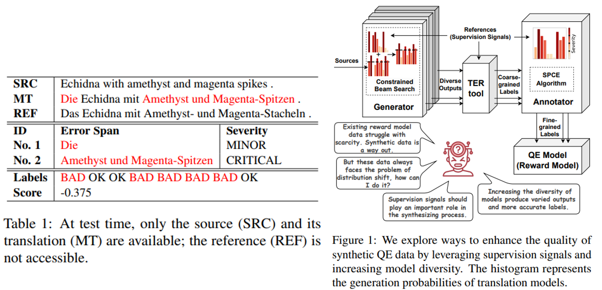
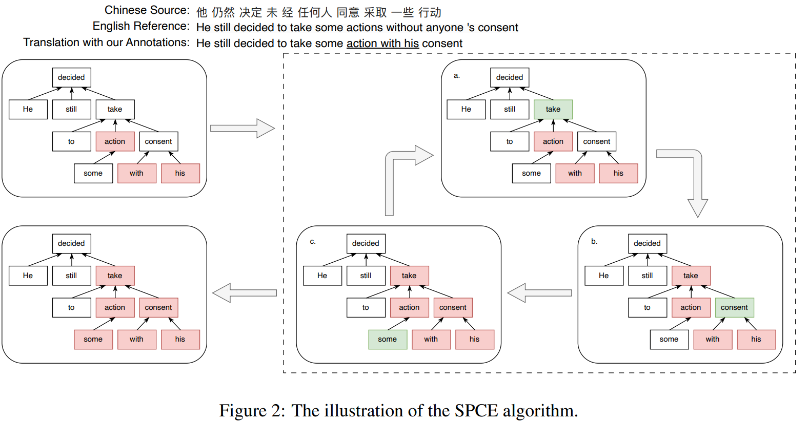

# Alleviating Distribution Shift in Synthetic Data for Machine Translation Quality Estimation

> https://aclanthology.org/2025.acl-long.373/

与依赖参考译文来评估质量的机器翻译（MT）指标（如BLEU）不同，质量估计（QE）无需任何参考就能评估翻译质量，通过过滤低质量翻译和识别错误片段来减少人力投入

> 从 LLM 的角度来看，QE模型可以作为机器翻译的奖励模型。何等人（2024年）探索了使用质量估计来使翻译模型与人类反馈保持一致，从而在翻译性能上取得了显著改进。LLMRe-fine（徐等人，2024a年）利用LLMs根据细粒度QE反馈来完善翻译。

多维质量指标（MQM）（表1）的注释近年来已成为QE的主要标准，因为MQM分数比早期的直接评估分数更可靠，它是细粒度并且可解释的，然而，获取这些细粒度的MQM标注是劳动密集型的。因此，他们的数据集通常较小，并且仅限于特定的语言对

> 现有研究旨在通过平行句子生成用于质量评估（QE）的合成多质量度量（MQM）数据。例如，MQMQE（Geng等人，2023a）随机遮盖参考文献中的语段，用从翻译模型负采样得到的标记替换这些语段，并使用模型本身的生成概率来标注严重程度。InstructScore（Xu等人，2023年）指导GPT-4根据参考文献生成具有特定严重程度的错误。

尽管MQM生成方法取得了有竞争力的性能，但它们的合成数据分布可能与真实数据的分布显著不同。分布偏移问题不仅导致质量评估性能下降，还影响下游人类偏好优化。

> 具体来说，负采样策略使得MQMQE的合成翻译流畅度降低。此外，MQMQE的合成标签与人类偏好不一致，因为随机遮盖的语段往往会打乱整个短语，而翻译模型往往对自己的输出过于自信。虽然InstructScore能够生成流畅的合成翻译和准确的合成标签，但生成的错误看起来不自然，不像高级翻译模型通常会产生的错误。更重要的是，使用强大的闭源大型语言模型需要大量的时间和财务资源

我们提出了一个框架 DCSQE（图1），用于 QE 的数据合成控制分布，旨在缓解生成合成QE数据时的分布偏移问题。具体来说，我们首先分别训练两个翻译模型作为生成器和注释器。然后使用生成器通过受限束搜索（CBS）生成合成翻译。这使我们能够利用TER工具高精度地将匹配的标记视为正确。对于不匹配的部分，我们利用注释器提供的生成概率重新评判它们的细粒度严重程度。由于人类注释者通常倾向于将整个短语标注为跨度，我们提出了一种算法，帮助将标记级别的标签聚合成短语级别的标签。

## 背景

质量评估任务在缺乏参考的情况下评估翻译的质量。给定一个源句子x及其机器翻译 $$\hat{\mathbf{y}}=\left\{y_{1}, y_{2},\ldots, y_{n}\right\}$$ （包含n个单词），我们旨在预测以下质量标签：

- 跨度级MQM标签 $${\mathbf{h}}=\left\{h_{1},\ldots, h_{n}\right\}$$ 标签*h*通过专业人工注释按错误严重程度 `(MINOR, MAJOR, CRITICAL) `
- 词级标签 $${\mathbf{g}}=\left\{g_{1},\ldots, g_{n}\right\}$$，标签 g 通常是一个二元标签（`OK or BAD`），它是从跨度级标签派生出来的。错误跨度内的单词被标记为“差”
- 句子级MQM分数s，它是从跨度级标签派生出来的。这些分数可以通过下面的公式来计算。其中 $$n_{severity}$$表示每种错误严重性的数量，n表示翻译长度

$$
s = 1 - \frac{n_{\text{MINOR}} + 5 \times n_{\text{MAJOR}} + 10 \times n_{\text{CRITICAL}}}{n}
$$

先前的工作，例如CometKiwi（Rei等人，2023年）和MQMQE（Geng等人，2023a年），通常采用多语言预训练语言模型，通常是XLM-R作为质量估计（QE）模型的骨干架构。模型最后一层的输出用于派生每个标记的表示。通过平均一个词内所有标记的表示来获得词级表示。类似地，回归分数表示是通过平均所有目标标记的表示来计算的。这些表示随后被输入到线性层中，分别预测词级质量标签和回归分数

跨度级任务可以被视为词级任务。因此，总体目标只结合句子级任务和词级任务。句子级任务被视为使用均方误差（MSE）损失优化的回归问题，而词级任务则被构建为使用交叉熵损失的序列标注问题。**在有监督的设置中，模型首先在合成数据上进行预训练，然后在真实数据上进行微调；而无监督设置仅使用合成数据进行训练**。

关于推理，通过比较“OK”的概率与各种阈值来确定错误严重性。对于跨度级任务，连续的“BAD”标记被识别为一个跨度，其错误严重性由该跨度内最严重的错误严重性决定。

## 方法

### 合成翻译

为了生成与真实机器翻译极为相似的合成翻译，我们直接使用带有约束束搜索（CBS）算法的**翻译模型**生成合成翻译。与标准束搜索（BS）算法类似，CBS算法也寻求生成具有高生成概率的翻译，从而产生自然的翻译错误。然而，标准的BS算法通常会生成参考的同义词，使得获得准确的合成标签变得困难。相比之下，CBS算法旨在在参考标记的生成概率超过指定阈值时保留它们，减少生成同义词的风险。

在大多数问答（QE）应用中，目标翻译模型是不可访问的。因此，现有研究训练一个替代翻译模型，称为**生成器**，在平行语料库上进行训练。我们假设增加合成翻译的多样性会提高生成与目标更为相似的翻译的可能性。然而，作为束搜索算法的变体，CBS算法也面临着生成多样化翻译的挑战。我们通过在不同的平行子集上训练生成器来增强其多样性。

> 在初步实验中，我们尝试使用dropout来扰动生成器，以便为单个源句子产生多样的翻译。然而，这种方法并没有增强合成翻译的多样性，也没有提高质量评估（QE）的性能

### 合成标签

**粗粒度标签**。CBS允许我们保留参考的主要结构，从而使用精确匹配获得准确的标签。我们使用TER工具执行合成翻译与相应参考之间的单词级对齐。匹配的部分被视为“OK”，反之亦然。生成合成翻译后，我们需要对它们进行注释，以符合人类偏好。

**精细标签**。为了给每个“BAD”标记分配细粒度的严重性并纠正假阴性标签，我们使用翻译模型作为注释器来重新评判之前的标签。翻译模型的置信度，即生成概率，可以作为评估翻译质量的可靠指标。因此，我们利用每个标记的生成概率 $$p_i$$ 来确定其错误严重性。通过阈值判断严重性标签 $$\hat{h}_i$$

**利用监督信号**。当模型缺乏对给定输入的必要翻译知识时，其生成概率变得投机，并且无法与错误的严重性有意义地关联。为了解决这个问题，我们确保注释器在也用于生成合成数据的平行对上进行训练。因此，当注释器处理给定的平行对时，它会变得“专业”，而不是“业余”。

**将注释器与生成器区分开来**。MQMQE使用相同的翻译模型来注释其自身的输出。然而，这种方法可能导致对模型预测的过度自信，从而导致不准确的注释。为了调查这个问题，我们引入另一个训练有素的不同的翻译模型作为注释器。

**将错误标记组合成人可读短语**。尽管我们拥有标记级别的标签，人类注释者倾向于更倾向于注释包含翻译错误的整个短语，以确保注释的清晰性和可解释性。同时，注释者努力使短语尽可能短，确保它涵盖所有连续的错误标记，而不包括任何不必要的标记。因此，我们提出了最短短语覆盖错误（SPCE）算法，将错误标记组合成人可读短语。如图2所示，SPCE算法按如下方式操作：

首先，我们解析合成翻译以获得其依赖树。连续的“BAD”标记添加到候选集中，作为初始短语。接下来，我们迭代执行以下步骤：

1. 我们采用最低公共祖先（LCA）算法来找到候选标记（即单词“take”）的公共祖先节点。此步骤定位包含所有错误的最小子树
2. 为了确保句法连贯性，我们将从LCA到路径上的所有标记添加到候选集中（即单词“consent”，它在从“his”到“take”的路径上）
3. 为了确保候选标记是连续的，我们将位于最左和最右候选标记之间的所有标记添加到候选集中（即单词“some”，它在短语“take some action with his consent”中）

迭代终止于无需向候选集添加额外标记，为了给每个短语分配一个代表性的细粒度标签，我们通过在候选标记中选择最严重的错误标签来确定其严重性。

## 实验

在实验部分，我们旨在解决关于DCSQE的以下研究问题：

1. DCSQE在不同语言对的监督和无监督设置下的表现如何？我们在多个语言对（英语-德语、中文-英语、希伯来语-英语）的监督和无监督环境中评估DCSQE。
2. 为了使合成标签与人类偏好保持一致，我们引入注释器和SP算法来生成MQM数据。这些技术的有效性如何？我们进行消融研究，量化注释器和SPCE算法在改善合成标签与人类偏好一致性方面的个别贡献。
3. 注释器和生成器可以是同一个模型吗？换句话说，一个模型能否公正地注释自己的输出？我们调查使用单一模型同时充当生成器和注释器的可行性。
4. 提高生成器的多样性会提升问答效果吗？我们通过对不同的平行子集进行训练来提高生成器的多样性
5. 生成器和注释器的翻译性能如何影响合成数据的质量？我们通过在大小不同的语料库上训练来控制生成器和注释器的翻译性能
6. DCSQE在生成成本和收敛效率方面是否显示出优势？我们从生成成本的角度将DCSQE与其他合成数据方法进行比较

用于合成伪MQM数据的生成器和注释器基于具有共享解码器输入输出嵌入的Transformer-Large架构。我们使用名为TERCOM4的TER工具对生成器生成的合成翻译进行注释。我们使用XLMR-L骨干对所有合成数据方法训练质量估计（QE）模型。实验是使用开源的Fairseq工具包实现的，并在NVIDIA V100 GPU上进行。

- 未受监督的翻译模型表现显著下降，平均分别下降了15.74和7.64分。这意味着之前合成量化宽松（QE）数据中存在分布偏移问题。相比之下，我们提出的方法具有更优的鲁棒性，平均下降分数较小
- 注释器和生成器可以是同一个模型吗？该模型无法公正地标注其输出，无论模型的性能如何，翻译模型都倾向于一致地对其自身输出分配更多的“正确”标签
- 生成器的多样性提高了质量评估性能。多样性导致了不同的翻译错误，这些错误更有可能全面覆盖现实中的错误。因此，为相同的平行对生成多样化的合成数据也提高了质量评估性能
- 生成器的容量必须平衡。如果生成器过强，生成的数据将错误很少，限制学习机会；如果生成器过弱，数据将过于嘈杂或不切实际
- 利用监督信号增强注释模型的能力是有帮助的。有两种可能的方法来丰富注释者的翻译知识：（1）利用注释者训练集中的平行数据进行合成数据生成，（2）扩展训练语料库。
- 对于所有任务，随着数据量的增加，合成数据方法表现出显著的性能提升。值得注意的是，这种上升趋势持续存在，直到达到500万对平行句子的规模才显示出收敛

## 限制

- 尽管合成数据质量与注释器的翻译表现相关联，其中性能更高的合成数据更符合人类偏好，但由于计算限制，我们没有探索大型语言模型作为注释器。
- 尽管我们的方法在高资源环境中被证明是有效的，但在极度数据稀缺的情况下（即即使并行数据集也不可用），其鲁棒性还需要进一步验证
- 我们对合成量化误差数据的见解可以应用于一般奖励模型，这需要进一步的探索。

