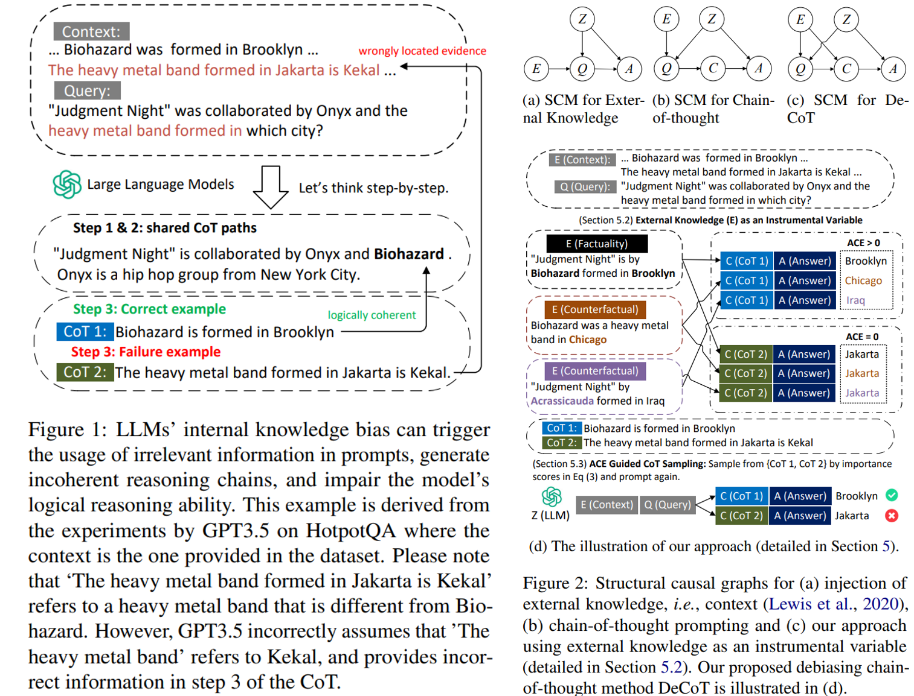
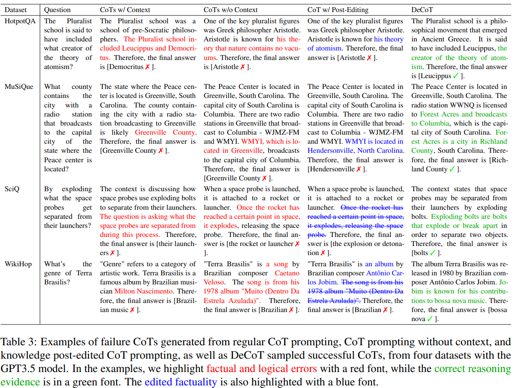

# DeCoT: Debiasing Chain-of-Thought for Knowledge-Intensive Tasks in Large Language Models via Causal Intervention

> https://aclanthology.org/2024.acl-long.758/

为了有效整合外部知识（即上下文），提出了多种方法来检索与任务相关的语言证据。然而，仅仅在提示中注入外部知识并不能保证大型语言模型能够识别和使用提示中的相关信息，特别是当大型语言模型在预训练数据中学习到偏见信息时。大型语言模型中的知识偏见可能会进一步导致外部知识与模型内部知识之间的知识冲突或误解。在这种情况下，大型语言模型可能会使用来自提示的不相关信息，并生成错误且意外的回应

当大型语言模型依赖于思维链（CoT）推理来处理复杂任务时，预训练模型中的偏见信息进一步损害了大型语言模型的推理能力。许多工作建议在再次提示之前验证和后期编辑生成的推理路径以消除生成CoT路径中的事实错误。然而，逻辑推理错误不容易被检测或纠正，因为事实验证和后期编辑推理链的有效性可能仅限于简单地注入更多知识。

> 
>
> 例如在图1中，给定查询（例如，“"Judgment Night" was collaborated by Onyx and the heavy metal band formed in which city?”）以及提供外部知识的上下文，大型语言模型可能会生成逻辑上不正确的CoT，其中最后一个链条偏离了推理路径。这种逻辑不一致可能是由于查询与大型语言模型内部知识理解之间的虚假相关性造成的

因此，这种虚假相关性可以导致大型语言模型在上下文中找到一些任意证据，而不论其与前一个链条的逻辑联系如何，只要它包含了确切的短语。在这种情况下，**事实验证方法无法检测到逻辑推理错误，即使事实被验证为正确，答案仍然可能是错误的**

**我们的主要目的是找到潜在的错误相关性并通过反事实去偏纠正推理错误**，我们通过结构因果模型提出了一种新颖的因果视角，以正式解释大型语言模型的内部知识偏差。为了衡量虚假相关性，我们建议使用外部知识作为工具变量，通过因果干预估计大型语言模型中CoT推理路径的平均因果效应（ACE）。基于ACE的测量，我们可以进一步引入CoT采样方法来找到最佳的CoT作为中介，并进行前门调整。在此方法中，可以减少大型语言模型（LLMs）内部知识与任务查询之间的虚假相关性，确保正确进行CoT推理和LLM生成。

## 背景

为了理解知识密集型任务中的因果关系，我们引入了一个结构因果模型（SCM），并将大型语言模型（LLMs）的内部知识理解识别为混杂因素。在图2a和图2b中，我们将两种传统的知识注入方法分别形式化为两个结构因果模型。通过这些结构因果模型，我们解释了传统知识注入方法的有效性及其局限性。我们进一步在图2c中展示了我们方法的 SCM，即去偏链式思维（DeCoT）。我们方法DeCoT的公式在图2d中进行了说明。

对于知识密集型问答任务，模型会接收到一个查询 *Q*，即 [*q*1,*q*2,…,*qn*] ，以及一段上下文 *E*，即 [*e*1,*e*2,…,*el*]，也就是外部知识。给定查询 *Q* 和上下文 *E*，模型 *θ* 会被提示通过从条件概率分布中采样来循环生成响应 *Y*。
$$
y_{t}\sim p_{\theta}\left(y\mid E,Q,y_{<t}\right)
$$
在图2a中，因果路径 *E*→*Q*←*Z* 表示知识注入过程，其中E代表外部知识，Q代表推理阶段的查询，Z代表大型语言模型的内部知识。理想情况下，查询（Q）作为一个碰撞器，能够缓解由于外部知识（E）和大型语言模型内部知识（Z）的影响而产生的虚假关联，当E和Z在因果上无关。然而，大多数知识注入方法将外部知识作为前缀附加到输入提示的上下文中。因此，外部知识对查询的因果影响也由大型语言模型决定，这使得E和Z成为依赖变量，Q和Z之间的虚假关联仍然存在。

思维链（如图2b所示）因果路径 *Q*→*C*→*A* 表明思维链（C）可以作为查询（Q）和答案（A）之间的中介。然而，由于思维链也是由 LLM 提示的，它也可能因果依赖于LLM的内部知识，从而形成了C和Z之间的虚假关联。值得注意的是，知识编辑方法可以纠正上下文和推理路径中的事实错误，但推理逻辑仍然不正确。

这种情况下，模型通过逐步解释来生成其推理路径C，然后再生成最终答案A（即*Y*=[*C*,*A*]）。通过根据查询Q和上下文E的条件采样N个不同的CoT *C*=[*C*1,*C*2,…,*CN*]，我们可以进一步条件化答案A的生成过程。
$$
C_{i} \sim p_{\theta}(C \mid E, Q)\\
A_{i,r} \sim p_{\theta}(A \mid E,Q, C_{i})
$$

## 方法

在图2c中，CoT(*C*) 是查询 (*Q*) 和答案 (*A*) 之间的中介。根据后门准则，中介 (*C*) 应该与混杂因素 (*Z*) 因果独立，以实现后门调整。然而，在实践中，CoT也是由大型语言模型生成的，这表明CoT (*C*) 与LLM的内部知识 (*Z*) 之间可能存在潜在的错误相关性。因此，为了追踪未观察到的混杂因素Z的偏差，我们引入外部知识作为工具变量。通过改变工具变量E的值（即外部知识），我们估计C和A之间的真实因果关系。

> 例如，在图2d中，两个反事实的外部知识（例如……）“Biohazard formed in Chicago”和“Judegment Night was by Acrassicauda formed in Iraq”）被介绍，由于“CoT 2”第三个思维链中的虚假相关性，由“CoT 2”生成的响应保持不变（即，ACE = 0），而由正确推理路径“CoT 1”生成的响应则根据反事实证据而改变（即，ACE > 0）

我们将外部知识建模为一个工具变量E，以理解CoT C和答案A之间的因果关系。由于直接控制CoT生成过程的局限性，我们通过工具变量E包含反事实知识来进行因果处理。具体来说，我们 **prompt 大型语言模型提取T个事实实体** *V*=[*v*1,*v*2,…,*vT*]，这些实体对应于T个反事实上下文 *E*1∗,*E*2∗,…,*ET*∗。在每个样本中：
$$
E_{j}^{*}=\left[e_{1}, e_{2},\ldots, v_{j},\ldots, e_{l}\right]
$$
相应的事实实体 $$v_j$$ 将被反事实实体替代，**prompt 其提出 P 个反事实实体** $$V_{j}^{*}=\left[v_{j, 1}^{*},v_{j,2}^{*},\ldots, v_{j,P}^{*}\right]$$ 分配给每一个提取的实体 $$v_j \in V$$   
$$
E_{j,k}^{*}\left(v_{j,k}^{*}\right)=\left[e_{1}, e_{2},\ldots, v_{j,k}^{*},\ldots, e_{l}\right], k\leq P
$$
通过替换每个样本 $$E_{j}^{*}$$ 中相应的事实实体来 $$v_j$$ 构建。在这种方法中，我们估计与每个CoT推理路径*C*相对应的平均因果效应（ACE）。
$$
\begin{aligned}
\operatorname{ACE}\left(C_{i}, v_{j}\right)= &\mathbb{E}\left(A\mid do(E),Q,C_{i}\right)-\mathbb{E}\left(A\mid do\left(E_{j}^{*}\right), Q,C_{i}\right)\\
= &\mathbb{E}_{v_{j, k}^{*}\in V_{j}^{*}}\left[p_{\theta}\left(A\mid E,Q,C_{i}\right)-\right.\left. p_{\theta}\left(A\mid E_{j,k}^{*}\left(v_{j, k}^{*}\right), Q,C_{i}\right)\right]
\end{aligned}
$$
其中，平均因果效应衡量的是答案的信任度下降，以反事实情境作为证据。我们观察到不同事实实体的平均因果效应可能会因情境、查询和条件随机场（CoT）的不同而变化，为了考虑外部情境对每个CoT的整体因果效应，我们建议测量所有干预实体的平均因果效应。
$$
\operatorname{ACE}\left(C_{i}\right)=\mathbb{E}_{v_{j}\in V}\operatorname{ACE}\left(C_{i}, v_{j}\right)
$$
其中，干预实体 $$v_j$$ 是从外部上下文E的均匀分布中抽样的。

利用测量的平均因果效应（ACE）得分，我们开发了一种高效的抽样方法，以获得高质量的连贯推理链条的思维链（CoTs），而无需额外的去混杂层进行大型语言模型（LLM）微调。由于大型语言模型是黑箱模型，对输入查询Q和上下文E的参数化进行直接的因果干预方法有限。因此，我们提出使用抽样的思维链CoTs C作为中介变量来进行前门调整。

基于测量的平均因果效应（ACE），我们构建了重要性得分，以衡量最终答案A对上下文E干预的不同思维链CoTs C的反应
$$
C^{*}\sim\operatorname{softmax}\left[p_{\theta}\left(C_{i}\mid E,Q\right)\cdot\operatorname{ACE}\left(C_{i}\right)\right]
$$
前门调整可以通过引入中介变量 C∗ 实现，该中介变量在推理过程中具有最大的平均因果效应
$$
A^{*} \sim P(A \mid E, Q, do(C))\propto p_{\theta}(A \mid E, Q, C^{*})
$$
抽样答案 *A*∗ 的因果效应是通过抽样的CoT推理路径 *C*∗ 来介导的，其中介-结果混淆效应得到了控制和缓解

## 实验

我们将我们的方法应用于不同的预训练大型语言模型（LLM）：拥有110亿模型参数的Flan-T5-XXL、LlaMA-2-7B和GPT-3.5 Turbo

为了获得多样化的思维链推理路径，对所有骨干模型采样 *N*=5 条思维链，并将温度设置为1.0。 对于DeCoT，我们让大型语言模型（LLM）提取上下文中出现频率最高的前*T*=5个实体以供干预。进一步提示LLM为每个提取出的实体提供*P*=3个备选的反事实实体

作为基线，我们将我们的方法与传统的思维链提示方法（CoT）以及上下文感知的对比解码方法CAD进行比较。我们还包括了一个设计有传统思维链提示方法但不包含上下文的基线（不带上下文的CoT），以探究不同数据集中上下文的影响。值得注意的是，与基线相比，我们的方法不依赖于任何额外的假设，也不需要对数据进行任何进一步的处理，就能在这些基线上取得性能提升。与基线相同。

- 对于所有的大型语言模型来说，当缺少支持性证据的上下文时，其表现显著下降。
- 上下文感知的对比解码（CAD）基线可以利用其答案分布作为通过同时提示查询和上下文获得的正分布的负惩罚。然而，由于负面答案既没有得到内部知识的支持，也没有得到外部知识的支持，它可能具有更随机的分布，并限制了对比解码方法的有效性
- 我们的方法DeCoT通过检测逻辑上不正确的CoT并对其进行惩罚，在常规CoT上取得了通常比CAD更高的改进
- 我们不是简单地对正负答案的分布进行对比，而是使用反事实上下文来检查答案分布的变化，这为评估对大型语言模型内部知识偏差的因果效应提供了更细粒度的测量。性能的一致提升表明DeCoT能够通过该测量更准确地检测出不正确的CoT，并进行有针对性的因果干预。
- 通过结合ReAct生成的上下文作为推理证据，DeCoT通过反事实推理进一步提高了ReAct的性能
- 我们仅对选定实体的数量T进行实验，随着T的增大，DeCoT找到更重要实体的可能性更高，以便进行因果干预。然而，更多的因果干预实验需要更多的反事实提示，这以增加API调用次数或推理时间为代价。我们观察到，通过选择最受欢迎的实体，我们可以准确地找到好的事实实体
- 关于不同数量替代实体（P=0,1,3）的性能，由于替代实体是反事实的，通常情况下，不同的替代实体之间的负面因果效应应该是相似的。然而，实际上替代实体可能会进一步引入预期之外的因果关系到上下文中。因此，通过计算多个替代实体的平均因果效应，可以平均掉这些预期之外的因果效应
- 我们观察到，没有上下文生成的CoTs可能包含错误的知识，这可能会进一步误导推理路径。带有上下文提示的CoTs在事实上可能更加忠实。然而，这些CoTs的逻辑推理仍然可能是错误的

