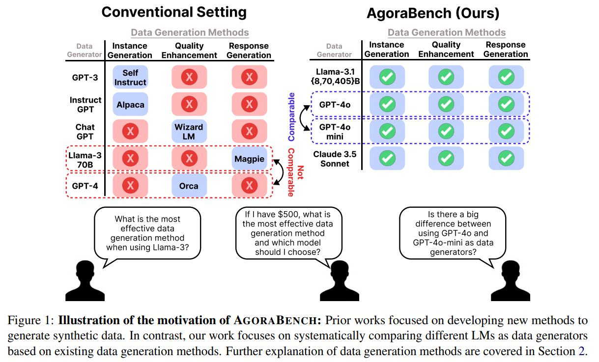
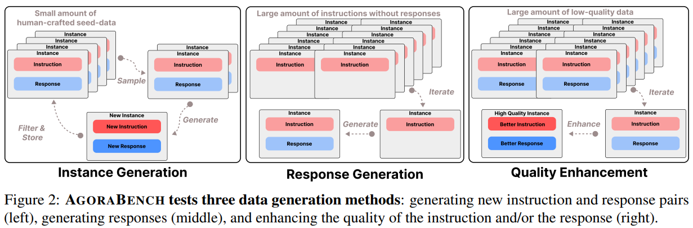
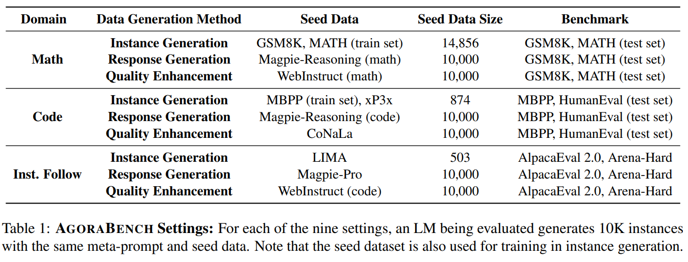
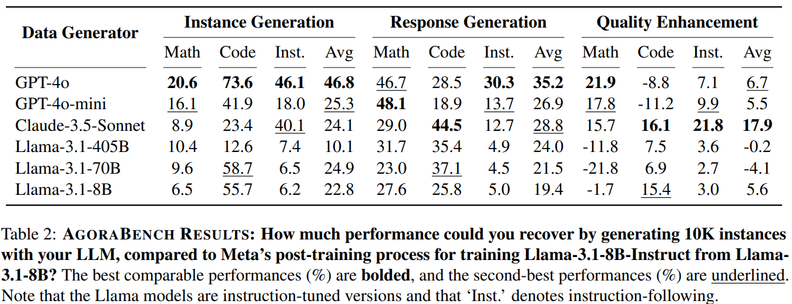
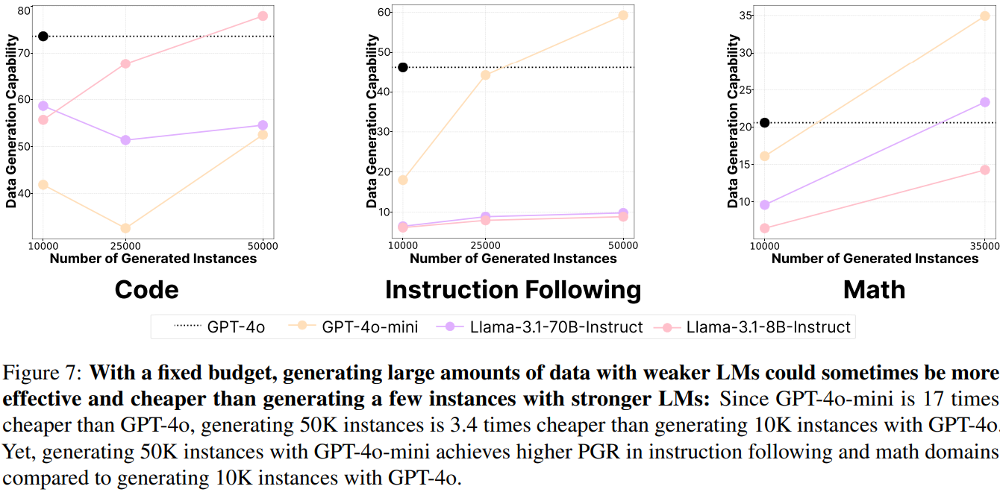
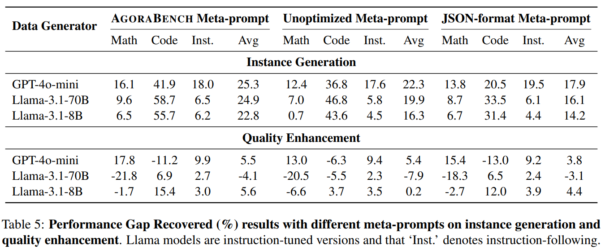

# Evaluating Language Models as Synthetic Data Generators

> https://aclanthology.org/2025.acl-long.320/

虽然通过手动注释获取数据仍然发挥着重要作用，但合成数据生成提供了对人类标记的可扩展补充，衡量每个语言模型的数据生成能力变得与开发新的数据生成方法同样重要。

为了系统地比较语言模型作为数据生成器的性能，需要一个统一的实验设置，在这个设置中，只有数据生成器是变化的，而其他组件保持不变。我们提出了**AgoraBench**，一个评估语言模型在九个不同设置下数据生成能力的基准测试，结合了三个领域（数学、指令遵循、代码）和三种数据生成方法（实例生成、响应生成、质量增强）。在每个设置中，除了数据生成器之外的所有变量都受到控制：使用相同的元提示和种子数据集，每个语言模型进行生成相同数量的训练实例

Llama-3.1-8B 在每个合成数据集上进行训练，并在一系列固定的基准测试上进行评估，这些基准测试涵盖不同的能力：数学、编程和一般指令遵循。为了评估合成数据的质量，我们定义了一个名为“性能差距恢复（PGR）”的指标，该指标衡量了在数据上训练的模型（记为“学生模型”）相对于其基础模型的相对改进。

总共评估了GPT-4o, GPT-4o-mini, Claude3.5-Sonnet, 和 Llama-3.1-Instruct (8, 70, 405B)

## 背景知识

给定种子数据 $$D_{seed}$$ 以及描述要执行的数据生成类型的提示（称为“元提示”）M，数据生成器G会生成
$$
D_G=G(D_{seed},M)
$$
其中，$$D_{seed}$$ 和  $$D_G$$ 都可以表示为 $$\left\{\left(I_{i}, R_{i}\right) \mid i=1, \ldots, n\right\}$$ ，其中 $$I$$ 表示一条指令，R 表示相应的响应，n 表示数据的大小。

在多种数据生成方法中，大多数可以归为三类：实例生成、响应生成和质量提升。这些方法的工作原理如下：

- 实例生成：给定一个小型种子数据集 $$D_{seed}$$，从中随机抽取一些实例作为上下文演示，从而生成新的实例。这个过程会迭代进行，直到构建出 $$D_G$$，且最终的 $$D_G$$ 远大于种子数据集。注意，生成的实例也可以选择性地用作演示。
- 响应生成：给定大量指令 $$D_I=\left\{\left(I_{i}\right) \mid i=1, \ldots, n\right\} $$，G遍历每一条指令 $$I_i$$ 以生成相应的响应 $$R_i$$
- 质量提升：给定大量指令和响应 $$D'=\left\{\left(I'_{i}, R'_{i}\right) \mid i=1, \ldots, n\right\}$$ ，G遍历每个实例以改进指令或响应，例如，使指令更难或具有更高的教育价值

关于指标，语言模型的数据生成能力可以通过评估在教师生成的数据上训练的学生模型的绩效提升来衡量。具体来说，我们提出了一种度量指标——性能差距恢复度（Performance Gap Recovered，简称PGR），该指标衡量的是相对于参考模型，基准B的改进程度。
$$
PGR(G,B)=\frac{\operatorname{score}_{B}\left(S_{D_{G}}\right)-\operatorname{score}_{B}\left(S_{\varnothing}\right)}{\operatorname{score}_{B}\left(S_{ref}\right)-\operatorname{score}_{B}\left(S_{\varnothing}\right)}\times 100
$$
$$S_{\varnothing}$$ 表示一个预训练的语言模型，$$S_{D_{G}}$$ 代表在数据集 $$D_G$$ 上训练的 $$S_{\varnothing}$$，$$S_{ref}$$ 代表 $$S_{\varnothing}$$ 上的 Instruct 模型。例如，在我们的实验中，我们使用 Llama-3.1-8B 作为 $$S_{\varnothing}$$，使用 Llama-3.1-8B-Instruct 作为 $$S_{ref}$$，作为参考，Llama-3.1-8B-Instruct 的训练过程涉及大量的人造数据样本（1000 万以上），如果能用少量数据达到相同效果，则非常有价值

> 请注意，以往的研究大多采用内在指标来衡量数据质量，如响应质量、指令难度和实例多样性。然而，这些指标并不直接衡量它们对数据生成的最终目标的影响：提高学生模型的性能。PGR评估了学生模型的改进有多少来自于数据生成器本身，是内在指标的重要补充

> 由于 $$S_{\varnothing}$$ 无法解决 zero-shot prompting，所以在实验上，$$S_{\varnothing}$$ 采用few-shot prompting，$$S_{D_{G}}$$ 和 $$S_{ref}$$ 为 zero-shot prompting

在训练学生模型时，我们采用监督微调（SFT），仅在响应标记上计算损失。我们直接使用生成的数据 $$D_G$$ 而不进行过滤，并且不考虑其他训练后方法，因为我们的目标是在最直接的设置中评估语言模型的原始数据生成能力，而不是最大化 $$S_{D_{G}}$$ 的性能

## 评估方法

AGORA-BENCH关注被认为是语言模型关键的三个核心能力：指令遵循、数学推理和编程，每个领域应用三种数据生成方法，得到九个不同的设置，每个设置都有专用的种子数据集（D_seed）和基准（B）。对于每个设置，作为数据生成器的语言模型生成10K训练实例。然后，使用来自单一领域的数据训练学生模型，以隔离生成数据质量的影响

对于每个设置，我们基于不同的假设选择种子数据集

对于**实例生成**，由于我们将少量高质量数据扩展成更大的量，我们的方法以使用高质量、人工制作的数据作为种子数据为前提。因此，我们使用GSM8K（Cobbe等人，2021年）和MATH（Hendrycks等人，2021年）的训练子集用于数学，MBPP（Austin等人，2021年）和xP3x（Muennighoff等人，2023b年）用于代码，以及LIMA（Zhou等人，2024年）用于指令遵循。我们排除了超过4096个标记的实例，这些实例是基于Llama-3分词器的，从而分别得到数学、代码和指令遵循领域各14856、874和503个种子实例。

对于**响应生成**，我们模拟不同数据生成器如何将响应附加到一组固定指令上，以最终创建更高质量的数据。虽然我们可以任意选取数据并丢弃它们的响应用于实验，但我们利用了Magpie数据集，因为徐等人。（2024b）的设置与我们的设置非常接近——他们首先使用空白聊天模板提示大型语言模型（LM）提取指令，然后使用两种不同类型的大型语言模型（Llama-3-70B-Instruct和Qwen-2-72B-Instruct）生成响应。在我们的实验中，我们从Magpie数据集中抽取了10K个遵循指令的实例，并从Magpie-Reasoning数据集中抽取了10K个数学和代码领域的实例。

对于**质量提升**，我们测试了存在完整指令和响应实例，但质量需要提升以便用于post-training的场景，即指令过于简单，或者响应不够详细。我们从WebInstruct（需要完善的来自网络的问答对；参见岳等人（2024））中抽取了10K个遵循指令和数学领域的实例。请注意，WebInstruct不包含领域标签，因此我们提示GPT-4o-mini-2024-07-18准备一个单独的 $$D_{seed}$$。对于代码领域，我们使用CoNaLa，其中包含与StackOverflow的1-3行代码片段配对的简单指令（尹等人）。

**基准测试**。我们使用每个领域的两个代表性基准来评估学生模型 $$S_{D_{G}}$$ 的性能。对于数学，我们使用GSM8K（Cobbe等人，2021年）和MATH（Hendrycks等人，2021年）的测试子集。对于代码，我们使用MBPP（Austin等人，2021年）和HumanEval（Chen等人，2021年）的测试集。对于指令遵循，我们在AlpacaEval-2.0（Dubois等人，2024年）和Arena-Hard（Li等人，2024年）上进行评估。

## 结论

- GPT-4o 是整体表现最佳的数据生成器
- Claude3.5-Sonnet 在质量提升方面特别有效
- 在某些情况下，问题解决能力较弱的语言模型在数据生成方面可能胜过较强的模型，例如，在代码领域生成新实例时，Claude3.5-Sonnet 的效果不如 Llama-3.1-8B-Instruct
- 数据质量的多个内在特征——包括指令难度、响应质量和响应困惑度——共同影响学生模型的改进
- 一个更强大的语言模型并不一定生成更好的训练数据，问题解决能力（基准测试分数）与数据生成能力（AGORA-BENCH PGR分数）之间均未显示出强烈的线性相关性
- GPT-4o、GPT-4o-mini和Llama-3.1-8B-Instruct是有效的数据生成器，能够平衡成本和性能
- 在更大的数据生成量下，使用GPT-4o-mini、Llama-3.1-70B-Instruct和Llama-3.1-8B-Instruct生成了多达50k 个实例，表现优于 10k 的效果。使用更经济实惠的大型语言模型生成更大量的合成数据可能比用昂贵的模型生成较小的数据集更有优势

关于 Meta-prompt，我们还检验了元提示设计对生成质量的影响，我们创建了四个额外的[元提示](https://drive.google.com/drive/folders/1EfYwgo0T7tJGDnpQ2CUZGciPBfucu73g?usp=sharing)以供比较。对于每个设置（实例生成和质量增强），我们让两位合著者创建了元提示：一位开发了一个Unoptimized 版本，另一位创建了一个JSON格式的版本，结果显示AgoraBench元提示在六个中的五个取得了最高分。使用自由形式生成的AGORA BENCH元提示比JSON格式提示实现了4.45%更高的性能，与最近的发现一致，即结构化格式要求可能会损害语言模型输出的质量。

