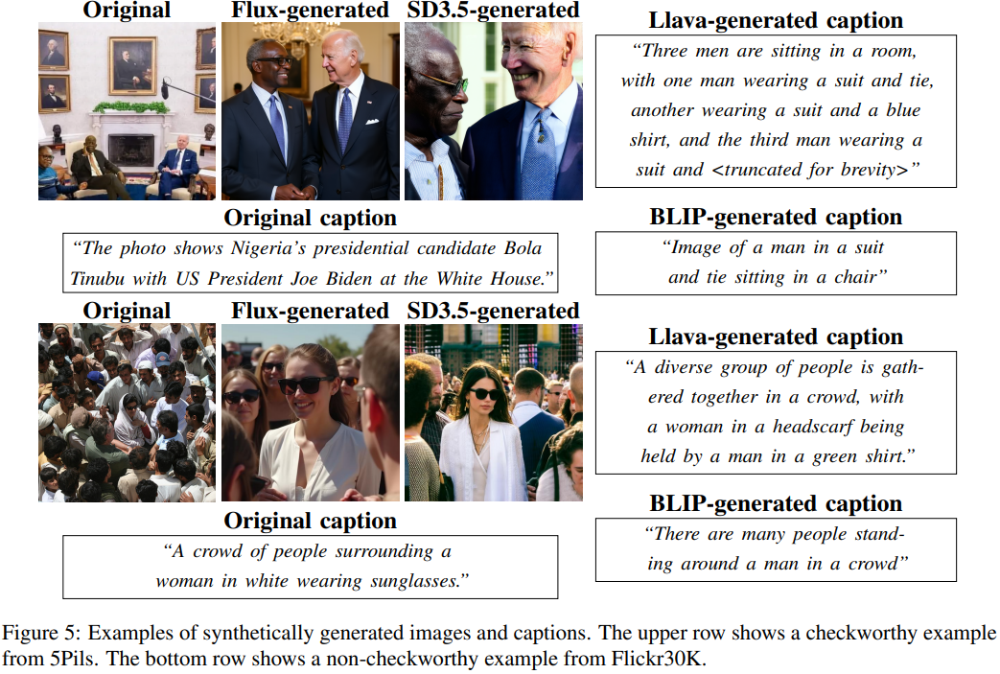

# HintsOfTruth: A Multimodal Checkworthiness Detection Dataset with Real and Synthetic Claims

> https://aclanthology.org/2025.acl-long.1510/

错误信息通过社交网络和伪装成合法新闻来源的欺骗性网站，迅速传播。持续验证多模态信息的真实性是一个关键挑战。人工事实核查成本高昂且耗时，自动化方法可以通过识别值得核查的主张来提供帮助。然而，现有的自动化可信度检测方法

- 对多模态内容的支持不足。现代虚假信息通常包括混合形式的媒体，如图片或视频
- 仅在有限数量的领域进行了测试。虚假信息检测策略因领域而异，这引起了关于泛化能力的担忧
- 在合成媒体上的能力未知，对生成模型的普遍访问正在重塑虚假信息，这使得评估检测方法在合成内容上的表现变得至关重要
- 未考虑计算成本作为一个因素。尽管 LLM 表现良好，但其高昂的计算成本可能使大规模的可信度检测变得不切实际

本文介绍了HintsOfTruth，这是首个公开可用的包含真实世界和合成生成的可信及不可信声明的图像-文本对的多模态数据集。

## 方法

给定一个文本声明c以及图像i，我们的任务是预测这对是否值得进行事实核查p(i,c)=1。在可验证性检测中，回答以下问题：（Q1）文本是否包含可验证的事实声明？（Q2）该声明是否具有潜在的危害性、紧急性和时效性？（Q3）声明的内容是否反映在图像中？（Q4）图像是否为声明提供了额外信息？

我们依赖的数据来源于事实核查文章，因为这些文章中的声明已经过核查。事实核查文章由经验丰富的事实核查员撰写，并包含丰富的上下文信息。我们从5Pils（包含从印度、肯尼亚和南苏丹的新闻来源中提取的图像、声明以及关于声明的情境化问题）和Multiclaim（包含指向各种事实核查文章及其相应声明的网址，但需要抓取并过滤出图像）来源获取数据

对于获取负面实例（不值得核查的图像/文本对），策略包括：

- 非事实性（Q1）声明，例如主观意见或无法使用外部信息验证的事实。代表此策略的数据集是SentiCap
- 无关紧要（Q2）的陈述，这些陈述没有危害性，不是关于突发新闻，不是最新的，或与新闻话题无关。代表此策略的数据集是Flickr30K
- 无跨模态联系（Q3）的图像本应与文本有深刻的联系，但图像被替换后不再合理
- 我们从任何已说明的数据集中筛选出不明确提及多模态内容的声明（Q4）。通过这种方式，我们鼓励排除那些基本使用图像的样本（即声明不涉及图像的对），使其不被纳入我们的数据集。我们将可疑和非可疑样本合并到HintsOfTruth中，这是我们的新颖多模态可信度数据集，涵盖多个领域。

鉴于合成错误信息的风险，我们用包含各种公开可访问模型生成的声明或图像的额外样本增强我们的数据集。新样本由原始文本（或图像）和相应的生成图像（或文本）组成。具体来说，我们使用两个图像生成器从声明创建图像，使用两个多模态模型从图像生成声明。我们的方法遵循一种简单的跨模态生成方法：模型自由生成相应的文本或图像，而不需要对抗性提示。这使我们能够检验可信度检测模型对合成数据的响应。新样本的标签完全取决于声明：合成声明被视为不可信，因为模型主要生成不相关的标题，而合成图像保留其原始标签，确保与声明内容的一致性。

## 实验

使用标准的CheckThat! 2023任务1A数据集作为训练数据集和参考基准，使用其预定义的训练/测试分割，代表分布内场景。

HintsOfTruth 数据集被划分为两个等大小的开发集，以及一个较小的测试集。我们使用测试集来测试在CheckThat上微调的检测方法。这代表了一个跨分布场景，应该比在分布设置更具挑战性。

- 在CheckThat数据集上，表现最强的模型是多模态BLIP和BLIP2
- 有趣的是，仅文本编码器的准确率接近BLIP和BLIP2的准确率，这表明准确的真伪检测几乎不需要视觉信息
- 仅图像编码器的准确率也只比上限低14%。
- 单一模型与多模态模型之间狭窄的差距表明该数据集在评估多模态能力方面的适用性有限。
- 在 HintsOfTruth 数据集上，Pixtral形成了性能的上限，纯文本模型与上限之间的差距大于CheckThat
- TinyBERT的表现超过了较大的纯文本模型，仅次于Pixtral。这表明一个调校得当的小型分类阈值模型可能是有效的，这对于计算能力有限的较小组织来说是一个有趣的途径。
- 仅图像编码器的表现比其他模型差
- 性能与参数数量一致（即模型越大，表现越好）
- 随着上下文增加，Pixtral和Llava表现出相反的行为：（1）用少量学习的更多示例帮助了Llava，但对Pixtral模型有害；（2）在零样本情况下，Llava可以从长提示中受益，但Pixtral通常从短提示中受益
- 微调 FT 模型仅使用CheckThat在三个领域进行训练，它们一致地泛化到HintsOfTruth 的子集上，这表明有效的知识转移。然而，表现会根据实验特征如使用的模态、预训练设置和模型大小而变化
- 探索模型大小与性能之间的权衡，TinyBERT作为最平衡的选择脱颖而出，以显著更低的成本和运行时间，这表明调整一个小模型就能实现强大的性能，引发了对视觉信息在可验证性检测中作用的质疑

## 限制

我们通过仅保留提及多模态内容的主张来检查复杂图像使用的方法（回答问题Q4：该图像是否为主张提供了额外信息？）可以得到加强。具体来说，对于值得核查的子集（5Pils 和多主张），我们假设由于主张和图片被包含在事实核查文章中，图片作为事实核查的一部分提供了额外的上下文。然而，需要进一步的（手动）验证来实证测试这一假设。

我们假设在考虑这些子集的增强版本的提示时，图像生成器会生成适当的上下文。这是一个强假设，因为生成的图像可以说提供了（可能不相关的）上下文。尽管如此，我们认为这些增强内容是值得核查的：模型可以从视觉伪影或生成的上下文类型中学习。

我们的研究完全基于英语数据，而错误信息影响许多不同的语言和文化。然而，我们工作中使用的一些资源可以被利用来生成其他语言的实例。

我们在实验中没有加入检索增强生成（RAG）系统。虽然这类系统可能通过检索相关事实核查来提升可信度检测的效果，但当过去的事实核查是可获取的时候，它们对时间泄露敏感，导致结果失真，并且需要比本文中模型更多的资源。

我们没有进行可信度预测的人类评估。虽然常常采用众包注释者来完成此类任务，但他们准确判断可信度的能力仍然不确定。事实核查服务通常雇佣专家记者，他们依靠直觉和经验来决定核查什么内容，并且可能需要花费几天时间来撰写事实核查文章。因此，尚不清楚普通众包注释者是否能够在在线注释研究中可靠地注释可信度。并行进行的众包和专家评估研究，如专家评估或现实世界的事实核查用例，可能会提供关于注释者行为的更深入见解。

未来的工作应将事实核查的检测方法转变为基于排名的方法，帮助事实核查员优先考虑主张。解释为什么一个主张需要验证可以进一步帮助事实核查员传达决定，例如，通过合作揭示支持事实核查决定的论据。像“学会延迟”和“主动学习”这样的技术有助于高效的数据收集。