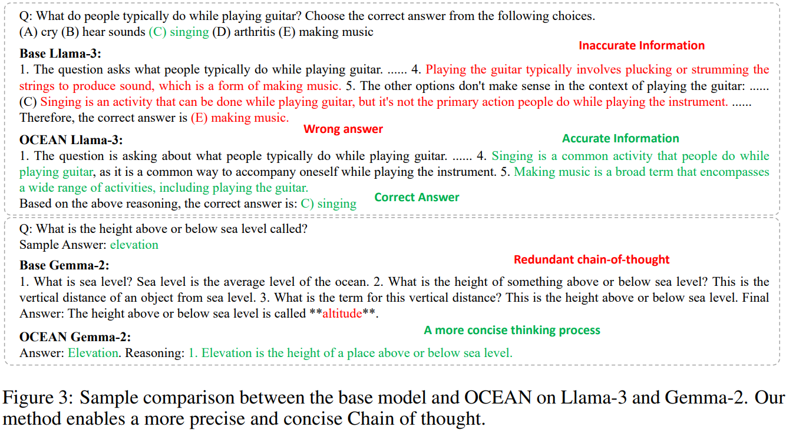

# OCEAN: Offline Chain-of-thought Evaluation and Alignment in Large Language Models

> https://arxiv.org/abs/2410.23703

离线策略评估旨在仅使用收集到的数据来估计目标策略模型的性能，而无需目标策略与现实环境之间的直接互动。然而，考虑到注释者可能不具备各种类型知识背景和相应推理的全面性，收集关于思维链推理的人类反馈可能会更具挑战性。此外，由于思维链推理涉及顺序决策过程，收集到的人类反馈量可以呈指数级增长。由于这些挑战，传统基于人类反馈的强化学习方法（RLHF）可能会面临训练效率低下和可扩展性问题。

我们提出利用知识图谱作为弱但可控的知识推理器来有效衡量通过逆倾向得分（IPS）确保 LLM 的多步骤思维链推理与多跳知识图谱轨迹的对齐。与现有的思维链评估方法不同，后者依赖于在特定知识图谱上的准确思维链定位，我们提出将知识图谱轨迹表述出来，并开发一种知识图谱策略，作为在图谱上的语言推理机制。因此，我们可以**弥合知识图谱与LLM推理形式之间的异质性**，并且表述出来的知识图谱策略可以泛化以兼容各种LLMs。

为了在LLMs中实现可控的思维链对齐，我们主要通过将LLM生成思维链推理步骤的决策过程表述为一个马尔可夫决策过程（MDP），该过程的目标是以最小的知识探索和利用达到正确的最终答案。然后，我们提出了一种离线思维链评估和对齐方法，OCEAN，它通过收集带有知识图谱反馈的离线数据样本，对来自非策略性LLMs生成的思维链进行评估。改进的知识图谱IPS方法考虑了知识图谱策略反馈的影响，该反馈使模型的思维链生成与行为策略保持一致，防止模型退化。

我们证明了KG-IPS估计量为目标策略提供了一个无偏估计，并且**通过次高斯浓度不等式建立了方差的下限**。为了能够直接优化 LLM 策略，我们利用提出的KG-IPS策略评估方法对LLM进行微调，通过梯度下降法直接最大化估计的策略值。

我们在三种类型的思维链推理任务上实证评估了优化后的LLM策略，并展示了所提出的策略优化方法的有效性。我们还观察到在评估任务上的相对性能提升，而不影响LLM的泛化能力或生成质量。

## 背景

给定提示指令q，因果语言模型 $$\pi_θ$$ 中的思维链推理过程包括在最终答案预测y之前，生成一系列推理步骤c=(c1,c2,...,c_T)的轨迹。可控的思路链生成可能具有挑战性，因为其本质在于自回归序列采样，这会在采样包含多个标记的推理步骤 $$\pi_{\theta}(c_t\mid q)$$ 时产生一个高维的动作空间。
$$
c_{t}\sim\pi_{\theta}(\cdot\mid q)=\prod_{i=1}^{t-1}\pi_{\theta}(c_{i}\mid q,c_{<i}),\quad y\sim\pi_{\theta}(\cdot\mid q)=\pi_{\theta}(y\mid q,\boldsymbol{c})\prod_{i=1}^{T}\pi_{\theta}(c_{i}\mid q,c_{<i})
$$
思路链推理可以被看作是一个马尔可夫决策过程（MDP）：

- 从指令提示q开始，LLM 依次决定并生成下一步推理路径 $$c_t$$，该路径导航直到到达目标最终答案y
- 给定LLM策略  $$\pi_θ$$ ，在时间步骤 t，每个状态 $$s_t \in \mathcal{S}$$ 包括指令提示q和之前生成的推理路径
- LLM的动作空间 $$\{1,...|\mathcal{V}|\}^{N_t}$$ 是从相同的有限词汇集V中抽样的 $$N_t$$ 个标记的序列
- LLM策略  $$\pi_θ$$ 基于当前状态采样下一步思路，即 $$a_{t}\sim\pi_{\theta}\left(a_{t}\mid s_{t}\right)$$，这是推理路径中的一个子序列，而周围的上下文由LLM确定性地生成
- 思路链中的转换是将每个推理路径连接到当前状态，即 $$s_{t+1}=[s_t,c_t]$$
- 奖励函数是评估给定状态下的每个思路，即 $$r_{t}=r(s_t,c_t)$$

尽管这种思维链的表述能够通过强化学习直接对大型语言模型进行在策略优化，但在大型语言模型中与知识图谱直接交互以收集每一步奖励在实践中可能具有挑战性，并且由于大型语言模型的非结构化生成与结构化知识图谱之间的差异，需要大量工程努力。因此，我们提出离线评估和优化与知识图谱偏好一致的目标策略。

与思维链推理不同，传统的知识图谱推理方法在第t步从图 $$\mathcal{G}=(\mathcal{E},\mathcal{V})$$的一个子集中采样一个实体-关系对，$$(r_t,e_t)$$ 该子集由当前边 $$e_{t-1}$$ 的外出边组成。
$$
\left(r_{t}, e_{t}\right) \in \left\{\left(r^{\prime}, e^{\prime}\right) \mid\left(e_{t-1}, r^{\prime}, e^{\prime}\right) \in \mathcal{G}\right\}
$$
实体 $$e_{t-1}$$ 到所有外出边的过渡可行性完全由 $$\mathcal{G}$$ 决定。知识图谱推理的过程从指令q的一个分解三元组 (*e*0,*r*1,*e*1) 开始，并通过从一个策略 *μ* 中采样来生成一个三元组链 $$\boldsymbol{h}=\left(e_{0}, r_{1},e_{1},\ldots, r_{T},e_{T}\right)$$
$$
\left(r_{t}, e_{t}\right) \sim \mu\left(\left(r_{t}, e_{t}\right) \mid e_{0}, r_{1}, e_{1}, \ldots, r_{t-1}, e_{t-1}\right)
$$
知识图谱探索的目标是在搜索步骤T结束时得出正确的答案实体。通过知识图谱探索，我们可以收集一组轨迹 $$\mathbb{H}=\left\{\boldsymbol{h}_{k}\right\}_{k=1}^{K}$$，这些轨迹用来估计一个参数概率策略 $$\mu_{\phi}$$ 作为代理模型来模拟知识图谱的偏好。

为了对齐知识图谱偏好策略  $$\mu_{\phi}$$ 与目标策略  $$\pi_θ$$ 之间的动作空间，我们利用一个小型语言模型作为 $$\mu_{\phi}$$ 的核心，并在自然语言上下文中对模型进行微调，以处理口头化的轨迹。受到将结构化知识图谱转化为自然语言查询和上下文，我们利用GPT-4模型f将每个三元组链h转化为一条思路链*c*=*f*(*h*)。口头化的知识图谱轨迹用于模拟知识图谱偏好

## 方法

我们提出了一种与知识图谱偏好对齐的离线评估思路链生成过程的方法。该离线策略估计器可用于策略优化，使大型语言模型与知识图谱中更真实的推理路径保持一致。我们开发了一个小型语言模型作为行为策略，以模拟知识图谱偏好。

### 离线评估与优化

最广泛使用的离线评估方法之一是逆倾向得分。鉴于离线的记录思维轨迹 $$\mathcal{D}=\left\{\tau_{i}\right\}_{i=1}^{N},\text{ where }\tau_{i}=\left(s_{t}^{(i)}, c_{t}^{(i)}, r_{t}^{(i)}, s_{t+1}^{(i)}\right)_{t=0}^{T_{i}}$$，我们提出了一种知识图谱逆倾向得分 KG-IPS 估计器，在知识图谱偏好策略 $$\mu_{\phi}$$ 中考虑实体标记的双重权重，以及在基础大型语言模型策略 $$\pi_0$$ 中考虑非实体标记的权重。
$$
\hat{V}_{KG-IPS}(\theta)=\frac{1}{N} \sum_{i=1}^{N} \frac{1}{T_{i}\left|c_{t}^{(i)}\right|} \sum_{t=1}^{T_{i}} \sum_{e \in c_{t}} \frac{\pi_{\theta}(e \mid s_{t}^{(i)})}{\lambda(e \mid s_{t}^{(i)})} \log \pi_{0}(e \mid s_{t}^{(i)})
$$

$$
\lambda\left(e\mid s_{t}^{(i)}\right)=\mathbf{1}\left\{e\in a_{t}^{(i)}\right\}\cdot\mu_{\phi}\left(e\mid s_{t}^{(i)}\right)+\mathbf{1}\left\{e\in c_{t}^{(i)}\backslash a_{t}^{(i)}\right\}\cdot\pi_{0}\left(e\mid s^{(i)}\right)
$$

其中，使用基础策略 $$\pi_0$$ 中每个标记的对数似然得分作为奖励函数。

> KG-IPS估计量提供目标策略 $$\pi_θ$$ 的无偏估计。标准的IPS估计量已知在行为策略 $$\mu_{\phi}$$ 和目标策略 $$\pi_θ$$ 之间存在较大行为差异，通过分别用 $$\mu_{\phi}$$ 和 $$\pi_0$$ 对实体标记和非实体标记进行加权，我们避免了由长链式思维推理过程累积的方差增加，并在没有模型退化的情况下保持了大型语言模型对非实体标记的行为。KG-IPS估计量的方差下界为 $$\frac{M^2}{4n}$$，其中M表示加权项的最大值，n是样本数量。

我们证明了最终奖励的最优策略与基于实体知识图谱奖励的最优策略是一致的，这意味着非基于实体的LLM奖励可以被视为一个正则化项，不影响最优策略。最终，我们可以通过梯度上升最大化估计的价值函数来直接优化目标策略。
$$
\theta \leftarrow \theta + \nabla_{\theta} \hat{V}_{KG - IPS}(\theta)
$$

### 知识图谱偏好建模

为了便于评估和优化，我们对知识图谱偏好进行建模，并通过开发行为策略 $$\mu_{\phi}$$ 来得出反馈，该策略用语言表达知识图谱轨迹。上文中从图G中随机采样的轨迹H包含的样本可能无法转换成一条通向合理问答的思路链。按照常规的自洽测量方法，给定一个采样的轨迹h及其表达的思想链c，我们提示GPT-4模型提出一个问题q，该问题关联到第一个实体 $$e_0\in h$$，其答案应该是最后一个实体 $$e_T\in h$$，然后用提出的问题对GPT-4模型进行查询。
$$
\hat{q}\sim f(q|e_{0},e_{T},\boldsymbol{c}),\quad\hat{y}\sim f(y|\hat{q},\boldsymbol{c}),\quad R(\boldsymbol{h}|\boldsymbol{c})=\mathrm{E}\left[\mathbf{1}\left\{e_{T}=\hat{y}\right\}\right]
$$
其中轨迹的奖励由答案准确性决定。基于这种自洽性测量，我们将奖励函数 *R*(*h*∣*c*) 估计为归一化的问题回答准确性。然后我们通过策略梯度优化直接微调偏好策略 $$\mu_{\phi}$$ 
$$
\nabla_{\phi} J(\phi)=\nabla_{\phi}\sum_{k=1}^{K}\sum_{t=0}^{|c_{k}|-1} R\left(\boldsymbol{h}_{k}\mid\boldsymbol{c}_{k}\right)\log\mu_{\phi}\left(y_{t}\mid q,y_{<t}\right)
$$
关系分布相对更偏向于最常见的关系。这表明口头化的知识图谱推理策略可能更侧重于更频繁的推理转换，有可能提升其学习有意义模式的能力。相比之下，实体分布呈现出相对较短的尾部，这可能有助于减轻过度拟合特定实体或知识偏见的风险。

## 实验

数据集涵盖知识密集型推理、多跳推理、常识推理。

使用四个主要的大型语言模型进行实验：Gemma-2拥有2B模型参数，Llama-3拥有8B模型参数，Phi-3.5-mini拥有3.8B模型参数，以及Mistral-0.2（拥有7B模型参数。我们使用微调过的指令骨干大型语言模型（LLM）版本，以提高问答任务中的指令遵循能力。

在OCEAN中进行思维链对齐时，我们使用CWQ问答数据集作为源数据，其中的问答对是根据知识图谱开发的。OCEAN仅使用CWQ问题来让大型语言模型生成思维链推理路径，然后利用知识图谱偏好模型进行进一步对齐，而不直接对真实答案进行监督学习。为了与直接监督学习进行比较，我们还启用了指令微调作为基线（SFT），该基线以问题作为指令、答案作为响应进行微调。

知识图谱偏好模型基于预训练的GPT2-Medium模型开发，从Wikidata5M（Wang等人，2021年）知识图谱中收集了6K个问答对。采样得到的知识图谱轨迹由GPT-4模型组合成以相应问题为前缀的自然语言，该模型将知识图谱推理轨迹表述出来，并与生成式语言模型的行为保持一致。

- OCEAN旨在在不直接编辑其内部知识的情况下，结合从知识图谱推理策略中学到的更多忠实于知识的思维链推理模式，OCEAN在适应下游任务时保持了其泛化能力
- 比较SFT和基础LLMs，当下游任务需要可能与微调阶段的知识图谱发生冲突的特定领域知识时，直接将知识图谱与LLMs对齐可能会因为领域变化和微调阶段的知识不一致而受到影响，显示了在LLMs中进行直接知识编辑的风险。
- 随着OCEAN的增强，知识密集型任务的知识问答准确性普遍提高
- 直接监督式微调对大型语言模型在常识知识的潜在灾难性遗忘方面影响很大，OCEAN在常识推理上通过利用策略外评估和从知识图谱反馈进行优化，实现了稳健的性能，OCEAN作为一个稳健的策略外对齐范式，用于整合知识图谱推理，而不影响预训练大型语言模型的泛化能力和行为
- 对齐后的LLMs在生成多样性和忠实度方面达到可比或更好的表现。这证明了虽然OCEAN将思维链推理与知识图谱对齐，我们仍然保持了LLMs的文本生成质量

为了进一步理解对齐的效果，我们选择了在 $$\hat{V}(\theta)$$上有显著改进的核心LLMs，即Gemma-2和Llama-3，并通过比较基础模型和OCEAN在同一组问题上的输出来进行样本分析。我们的发现表明，我们方法的应用提高了生成响应中思维链的精确性和简洁性。

提供了一些示例。具体来说，在第一个例子中，基础Llama-3模型错误地声称唱歌不是与弹吉他相关的主要动作，这导致了对问题的错误解答。相比之下，我们的方法使模型能够识别出唱歌是在弹吉他时的一种常见活动，同时也理解到制作音乐是一个更广泛的术语。在第二个例子中，尽管基础模型和Gemma-2上的OCEAN对问题都提供了合理的答案，但我们的模型展示了更为简洁的思维链，简化了推理过程，并以更大的简洁性得出了解决方案。