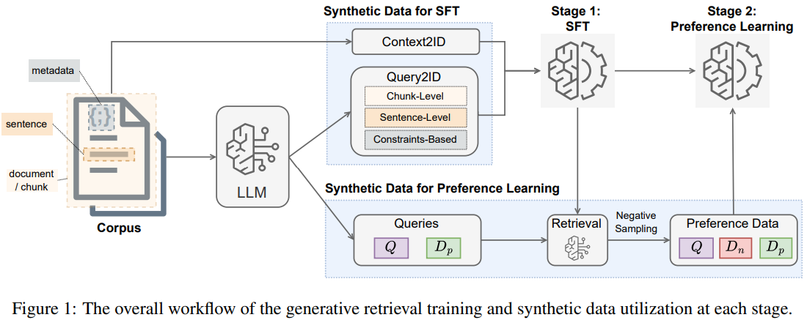

# On Synthetic Data Strategies for Domain-Specific Generative Retrieval

> https://aclanthology.org/2025.acl-long.392/

生成式检索作为一种信息检索（IR）的有前途的新范式正在出现，它利用生成模型直接为用户查询生成潜在相关文档标识符的排序列表。训练生成式检索模型时，数据策略的作用，尤其是在处理特定领域语料库时，仍然相对未被充分探索。这一差距至关重要：由于生成式检索模型在其参数记忆中内化整个语料库，因此训练数据的选择和质量可能在其性能中发挥关键作用。

为了减轻领域内注释的高成本和可扩展性挑战，大多数研究采用了DSI-QG（Zhuang等人，2022a年），该方法使用由docT5query（Nogueira等人，2019年）（一个在MS-MARCO数据上训练的模型）生成的段落级合成查询。然而，将这种现成的合成数据策略应用于新领域可能不够。与专注于强大文本表示的密集检索方法不同，生成式检索器必须发展出三个关键能力：

1. 记忆（存储语料库（如文档）的内容并将它们映射到分配的标识符）
2. 泛化（推断超出用户查询的显式文本线索）
3. 相关性评分（根据与给定查询的相关性准确对文档标识符进行排序）

特定领域的语料库可能加剧这些挑战，因为模型必须调整其内部表示以反映领域细微差别，同时保持强大的泛化和排序准确性。在本项工作中，我们系统地研究了可以促进这些核心能力的数据策略。

我们介绍了一个两阶段的训练框架。

- 第一阶段专注于通过在合成数据上进行有监督微调，将输入直接映射到文档标识符
- 第二阶段使用偏好学习进一步提升排名性能，这里我们采用规则化偏好优化RPO，作为基于PPO的强化学习的有效替代方案

第一阶段关注记忆和泛化能力。我们检查了两种数据源作为训练期间解码文档标识符的输入：直接从语料库中提取的上下文数据（例如，块）以及代表各种相关信号的合成查询。对于合成查询，我们使用多粒度上下文（例如，句子级别、块级别）来生成查询，以捕捉来自语料库的局部和全局信息。我们还探索了在生成合成查询时添加源自可用元数据或特定领域知识的约束，以增强模型处理复杂、领域相关查询的能力。在第一阶段，模型被优化为产生单个正面候选项，不考虑不同候选项之间的相关性。

在第二阶段，我们进一步创建数据，通过偏好学习提升模型的排名能力。我们研究了用于偏好学习的负面候选文档的选择。我们不依赖静态的离线数据，而是在第一阶段之后，从模型自身排名靠前的候选文档中在线收集偏好数据，并将其与语料库中的随机抽样进行比较。我们进一步调查了改变负面候选数量对排名性能的影响及其选择。

- 实验展示了具有不同方面的查询，如多粒度和基于约束的查询，与仅依赖来自查询生成模型的块级合成查询相比，显著提高了检索性能。
- 增加上下文数据的采样量进一步提升了性能。
- 这些数据策略很好地泛化到其他类型的文档标识符，如原子标识符。
- 证明了RPO有效地提升了生成式检索的排名性能，关键在于选择高质量的负面候选：高质量困难负面候选提高了性能，而随机负面可能会产生不利影响。

## 生成式检索框架

典型的生成式检索框架接收一个查询作为输入，并生成相应的相关文档标识符作为检索结果。因为语料库中的每个文档都有一个唯一的标识符，人们可以使用这些标识符来检索相应的文档以供下游任务使用。

我们在实验中主要使用语义文档标识符，因为它们性能优越，并且对更大语料库具有更好的可扩展性。我们指导大型语言模型生成描述文档内容的关键词列表，并将这个关键词列表作为其语义标识符。

此外，我们将合成数据策略扩展到其他类型的标识符以验证其泛化能力，例如原子标识符，这些是可以通过一步解码或分类过程生成的唯一标记。

生成式检索模型学习根据查询生成相关文档的标识符。具体来说，对于查询q和相关文档d及其标识符*d*′，生成式检索旨在根据q生成*d*′，可以表示为：
$$
\begin{aligned}
\operatorname{score}(q, d) &=P\left(d^{\prime}\mid q;\theta\right)\\
&=\prod_{i} P\left(d_{i}^{\prime}\mid d_{<i}^{\prime}, q;\theta\right)
\end{aligned}
$$
其中，$$d_{i}^{\prime}$$ 是标识符的第 *i* 个标记。为了确保生成的标识符在推理过程中有效，我们使用 constrained beam search with Trie 来限制每个解码步骤的输出标记空间。束搜索 top-K 个输出作为最终的检索结果。

与密集检索模型相比，生成式检索通过直接生成相关文档标识符，绕过了对外部索引的需求。然而，学习生成式检索模型存在明显的挑战。由于它仅依赖于参数化知识，该模型不仅要学习检索任务，还要以某种方式捕获和编码文档内容将每篇文档与其标识符关联起来。因此，生成式检索通常需要在整个语料库上进行训练，以使模型能够有效记忆和理解必要的信息。

## SFT 微调数据策略

我们的合成数据包括两个主要组成部分： 

- Context2ID，训练模型根据文档内容检索文档标识符
- Query2ID，模型从给定查询中检索相关文档标识符

结合这两种数据类型鼓励模型学习在给出查询时既记忆内容又重新检索

在 SFT，我们通过最大化每个单独标记的概率来训练模型生成相关文档标识符，虽然普遍做法只关注于优化输出序列（即文档标识符），但理解并记忆上下文也是生成式检索模型训练目标的一部分。为此，我们还优化模型学习解码输入。具体来说，对于给定的查询-文档对 (*q*,*d*)，其中 *q*可以是实际查询或来自文档 *t* 的文本块，该模型最大化以下组合输入和输出序列的概率：
$$
\begin{aligned}
\mathcal{L}_{\text{sft}}(q, d)=&-\log P\left(d^{\prime}, q ; \theta\right) \\
= & -\sum_{i} \log P\left(q_{i} \mid q_{<i} ; \theta\right)  -\sum_{i} \log P\left(d_{i}^{\prime} \mid d_{<i}^{\prime}, q ; \theta\right)
\end{aligned}
$$
Context2ID 数据是通过将语料库中的每个文本块与其对应的文档标识符配对来创建的，目标是为了帮助生成式检索模型将每篇文档的内容与其唯一标识符关联起来，即“记忆”文本。

Query2ID 旨在教会模型根据给定的查询检索相关文档标识符。它帮助模型学习核心检索任务，并且从查询的角度进一步理解内容。先前的工作发现使用查询生成模型（例如，docT5query）通过多次独立采样从文档中生成合成查询是有效的。在这项工作中，我们改为使用大型语言模型来生成合成查询。具体来说，给定一个上下文（例如，一个文档块），大型语言模型被指导生成一组多样化的m个查询，从而比基于采样的方法使用专门的查询生成模型覆盖更广泛的语义变化。

我们首先生成具有不同粒度级别的上下文的查询：块级别和句子级别。

- 生成块级别的合成查询通过将整个块作为输入提供给 LLM，以捕捉更高级别的语义或事实
- 句子级别的合成查询则仅通过提供单个句子来生成，以便专注于文档内更具体的细节

使用大型语言模型进行查询生成的关键优势在于其能够结合特定领域的指令。例如，我们可以提示LLM在生成的查询中包含元数据约束，如文档的作者姓名或政治倾向性。尽管具体的约束类型取决于可用的元数据，并且可能是特定领域或数据集特定的，但在现实世界的场景中，如企业数据中，它们是常见的。我们要求LLM为每篇包含这些约束的文档生成 $$m_i$$ 个查询，使我们的生成检索模型能够处理更加专业化或特定领域的查询。

## 偏好学习数据策略

先前的工作已经表明，结合排名任务可以进一步增强生成检索模型的相关性建模。然而，当生成式检索模型基于大型语言模型时，复杂的排名目标（如列表优化）通常因多次前向传播而变得计算效率低下。在这项工作中，我们改用一种更简单的方法，采用规则化偏好优化算法来执行偏好优化，这是一种在优化大型语言模型中广泛应用的技术。

> RPO 是有向偏好优化 DPO 的扩展版本，包括额外的监督微调损失，以减轻对负面响应的过度优化问题

使用规则化偏好优化 RPO 方法，它以输入查询q、一个正面候选项 $$d_p$$ 和一个负面候选项 $$d_n$$ 作为输入。该损失支持正面候选项，反对负面候选项。
$$
\mathcal{L}_{\text{rpo}}\left(q, d_{p}, d_{n}\right)=-\log \delta \left(\beta \log \frac{P\left(d_{p}^{\prime} \mid q ; \theta\right)}{P\left(d_{p}^{\prime} \mid q ; \theta_{\text{ref}}\right)}\right. \left.-\beta \log \frac{P\left(d_{n}^{\prime} \mid q ; \theta\right)}{P\left(d_{n}^{\prime} \mid q ; \theta_{\text{ref}}\right)}\right) -\alpha \frac{\log P\left(d_{p}^{\prime} \mid q ; \theta\right)}{\left|d_{p}^{\prime}\right|}
$$
其中，$$\theta_{\text{ref}}$$ 是参考模型的参数，即第一阶段训练的监督微调模型。$$d_p'$$ 是正面候选的标识符

我们需要合成查询来进行偏好学习，仍然采用基于 LLM 的查询生成方法，与 SFT 阶段相同。然而，在指令中有几个关键差异。首先，我们要求大型语言模型尽可能制作出困难的查询。同时，我们不仅要求大型语言模型提供合成查询，还要求它们提供相应的答案。这是为了确保在制作困难查询的同时，这些合成查询仍然能够使用给定的上下文得到回答。

这些改变使得新的一批合成查询不同于监督微调期间使用的查询，这样模型就不会过度优化到同一批数据。增加难度也增加了最初的生成检索模型犯错误的可能性，因此模型将通过从这些错误中学习来受益于偏好学习

在生成合成查询后，下一步是为RPO优化选择文档候选对。对于每个训练实例，我们需要一个正面候选和一个负面候选。由于我们总是基于文档生成合成查询，正面候选自然可以被分配。

为了提高负面候选的难度，在 SFT 阶段之后，我们将使用生成式检索模型对合成查询进行检索，如果正面候选排在第一位，我们将不使用该查询进行偏好学习。如果正面候选排名低于k，则会有k个不同的负面候选。当存在多个负面候选时，我们将每个负面候选与正面候选配对，形成一对候选实例用于偏好学习。

## 实验

选择了4个数据集进行实验。对于所有数据集，我们使用Mistral 7b系列作为生成式检索的基础模型。我们使用Mixtral 8x7b来生成所有合成查询，并使用 Claude 3 Sonnet 来生成关键词。

将我们的生成式检索性能与几种现成的检索器进行了比较，这些结果表明，仅依赖领域内合成数据进行训练而不进行检索预训练的生成式检索模型，可以与那些检索器相媲美。这些结果展示了生成式检索的潜力，以及利用大型语言模型生成符合特定领域需求的合成数据的有效性。

## 限制

- 我们提出的合成数据策略主要集中在监督微调和偏好学习阶段。但是，还有一些设置可以大大提高生成式检索的可用性，例如增量学习或泛化到未见过的文档
- 类似的数据策略也可以有效地用于增强密集检索领域适应。需要进一步的系统研究来调查密集检索模型微调的策略，以及生成式模型与密集模型训练之间的差异
- 我们的合成查询主要基于一个文档。然而，现实世界的查询可能更为复杂，例如那些涉及多跳推理或多证据比较的多篇文档的查询。目前在探讨如何生成这些复杂的查询以及在检索模型训练中使用这些查询方面仍有不足