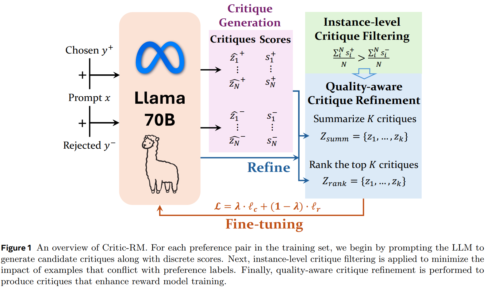

# Self-Generated Critiques Boost Reward Modeling for Language Models

> https://arxiv.org/abs/2411.16646

标准的奖励模型通常使用偏好对进行训练，并用成对的逻辑损失进行优化，为每个回应产生一个单一的标量分数。然而，输出一个标量分数不仅难以解释，而且未能充分利用大型语言模型从预训练和后训练获得的内在语言建模能力。因此，这些奖励模型往往数据效率较低，容易受到鲁棒性问题影响，例如奖励操纵。这些限制阻碍了RLHF中反馈信号的质量，并导致次优的策略更新。

另一方面，作为 LLM-as-a-judge 范式提供了一个替代方案，其中LLM首先生成批评意见，然后可选地提供一个离散分数作为响应的质量代理。结合两种范式的优势——整合了作为裁判的LLM的可解释性和结构化批评与奖励模型的标量优化框架——具有巨大的潜力，可以解决每种方法的局限性，并产生更稳健、更有效的奖励信号。

尽管其出发点很好，将批评纳入奖励建模呈现出两个主要挑战：

1. 目标冲突：批评生成需要语言建模，而奖励模型提供的是标量输出，这使其难以整合到语言建模中。
2. 评估器限制：现成的LLM通常不是好的评估器，而额外的微调需要成本高昂的人类生成或注释过的批评

最近的研究直接将来自现成LLM生成的批评纳入奖励建模，或通过知识蒸馏同时学习生成批评和奖励。这些方法通常依赖于强大的教师LLM来生成高质量的批评，这在实践中大规模获取可能成本高昂且效率低下。此外，当不存在更强的教师模型时，它们无法用来改进前沿模型。

我们介绍了一种新的框架Critic-RM，**使大型语言模型能够利用自我生成的批评进行奖励建模。不需要额外的监督**，即不依赖于强大的大型语言模型（LLM）教师。我们的方法受到自我改进语言模型最新进展的启发，其中模型通过自身生成的数据进行迭代精炼。为了在奖励建模中应用类似的LLM自我改进范式，我们假设将LLM的批评生成能力注入到此过程中至关重要。

具体来说，Critic-RM利用指令微调的LLM作为骨干，生成多个候选批评，每个批评都有一个离散分数（用于过滤批评；不是我们的最终奖励），用于对各个响应进行评分。然而，这些批评的质量可能会有所不同，质量差的批评往往导致有缺陷的质量预测。为了解决这个问题，我们首先应用一致性引导的过滤技术，只保留分数与人类注释的偏好标签一致的批评。为了进一步提高这些合成批评的质量，我们还提出了两种策略，即总结和排序，以精炼训练奖励模型时使用的批评。

一旦为每个响应生成了批评，主要挑战在于设计一种有效的训练策略，将批评建模和标量奖励预测目标结合起来。虽然大型语言模型从每个响应的多样化批评中受益，但奖励建模容易出现过拟合；这种矛盾使得确定最佳学习步骤变得非平凡。为了解决这个问题，我们**引入了一种简单的加权平衡策略，模型最初专注于批评建模损失，然后逐渐过渡到基于响应和批评来预测奖励**。这种方法平衡了两个学习目标，使模型能够在高质量批评生成和准确的奖励预测方面都表现出色。

为了证明Critic-RM的有效性，我们在RewardBench以及三个超出分布的奖励建模任务上进行了广泛的实验，结果表明，在领域内外的评估中，Critic-RM均优于基线。此外，对批评评估基准的实验突显了Critic-RM在为纠正大型语言模型的错误推理生成有价值反馈方面的能力。我们的分析确认，Critic-RM之所以具有优越的泛化能力，源于其识别和利用高质量自我生成批评的能力。

## 方法

偏好数据集可以写为 $$\mathcal{D}=\left\{\left(x_{i}, y_{i}^{+},y_{i}^{-}\right)\right\}_{i=1}^{\left|\mathcal{D}\right|}$$ ，包含 prompt 和 成对偏好回答。为了对成对偏好进行建模，学习目标是使用布拉德利-特里模型来最大化概率
$$
p\left(y^{+} \succ y^{-} \mid x\right)=\frac{\exp \left(r\left(x, y^{+}\right)\right)}{\exp \left(r\left(x, y^{+}\right)\right)+\exp \left(r\left(x, y^{-}\right)\right)}
$$
在实践中，奖励模型 $$r_{\psi}$$ 被训练以最小化以下的经验负对数似然损失
$$
\ell_{\mathrm{rm}}(\psi)=-\mathbb{E}_{(x, y^{+},y^{-})\sim\mathcal{D}}\log\left(\sigma\left(r_{\psi}\left(x, y^{+}\right)-r_{\psi}\left(x, y^{-}\right)\right)\right)
$$
在这项工作中，我们研究使用现成的微调指令大型语言模型（LLM）$$\mathcal{M}_{\theta}$$ 作为批评生成模型和奖励模型的骨干。具体来说，我们将批评生成模型表示为 $$g_{\phi}=h_{\mathrm{g}}\circ{\mathcal{M}}_{\theta}$$ ，将奖励模型表示为 $$r_{\psi}=h_{\mathrm{r}}\circ{\mathcal{M}}_{\theta}$$，其中 h 分别代表从原始 $$\mathcal{M}_{\theta}$$ 继承的语言建模头部和随机初始化的奖励建模头部

批评-奖励模型的框架如图所示。批评-奖励模型首先生成每个提示-响应对的候选批评。然后，执行过滤步骤以减少可能导致错误预测的潜在噪声理由的影响，允许我们用额外的批评来增强偏好对，以提高奖励建模的精确度。最后，我们实施联合训练方案，以教会模型高质量批评生成和准确的奖励建模。

为了将批评整合到奖励建模步骤中，我们将批评视为潜在变量，作为响应和最终奖励之间的中间变量。具体来说，我们用 *z*+,*z*− 分别表示针对选定和拒绝的响应 *y*+,*y*− 的批评，并带有提示x。然后，整体学习目标
$$
\begin{align}
p(y^{+} \succ y^{-} \mid x) &= \sum_{z^{+}, z^{-}} p(y^{+} \succ y^{-}, z^{+}, z^{-} \mid x)\\
&= \sum_{z^{+}, z^{-}} p(y^{+} \succ y^{-} \mid z^{+}, z^{-}, x) \cdot p^{*}(z^{+} \mid y^{+}, x) \cdot p^{*}(z^{-} \mid y^{-}, x) 
\end{align}
$$
由于*p*∗(⋅∣*y*,*x*)代表批评的预言分布，通常难以处理，我们的目标是利用评论家生成模型 $$g_{\phi}$$ 通过应用Jensen不等式来生成近似分布 $$q_{\phi}$$
$$
\log p\left(y^{+} \succ y^{-} \mid x\right)=\log \mathbb{E}_{q_{\phi}\left(z^{+} \mid y^{+}, x\right), q_{\phi}\left(z^{-} \mid y^{-}, x\right)}\left[\frac{p\left(y^{+} \succ y^{-}, z^{+}, z^{-} \mid x\right)}{q_{\phi}\left(z^{+} \mid y^{+}, x\right) q_{\phi}\left(z^{-} \mid y^{-}, x\right)}\right] \\
\geq \mathbb{E}_{q_{\phi}\left(z^{+} \mid y^{+}, x\right), q_{\phi}\left(z^{-} \mid y^{-}, x\right)}\left[\log \frac{p\left(y^{+} \succ y^{-}, z^{+}, z^{-} \mid x\right)}{q_{\phi}\left(z^{+} \mid y^{+}, x\right) q_{\phi}\left(z^{-} \mid y^{-}, x\right)}\right]
$$
然后，训练目标可以表示为优化负对数似然的对数，而不是直接优化负对数似然。
$$
\begin{aligned}
\mathcal{L} & = \mathbb{E}_{q_{\phi}\left(z^{+} \mid y^{+}, x\right), q_{\phi}\left(z^{-} \mid y^{-}, x\right)}\left[-\log \frac{p\left(y^{+} \succ y^{-}, z^{+}, z^{-} \mid x\right)}{q_{\phi}\left(z^{+} \mid y^{+}, x\right) q_{\phi}\left(z^{-} \mid y^{-}, x\right)}\right] \\
& = \underbrace{\mathbb{E}_{q_{\phi}\left(z^{+} \mid y^{+}, x\right), q_{\phi}\left(z^{-} \mid y^{-}, x\right)}\left[-\log p\left(y^{+} \succ y^{-} \mid z^{+}, z^{-}, x\right)\right]}_{\text{Preference Modeling Loss with Critiques}} \\
& \quad + \underbrace{\mathcal{D}_{\mathrm{KL}}\left(q_{\phi}\left(z^{+} \mid y^{+}, x\right) \| p^{*}\left(z^{+} \mid y^{+}, x\right)\right) + \mathcal{D}_{\mathrm{KL}}\left(q_{\phi}\left(z^{-} \mid y^{-}, x\right) \| p^{*}\left(z^{-} \mid y^{-}, x\right)\right)}_{\text{Critique Generation Loss}}
\end{aligned}
$$
学习目标意味着什么？方程提供了一种将奖励模型学习目标分解为两部分的方法：

1. 带批评的偏好建模损失 $$\ell_{\mathrm{r}}$$：奖励模型 $$r_\theta$$ 学习根据批评预测每个响应的奖励
2. 批评生成损失 $$\ell_{\mathrm{c}}$$：大型语言模型生成 $$g_\theta$$ 经过训练，以生成批评来近似预言分布 *p*∗(⋅∣*y*,*x*)

### 奖励建模损失

为了使奖励模型 $$r_{\psi}$$ 能够学习带有批评的偏好（即  $$\ell_{\mathrm{r}}$$），这可能很直接，因为我们只需要通过用批评来增强响应作为输入。
$$
\ell_{\mathrm{r}}(x, y^{+},y^{-},z^{+},z^{-})=-\log p(y^{+}\succ y^{-},z^{+},z^{-}\mid x)=-\log p(r_{\psi}(x,[y^{+};z^{+}])>r_{\psi}(x,[y^{-};z^{-}]))
$$
通过这种方式，对于每个提示，奖励模型将学会基于响应和批评来生成奖励。在实践中，我们将批评放在响应之后，并在批评末尾添加一个特殊标记，以便计算奖励。

### 批评生成损失

对于批评生成损失，近似 *p*∗(⋅∣*y*,*x*) 可能并非易事，因为主要挑战在于缺乏高质量的批评注释。为了确保批评的质量，我们的关键假设是对响应的良好批评应与人类偏好标签相符。考虑到这一点，我们设计了一个“先生成后过滤”的框架，为批评模型训练创建高质量的监督信号。

为了在不依赖更强大的大型语言模型的情况下生成批评，我们首先提示大型语言模型 $$\mathcal{M}_{\theta}$$（与奖励模型使用相同的骨干），然后按照  LLM-as-a-judge 通过  $$\left(\widehat{z}_{i}, s_{i}\right)_{i=1}^{N} \sim g_{\phi}(x, y)$$ 采样一组 N 个候选批评作为输入提示和响应 (*x*,*y*)，其中 *z* 是生成的批评，s 是从 1 到 10 的离散分数，表示响应的质量。

为了减少潜在的噪音批评并鼓励批评与偏好标签之间的一致性，我们建议首先保留由裁判生成的分数指导的实例。 先前的得分定义如下，s分别代表选定和拒绝回应的平均得分。通过应用这一过滤过程，我们增强了批评与人类偏好的连贯性，并最小化了噪声实例的影响：
$$
\mathcal{D}_{\text{sub}}=\left\{(x, y^{+}, y^{-}) \mid \bar{s}\left(x, y^{+}\right)>\bar{s}\left(x, y^{-}\right)\right\} \\
\bar{s}(x, y^{+})=\sum_{i=1}^{N}s_{i}^{+}/N, \bar{s}(x, y^{-})=\sum_{i=1}^{N}s_{i}^{-}/N
$$
先前的步骤主要集中在实例级去噪上，而对于每一个（提示，回应）对，不同批评的质量也有所不同。为了进一步提高批评的质量，我们设计了一种基于元评判员的技术（Wu等人，2024年），以再次利用大型语言模型 $$\mathcal{M}_{\theta}$$ 进一步精炼 $$\mathcal{D}_{\text{sub}}$$ 中的批评，有两种可能的变体：

- **基于总结的精炼**：我们采用大型语言模型作为总结器，根据不同的批评撰写‘元批评’，以便大型语言模型能够潜在地识别出最常见的、合理的反馈，同时减轻潜在错误反馈的影响。最终的批评可以写为 $$\mathcal{Z}_{\text{summ}} = \left\{z_{i}\right\}_{i=1}^{K} \sim g_{\phi}\left(x, y, \Pi_{j=1}^{N} \widehat{z}_{j}\right)$$，其中 $$\Pi_{j=1}^{N} \widehat{z}_{j}是$$ N个初始批评的一个排列。通过对不同批评的排列进行采样，我们可以生成更多样化的批评用于模型训练
- **基于排名的精细化**：我们使用大型语言模型作为元评判来为评论创建评估分数。具体来说，对于每一条评论 ，我们提示大型语言模型生成一个从1到10的离散分数，记作 $$m_{i}\sim g_{\phi}\left(x, y,\widehat{z}_{i}\right)$$，这作为评论质量估计的代理。然后，我们只保留排名最高的K条评论，记作 $$\mathcal{Z}_{\text{rank}}=\left\{z_{i}\right\}_{i=1}^{K}=\operatorname{Top-K}\left(\left\{\widehat{z}_{i}\right\}_{i=1}^{N}\right)$$ 。通过这种方式，我们可以保留模型自身识别出的质量最高的评论

我们用自我识别的高质量评论扩充训练集 $$\mathcal{D}_{\text{sub}}=\left\{\left(x, y^{+}, y^{-}, \mathcal{Z}^{+}, \mathcal{Z}^{-}\right)\right\}$$ 。利用自我生成的高质量评论 Z ，我们的目标是用它们来近似预言分布的分布，记作 $$p^{*}(z \mid y, x) = \mathbb{I}(z \in \mathcal{Z})$$ 。直接在后向KL损失中使用这个分布可能会导致策略和熵的崩溃。因此，我们使用前向KL损失来近似这个学习目标。然后使用经验分布，KL散度变为：
$$
\begin{aligned}
\ell_{\mathrm{c}}(\mathcal{Z} ; x, y) & =\mathcal{D}_{\mathrm{KL}}\left(p^{*}\left(z \mid y_{i}, x_{i}\right) \| q_{\phi}\left(z \mid y_{i}, x_{i}\right)\right) \\
& =\mathbb{E}_{z \sim p^{*}\left(z \mid y_{i}, x_{i}\right)}\left[\log p^{*}\left(z \mid y_{i}, x_{i}\right)-\log q_{\phi}\left(z \mid y_{i}, x_{i}\right)\right] \\
& =-\frac{1}{K} \sum_{z \in \mathcal{Z}} \log q_{\phi}(z \mid y, x)+\text { const. }
\end{aligned}
$$

### 加权平衡策略

为了将奖励建模损失和批评生成损失结合起来，一个挑战在于这两项的不同学习目标：

- 对于批评生成，模型 $$g_{\phi}$$ 将从用来自 Z 的多样化批评进行微调中获益更多
- 当用多于一轮的数据进行微调时，奖励模型 $$r_{\psi}$$ 通常会出现过拟合问题

为了解决这个问题，我们设计了一种动态权重调度方法，中加入一个额外的权重 *λ*(*t*)，该权重与训练步骤 t 相关，用于平衡这两个目标。
$$
\mathcal{L}(\phi, \psi)=\mathbb{E}_{(x, y^{+}, y^{-}, \mathcal{Z}^{+}, \mathcal{Z}^{-}) \in \mathcal{D}_{\text{sub}}}\left[ \lambda(t) \cdot \ell_{c}(\phi) + (1 - \lambda(t)) \cdot \ell_{\mathrm{r}}(\psi) \right],
\\
\lambda(t)=\begin{cases}1, & 0 < t < (K - 1) T \\1 - \beta \times \frac{t - (K - 1) T}{T}. & (K - 1) T < t < K T\end{cases}
$$
这种方法允许模型在训练的初期专注于批评生成，并在最后一轮转向奖励学习，减轻了奖励模型的过拟合问题

### Critic-RM Inference

与标准的奖励模型训练相比多了一步，给定（提示，响应）对（x，y），模型将首先生成一个批评 $$z\sim q_{\phi}(x,y)$$，然后预测响应的奖励为 $$r=r_{\psi}(x,[y,z])$$

我们还进行了推理时缩放以提高性能。具体来说，我们生成一组 m 个批评作为 $$\mathcal{Z}=\left\{z_{i}\right\}_{i=1}^{m}\sim q_{\phi}(x, y)$$，这些批评具有非零温度，然后预测响应的奖励为不同批评的平均奖励 $$r=r_{\psi}(x,[y,z_i])/m$$

## 实验

我们利用公共和合成数据集进行奖励模型训练。为了纳入来自不同领域的额外偏好监督，我们进一步使用Llama-3.1模型生成合成数据。在主要实验中使用Llama3.1-70B-Instruct 作为骨干

对于奖励模型的评估基准，我们主要在RewardBench（Lambert等人，2024年）上进行评估，该基准包含一套在聊天、推理和安全领域挑选的提示-选择-拒绝三元组，总计有2985个例子。我们使用原作者提供的标准评估协议。

对于评论家模型的评估基准，我们采用了CriticBench（Lin等人，2024年），这是一个旨在评估大型语言模型在各种任务中进行批判和改进其推理能力的基准。CriticBench涵盖五个关键推理领域：数学、常识、符号、编码和算法。它包括了来自17个不同大型语言模型（LLM）的回应，要求这些LLM提供评估其回应正确性的批评意见。具体来说，它考虑了两个评估维度：（1）批评准确性：使用F1分数来评估批评的正确性；（2）纠正准确性：使用准确性来评估模型是否能够基于批评反馈生成正确答案。

- 结合批评意见通常有助于奖励建模。Critic-RM普遍优于本研究中使用的基线。具体来说，当使用相同的偏好数据进行训练时，Critic-RM的表现比标准奖励模型高出3.7%到4.7%。这些结果证明了在奖励模型训练步骤中纳入批评意见的优势，这既有助于高质量批评，也有助于精确奖励。
- 高质量的评价至关重要。即用于提升评价质量的后处理方法，这是在该挑战性环境中实现自我改进的关键。
- 推断时扩展主要有助于推理任务。我们进一步观察到，在推断过程中生成多个评价时， Critic-RM 和基线模型的性能都有所提升。值得注意的是，这些提升在推理密集型任务中最为显著，如数学、编程和安全任务，在这些任务中，模型必须决定拒绝还是接受一个回应。这表明，当计算资源受限时，优先考虑推理密集型任务可以带来更显著的性能提升
- Critic-RM的性能与参数明显更多的LLM-as-a-judge模型相当。这突显了Critic-RM在适应实际场景时的效率和有效性
- Critic-RM显示出强大的数据效率——仅需10%的标记数据就足以超越标准奖励模型，使其在实际应用中极具价值
- Critic-RM能够准确识别被拒绝回应中的主要错误，并解释为什么选定的回应更优，从而带来更准确的预测

## 限制

- 在不同的大型语言模型架构上测试Critic-RM可能会提供对其有效性的更广泛见解
- 在推理过程中生成批评增加了计算开销。这种权衡可能会影响其在实时应用中的使用，其中延迟对模型部署至关重要
- Critic-RM没有包含迭代训练，即模型通过多轮自我完善。添加此步骤可能会进一步提升奖励建模性能