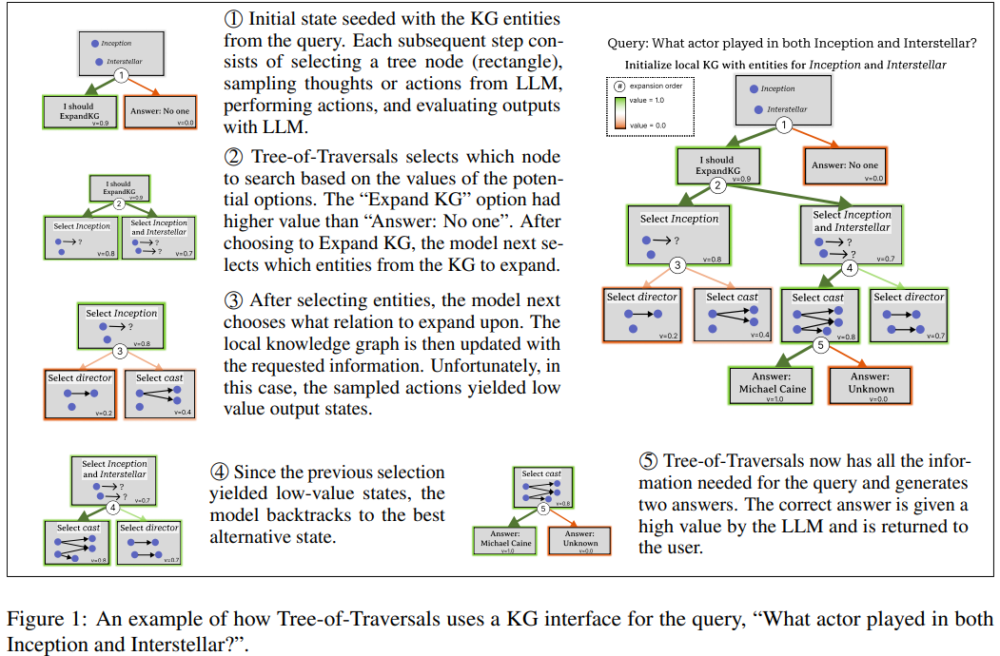
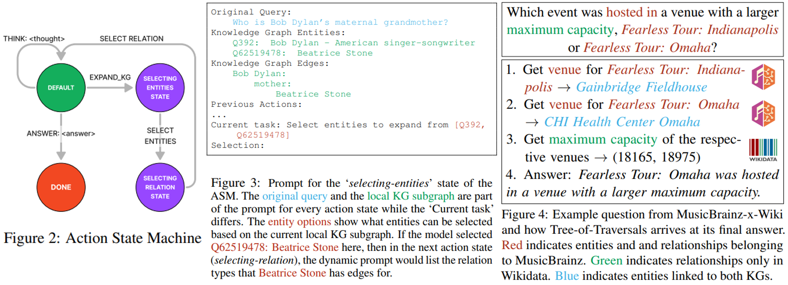

# Tree-of-Traversals: A Zero-Shot Reasoning Algorithm for Augmenting Black-box Language Models with Knowledge Graphs

> https://aclanthology.org/2024.acl-long.665/

能够在不从头开始训练或微调模型的情况下，增强任何数量内部或外部知识图谱的黑盒LLM 算法，这是非常有价值的。我们介绍了一种名为“遍历树”的新型算法，它通过允许以零样本方式增强任意数量知识图谱的强大LLM来解决上述问题。它无需训练，以黑盒方式访问大型语言模型（LLM），并能与任何可访问的知识图谱（KG）配合使用。

> 这样的零样本算法将使得几种创新用例成为可能，例如：（1）客户结合内部特定领域知识图谱使用黑盒LLM API；（2）将个性化知识图谱集成到LLM中，而不必承担使用此类个人数据进行模型训练的风险；（3）通过一系列可通过API访问的知识图谱（例如，IMDb1、MusicBrainz2）集成深度领域知识。

## 方法

遍历树算法维护一个局部知识图谱子图，不断扩展直至包含LLM回答给定查询所需的所有信息。开始时，初始化一个局部知识图谱子图，包含原始查询中出现的实体。然后使用树搜索算法进行扩展，选择LLM生成的动作和思想，以便通过知识图谱接口从知识图谱中获取相关知识。当LLM能够利用局部知识图谱子图作为上下文回答原始查询时，算法停止。遍历树由三个主要部分组成：

- 实现的知识图谱接口，用于与一个或多个所需的知识图谱进行交互。
- 一个动作状态机（ASM），它是一个有限状态机，定义了在大型语言模型（LLM）与知识图谱（KG）交互以扩展本地KG子图时可能的动作空间、状态和提示模板。
- 一种树搜索算法，它定义了整体LLM搜索轨迹，例如最佳优先搜索、犯错后回溯，以及在找到答案时的终止条件

### 知识图谱接口

知识图谱接口允许遍历树结构与一个或多个知识图谱进行交互。设 K=(E,R,T) 为单个知识图谱。E 是实体集，其中每个实体由一个标识符、一个标签和一个可选的描述组成。R 是关系类型集，每个关系类型由一个标识符、一个标签和一个可选的逆标签组成。T 是知识图谱（KG）中的一组边或事实，其中每条边的形式为(*s*,*r*,*o*)，这里*s*,*o*∈E且*r*∈R。

> - E 中的一个实体例如：Q35332, ‘Christopher Nolan’, ‘British-American filmmaker’
> - R 中的一个关系例如：P57, ‘director’, ‘is director of’
> - T 中的一个边例如： ‘Inception’, ‘director’, ‘Christopher Nolan’

只要实现以下接口，就可以使用遍历树（Tree-of-Traversals）来处理KG。当SPARQL查询可用时，该接口用SPARQL查询实现；否则，我们使用KG可用的图API。对于多个KG，分别实现每个接口。

- initialize：输入一个查询*q*，从*q*中提取实体并返回链接的实体
- get_relations：输入一组实体，并返回这组实体在K中具有的关系类型
- get_edges：输入一组实体和关系类型，并返回对于实体满足关系的边和新的实体

### 动作状态机（ASM）

开发适用于任意知识图谱（KG）的零样本大型语言模型（LLM）算法的一个挑战在于，LLM不知道图中存在哪些关系，或者对于给定实体来说哪些关系是有效的。小样本或上下文学习方法只能覆盖一小部分可能的关系类型（例如，维基百科有超过11,000种关系类型）。

为了克服这些问题，我们将扩展局部KG子图的任务分解为多个子任务。我们使用一个有限状态机，具有以下操作：思考、回答、扩展KG、选择实体和选择关系，以及状态：默认、选择实体、选择关系和完成，本文贯穿始终将其称为动作状态机（ASM）。见图2

从默认状态开始，遍历树（Tree-of-Traversals）可以选择思考、回答或选择扩展KG。在遍历树选择扩展KG之后，它首先被提示选择需要更多信息的实体（例如，图1中的“盗梦空间”）。然后被提示从事件接口的get_relations方法提供的候选关系列表中选择一个关系。在选择了一个关系（例如，图1中的“演员阵容”）之后，所有包含一个选定的实体作为源和选定关系作为关系的边都被添加到局部KG子图中。遍历树随后能够再次回答、思考或扩展KG。

ASM中除“完成”状态外的每个状态都与一个独特的提示模板相关联。提示模板在呈现给大型语言模型（LLM）之前，会包含来自本地知识图谱（KG）子图和KG接口的信息。针对每个状态的自定义提示使我们能够向LLM提供精确且相关的信息以及针对每个状态的具体指令。而选定的“重新选择实体”则展示了本地可用的实体选项供其选择（见图3）。本地KG子图使用一种令牌高效的YAML格式表示，以最小化对同一实体的多条边的重复。

调用KG接口。在初始化之外，ASM需要调用KG接口的两次：（1）在构建选择关系提示时，算法调用get_relations()来收集可用的关系选择。（2）在选择了一种关系类型r之后，执行从选择关系到默认关系的过渡时，算法调用get_edges()以便它可以将新的边和实体添加到本地子图中。

### 树搜索算法

给定一个查询q，它从使用上文描述的 initialize 开始。初始化后，搜索过程包括以下几个步骤：

1. 基于节点值函数选择的未探索节点进行扩展
2. 从LLM（分支因子为k）中采样k个动作，使用与选定节点状态相关联的提示在ASM中进行操作
3. 对每个采样的动作，应用转移函数
4. 用LLM值函数评估结果节点的价值。当找到答案且节点值超过阈值 *τ* 时，搜索停止

为了限制搜索空间，我们添加了两个超参数：树搜索的最大深度，超过该深度算法被迫过渡到完成状态（即回答问题），以及模型停止探索并返回“无法找到答案”的最大扩展次数。

遍历树计算节点的价值以确定其效用。该价值由大型语言模型使用评估提示生成。该价值可以在0到1之间，其中1表示最高效用。我们使用两种类型的评估提示：一种用于中间状态，另一种用于答案状态。提示包括原始查询、本地知识图谱子图、先前动作的轨迹，以及评估节点的指令。然后使用这些价值来指导动作空间的探索。具体来说，choose_node返回未探索的具有最高价值的节点（最佳优先）。如果有多个节点的价值相同，则使用深度优先搜索。

在某些情况下，我们可以使用抽象语义模型和知识图谱接口通过单一的思考和行动序列找到查询的答案。这等同于分支因子为*k*=1的遍历树。我们将其称为遍历链。虽然对于比较很有用，但实验表明考虑多个分支的好处。

### 多个知识图谱的遍历树

通过添加多个知识图谱来增强大型语言模型主要涉及为每个添加的知识图谱构建知识图谱接口。算法还有几处其他更改：（1）在初始化（q）中提取的实体与每个知识图谱接口匹配。（2）在选择关系期间呈现关系选项时，对每个知识图谱接口调用get_relations()。（3）在向本地知识图谱子图中添加新实体时，我们会调用其他知识图谱接口的实体链接函数。我们允许实体链接函数作为知识图谱接口中的一个独立函数，或者在初始化（o）时回退，其中o是刚刚添加实体的文本标签。这使得即使没有可用的公共知识图谱之间的显式链接，也能够使用它们，同时仍然能够正常运行。

## 实验

三种不同模型来评估“遍历树”算法：claude-instant-v1、llama2-70b-chat-v1和 llama2-13b-chat-v1。首先在两个常用于评估大型语言模型知识的常见任务上评估“遍历树”算法。为了测试需要多个知识图谱知识的综合复杂问题，我们创建了一个新的数据集，该数据集需要来自多个知识图谱的知识。

使用精确匹配包含（EM-in）作为评估指标。如果真实答案在答案中以精确匹配的形式出现，则EM-in为1，否则为0。这考虑到了大型语言模型以不同句法输出答案的可能性。这是一个常见的指标，但经常与精确匹配（EM）互换使用。当存在多个答案时，我们对所有标签计算平均EM-in。

我们针对三种可以与任何黑盒大型语言模型配合使用的方法进行实验：（1）思维链（CoT）提示（2）ReAct，它在生成思维和生成用于从像维基百科这样的文本知识库中搜索和检索的动作之间迭代，（3）前瞻式主动检索（FLARe），它在生成思维和然后从知识库重新检索以纠正不准确性之间迭代。

- 对于所有模型，遍历树在2个维基多跳上优于基线
- 我们假设这种增益的大部分是由于遍历树通过提出的KG界面访问知识库及其由ASM指导的思维-动作程序
- 与遍历链相比，遍历树进一步提高了性能
- 模型表现得越好，从遍历树中获得的收益就越大
- 对于所有模型，价值函数都有一个有意义的信号。在得分为1.0与得分为0.0的答案准确性之间平均相差31.0%。这代表了在选择得分为1.0的答案时相对于得分为0.0的答案的平均相对改进为83.2%
- 能够回溯使得遍历树的准确性显著提高，增幅在4.1%到12.3%之间
- 在大多数情况下，ReAct的表现不如Chain-of-Thought。这一现象出现在原始的ReAct论文中，他们指出尽管准确性较低，但他们的方法显著减少了幻觉

